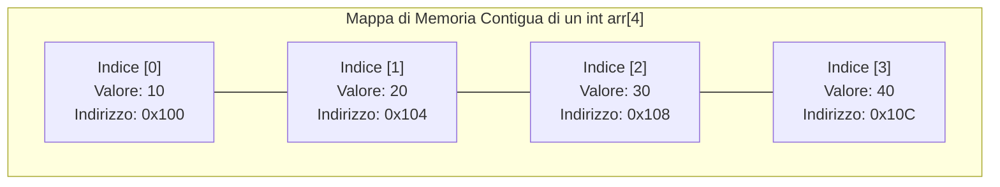
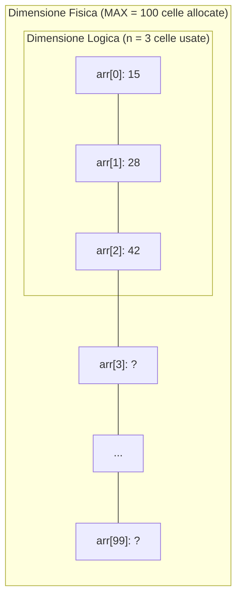
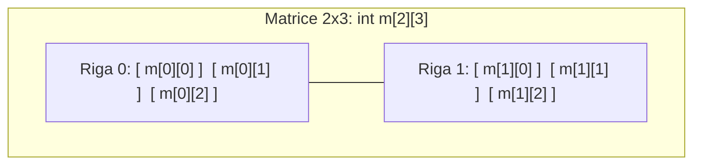

Un **array** (o **vettore**) è una struttura dati statica e omogenea che memorizza una sequenza di elementi dello **stesso tipo** in posizioni di memoria RAM strettamente **contigue** (adiacenti).



> [!NOTE]
> **Perché gli indici partono da 0?**
> L'indice rappresenta l'**offset** (lo scostamento) rispetto alla prima cella di memoria:
> $\text{Indirizzo}(arr[i]) = \text{IndirizzoBase} + (i \times \text{dimensione del tipo})$
> Per il primo elemento lo scostamento è zero ($0 \times 4 = 0$), quindi si trova esattamente all'indirizzo base!

---
## 1. Caratteristiche Fondamentali
1. **Omogeneità**: tutti gli elementi sono del medesimo tipo (`int`, `float`, `char`...).
2. **Dimensione Fissa**: stabilita alla compilazione e immutabile a runtime.
3. **Accesso Diretto $O(1)$**: possiamo leggere o scrivere qualsiasi elemento all'istante conoscendo il suo indice numerico (`arr[i]`).

---
## 2. Dimensione Fisica vs Dimensione Logica
Negli algoritmi del mondo reale e nei compiti scolastici, quasi mai si riempie completamente un array statico fin dall'inizio. Si distinguono quindi due dimensioni:



- **Dimensione Fisica (o Capacità Massima)**: la memoria massima riservata in fase di dichiarazione (es. `const int MAX = 100; int arr[MAX];`).
- **Dimensione Logica (o Numero di Elementi)**: quanti dati significativi sono stati effettivamente inseriti dall'utente (`int n;`).

```cpp
#include <iostream>
using namespace std;

int main() {
    const int MAX = 50; // Dimensione Fisica
    int voti[MAX];
    int n;              // Dimensione Logica

    do {
        cout << "Quanti voti vuoi inserire (max " << MAX << ")? ";
        cin >> n;
    } while (n < 1 || n > MAX);

    for (int i = 0; i < n; i++) {
        cout << "Inserisci voto #" << (i + 1) << ": ";
        cin >> voti[i];
    }

    cout << "Hai inserito " << n << " voti." << endl;
    return 0;
}
```

---
## 3. Dichiarazione e Inizializzazione
```cpp
// 1. Array non inizializzato (contiene dati casuali "spazzatura")
int dati[5];

// 2. Inizializzazione completa
int numeri[5] = {10, 20, 30, 40, 50};

// 3. Tutti gli elementi azzerati a 0
int zeri[5] = {0};

// 4. Inizializzazione parziale (i non specificati diventano 0)
int primiDue[5] = {3, 7}; // Diventa: 3, 7, 0, 0, 0

// 5. Deduzione automatica della dimensione
char vocali[] = {'a', 'e', 'i', 'o', 'u'}; // Dimensione = 5
```

### Calcolare la dimensione con `sizeof`
Se un array statico non ha una costante esplicita:
```cpp
int arr[] = {12, 45, 78, 23, 56};
int dimensione = sizeof(arr) / sizeof(arr[0]); // (5 * 4 byte) / 4 byte = 5
```

---
## 4. Il Pericolo "Out-of-Bounds"
> [!CAUTION]
> In un array `int arr[5]`, gli indici validi sono da `0` a `4`.
> Il C++ **non controlla i limiti di memoria a runtime** per ragioni di pura velocità!
> Se scrivi `arr[5] = 99` o `arr[10]`, stai sovrascrivendo memoria casuale. Questo provoca corruzione dei dati o crash istantanei (*Segmentation Fault*).

> [!INFO] 🖼️ Placeholder Immagine: Rappresentazione dell'errore di memoria Out-of-Bounds
> *Suggerimento per Obsidian: inserisci qui uno screenshot esplicativo dell'accesso a memoria non autorizzata oltre la fine dell'array.*
> `![[Pasted image out_of_bounds.png|550]]`

---
## 5. Scorrimento con Cicli `for`

### Ciclo `for` classico ad indice
```cpp
const int N = 4;
int numeri[N] = {5, 10, 15, 20};

for (int i = 0; i < N; i++) {
    cout << "Posizione " << i << " = " << numeri[i] << endl;
}
```

### Range-based `for` loop (C++11)
```cpp
// Lettura per copia
for (int x : numeri) {
    cout << x << " ";
}

// Modifica tramite riferimento (&)
for (int &x : numeri) {
    x *= 2; // Raddoppia direttamente gli elementi dell'array
}
```

---
## 6. Algoritmi Fondamentali su Array
```cpp
#include <iostream>
using namespace std;

int main() {
    const int N = 5;
    int arr[N] = {18, 4, 32, 9, 21};

    // 1. Somma e Media
    int somma = 0;
    for (int i = 0; i < N; i++) somma += arr[i];
    float media = static_cast<float>(somma) / N;

    // 2. Ricerca del Massimo e Minimo con Indice
    int max = arr[0], min = arr[0];
    int idxMax = 0, idxMin = 0;

    for (int i = 1; i < N; i++) {
        if (arr[i] > max) { max = arr[i]; idxMax = i; }
        if (arr[i] < min) { min = arr[i]; idxMin = i; }
    }

    cout << "Somma: " << somma << " | Media: " << media << endl;
    cout << "Max: " << max << " (all'indice " << idxMax << ")" << endl;
    cout << "Min: " << min << " (all'indice " << idxMin << ")" << endl;
    return 0;
}
```

---
## 7. Array Bidimensionali (Le Matrici)
Una matrice è una tabella a griglia composta da **righe** e **colonne**:



```cpp
// Matrice di 2 righe e 3 colonne
int matrice[2][3] = {
    {10, 20, 30}, // Riga 0
    {40, 50, 60}  // Riga 1
};

// Scorrimento a matrice con cicli annidati:
for (int r = 0; r < 2; r++) {
    for (int c = 0; c < 3; c++) {
        cout << matrice[r][c] << "\t";
    }
    cout << endl; // A capo dopo ogni riga
}
```

---
## 8. Array Statici vs Array Dinamici (`std::vector`)
Quando la dimensione dei dati non può essere decisa in compilazione, si usa la classe `std::vector` della STL:

```cpp
#include <vector>
#include <iostream>
using namespace std;

int main() {
    vector<int> v; // Vettore dinamico inizialmente vuoto

    v.push_back(10); // Aggiunge 10 in fondo
    v.push_back(20); // Aggiunge 20 in fondo
    v.push_back(30);

    cout << "Numero elementi: " << v.size() << endl; // 3
    cout << "Elemento all'indice 1: " << v.at(1) << endl; // 20 (accesso sicuro con controllo limiti)

    v.pop_back(); // Rimuove l'ultimo elemento (30)
    return 0;
}
```

| Proprietà | Array Statico (`int arr[N]`) | Vettore STL (`vector<int> v`) |
| :--- | :--- | :--- |
| **Dimensione** | Rigida e prefissata | Dinamica ed espandibile a piacimento |
| **Allocazione** | Nello Stack | Nello Heap gestita in automatico |
| **Aggiunta elementi** | Impossibile oltre $N$ | Metodo `.push_back(valore)` |
| **Controllo limiti** | Assente (rischio crash) | Disponibile con `.at(indice)` |
