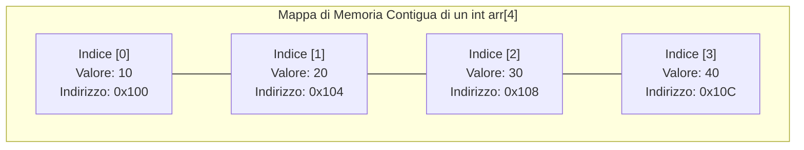
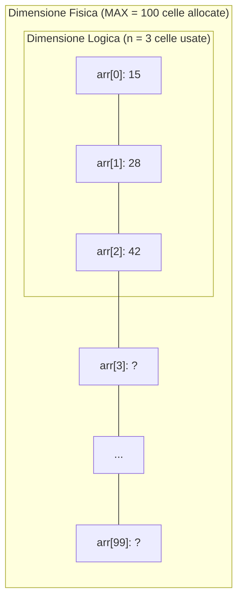
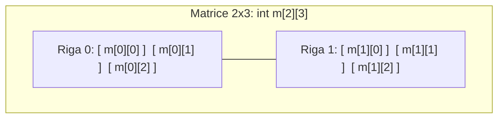

> [!SUMMARY] ⚡ In Sintesi (A Colpo d'Occhio)
> - **Array**: sequenza di celle di memoria RAM ==contigue== contenenti elementi dello ==stesso tipo==.
> - **Indici**: da ==`0`== a ==`N - 1`== (l'indice rappresenta l'offset dall'indirizzo base).
> - **Due Dimensioni**: ==Fisica== (capacità massima dichiarata) vs ==Logica== (dati effettivamente inseriti).
> - **Pericolo Mortale**: ==Out-of-Bounds== (il C++ non controlla i limiti; accedere oltre causa crash o corruzione dati).
> - **Dinamicità**: per array a dimensione variabile si usa ==`std::vector`== (`.push_back()`, `.size()`).

---

Un **array** (o **vettore**) è una struttura dati statica e omogenea che memorizza una sequenza di elementi dello stesso tipo in posizioni di memoria RAM strettamente contigue.



> [!QUESTION] ❓ Domanda d'Esame: Perché gli indici partono da 0?
> L'indice rappresenta l'==offset (scostamento)== rispetto alla prima cella di memoria:  
> $$\text{Indirizzo}(arr[i]) = \text{IndirizzoBase} + (i \times \text{dimensione\_tipo})$$  
> Per il primo elemento lo scostamento è zero ($0 \times 4\text{ byte} = 0$), quindi si trova esattamente all'indirizzo base!

---

## 1. Dimensione Fisica vs Dimensione Logica

Negli esercizi reali quasi mai un array statico viene riempito al 100% all'avvio:



- **Dimensione Fisica (Capacità Massima)**: la memoria riservata in compilazione (es. `const int MAX = 100; int arr[MAX];`).
- **Dimensione Logica (Elementi Utili)**: il numero reale di dati inseriti dall'utente (`int n; cin >> n;`).

```cpp
#include <iostream>
using namespace std;

int main() {
    const int MAX = 50; // Dimensione Fisica
    int voti[MAX];
    int n;              // Dimensione Logica

    do {
        cout << "Quanti voti vuoi caricare (max " << MAX << ")? ";
        cin >> n;
    } while (n < 1 || n > MAX);

    for (int i = 0; i < n; i++) {
        cout << "Voto #" << (i + 1) << ": ";
        cin >> voti[i];
    }
    return 0;
}
```

---

## 2. Dichiarazione e Inizializzazione

```cpp
// 1. Non inizializzato (contiene dati spazzatura casuali!)
int dati[5];

// 2. Inizializzazione completa
int numeri[5] = {10, 20, 30, 40, 50};

// 3. Tutti gli elementi azzerati a 0
int zeri[5] = {0};

// 4. Parziale (i mancanti diventano automaticamente 0)
int primiDue[5] = {3, 7}; // Diventa: 3, 7, 0, 0, 0
```

> [!TIP] 💡 Calcolo Automatico della Dimensione con `sizeof`
> ```cpp
> int arr[] = {12, 45, 78, 23, 56};
> int dimensione = sizeof(arr) / sizeof(arr[0]); // (5 * 4 byte) / 4 byte = 5
> ```

---

## 3. Il Pericolo "Out-of-Bounds"

> [!DANGER] 🚫 Errore Gravissimo: Accesso Fuori Limiti
> In un array `int arr[5]`, gli indici validi vanno da `0` a `4`.  
> Il C++ ==non controlla i limiti a runtime== per massimizzare le prestazioni.  
> Se tenti di accedere a `arr[5]` o `arr[10]`, leggerai o sovrascriverai memoria casuale, causando crash improvvisi (*Segmentation Fault*) o corruzione silenziosa dei dati!

> [!INFO] 🖼️ Placeholder Immagine: Rappresentazione dell'errore di memoria Out-of-Bounds
> *Suggerimento per Obsidian: inserisci qui uno screenshot esplicativo dell'accesso a memoria non autorizzata oltre la fine dell'array.*  
> `![[Pasted image out_of_bounds.png|550]]`

---

## 4. Scorrimento con Cicli `for`

### Metodo 1: Ciclo ad Indice Classico
```cpp
const int N = 4;
int numeri[N] = {5, 10, 15, 20};

for (int i = 0; i < N; i++) {
    cout << "arr[" << i << "] = " << numeri[i] << endl;
}
```

### Metodo 2: Range-based for (C++11)
```cpp
// Lettura per copia
for (int x : numeri) { cout << x << " "; }

// Modifica tramite riferimento (&)
for (int &x : numeri) { x *= 2; } // Raddoppia direttamente gli elementi
```

---

## 5. Algoritmi Fondamentali su Array

```cpp
#include <iostream>
using namespace std;

int main() {
    const int N = 5;
    int arr[N] = {18, 4, 32, 9, 21};

    // 1. Somma e Media
    int somma = 0;
    for (int i = 0; i < N; i++) somma += arr[i];
    float media = static_cast<float>(somma) / N;

    // 2. Massimo e Minimo con Indice
    int max = arr[0], min = arr[0];
    int idxMax = 0, idxMin = 0;

    for (int i = 1; i < N; i++) {
        if (arr[i] > max) { max = arr[i]; idxMax = i; }
        if (arr[i] < min) { min = arr[i]; idxMin = i; }
    }

    cout << "Media: " << media << " | Max: " << max << " all'indice " << idxMax << endl;
    return 0;
}
```

---

## 6. Array Bidimensionali (Le Matrici)

Una matrice è una tabella a griglia bidimensionale organizzata per **righe** e **colonne**:



```cpp
int matrice[2][3] = {
    {10, 20, 30}, // Riga 0
    {40, 50, 60}  // Riga 1
};

// Scorrimento a griglia con cicli for annidati
for (int r = 0; r < 2; r++) {
    for (int c = 0; c < 3; c++) {
        cout << matrice[r][c] << "\t";
    }
    cout << endl;
}
```

---

## 7. Array Statici vs Array Dinamici (`std::vector`)

```cpp
#include <vector>
#include <iostream>
using namespace std;

int main() {
    vector<int> v; // Array dinamico inizialmente vuoto

    v.push_back(10); // Inserisce in fondo
    v.push_back(20);

    cout << "Dimensione: " << v.size() << endl; // 2
    cout << "Accesso sicuro: " << v.at(0) << endl; // 10
    v.pop_back(); // Rimuove l'ultimo elemento
    return 0;
}
```

| Proprietà | Array Statico (`int arr[N]`) | Vettore STL (`vector<int> v`) |
| :--- | :--- | :--- |
| **Dimensione** | Rigida in compilazione | ==Dinamica ed espandibile== |
| **Allocazione** | Nello Stack | Nello Heap gestita in automatico |
| **Aggiunta elementi** | Impossibile oltre $N$ | Metodo ==`.push_back(valore)`== |
| **Controllo limiti** | Assente | Metodo sicuro ==`.at(indice)`== |
