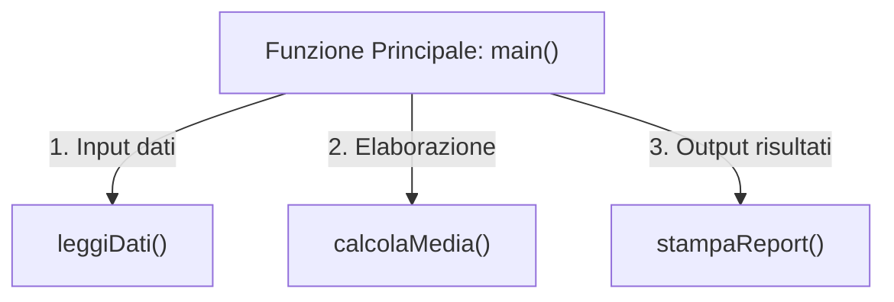
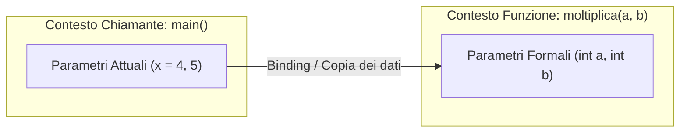
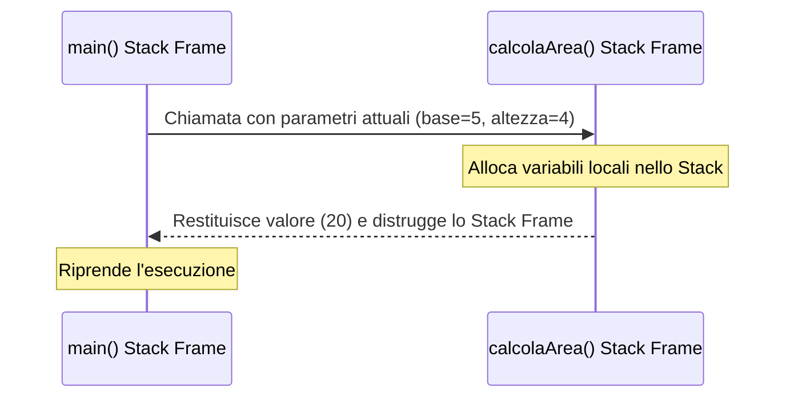
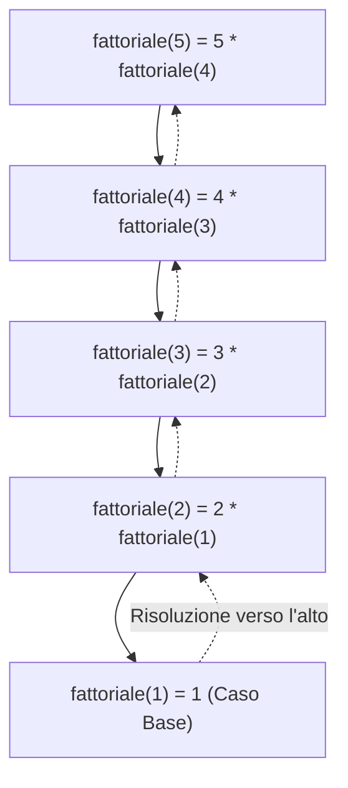

Nei programmi reali scrivere tutto il codice all'interno del `main()` genera software disordinato, difficile da comprendere e quasi impossibile da testare o correggere.

La soluzione architetturale è la **modularizzazione**: dividere un grande problema in sotto-problemi più piccoli e indipendenti, implementati tramite **funzioni** e **procedure**.



---
## 1. I Grandi Vantaggi della Modularizzazione
- **Riusabilità (Principio DRY - *Don't Repeat Yourself*)**: scrivi una routine complessa una sola volta e la richiami da qualsiasi parte del programma.
- **Leggibilità**: il `main()` diventa un indice compatto e chiaro delle operazioni svolte ad alto livello.
- **Isolamento dei bug**: se si verifica un errore, puoi testare la singola funzione in modo indipendente senza dover riesaminare l'intero programma.
- **Lavoro in team**: programmatori diversi possono sviluppare e testare funzioni diverse in parallelo.

---
## 2. Funzioni vs Procedure
In C++ la sintassi di base è identica, ma concettualmente si distinguono due ruoli:

| Proprietà | Funzione | Procedura |
| :--- | :--- | :--- |
| **Tipo di Ritorno** | Un tipo di dato concreto (`int`, `float`, `string`, `bool`...) | **`void`** (nessun valore restituito) |
| **Scopo** | Riceve input, **calcola un risultato** e lo restituisce al chiamante | Compie un'**azione** (stampa a schermo, modifica file, ecc.) |
| **Istruzione `return`** | **Obbligatoria**: `return valore;` | Opzionale (si usa solo `return;` per uscire in anticipo) |
| **Uso nel chiamante** | Assegnata a una variabile o stampata: `x = radice(16);` | Invocata come comando isolato: `pulisciSchermo();` |

---
## 3. Parametri Formali vs Parametri Attuali (Argomenti)
Questa è una delle distinzioni teoriche più importanti e richieste in ambito didattico:

```cpp
// Definizione della funzione:
int moltiplica(int a, int b)   <-- 'a' e 'b' sono PARAMETRI FORMALI
{
    return a * b;
}

int main() 
{
    int x = 4;
    int risultato = moltiplica(x, 5);  <-- 'x' e '5' sono PARAMETRI ATTUALI
}
```



### Tabella Comparativa
| Aspetto | Parametri Formali | Parametri Attuali (o Argomenti) |
| :--- | :--- | :--- |
| **Dove si trovano?** | Nell'**intestazione (firma)** della definizione o prototipo della funzione. | Nella **chiamata** alla funzione (es. dentro il `main`). |
| **Cosa sono?** | Variabili "segnaposto" con tipo e nome (`int a, int b`). | I valori o le variabili reali passati (`x, 5, y + 2`). |
| **Durata di vita** | Esistono solo finché la funzione è in esecuzione nello Stack. | Esistono nel contesto di chi esegue la chiamata. |

> [!NOTE]
> Il processo con cui i parametri attuali vengono associati ai parametri formali durante la chiamata prende il nome di **binding dei parametri**.

---
## 4. Anatomia di una Funzione
Una funzione in C++ è composta da 4 elementi fondamentali:

```cpp
tipo_ritorno nomeFunzione(tipo1 param1, tipo2 param2) {
    // Corpo della funzione: dichiarazioni locali e logica
    return espressione; // Restituisce il valore calcolato
}
```

1. **Tipo di Ritorno**: specifica il tipo del dato prodotto (`int`, `double`, `bool`, `void` per procedure).
2. **Identificatore (Nome)**: segue le stesse regole dei nomi di variabile (es. `calcolaIva`, `massimoTraDue`).
3. **Parametri Formali**: elenco tra parentesi tonde dei dati in ingresso con il relativo tipo.
4. **Corpo**: racchiuso tra parentesi graffe `{ }`, contiene le istruzioni da eseguire.

---
## 5. Prototipi di Funzione (Forward Declaration)
Il compilatore C++ legge il file riga per riga dall'alto verso il basso. Se incontra una chiamata prima che la funzione sia stata scritta, solleverà un errore (*"funzione non dichiarata"*).

Per mantenere il codice ordinato (con il `main()` in cima come panoramica e le funzioni implementate in basso), si definiscono i **prototipi** prima del `main`:

```cpp
#include <iostream>
using namespace std;

// 1. PROTOTIPI (comunicano al compilatore nome, parametri e tipo di ritorno)
int quadrato(int n);
void stampaSeparatore();

// 2. MAIN (subito visibile in cima al sorgente)
int main() {
    stampaSeparatore();
    cout << "Il quadrato di 6 e': " << quadrato(6) << endl;
    stampaSeparatore();
    return 0;
}

// 3. DEFINIZIONE DELLE FUNZIONI
int quadrato(int n) {
    return n * n;
}

void stampaSeparatore() {
    cout << "-----------------------------------" << endl;
}
```

---
## 6. Meccanismi di Passaggio dei Parametri
Il C++ supporta tre modalità distinte di passaggio:

### A. Passaggio per Valore (Copia)
- **Come funziona**: il parametro formale riceve una **copia esatta** del valore del parametro attuale.
- **Effetto collaterale**: qualsiasi modifica apportata al parametro all'interno della funzione **non si riflette** sulla variabile originale.

```cpp
void raddoppiaFalso(int x) {
    x = x * 2; // Modifica solo la copia locale nello Stack frame
}

int main() {
    int valore = 10;
    raddoppiaFalso(valore);
    cout << valore << endl; // Stampa ancora 10!
}
```

---
### B. Passaggio per Riferimento (`&`)
- **Come funziona**: inserendo il simbolo `&` dopo il tipo, il parametro formale non crea una nuova variabile ma diventa un **alias diretto** della variabile originale.
- **Effetto collaterale**: qualunque modifica fatta all'interno della funzione **modifica istantaneamente la variabile originale nel chiamante**!

L'esempio per eccellenza è la funzione `scambia` (*swap*):

```cpp
#include <iostream>
using namespace std;

// Le variabili a e b sono riferimenti a x e y
void scambia(int &a, int &b) {
    int temp = a;
    a = b;
    b = temp;
}

int main() {
    int x = 3;
    int y = 9;

    cout << "Prima: x = " << x << ", y = " << y << endl;
    scambia(x, y);
    cout << "Dopo:  x = " << x << ", y = " << y << endl; // x = 9, y = 3!

    return 0;
}
```

---
### C. Passaggio per Riferimento Costante (`const &`)
Quando passiamo strutture o oggetti pesanti (come stringhe molto lunghe o grandi vettori), il passaggio per valore è lento perché obbliga a copiare migliaia di byte.
Il passaggio per riferimento costante unisce il meglio dei due mondi:
1. **Velocità massima**: zero copie in memoria (passa solo l'indirizzo interno).
2. **Sicurezza totale**: il prefisso `const` impedisce modifiche accidentali al dato originale.

```cpp
void stampaMessaggio(const string &msg) {
    cout << "Messaggio: " << msg << endl;
    // msg += " mod"; // ERRORE in compilazione: const garantisce la sola lettura!
}
```

---
## 7. Il Call Stack e lo Stack Frame
Cosa succede nella memoria RAM quando invochi una funzione?

1. Nel momento della chiamata, il programma alloca nello **Stack** una nuova porzione di memoria chiamata **Stack Frame** (o record di attivazione).
2. Lo Stack Frame contiene:
   - I parametri formali ricevuti;
   - Le variabili locali create nella funzione;
   - L'indirizzo di ritorno (dove tornare nel `main` una volta finito).
3. Quando la funzione incontra `return` o la parentesi finale `}`, il suo Stack Frame viene **distrutto all'istante** e la memoria viene liberata.



> [!INFO] 🖼️ Placeholder Immagine: Rappresentazione dello Stack Frame in memoria RAM
> *Suggerimento per Obsidian: inserisci qui uno schema visivo della memoria Stack con i record di attivazione impilati l'uno sull'altro.*
> `![[Pasted image stack_frame.png|550]]`

---
## 8. Scope e Visibilità delle Variabili
- **Variabili Locali**: dichiarate dentro una funzione o tra parentesi `{ }`. Nascono quando il blocco viene eseguito e muoiono alla sua chiusura.
- **Variabili Globali**: dichiarate all'esterno di qualunque funzione. Visibili ovunque.
  > [!WARNING]
  > Evita le variabili globali! Rendono il codice instabile, aumentano l'accoppiamento e causano bug invisibili (*side effects*). Usa sempre parametri e valori di ritorno.

---
## 9. Overloading delle Funzioni (Sovraccarico)
In C++ possiamo definire **più funzioni con lo stesso nome**, a patto che abbiano una lista parametri differente per tipo o numero (*firma univoca*). Il compilatore individuerà automaticamente quale versione invocare:

```cpp
// 1. Calcola l'area di un quadrato
int area(int lato) {
    return lato * lato;
}

// 2. Calcola l'area di un rettangolo (stesso nome, due parametri)
int area(int base, int altezza) {
    return base * altezza;
}

// 3. Calcola l'area di un cerchio con decimali (stesso nome, parametro float)
float area(float raggio) {
    return 3.14159f * raggio * raggio;
}
```

---
## 10. La Ricorsione
Una funzione si definisce **ricorsiva** quando richiama se stessa per risolvere una porzione più piccola dello stesso problema.

Ogni funzione ricorsiva deve obbligatoriamente contenere:
1. **Caso Base (Condizione di arresto)**: il caso semplice che non richiede ulteriori chiamate. Senza di esso il programma va in loop infinito esaurendo lo Stack (*Stack Overflow*).
2. **Passo Ricorsivo**: la chiamata a se stessa con un parametro ridotto che converge verso il caso base.



### Codice Completo di Esempio (Fattoriale)
```cpp
#include <iostream>
using namespace std;

long long fattoriale(int n) {
    // 1. Caso Base: 0! = 1 e 1! = 1
    if (n <= 1) {
        return 1;
    }
    // 2. Passo Ricorsivo
    return n * fattoriale(n - 1);
}

int main() {
    int valore = 5;
    cout << "Fattoriale di " << valore << ": " << fattoriale(valore) << endl; 
    // Risultato: 5 * 4 * 3 * 2 * 1 = 120
    return 0;
}
```
