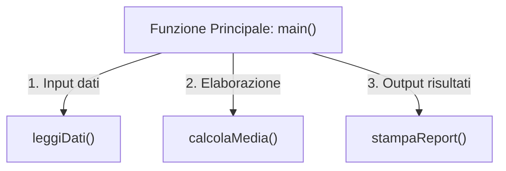
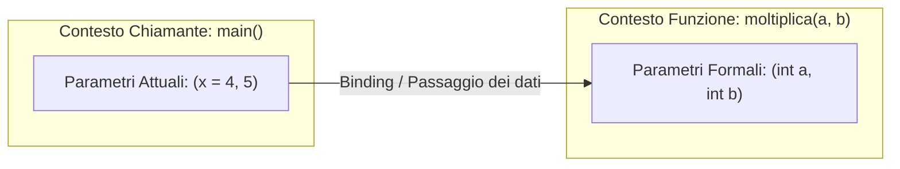
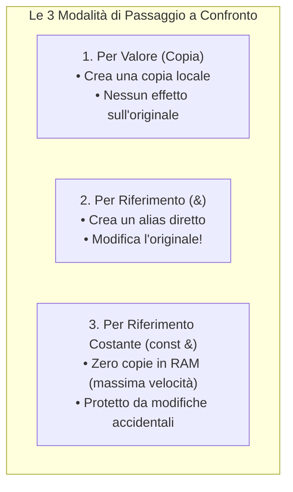
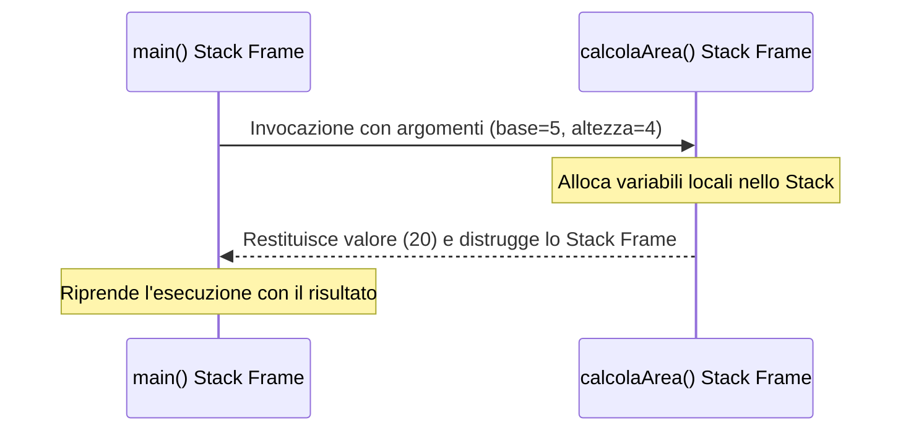
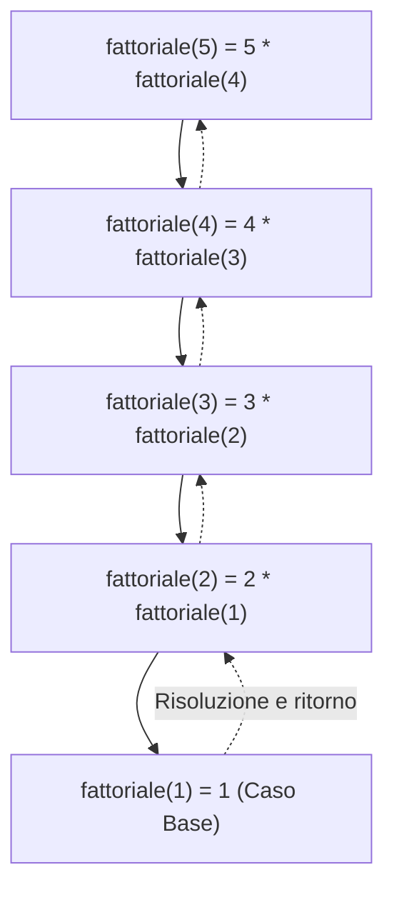

> [!SUMMARY] ⚡ In Sintesi (A Colpo d'Occhio)
> - **Modularità**: spezzare un grande programma in piccoli sottoprogrammi indipendenti (Principio ==DRY - Don't Repeat Yourself==).
> - **Funzione vs Procedura**: la ==Funzione== calcola e restituisce un valore (`return`); la ==Procedura== compie un'azione e non restituisce nulla (`void`).
> - **Parametri Formali vs Attuali**: i ==formali== sono le variabili segnaposto nella firma; gli ==attuali== sono i valori reali passati alla chiamata.
> - **Passaggio Parametri**: per ==valore== (copia protetta), per ==riferimento `&`== (modifica l'originale), per ==riferimento costante `const &`== (massima velocità in sola lettura).

---

Nei programmi reali scrivere tutto il codice all'interno del `main()` genera software disordinato, difficile da comprendere e quasi impossibile da testare o correggere.

La soluzione architetturale è la **modularizzazione**: dividere un problema complesso in sotto-problemi più piccoli, implementati tramite **funzioni** e **procedure**.



---

## 1. I Grandi Vantaggi della Modularizzazione

- **Riusabilità (Principio DRY)**: scrivi una routine complessa ==una sola volta== e la richiami da qualsiasi parte del programma.
- **Leggibilità**: il `main()` diventa un indice compatto e chiaro delle operazioni svolte ad alto livello.
- **Isolamento dei bug**: se si verifica un errore, puoi testare la singola funzione in modo indipendente senza dover riesaminare l'intero programma.
- **Lavoro in team**: programmatori diversi possono sviluppare e testare funzioni diverse in parallelo.

---

## 2. Funzioni vs Procedure

In C++ la sintassi di base è identica, ma concettualmente si distinguono due ruoli:

| Proprietà | Funzione | Procedura |
| :--- | :--- | :--- |
| **Tipo di Ritorno** | Un tipo di dato concreto (`int`, `float`, `string`, `bool`...) | **`void`** (nessun valore restituito) |
| **Scopo** | Riceve input, **calcola un risultato** e lo restituisce al chiamante | Compie un'**azione** (stampa a schermo, modifica file, ecc.) |
| **Istruzione `return`** | **Obbligatoria**: `return valore;` | Opzionale (si usa solo `return;` per uscire in anticipo) |
| **Uso nel chiamante** | Assegnata a una variabile o stampata: `x = radice(16);` | Invocata come comando isolato: `pulisciSchermo();` |

> [!TIP] 💡 Come riconoscerle subito
> Se il sottoprogramma serve a **calcolare qualcosa** che ti serve nel codice successivo, usa una **Funzione**.  
> Se serve solo a **mostrare qualcosa** o **eseguire una sequenza di comandi**, usa una **Procedura (`void`)**.

---

## 3. Parametri Formali vs Parametri Attuali (Argomenti)

> [!QUESTION] ❓ Domanda Tipica da Interrogazione / Esame
> **Qual è l'esatta differenza tra un parametro formale e un parametro attuale?**  
> - Il **Parametro Formale** è la variabile dichiarata nella firma della funzione (il "segnaposto").
> - Il **Parametro Attuale** è il valore o la variabile reale fornita durante l'invocazione della funzione.

```cpp
// Definizione della funzione:
int moltiplica(int a, int b)   // <-- 'a' e 'b' sono PARAMETRI FORMALI
{
    return a * b;
}

int main() 
{
    int x = 4;
    int risultato = moltiplica(x, 5);  // <-- 'x' e '5' sono PARAMETRI ATTUALI
}
```



### Tabella Comparativa di Dettaglio

| Aspetto | Parametri Formali | Parametri Attuali (Argomenti) |
| :--- | :--- | :--- |
| **Dove si trovano?** | Nell'**intestazione (firma)** della definizione o prototipo. | Nella **chiamata** alla funzione (es. dentro il `main`). |
| **Cosa sono?** | Variabili "segnaposto" con tipo e nome (`int a, int b`). | I valori, variabili o espressioni reali passati (`x`, `5`, `y + 2`). |
| **Durata di vita** | Esistono solo finché la funzione è in esecuzione nello Stack. | Esistono nel contesto di chi esegue la chiamata. |

---

## 4. Anatomia di una Funzione

```cpp
tipo_ritorno nomeFunzione(tipo1 param1, tipo2 param2) {
    // Corpo della funzione: logica e calcoli
    return espressione; // Restituisce il valore al chiamante
}
```

1. **Tipo di Ritorno**: specifica il tipo del dato prodotto (`int`, `double`, `bool`, `void` per procedure).
2. **Identificatore (Nome)**: segue le stesse regole dei nomi di variabile (es. `calcolaIva`, `massimoTraDue`).
3. **Parametri Formali**: elenco tra parentesi tonde dei dati in ingresso con il relativo tipo.
4. **Corpo**: racchiuso tra parentesi graffe `{ }`, contiene le istruzioni da eseguire.

---

## 5. I Prototipi di Funzione (Forward Declaration)

Il compilatore C++ legge il codice dall'alto verso il basso. Se incontra una chiamata prima che la funzione sia definita, solleva un errore di *"funzione non dichiarata"*.

Per organizzare il file in modo pulito ed elegante (mettendo il `main()` in alto e le funzioni sotto), si usano i **prototipi**:

```cpp
#include <iostream>
using namespace std;

// 1. PROTOTIPI (annunciano al compilatore l'esistenza della funzione)
int quadrato(int n);
void stampaSeparatore();

// 2. MAIN (subito visibile in cima al sorgente)
int main() {
    stampaSeparatore();
    cout << "Il quadrato di 6 e': " << quadrato(6) << endl;
    stampaSeparatore();
    return 0;
}

// 3. DEFINIZIONE DELLE FUNZIONI
int quadrato(int n) {
    return n * n;
}

void stampaSeparatore() {
    cout << "-----------------------------------" << endl;
}
```

---

## 6. Modalità di Passaggio dei Parametri

Questa è una delle distinzioni fondamentali del C++.



### A. Passaggio per Valore (Copia Protetta)
- **Come funziona**: il parametro formale riceve una ==copia indipendente== del valore.  
- **Effetto**: se modifichi il parametro all'interno della funzione, la variabile originale nel `main()` **non cambia**.

```cpp
void raddoppiaFalso(int x) {
    x = x * 2; // Modifica solo la copia locale nello Stack frame
}

int main() {
    int valore = 10;
    raddoppiaFalso(valore);
    cout << valore << endl; // Stampa ancora 10!
}
```

---

### B. Passaggio per Riferimento (`&`)
- **Come funziona**: inserendo il simbolo `&` dopo il tipo, il parametro formale non crea una nuova variabile ma diventa un ==alias diretto== della variabile originale.
- **Effetto**: qualunque modifica fatta all'interno della funzione ==modifica istantaneamente la variabile originale nel chiamante==!

> [!SUCCESS] 🎯 Caso d'Uso Tipico: La funzione Swap (Scambio)
> ```cpp
> void scambia(int &a, int &b) {
>     int temp = a;
>     a = b;
>     b = temp;
> }
> ```
> Poiché `a` e `b` hanno l'operatore `&`, la modifica scambia fisicamente le variabili passate nel `main()`.

---

### C. Passaggio per Riferimento Costante (`const &`)
Quando passiamo oggetti pesanti (come stringhe lunghe o grandi strutture), il passaggio per valore è lento perché obbliga a copiare migliaia di byte.  
Usando `const Tipo &` otteniamo:
1. 🚀 **Velocità massima**: zero copie in memoria.
2. 🛡️ **Sicurezza totale**: il prefisso `const` impedisce modifiche accidentali all'originale.

```cpp
void analizzaTesto(const string &testo) {
    cout << "Lunghezza: " << testo.length() << endl;
    // testo = "modifica"; // ERRORE in compilazione: const impedisce modifiche!
}
```

---

## 7. Il Call Stack e lo Stack Frame

Cosa succede nella memoria RAM quando invochi una funzione?

1. Nel momento della chiamata, il programma alloca nello **Stack** una nuova porzione di memoria chiamata ==Stack Frame== (o record di attivazione).
2. Lo Stack Frame contiene:
   - I parametri formali ricevuti;
   - Le variabili locali create nella funzione;
   - L'indirizzo di ritorno (dove tornare nel `main` una volta finito).
3. Quando la funzione incontra `return` o la parentesi finale `}`, il suo Stack Frame viene ==distrutto all'istante== e la memoria viene liberata.



> [!INFO] 🖼️ Placeholder Immagine: Rappresentazione dello Stack Frame in memoria RAM
> *Suggerimento per Obsidian: inserisci qui uno schema visivo della memoria Stack con i record di attivazione impilati l'uno sull'altro.*  
> `![[Pasted image stack_frame.png|550]]`

---

## 8. Overloading delle Funzioni (Sovraccarico)

In C++ è consentito definire ==più funzioni con lo stesso identico nome==, purché abbiano una lista parametri diversa per numero o tipo (*firma univoca*). Il compilatore capirà automaticamente quale chiamare:

```cpp
int somma(int a, int b) { return a + b; }            // Interi
double somma(double a, double b) { return a + b; }  // Decimali
int somma(int a, int b, int c) { return a + b + c; } // Tre parametri
```

---

## 9. La Ricorsione

Una funzione si definisce **ricorsiva** quando chiama se stessa per risolvere una porzione ridotta del problema originario.



> [!DANGER] 🚫 Errore Critico: Manca il Caso Base = Stack Overflow
> Se una funzione ricorsiva non ha una corretta condizione di arresto (caso base), continuerà a chiamare se stessa all'infinito saturando la memoria dello Stack fino a provocare il crash immediato del programma (*Stack Overflow*).

```cpp
long long fattoriale(int n) {
    if (n <= 1) return 1;           // 1. Caso Base (condizione di arresto)
    return n * fattoriale(n - 1);   // 2. Passo Ricorsivo
}
```

---

> [!EXAMPLE]- 🧪 Programma Completo di Test Eseguibile (Clicca per espandere)
> ```cpp
> #include <iostream>
> using namespace std;
> 
> void scambia(int &a, int &b);
> long long fattoriale(int n);
> 
> int main() {
>     int x = 10, y = 20;
>     cout << "Prima dello swap: x=" << x << ", y=" << y << endl;
>     scambia(x, y);
>     cout << "Dopo lo swap:    x=" << x << ", y=" << y << endl;
> 
>     int num = 5;
>     cout << "Fattoriale di " << num << ": " << fattoriale(num) << endl;
>     return 0;
> }
> 
> void scambia(int &a, int &b) {
>     int temp = a;
>     a = b;
>     b = temp;
> }
> 
> long long fattoriale(int n) {
>     if (n <= 1) return 1;
>     return n * fattoriale(n - 1);
> }
> ```
