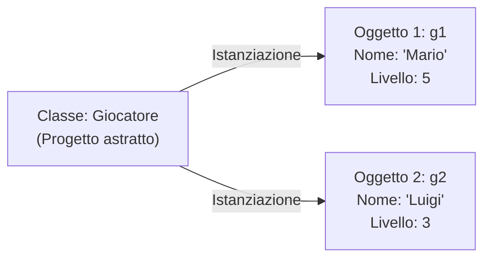
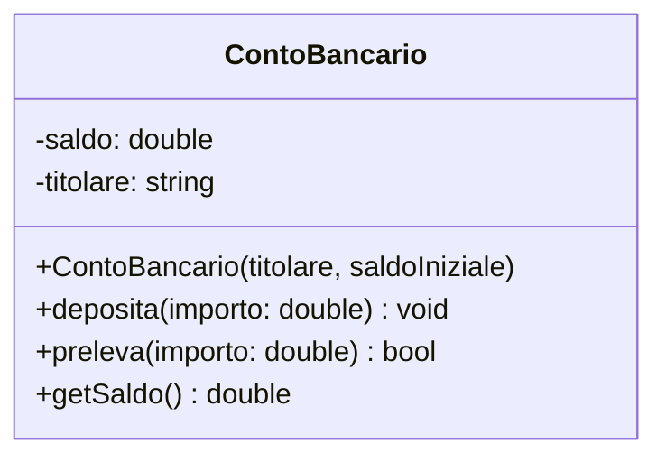

> [!SUMMARY] ⚡ In Sintesi (A Colpo d'Occhio)
> - **Classe vs Oggetto**: la ==Classe== è il progetto (*blueprint*); l'==Oggetto== è l'istanza concreta creata in RAM.
> - **L'Unica Differenza C++**: nelle `struct` i membri sono ==`public`== di default; nelle `class` sono ==`private`==.
> - **Incapsulamento**: variabili protette in `private`, accessibili dall'esterno solo tramite metodi `public` (getter e setter).
> - **Costruttore**: metodo speciale con lo stesso nome della classe per inizializzare l'oggetto alla nascita.
> - **Operatore Freccia (`->`)**: scorciatoia elegante per accedere ai membri tramite un puntatore (`ptr->metodo()`).

---

## 1. Classe vs Oggetto (Il Progetto e la Casa)

- **Classe (o Struct)**: è il **progetto architettonico** (*blueprint*), un modello che definisce proprietà e comportamenti.
- **Oggetto (o Istanza)**: è la **casa concreta costruita** in memoria RAM a partire da quel progetto.



---

## 2. Le Struct (Strutture Dati)

Una `struct` è un tipo composto che raggruppa variabili di tipo differente, chiamate **campi** (o membri).

```cpp
#include <iostream>
#include <string>
using namespace std;

struct Videogioco {
    string titolo;
    string genere;
    float valutazione;
    int annoUscita;
};

int main() {
    Videogioco g1; // Creazione istanza

    // Accesso ai campi con l'operatore punto (.)
    g1.titolo = "The Legend of Zelda";
    g1.genere = "Action-Adventure";
    g1.valutazione = 9.8f;
    g1.annoUscita = 2017;

    cout << "Gioco: " << g1.titolo << " (" << g1.annoUscita << ")" << endl;
    return 0;
}
```

---

## 3. Dalle Struct alle Classi (OOP)

> [!QUESTION] ❓ Domanda d'Esame: Qual è l'unica differenza tra una `struct` e una `class` in C++?
> In C++ l'unica differenza sintattica è la **visibilità predefinita**:
> - Nelle `struct`: tutti i membri sono **`public`** di default.
> - Nelle `class`: tutti i membri sono **`private`** di default.

Per convenzione del settore:
- Si usa `struct` per meri contenitori di dati (*Plain Old Data*).
- Si usa `class` per la **programmazione ad oggetti (OOP)** basata su **incapsulamento**.



---

## 4. Incapsulamento: `public` vs `private`

L'**incapsulamento** protegge i dati interni dell'oggetto impedendo che vengano manipolati in modo errato dall'esterno.

- **`private`**: visibili solo alle funzioni interne della classe stessa.
- **`public`**: accessibili da chiunque (es. nel `main`).

> [!SUCCESS] 🎯 Regola d'Oro dell'Incapsulamento: I Getter e Setter
> Metti sempre le variabili in `private` e fornisci metodi `public` per leggerle (`getSaldo`) e modificarle (`deposita`) con controlli di validità!

```cpp
class ContoBancario {
private:
    double saldo; // Protetto: nessuno può impostare saldo = -99999 dall'esterno!

public:
    // Metodo setter con validazione
    void deposita(double importo) {
        if (importo > 0) {
            saldo += importo;
            cout << "Depositati " << importo << " euro." << endl;
        } else {
            cout << "Importo non valido!" << endl;
        }
    }

    // Metodo getter (const indica che è di sola lettura!)
    double getSaldo() const {
        return saldo;
    }
};
```

---

## 5. Costruttori, Distruttori e il Puntatore `this`

### Il Costruttore
Metodo speciale con lo **stesso nome della classe** e senza tipo di ritorno. Viene chiamato **automaticamente** alla nascita dell'oggetto:

```cpp
#include <iostream>
#include <string>
using namespace std;

class Giocatore {
private:
    string nome;
    int puntiVita;
    int livello;

public:
    // 1. Costruttore di Default (senza parametri)
    Giocatore() : nome("Anonimo"), puntiVita(100), livello(1) {}

    // 2. Costruttore Parametrizzato con uso di this->
    Giocatore(string nome, int puntiVita, int livello) {
        // 'this' punta all'oggetto corrente: disambigua il campo dal parametro!
        this->nome = nome;
        this->puntiVita = puntiVita;
        this->livello = livello;
    }

    // Metodo di stampa
    void stampaScheda() const {
        cout << "Guerriero: " << nome << " | PV: " << puntiVita << " | Liv: " << livello << endl;
    }

    // Distruttore (eseguito alla distruzione dell'oggetto)
    ~Giocatore() {
        // Dealloca eventuale memoria dinamica nello Heap
    }
};

int main() {
    Giocatore g1;                     // Costruttore di default
    Giocatore g2("Artu", 150, 5);      // Costruttore parametrizzato

    g1.stampaScheda();
    g2.stampaScheda();
    return 0;
}
```

> [!INFO] 🖼️ Placeholder Immagine: Diagramma delle Classi UML e Relazione con gli Oggetti
> *Suggerimento per Obsidian: inserisci qui uno screenshot di un diagramma UML completo con classi, attributi e metodi.*  
> `![[Pasted image uml_classi.png|550]]`

---

## 6. Puntatori a Oggetti e l'Operatore Freccia (`->`)

Quando lavoriamo con un puntatore a un oggetto o una struct, usiamo l'operatore **`->`** (freccia) invece della combinazione scomoda `(*ptr).`:

```cpp
Giocatore *ptr = new Giocatore("Lancillotto", 120, 4);

// Invece di: (*ptr).stampaScheda();
ptr->stampaScheda(); // Molto più leggibile!

delete ptr; // Libera la memoria nello Heap
ptr = nullptr;
```

---

## Tabella di Confronto: `struct` vs `class`

| Proprietà | `struct` | `class` |
| :--- | :--- | :--- |
| **Visibilità predefinita** | ==`public`== | ==`private`== |
| **Uso prevalente** | Semplici aggregati di dati (*Plain Old Data*) | Programmazione OOP, logica di business protetta |
| **Supporto a Metodi e Costruttori** | Sì | Sì |
