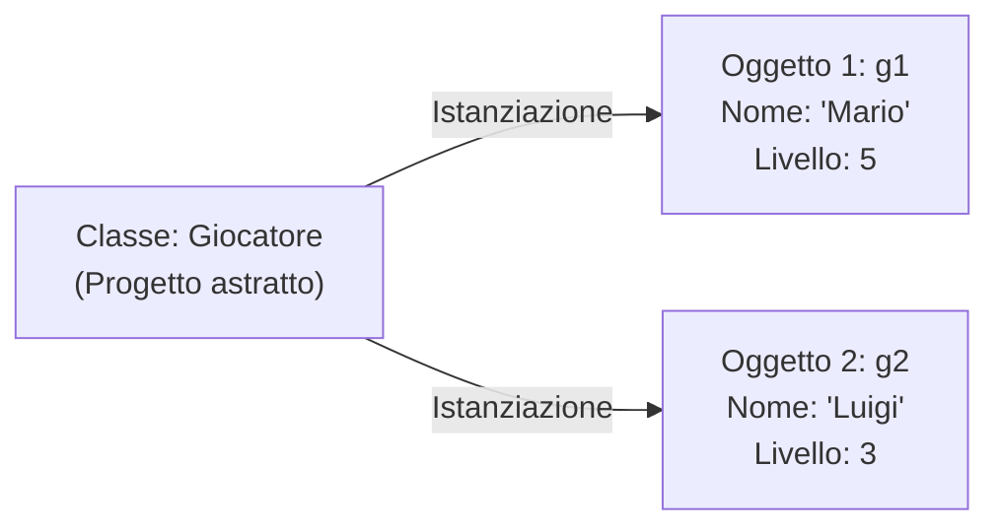
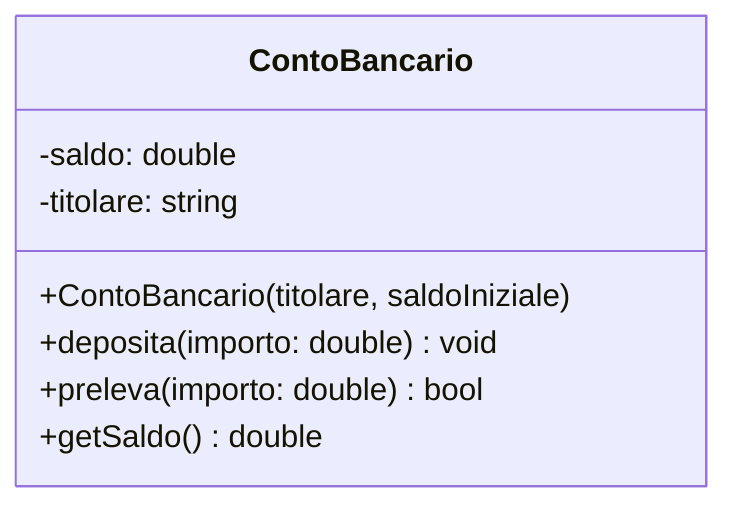

Nei problemi reali i tipi primitivi (`int`, `float`, `string`) non bastano per descrivere entità articolate come un utente, un prodotto o un personaggio di un videogioco.

Il C++ permette di creare **tipi di dati personalizzati** aggregando più variabili (e funzioni) sotto un unico nome mediante due strumenti: le **`struct`** e le **`class`**.

---
## 1. Classe vs Oggetto (Il Progetto e la Casa)
- **Classe (o Struct)**: è il **progetto architettonico** (*blueprint*), un modello astratto che definisce quali proprietà e comportamenti avrà quell'entità.
- **Oggetto (o Istanza)**: è la **casa concreta costruita** in memoria RAM a partire da quel progetto.



---
## 2. Le Struct (Strutture Dati)
Una `struct` è un tipo composto che raggruppa variabili di tipo differente, chiamate **campi** (o membri).

```cpp
#include <iostream>
#include <string>
using namespace std;

// Definizione della struttura Videogioco
struct Videogioco {
    string titolo;
    string genere;
    float valutazione;
    int annoUscita;
};

int main() {
    Videogioco g1; // Creazione dell'istanza

    // Accesso ai campi tramite operatore punto (.)
    g1.titolo = "The Legend of Zelda";
    g1.genere = "Action-Adventure";
    g1.valutazione = 9.8f;
    g1.annoUscita = 2017;

    cout << "Gioco: " << g1.titolo << " (" << g1.annoUscita << ")" << endl;
    return 0;
}
```

### Struct Annidate e Array di Struct
```cpp
struct Data {
    int giorno, mese, anno;
};

struct Studente {
    string nome, cognome;
    int matricola;
    Data dataNascita; // Struct annidata
};

int main() {
    Studente classe[20]; // Vettore di 20 studenti

    classe[0].nome = "Mario";
    classe[0].matricola = 101;
    classe[0].dataNascita.giorno = 15; // Doppio punto per accedere ai campi interni
}
```

---
## 3. Dalle Struct alle Classi (OOP)
In C++ l'unica differenza sintattica tra una `struct` e una `class` è la **visibilità predefinita**:
- Nelle `struct`: tutti i membri sono **`public`** di default.
- Nelle `class`: tutti i membri sono **`private`** di default.

Per convenzione:
- Si usa `struct` per meri contenitori di dati (*Plain Old Data*).
- Si usa `class` per la **programmazione orientata agli oggetti (OOP)** basata su **incapsulamento**.



---
## 4. Incapsulamento: `public` vs `private`
L'**incapsulamento** protegge i dati interni dell'oggetto impedendo che vengano manipolati in modo errato dall'esterno.

- **`private`**: visibili solo alle funzioni interne della classe stessa.
- **`public`**: accessibili da chiunque (es. nel `main`).

```cpp
class ContoBancario {
private:
    double saldo; // Nessuno dall'esterno può forzare saldo = -99999!

public:
    // Metodo setter con validazione dei dati
    void deposita(double importo) {
        if (importo > 0) {
            saldo += importo;
            cout << "Depositati " << importo << " euro." << endl;
        } else {
            cout << "Importo non valido!" << endl;
        }
    }

    // Metodo getter per consultare il valore in sola lettura (metodo const)
    double getSaldo() const {
        return saldo;
    }
};
```

---
## 5. Costruttori, Distruttori e il Puntatore `this`

### Il Costruttore
Metodo speciale con lo **stesso nome della classe** e senza tipo di ritorno. Viene chiamato **automaticamente** alla nascita dell'oggetto per inizializzarne i campi:

```cpp
#include <iostream>
#include <string>
using namespace std;

class Giocatore {
private:
    string nome;
    int puntiVita;
    int livello;

public:
    // 1. Costruttore di Default (senza parametri)
    Giocatore() : nome("Sconosciuto"), puntiVita(100), livello(1) {}

    // 2. Costruttore Parametrizzato con uso di this->
    Giocatore(string nome, int puntiVita, int livello) {
        // 'this' punta all'oggetto corrente: disambigua il campo dal parametro!
        this->nome = nome;
        this->puntiVita = puntiVita;
        this->livello = livello;
    }

    // Metodo di stampa
    void stampaScheda() const {
        cout << "Guerriero: " << nome << " | PV: " << puntiVita << " | Liv: " << livello << endl;
    }

    // Distruttore (eseguito alla distruzione dell'oggetto)
    ~Giocatore() {
        // Qui si dealloca eventuale memoria dinamica Heap
    }
};

int main() {
    Giocatore g1;                     // Chiama il costruttore di default
    Giocatore g2("Artu", 150, 5);      // Chiama il costruttore parametrizzato

    g1.stampaScheda();
    g2.stampaScheda();
    return 0;
}
```

> [!INFO] 🖼️ Placeholder Immagine: Diagramma delle Classi UML e Relazione con gli Oggetti
> *Suggerimento per Obsidian: inserisci qui uno screenshot di un diagramma UML completo con classi, attributi e metodi.*
> `![[Pasted image uml_classi.png|550]]`

---
## 6. Puntatori a Oggetti e l'Operatore Freccia (`->`)
Quando lavoriamo con un puntatore a un oggetto o una struct, usiamo l'operatore **`->`** (freccia) invece della combinazione scomoda `(*ptr).`:

```cpp
Giocatore *ptr = new Giocatore("Lancillotto", 120, 4);

// Invece di: (*ptr).stampaScheda();
ptr->stampaScheda(); // Molto più leggibile!

delete ptr; // Libera la memoria nello Heap
ptr = nullptr;
```

---
## Tabella di Confronto: `struct` vs `class`
| Proprietà | `struct` | `class` |
| :--- | :--- | :--- |
| **Visibilità predefinita** | `public` | `private` |
| **Ereditarietà predefinita** | `public` | `private` |
| **Uso prevalente** | Semplici aggregati di dati | Programmazione OOP, logica di business protetta |
| **Supporto a Costruttori/Metodi** | Sì (in C++ hanno le stesse capacità) | Sì |
