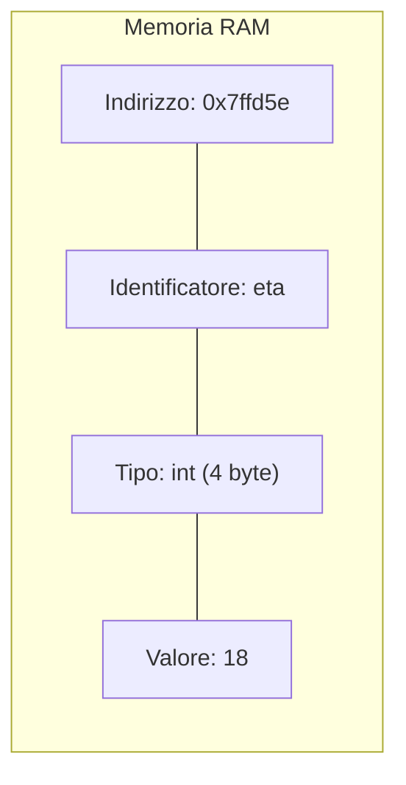
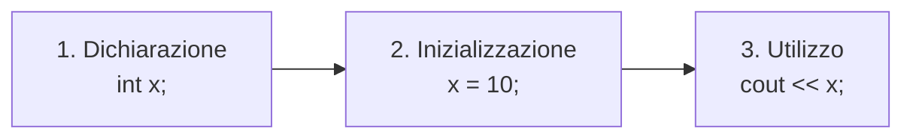
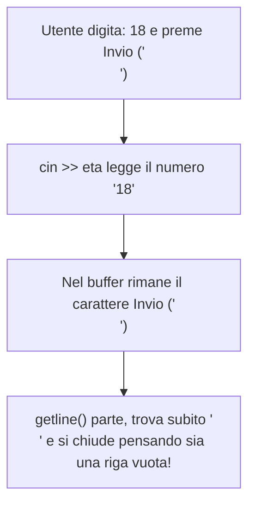

Una **variabile** è una porzione di memoria RAM destinata a contenere un dato che può variare durante l'esecuzione del programma.

Possiamo immaginarla come una **scatola etichettata** con 4 caratteristiche inscindibili:



1. **Nome (Identificatore)**: l'etichetta testuale usata dal programmatore per riferirsi alla cella (es. `eta`, `punteggio`).
2. **Tipo di Dato**: determina quanti byte di RAM riservare e come interpretare i bit memorizzati (`int`, `float`, `char`...).
3. **Valore**: il contenuto effettivo memorizzato all'interno della cella.
4. **Indirizzo di Memoria**: la posizione fisica univoca in RAM (es. `0x7ffd5e8b41ac`), ottenibile con l'operatore `&`.

> [!NOTE]
> A differenza dei file (persistenti su SSD/hard disk), le variabili sono **volatili**: quando il programma termina o il computer si spegne, tutti i dati nelle variabili vengono distrutti.

---
## 1. Ciclo di Vita di una Variabile
Le tre fasi fondamentali per usare una variabile sono:



```cpp
int eta;          // 1. Dichiarazione (riserva lo spazio, valore iniziale indefinito / spazzatura!)
eta = 18;         // 2. Assegnazione (memorizza il valore)

int livello = 1;  // Inizializzazione contestuale (buona norma!)
```

---
## 2. I Tipi di Dato Primitivi
In C++ ogni variabile deve avere un tipo stabilito prima dell'esecuzione (**tipizzazione statica e forte**).

| Tipo | Significato | Dimensione | Intervallo / Valori possibili | Esempio |
| :--- | :--- | :--- | :--- | :--- |
| **`int`** | Numero intero con segno | 4 byte (32 bit) | Da $-2 \times 10^9$ a $+2 \times 10^9$ | `int monete = 350;` |
| **`float`** | Decimale singola precisione | 4 byte (32 bit) | $\approx 7$ cifre decimali significative | `float peso = 68.5f;` |
| **`double`** | Decimale doppia precisione | 8 byte (64 bit) | $\approx 15$ cifre decimali significative | `double pi = 3.14159265;` |
| **`char`** | Singolo carattere ASCII | 1 byte (8 bit) | Tra apici singoli `' '` (codici 0-255) | `char voto = 'A';` |
| **`bool`** | Valore booleano di verità | 1 byte | `true` (1) oppure `false` (0) | `bool vivo = true;` |
| **`string`** | Stringa testuale (classe STL) | Dinamica | Testo tra doppi apici `" "` | `string nome = "Luca";` |

> [!TIP]
> Per usare `string` includi l'header `#include <string>`. Le stringhe in C++ sono oggetti dinamici che gestiscono automaticamente la memoria.

---
## 3. Modificatori di Tipo, Costanti e Overflow

### Modificatori
- **`unsigned`**: elimina i numeri negativi, raddoppiando l'intervallo positivo (es. `unsigned int` va da $0$ a oltre $4$ miliardi).
- **`long long`**: estende gli interi a 8 byte (fino a $\pm 9 \times 10^{18}$).
- **`const`**: rende la variabile una **costante di sola lettura**. Qualsiasi tentativo di modifica genererà un errore di compilazione.

```cpp
const float TASSO_IVA = 0.22f;
// TASSO_IVA = 0.25f; // ERRORE! Non puoi modificare una costante!
```

### Il Fenomeno dell'Overflow Numerico
Cosa succede se aggiungi `1` al valore massimo consentito da un tipo di dato?

```cpp
int maxIntero = 2147483647; // Massimo valore per un int a 32 bit con segno
maxIntero = maxIntero + 1;
cout << maxIntero << endl;  // Stampa: -2147483648!
```
> [!WARNING]
> Questo fenomeno si chiama **Integer Overflow**: il bit di segno si ribalta e il numero "ricomincia" dal limite negativo più basso. In sistemi critici può provocare bug gravissimi.

---
## 4. Input e Output (`cout`, `cin`, `getline()`)

### Output con `cout` (Operatore `<<`)
Permette di inviare dati al terminale:

```cpp
int vite = 3;
cout << "Vite rimaste: " << vite << endl;
```

### Input con `cin` (Operatore `>>`)
Estrae valori dal flusso di input della tastiera:

```cpp
int eta;
cout << "Quanti anni hai? ";
cin >> eta;
```

> [!CAUTION]
> L'operatore `>>` **si arresta al primo spazio bianco**. Se inserisci `"Mario Rossi"`, `cin` memorizzerà solo `"Mario"` e lascerà `"Rossi"` in sospeso nel buffer!

---
### Lettura di Intere Righe: `getline()` e il Problema del Buffer
Per leggere testi con spazi si usa `getline(cin, stringa)`. Tuttavia, se usato dopo un `cin >>`, si verifica un errore classico:



#### La Soluzione: `cin.ignore()`
```cpp
int eta;
string indirizzo;

cout << "Inserisci l'eta': ";
cin >> eta;

cin.ignore(); // Svuota l'Invio residuo dal canale di input!

cout << "Inserisci via e civico: ";
getline(cin, indirizzo); // Ora funziona correttamente!
```

> [!INFO] 🖼️ Placeholder Immagine: Funzionamento del buffer dello stream di input
> *Suggerimento per Obsidian: inserisci qui un diagramma che illustra la coda FIFO del buffer di cin prima e dopo cin.ignore().*
> `![[Pasted image buffer_cin.png|550]]`

---
## 5. Scope delle Variabili e Variable Shadowing
Lo **scope** (o ambito di visibilità) definisce dove una variabile può essere utilizzata nel codice.

```cpp
#include <iostream>
using namespace std;

int x = 100; // Variabile Globale

int main() {
    int x = 10; // Variabile Locale del main: nasconde quella globale (Shadowing!)
    cout << "x locale main: " << x << endl; // 10

    {
        int x = 5; // Locale del blocco interno
        cout << "x blocco interno: " << x << endl; // 5
    } // Qui la x da 5 viene distrutta!

    cout << "x torna ad essere: " << x << endl; // 10
    cout << "x globale (con ::): " << ::x << endl; // 100

    return 0;
}
```

---
## 6. Typecasting (`static_cast`)
Il casting converte una variabile da un tipo all'altro.

In C++, la divisione tra due interi `5 / 2` produce `2` (troncamento dei decimali). Per ottenere `2.5`, dobbiamo convertire almeno uno dei due operandi in un tipo decimale:

```cpp
int a = 5;
int b = 2;

// Errato: tronca a 2 prima di assegnare
float f1 = a / b; // 2.0

// Corretto tramite static_cast:
float f2 = static_cast<float>(a) / b; // 2.5
```
