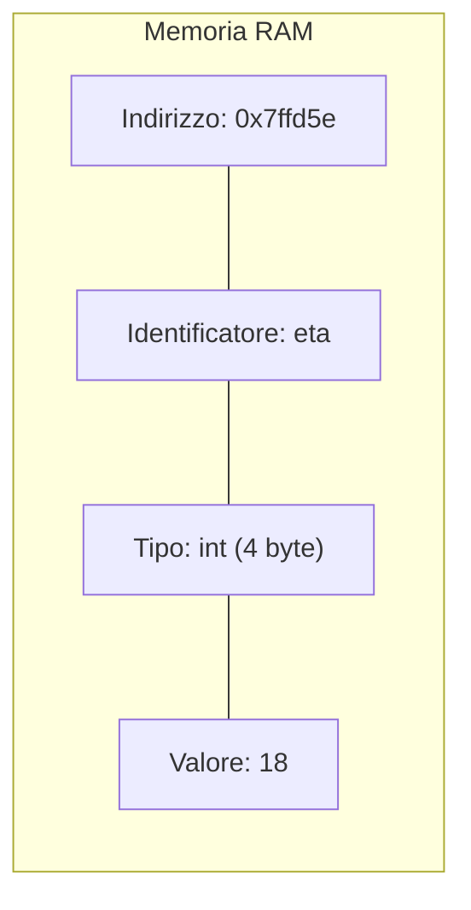
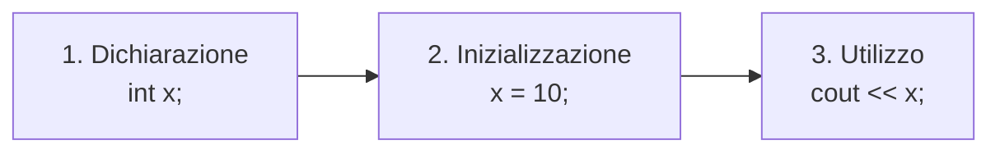
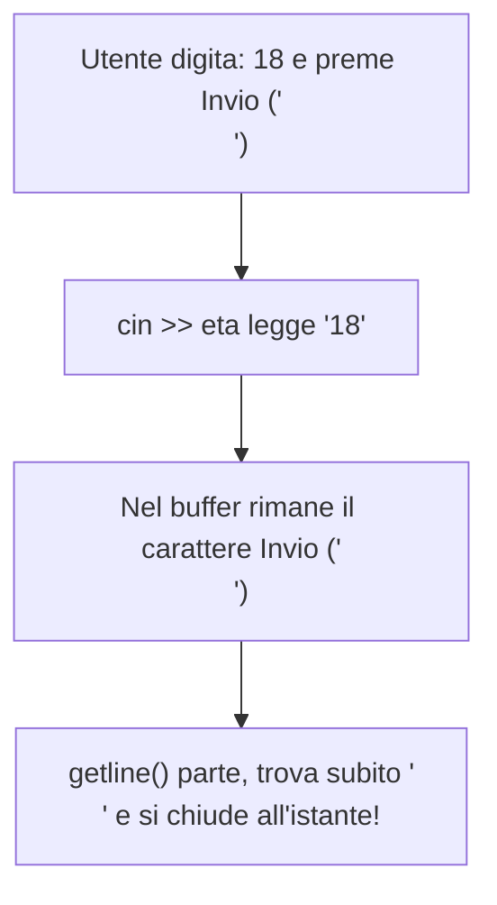

> [!SUMMARY] ⚡ In Sintesi (A Colpo d'Occhio)
> - **Variabile**: porzione di RAM con ==Nome==, ==Tipo==, ==Valore== e ==Indirizzo (`&`)==.
> - **Tipi Chiave**: `int` (interi 4 byte), `double` (decimali precisi 8 byte), `char` (singolo carattere), `bool` (`true`/`false`), `string` (testo).
> - **Input Tastiera**: `cin >>` legge fino al primo spazio; `getline(cin, s)` legge l'intera riga.
> - **Risoluzione Bug Buffer**: usa sempre ==`cin.ignore()`== tra un `cin >>` e un `getline()`.
> - **Divisione tra Interi**: $5 / 2$ fa $2$; usa ==`static_cast<float>(a) / b`== per ottenere $2.5$.

---

Una **variabile** è una porzione di memoria RAM destinata a contenere un dato che può variare durante l'esecuzione del programma.

Possiamo immaginarla come una **scatola etichettata** con 4 caratteristiche inscindibili:



1. **Nome (Identificatore)**: l'etichetta usata per riferirsi alla cella (es. `eta`, `punteggio`).
2. **Tipo di Dato**: stabilisce quanti byte di RAM riservare e come interpretare i bit (`int`, `float`, `char`...).
3. **Valore**: il contenuto effettivo memorizzato nella cella.
4. **Indirizzo di Memoria**: la posizione fisica univoca in RAM (es. `0x7ffd5e8b41ac`), accessibile con l'operatore **`&`**.

> [!NOTE]
> A differenza dei file (persistenti su SSD/hard disk), le variabili sono **volatili**: quando il programma termina o il computer si spegne, tutti i dati nelle variabili vengono distrutti.

---

## 1. Ciclo di Vita di una Variabile

Le tre fasi fondamentali per usare una variabile sono:



```cpp
int eta;          // 1. Dichiarazione (valore iniziale indefinito / spazzatura!)
eta = 18;         // 2. Assegnazione (memorizza il valore)

int livello = 1;  // Inizializzazione contestuale (buona norma consigliata!)
```

---

## 2. I Tipi di Dato Primitivi

In C++ ogni variabile deve avere un tipo stabilito a priori (**tipizzazione statica e forte**).

| Tipo | Significato | Dimensione | Intervallo / Valori possibili | Esempio |
| :--- | :--- | :--- | :--- | :--- |
| **`int`** | Numero intero con segno | 4 byte (32 bit) | Da $-2 \times 10^9$ a $+2 \times 10^9$ | `int monete = 350;` |
| **`float`** | Decimale singola precisione | 4 byte (32 bit) | $\approx 7$ cifre decimali significative | `float peso = 68.5f;` |
| **`double`** | Decimale doppia precisione | 8 byte (64 bit) | $\approx 15$ cifre decimali significative | `double pi = 3.14159265;` |
| **`char`** | Singolo carattere ASCII | 1 byte (8 bit) | Tra apici singoli `' '` (codici 0-255) | `char voto = 'A';` |
| **`bool`** | Valore booleano di verità | 1 byte | `true` (1) oppure `false` (0) | `bool vivo = true;` |
| **`string`** | Testo (classe STL da `<string>`) | Dinamica | Testo tra doppi apici `" "` | `string nome = "Luca";` |

---

## 3. Modificatori, Costanti e Integer Overflow

### Modificatori
- **`unsigned`**: elimina i negativi, raddoppiando il limite positivo (`unsigned int` va da $0$ a oltre $4$ miliardi).
- **`long long`**: estende gli interi a 8 byte (fino a $\pm 9 \times 10^{18}$).
- **`const`**: trasforma la variabile in una ==costante di sola lettura==. Qualsiasi modifica successiva genererà un errore di compilazione.

```cpp
const float TASSO_IVA = 0.22f;
// TASSO_IVA = 0.25f; // ERRORE! Non puoi modificare una costante!
```

> [!DANGER] 🚫 Il Fenomeno dell'Integer Overflow
> Se aggiungi `1` al valore massimo consentito da un `int` a 32 bit ($2.147.483.647$), il bit di segno si ribalta e il numero "ricomincia" dal limite negativo:
> ```cpp
> int max = 2147483647;
> max = max + 1;
> cout << max; // Stampa: -2147483648!
> ```

---

## 4. Input e Output (`cout`, `cin`, `getline()`)

### Output con `cout` (Operatore `<<`)
```cpp
int vite = 3;
cout << "Vite rimaste: " << vite << endl;
```

### Input con `cin` (Operatore `>>`)
```cpp
int eta;
cout << "Quanti anni hai? ";
cin >> eta;
```

> [!WARNING] ⚠️ Il Limite di `cin >>`
> L'operatore `>>` ==si ferma al primo spazio bianco==. Se inserisci `"Mario Rossi"`, `cin` leggerà solo `"Mario"` e lascerà `"Rossi"` nel canale di input!

---

### Lettura con Spazi: `getline()` e la Trappola del Buffer

Per leggere frasi complete con spazi si usa `getline(cin, stringa)`.  
Tuttavia, se usato subito dopo un `cin >>`, si verifica un errore comunissimo:



> [!SUCCESS] 🎯 La Soluzione: `cin.ignore()`
> Inserisci sempre `cin.ignore()` per "ripulire" l'Invio pendente prima di chiamare `getline()`:
> ```cpp
> int eta;
> string indirizzo;
> 
> cin >> eta;
> cin.ignore(); // Svuota il buffer!
> getline(cin, indirizzo); // Ora funziona regolarmente!
> ```

> [!INFO] 🖼️ Placeholder Immagine: Funzionamento del buffer dello stream di input
> *Suggerimento per Obsidian: inserisci qui un diagramma che illustra la coda FIFO del buffer di cin prima e dopo cin.ignore().*  
> `![[Pasted image buffer_cin.png|550]]`

---

## 5. Scope e Variable Shadowing

Lo **scope** (ambito di visibilità) definisce dove una variabile è valida.

```cpp
#include <iostream>
using namespace std;

int x = 100; // Variabile Globale

int main() {
    int x = 10; // Locale del main (nasconde quella globale: Shadowing!)

    {
        int x = 5; // Locale del blocco interno
        cout << "x blocco interno: " << x << endl; // 5
    } // Qui la x interna viene distrutta

    cout << "x locale main:    " << x << endl;   // 10
    cout << "x globale (::x):  " << ::x << endl; // 100
    return 0;
}
```

---

## 6. Typecasting con `static_cast`

> [!QUESTION] ❓ Domanda d'Esame: Perché 5 / 2 dà 2 in C++?
> Perché la divisione tra due interi genera **sempre un intero troncato**. Per avere decimali, almeno uno dei due operandi deve essere convertito con ==`static_cast<float>()`==:

```cpp
int a = 5;
int b = 2;

// Errato (troncamento a 2):
float errato = a / b; // 2.0

// Corretto con static_cast:
float corretto = static_cast<float>(a) / b; // 2.5
```
