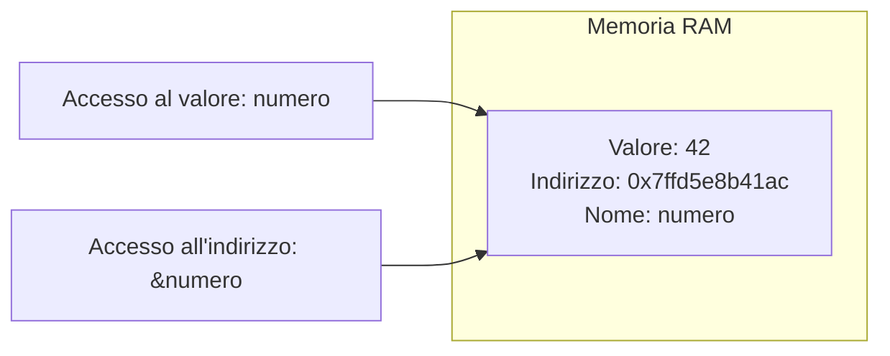
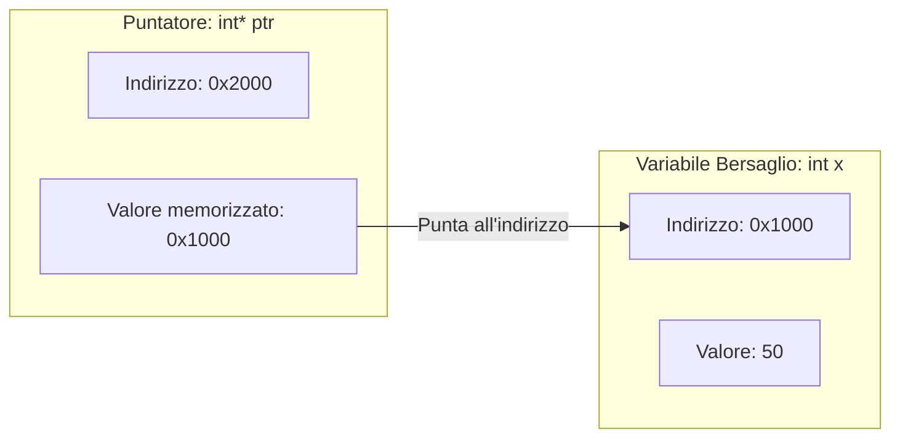
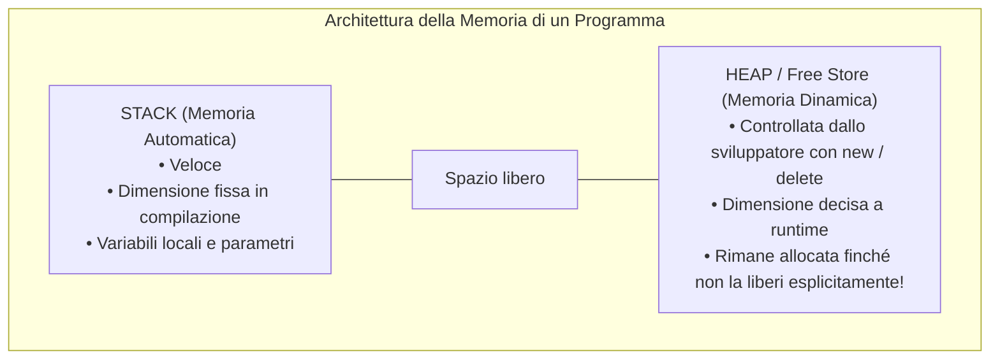
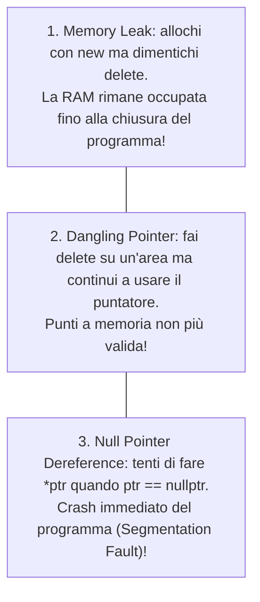

> [!SUMMARY] ⚡ In Sintesi (A Colpo d'Occhio)
> - **Puntatore**: variabile che memorizza l'==indirizzo di memoria RAM== di un'altra variabile.
> - **Operatore `&` (Indirizzo)**: ottiene la posizione fisica (`ptr = &x;`).
> - **Operatore `*` (Dereferenziazione)**: legge o scrive il ==valore puntato== (`*ptr = 100;`).
> - **Inizializzazione**: usa sempre ==`nullptr`== se non hai una variabile a cui puntare.
> - **Memoria Dinamica**: ==`new`== alloca nello Heap a runtime; ==`delete`== libera obbligatoriamente la RAM.

---

I **puntatori** consentono di interagire direttamente con la memoria RAM, offrendo massima velocità e controllo totale sull'hardware.

---

## 1. Variabili e Indirizzi di Memoria

Ogni volta che dichiariamo una variabile:
```cpp
int numero = 42;
```
il sistema riserva nella RAM uno spazio di 4 byte. La cella possiede un **indirizzo fisico univoco** (in esadecimale, es. `0x7ffd5e8b41ac`).



- Con `numero` leggiamo o scriviamo il **valore** (`42`).
- Con l'operatore **`&numero`** (*address-of*) otteniamo l'**indirizzo di memoria**.

---

## 2. Cos'è un Puntatore?

Un **puntatore** è una variabile speciale che **memorizza l'indirizzo di memoria di un'altra variabile**.



---

## 3. I Due Operatori Fondamentali: `&` e `*`

| Simbolo | Nome | Cosa fa | Esempio |
| :--- | :--- | :--- | :--- |
| **`&`** | Operatore Indirizzo (*address-of*) | Estrae la posizione in memoria | `int *p = &x;` |
| **`*`** | Operatore Dereferenziazione (*indirection*) | Accede al **contenuto** della cella puntata | `cout << *p;` oppure `*p = 99;` |

```cpp
#include <iostream>
using namespace std;

int main() {
    int valore = 25;
    int *ptr = &valore; // 'ptr' punta alla cella di 'valore'

    cout << "Valore di valore:           " << valore << endl; // 25
    cout << "Indirizzo di valore (&):    " << &valore << endl; // 0x61ff08
    cout << "Valore memorizzato in ptr:  " << ptr << endl;    // 0x61ff08
    cout << "Valore puntato (*ptr):      " << *ptr << endl;   // 25

    // Modifica indiretta tramite puntatore:
    *ptr = 100; 
    cout << "Nuovo valore di valore:     " << valore << endl; // 100!
    return 0;
}
```

> [!SUCCESS] 🎯 Regola d'Oro: Inizializzare sempre con `nullptr`
> Se dichiari un puntatore senza assegnargli subito una variabile, inizializzalo a ==`nullptr`==:
> ```cpp
> int *p = nullptr; // Evita che punti a una cella casuale e pericolosa della memoria!
> ```

---

## 4. Puntatori vs Riferimenti (`&`)

> [!QUESTION] ❓ Domanda d'Esame: Qual è la differenza tra un Puntatore e un Riferimento?

| Caratteristica | Puntatore (`int *p`) | Riferimento (`int &r`) |
| :--- | :--- | :--- |
| **Può essere nullo?** | ==Sì== (`nullptr`) | ==No==, deve riferirsi a una variabile reale |
| **Riassegnabile?** | ==Sì==, può puntare ad altro | ==No==, legato per sempre alla stessa cella |
| **Sintassi di accesso** | Richiede l'operatore `*p` | Trasparente (si usa come variabile comune) |
| **Dimensione in memoria** | Occupa 8 byte (a 64 bit) | Nessun overhead (è un semplice alias) |

---

## 5. Puntatori e Array

In C++ il nome di un array **è già un puntatore costante al suo primo elemento**:

```cpp
int arr[3] = {10, 20, 30};
int *p = arr; // Punta ad arr[0]

cout << *p << endl;       // 10 (arr[0])
cout << *(p + 1) << endl; // 20 (arr[1] - si sposta di 4 byte in avanti!)
cout << *(p + 2) << endl; // 30 (arr[2])
```

---

## 6. Memoria Dinamica: Stack vs Heap



### Gli Operatori `new` e `delete`
```cpp
#include <iostream>
using namespace std;

int main() {
    int n;
    cout << "Quanti elementi? ";
    cin >> n;

    // 1. Allocazione Dinamica nello Heap (new[])
    int *arr = new int[n];

    for (int i = 0; i < n; i++) arr[i] = (i + 1) * 10;

    // 2. Deallocazione Obbligatoria (delete[])
    delete[] arr;
    arr = nullptr; // Evita puntatori pendenti

    return 0;
}
```

---

## 7. I Tre Errori Mortali con i Puntatori



> [!DANGER] 🚫 Errore da Bocciatura: Il Memory Leak
> A ogni `new` deve corrispondere **esattamente un `delete`**. Se allochi memoria in un ciclo senza liberarla, il computer esaurirà tutta la RAM disponibile fino al blocco di sistema!

> [!INFO] 🖼️ Placeholder Immagine: Schema visivo di Memory Leak e Dangling Pointer
> *Suggerimento per Obsidian: inserisci qui un disegno che illustra blocchi di memoria orfani nello Heap non più raggiungibili dal programma.*  
> `![[Pasted image memory_leak.png|550]]`
