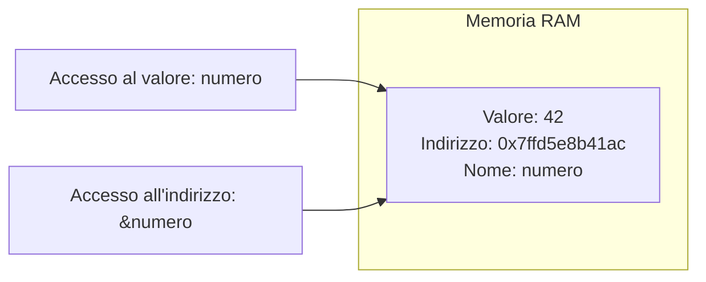
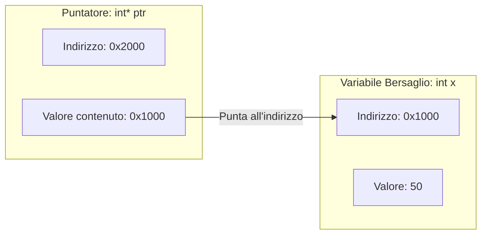
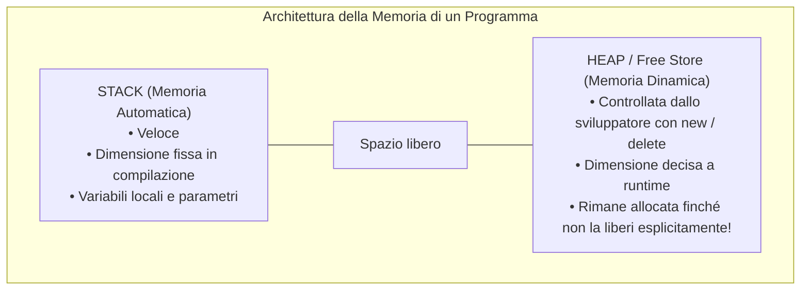
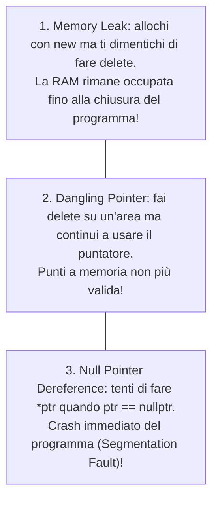

I **puntatori** sono una delle funzionalità più caratteristiche e potenti del C e del C++. Consentono di interagire direttamente con la memoria RAM, offrendo massima velocità e controllo totale sull'hardware.

---
## 1. Variabili e Indirizzi di Memoria
Ogni volta che dichiariamo una variabile:
```cpp
int numero = 42;
```
il sistema operativo riserva nella RAM uno spazio di 4 byte per contenere il dato `42`.
La cella possiede un **indirizzo fisico univoco** (espresso in esadecimale, es. `0x7ffd5e8b41ac`).



- Con `numero` leggiamo o scriviamo il **valore** (`42`).
- Con l'operatore **`&numero`** (*address-of*) otteniamo l'**indirizzo di memoria** della variabile.

---
## 2. Cos'è un Puntatore?
Un **puntatore** è una variabile speciale che **memorizza l'indirizzo di memoria di un'altra variabile**.



---
## 3. I Due Operatori Fondamentali: `&` e `*`
| Simbolo | Nome | Cosa fa | Esempio |
| :--- | :--- | :--- | :--- |
| **`&`** | Operatore Indirizzo (*address-of*) | Estrae la posizione in memoria di una variabile | `int *p = &x;` |
| **`*`** | Operatore Dereferenziazione (*indirection*) | Accede al **contenuto** della cella puntata dal puntatore | `cout << *p;` oppure `*p = 99;` |

### Codice Completo di Esempio
```cpp
#include <iostream>
using namespace std;

int main() {
    int valore = 25;
    int *ptr = &valore; // 'ptr' punta alla cella di 'valore'

    cout << "Valore della variabile:            " << valore << endl; // 25
    cout << "Indirizzo della variabile (&valore): " << &valore << endl; // es. 0x61ff08
    cout << "Indirizzo memorizzato in ptr:        " << ptr << endl;    // 0x61ff08
    cout << "Dato puntato da ptr (*ptr):         " << *ptr << endl;   // 25

    // MODIFICA INDIRETTA TRAMITE PUNTATORE:
    *ptr = 100; // Modifica la cella di memoria puntata
    cout << "Nuovo valore della variabile:        " << valore << endl; // 100!

    return 0;
}
```

> [!IMPORTANT]
> **Inizializzazione sicura con `nullptr`**:
> Non lasciare mai un puntatore "orfano" (`int *p;`). Se non hai ancora una variabile a cui farlo puntare, inizializzalo a `nullptr`:
>```cpp
> int *p = nullptr; // Indica esplicitamente che non punta a nessun dato valido
> ```

---
## 4. Puntatori vs Riferimenti (`&`)
Spesso si fa confusione tra puntatori e riferimenti. Ecco le 4 differenze sostanziali:

| Caratteristica | Puntatore (`int *p`) | Riferimento (`int &r`) |
| :--- | :--- | :--- |
| **Può essere nullo?** | **Sì** (`nullptr`) | **No**, deve riferirsi a una variabile reale esistente |
| **Riassegnabile?** | **Sì**, può puntare a un'altra variabile in seguito | **No**, una volta legato rimane tale per sempre |
| **Sintassi di accesso** | Richiede l'operatore di dereferenziazione `*p` | Trasparente, si usa direttamente il nome `r` |
| **Occupazione memoria** | Occupa 8 byte (su OS a 64 bit) | È un semplice alias a livello di compilatore |

---
## 5. Puntatori e Array
In C++ il nome di un array **è già un puntatore costante al suo primo elemento**:

```cpp
int arr[3] = {10, 20, 30};
// Queste scritture sono equivalenti:
cout << arr << " e' uguale a " << &arr[0] << endl;
```

### Aritmetica dei Puntatori
Quando aggiungi `1` a un puntatore (`p + 1`), il processore avanza di tanti byte quanti ne occupa il tipo di dato (`sizeof(int) = 4 byte`):

```cpp
int arr[3] = {10, 20, 30};
int *p = arr;

cout << *p << endl;       // 10 (arr[0])
cout << *(p + 1) << endl; // 20 (arr[1])
cout << *(p + 2) << endl; // 30 (arr[2])
```

---
## 6. Memoria Dinamica: Stack vs Heap


### Gli Operatori `new` e `delete`
Se la quantità di dati dipende da cosa inserisce l'utente a runtime, allochiamo memoria dinamica nello Heap:

```cpp
#include <iostream>
using namespace std;

int main() {
    int dimensione;
    cout << "Quanti numeri vuoi salvare? ";
    cin >> dimensione;

    // 1. ALLOCAZIONE DINAMICA NELLO HEAP (new[])
    int *vettore = new int[dimensione];

    for (int i = 0; i < dimensione; i++) {
        vettore[i] = (i + 1) * 10;
    }

    cout << "Numeri salvati: ";
    for (int i = 0; i < dimensione; i++) {
        cout << vettore[i] << " ";
    }
    cout << endl;

    // 2. DEALLOCAZIONE OBBLIGATORIA (delete[])
    delete[] vettore;
    vettore = nullptr; // Buona norma per evitare puntatori pendenti

    return 0;
}
```

---
## 7. I Tre Errori Critici con i Puntatori


> [!INFO] 🖼️ Placeholder Immagine: Rappresentazione visiva di Memory Leak e Dangling Pointer
> *Suggerimento per Obsidian: inserisci qui uno schema grafico che mostra blocchi orfani nello Heap non più raggiungibili dal programma.*
> `![[Pasted image memory_leak.png|550]]`
