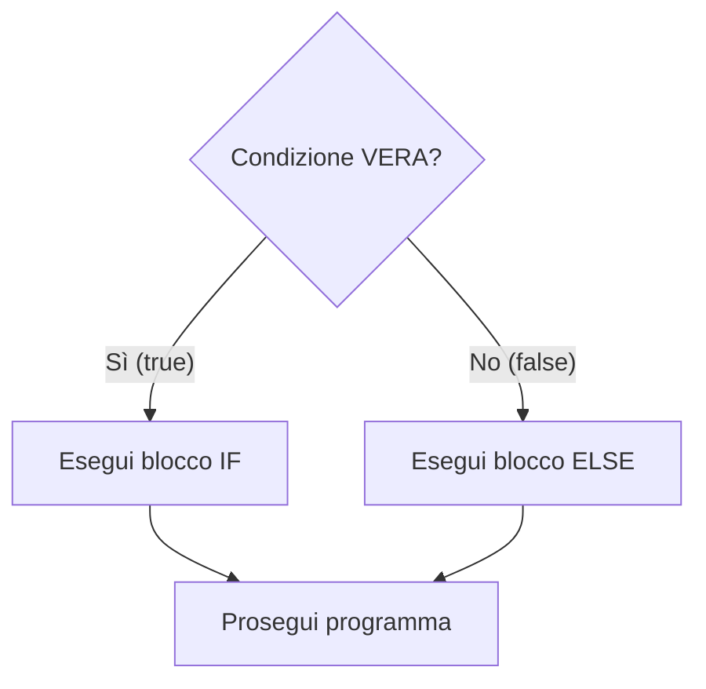
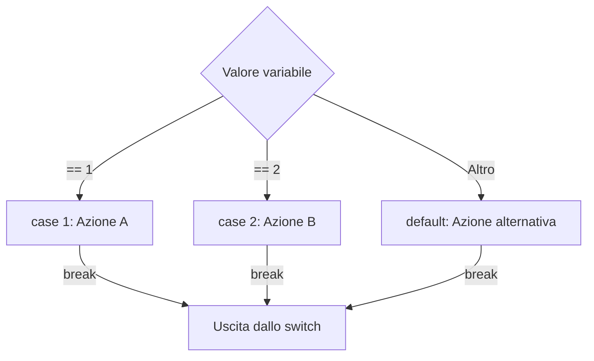
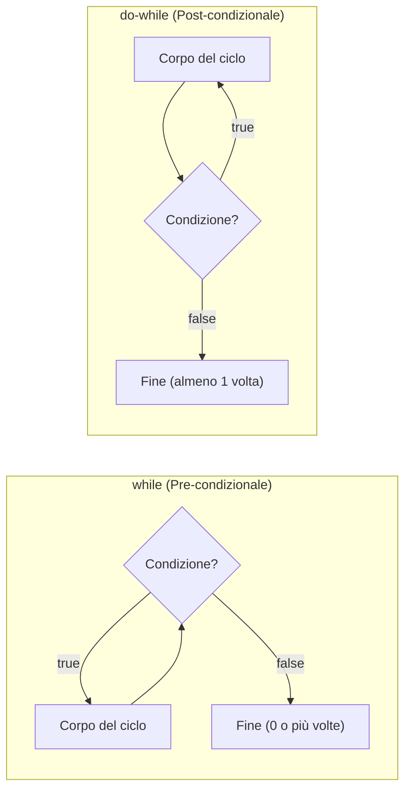
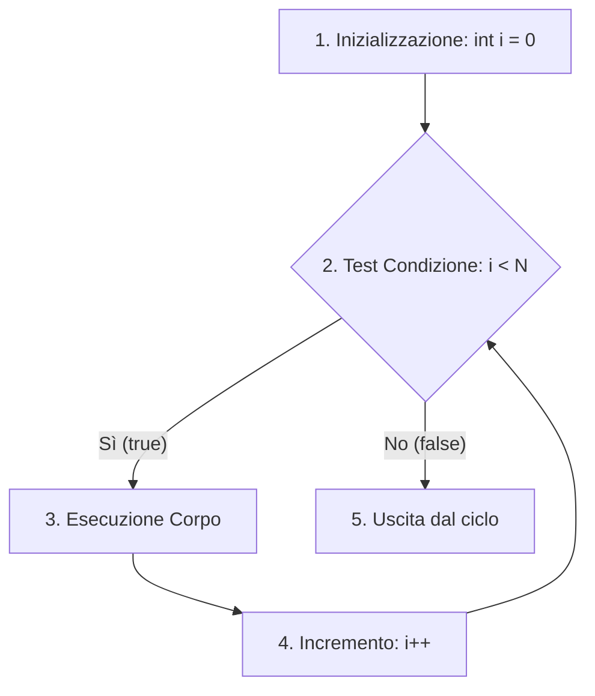

> [!SUMMARY] ⚡ In Sintesi (A Colpo d'Occhio)
> - **Selezione**: ==`if-else`== per condizioni booleane; ==`switch`== per menu numerici o caratteri (ricorda il `break`!).
> - **Ciclo `for`**: ideale quando il ==numero di iterazioni è noto== a priori (es. array da 0 a $N$).
> - **Ciclo `while`**: controllo in testa, esegue da ==0 a $N$ volte== (ottimo per lettura file).
> - **Ciclo `do-while`**: controllo in coda, esegue ==almeno 1 volta== (la scelta d'oro per la validazione dell'input).
> - **Interruzioni**: ==`break`== esce dal ciclo; ==`continue`== salta al giro successivo.

---

Nei programmi reali dobbiamo consentire al computer di prendere decisioni o ripetere blocchi di istruzioni finché una condizione è verificata.

Queste capacità sono governate dalle **strutture di controllo**:
1. **Selezione (Condizionali)**: `if`, `else`, `switch`.
2. **Iterazione (Cicli)**: `while`, `do-while`, `for`.

---

## 1. Strutture di Selezione

### Il costrutto `if` - `else if` - `else`
Biforca il flusso di esecuzione in base al valore booleano (`true` o `false`) dell'espressione.



```cpp
#include <iostream>
using namespace std;

int main() {
    int voto;
    cout << "Inserisci voto (1-10): ";
    cin >> voto;

    if (voto >= 8) {
        cout << "Livello: Ottimo" << endl;
    } else if (voto >= 6) {
        cout << "Livello: Sufficiente" << endl;
    } else {
        cout << "Livello: Insufficiente" << endl;
    }

    return 0;
}
```

### Cortocircuito Logico (*Short-Circuit Evaluation*)
- In `cond1 && cond2`: se `cond1` è ==falsa==, il computer **non valuta nemmeno `cond2`** (il risultato è per forza falso).
- In `cond1 || cond2`: se `cond1` è ==vera==, il computer **non valuta `cond2`** (il risultato è per forza vero).

> [!SUCCESS] 🎯 Trucco del Mestiere: Sicurezza dei Puntatori
> Grazie al cortocircuito puoi scrivere controlli salvavita come:  
> `if (ptr != nullptr && *ptr > 0)`  
> Se `ptr` è nullo, la dereferenziazione `*ptr` viene evitata proteggendo il programma da un crash!

---

### Selezione Multipla: `switch`

Quando confrontiamo **una singola variabile intera o carattere** contro più valori costanti, `switch` è molto più pulito di una sfilza di `else if`.



```cpp
char scelta;
cout << "Vuoi continuare? (s/n): ";
cin >> scelta;

switch (scelta) {
    case 's':
    case 'S':
        cout << "Continuo l'elaborazione..." << endl;
        break; // Esce dallo switch!
    case 'n':
    case 'N':
        cout << "Operazione annullata." << endl;
        break;
    default:
        cout << "Scelta non riconosciuta!" << endl;
        break;
}
```

> [!DANGER] 🚫 Errore da Matita Rossa: Dimenticare il `break` (Fall-Through)
> Se ometti l'istruzione `break`, il programma continuerà a eseguire indistintamente anche i `case` sottostanti anche se la condizione non corrisponde!

---

## 2. Strutture di Iterazione (I Cicli)



> [!QUESTION] ❓ Domanda d'Esame: Differenza tra `while` e `do-while`
> - **`while`**: la condizione viene controllata **prima**. Se è falsa subito, il ciclo esegue ==0 iterazioni==.
> - **`do-while`**: la condizione viene controllata **dopo**. Il corpo viene eseguito ==almeno 1 volta garantita==.

---

### Lo Schema Fisso della Validazione Input con `do-while`

> [!SUCCESS] 🎯 Il Pattern per la Verifica dei Dati Utente
> ```cpp
> int voto;
> do {
>     cout << "Inserisci un voto valido (1-10): ";
>     cin >> voto;
> } while (voto < 1 || voto > 10); // Ripete se il dato è SBAGLIATO!
> ```

> [!INFO] 🖼️ Placeholder Immagine: Diagramma di flusso della validazione di un input
> *Suggerimento per Obsidian: inserisci qui un diagramma di flusso flowchart della validazione utente con do-while.*  
> `![[Pasted image validazione_flowchart.png|500]]`

---

### Il Ciclo `for` (A Conteggio)



```cpp
// Stampa i numeri da 1 a 5
for (int i = 1; i <= 5; i++) {
    cout << i << " ";
}
cout << endl;
```

---

## 3. Istruzioni di Salto: `break` e `continue`

- **`break`**: ==termina ed esce all'istante== dal ciclo più interno.
- **`continue`**: ==salta il resto del giro corrente== e passa subito all'iterazione successiva.

```cpp
for (int i = 1; i <= 6; i++) {
    if (i == 3) continue; // Salta il numero 3!
    if (i == 5) break;    // Blocca il ciclo prima del 5!
    cout << i << " ";
}
// Stampa a schermo: 1 2 4
```

---

## Tabella di Scelta Rapida

| Situazione | Struttura Consigliata | Esempio Tipico |
| :--- | :--- | :--- |
| **Numero di iterazioni noto a priori** | ==`for`== | Scorrere un array di 50 elementi |
| **Controllo preventivo della condizione** | ==`while`== | Lettura da file riga per riga fino a EOF |
| **Esecuzione obbligatoria almeno una volta** | ==`do-while`== | Validazione da tastiera, menu ripetuto |
| **Scelta multipla tra valori fissi** | ==`switch`== | Menu di selezione (1, 2, 3...) |
