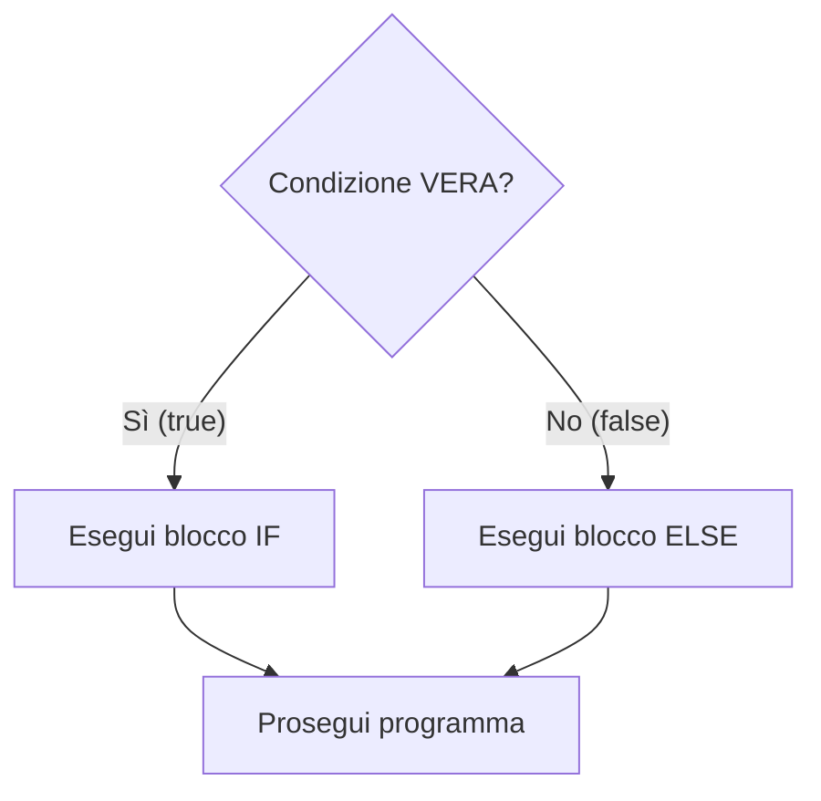
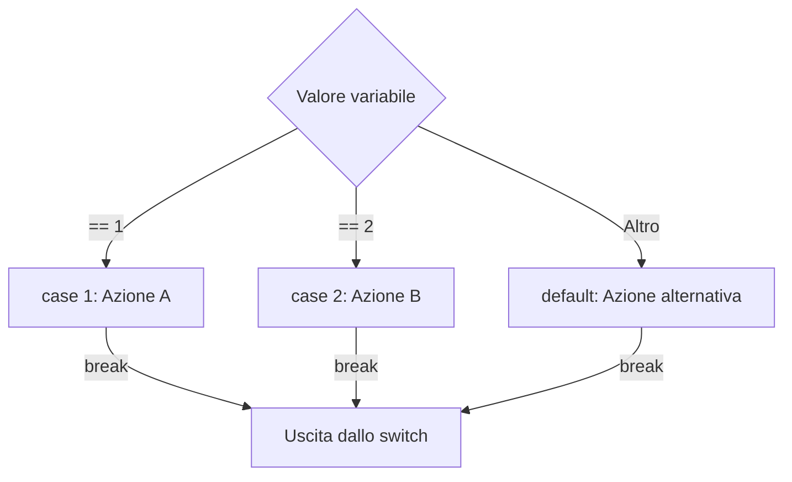
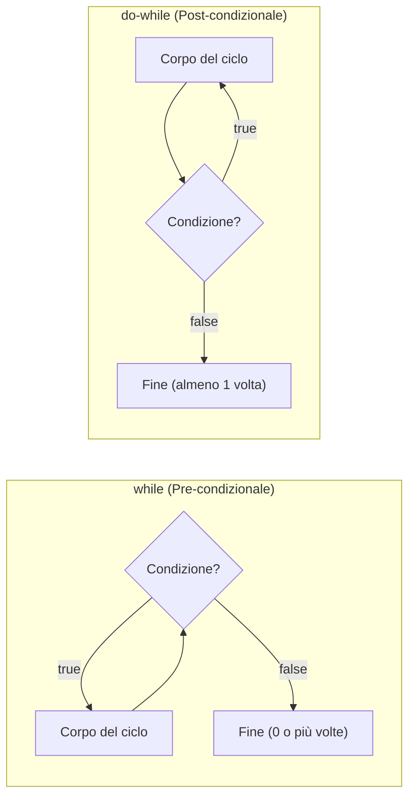
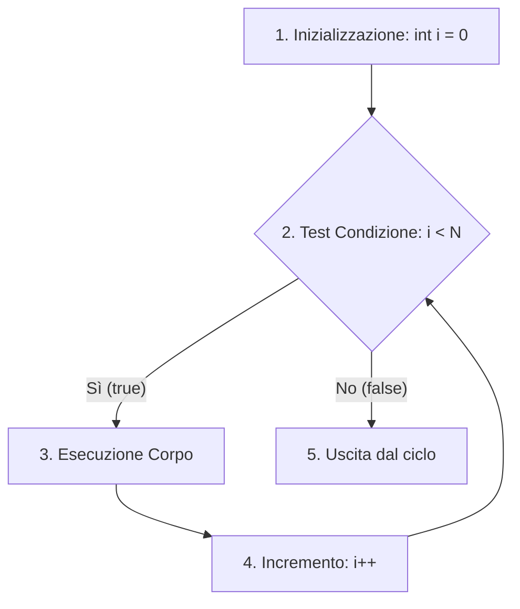

Nei programmi più semplici le istruzioni vengono eseguite in modo **sequenziale**, una riga dopo l'altra.
Nella realtà, però, dobbiamo consentire al computer di prendere decisioni o ripetere blocchi di istruzioni finché una condizione è verificata.

Queste capacità sono governate dalle **strutture di controllo**:
1. **Selezione (Condizionali)**: `if`, `else`, `switch`.
2. **Iterazione (Cicli)**: `while`, `do-while`, `for`.

---
## 1. Strutture di Selezione

### Il costrutto `if` - `else if` - `else`
Consente di biforcare il flusso di esecuzione in base al valore di verità (`true` o `false`) di un'espressione.



```cpp
#include <iostream>
using namespace std;

int main() {
    int voto;
    cout << "Inserisci voto (1-10): ";
    cin >> voto;

    if (voto >= 8) {
        cout << "Livello: Ottimo" << endl;
    } else if (voto >= 6) {
        cout << "Livello: Sufficiente" << endl;
    } else {
        cout << "Livello: Insufficiente" << endl;
    }

    return 0;
}
```

### Cortocircuito Logico (*Short-Circuit Evaluation*)
Negli operatori logici composti:
- Nel costrutto `cond1 && cond2`: se `cond1` è **falsa**, il compilatore **non valuta nemmeno `cond2`** (il risultato complessivo sarà comunque falso).
- Nel costrutto `cond1 || cond2`: se `cond1` è **vera**, il compilatore **non valuta `cond2`** (il risultato sarà comunque vero).

> [!TIP]
> Questa proprietà consente di scrivere controlli di sicurezza salvavita come:
> `if (ptr != nullptr && *ptr > 0)`
> Se `ptr` è nullo, la dereferenziazione `*ptr` non viene eseguita evitando un crash!

---
### Selezione Multipla: `switch`
Quando dobbiamo confrontare **una singola variabile intera o carattere** contro una serie di valori costanti prefissati, `switch` è più pulito ed efficiente di una sfilza di `else if`.



```cpp
char scelta;
cout << "Vuoi continuare? (s/n): ";
cin >> scelta;

switch (scelta) {
    case 's':
    case 'S': // Supporta sia minuscola che maiuscola
        cout << "Continuo l'elaborazione..." << endl;
        break; // Interrompe ed esce dallo switch
    case 'n':
    case 'N':
        cout << "Operazione annullata." << endl;
        break;
    default:
        cout << "Scelta non riconosciuta!" << endl;
        break;
}
```

> [!CAUTION]
> **Il pericolo del *Fall-Through***: se dimentichi di inserire l'istruzione `break`, il programma continuerà a eseguire anche le istruzioni dei `case` successivi, anche se la condizione non corrisponde!

---
## 2. Strutture di Iterazione (I Cicli a Confronto)
I cicli servono a ripetere istruzioni. In C++ si dividono in base a **quando** viene controllata la condizione:



### 1. `while`: Controllo in Testa
La condizione viene verificata **prima** di ogni giro. Se la condizione è falsa fin dall'inizio, il ciclo non parte mai.

```cpp
int contatore = 1;
while (contatore <= 3) {
    cout << "Iterazione: " << contatore << endl;
    contatore++;
}
```

---
### 2. `do-while`: Controllo in Coda (Validazione Input)
Il corpo viene eseguito **almeno una volta**, perché la verifica avviene solo alla fine.
È il costrutto fondamentale per la **validazione dei dati immessi dall'utente**:

```cpp
#include <iostream>
using namespace std;

int main() {
    int numero;
    // Chiede il numero finché non rispetta l'intervallo richiesto
    do {
        cout << "Inserisci un numero positivo tra 1 e 10: ";
        cin >> numero;
    } while (numero < 1 || numero > 10);

    cout << "Hai inserito un valore valido: " << numero << endl;
    return 0;
}
```

> [!INFO] 🖼️ Placeholder Immagine: Diagramma di flusso della validazione di un input
> *Suggerimento per Obsidian: inserisci qui un diagramma di flusso flowchart della validazione utente con do-while.*
> `![[Pasted image validazione_flowchart.png|500]]`

---
### 3. `for`: Ciclo a Conteggio
Ideale quando il numero di iterazioni è prefissato o quando si devono scorrere collezioni di dati.



```cpp
// Stampa i numeri da 1 a 5
for (int i = 1; i <= 5; i++) {
    cout << i << " ";
}
cout << endl;
```

#### Pre-incremento (`++i`) vs Post-incremento (`i++`)
- `i++` (Post): restituisce il valore attuale di `i` e solo successivamente lo incrementa.
- `++i` (Pre): incrementa prima il valore e restituisce il valore già aggiornato.
*(Nei cicli `for` l'effetto pratico è lo stesso, ma `++i` è preferito per ragioni di efficienza quando si usano iteratori complessi).*

---
## 3. Istruzioni di Salto: `break` e `continue`
- **`break`**: esce all'istante dal ciclo più interno in cui si trova.
- **`continue`**: salta il resto delle istruzioni del giro corrente e passa immediatamente alla verifica della successiva iterazione.

```cpp
for (int i = 1; i <= 6; i++) {
    if (i == 3) continue; // Salta il numero 3!
    if (i == 5) break;    // Si ferma del tutto prima del 5!
    cout << i << " ";
}
// Output stampato: 1 2 4
```

---
## Tabella di Scelta Rapida
| Situazione | Struttura Consigliata | Esempio |
| :--- | :--- | :--- |
| Conosci a priori quanti giri fare | **`for`** | Scorrere un array di 50 elementi |
| Devi verificare prima se agire | **`while`** | Lettura di righe da file fino a EOF |
| Devi eseguire l'azione almeno una volta | **`do-while`** | Menu con ripetizione o controllo input |
| Confronti una variabile contro 3 o più valori fissi | **`switch`** | Selezione opzioni menu (1, 2, 3...) |
