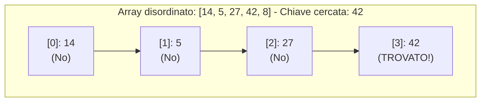
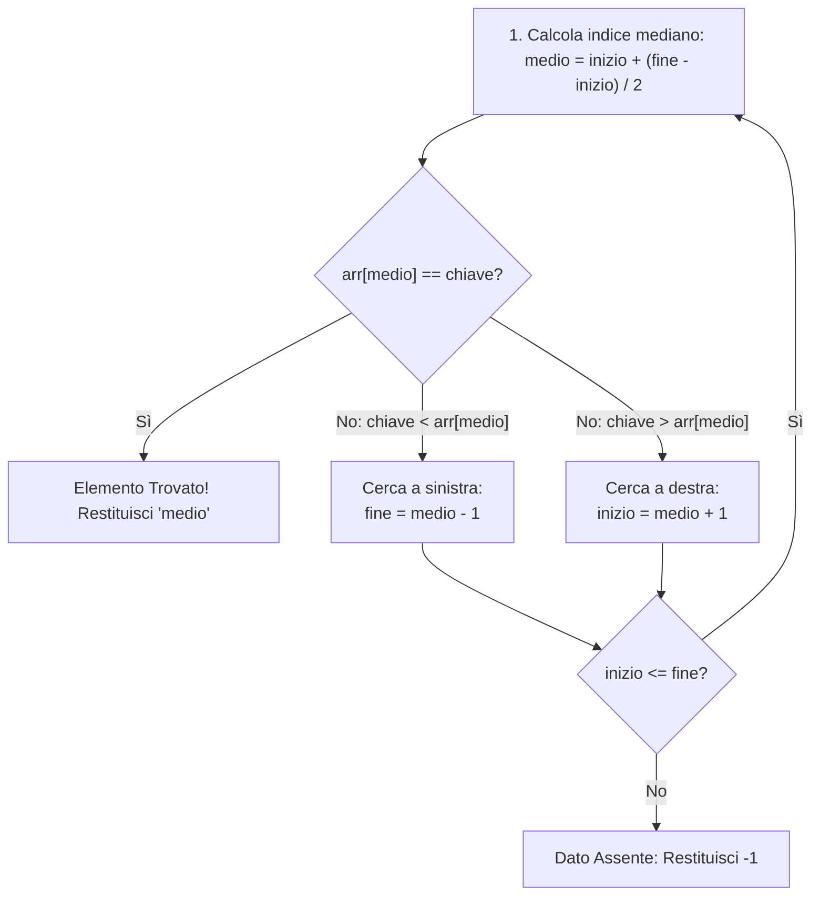

> [!SUMMARY] ⚡ In Sintesi (A Colpo d'Occhio)
> - **Ricerca Lineare**: controlla cella per cella. Funziona su ==qualsiasi array== (anche disordinato). Complessità: ==$O(n)$==.
> - **Ricerca Binaria (Dicotomica)**: dimezza lo spazio di ricerca (*Divide et Impera*). Richiede ==array obbligatoriamente già ordinato==! Complessità: ==$O(\log n)$==.
> - **Confronto Potenza**: su 1 milione di elementi la lineare fa fino a 1.000.000 di confronti; la binaria ne fa ==al massimo 20==!

---

Cercare se un elemento è presente all'interno di una collezione di dati è un problema cardine dell'informatica.

In C++ gli algoritmi di ricerca standard su vettori sono due:
1. **Ricerca Lineare (o Sequenziale)**: elementare, applicabile a qualsiasi array.
2. **Ricerca Binaria (o Dicotomica)**: straordinariamente veloce, ma richiede che l'array sia già ordinato.

---

## 1. Ricerca Lineare (Sequenziale)

### Come Funziona
Scorre il vettore cella per cella dall'indice `0` all'indice `N - 1`. Non appena trova il valore cercato restituisce l'indice corrente; se termina il vettore senza successo restituisce `-1`.



```cpp
int ricercaLineare(const int arr[], int dimensione, int chiave) {
    for (int i = 0; i < dimensione; i++) {
        if (arr[i] == chiave) {
            return i; // Trovato all'indice i
        }
    }
    return -1; // Non presente
}
```

### Complessità Computazionale
- **Caso Migliore**: $O(1)$ — L'elemento cercato è il primo esaminato.
- **Caso Peggiore e Medio**: ==$O(n)$== — L'elemento è l'ultimo o assente (dobbiamo esaminare tutti gli $n$ elementi).

---

## 2. Ricerca Binaria (Dicotomica)

> [!QUESTION] ❓ Domanda d'Esame: Qual è il prerequisito della ricerca binaria?
> La ricerca binaria richiede **tassativamente che il vettore sia già ordinato** (in ordine crescente o decrescente). Se l'array è disordinato, l'algoritmo fallirà!

### Logica del "Divide et Impera"
Invece di controllare un elemento alla volta, a ogni confronto **dimezziamo lo spazio di ricerca**:



> [!TIP] 💡 Formula Sicura contro l'Integer Overflow
> Calcolando `(inizio + fine) / 2` su array enormi si rischia un **Integer Overflow**.  
> Usa sempre la formula sicura: ==`medio = inizio + (fine - inizio) / 2`==.

### Codice C++ (Versione Iterativa)
```cpp
int ricercaBinaria(const int arr[], int dimensione, int chiave) {
    int inizio = 0;
    int fine = dimensione - 1;

    while (inizio <= fine) {
        int medio = inizio + (fine - inizio) / 2;

        if (arr[medio] == chiave) {
            return medio; // Trovato!
        }

        if (arr[medio] < chiave) {
            inizio = medio + 1; // Sposta a destra
        } else {
            fine = medio - 1;   // Sposta a sinistra
        }
    }

    return -1; // Non presente
}
```

> [!INFO] 🖼️ Placeholder Immagine: Schema visivo ad albero del dimezzamento per la ricerca binaria
> *Suggerimento per Obsidian: inserisci qui un disegno che illustra il restringimento progressivo dei puntatori inizio, medio e fine.*  
> `![[Pasted image binary_search_tree.png|550]]`

---

## 3. Confronto di Efficienza: Lineare vs Binaria

La complessità temporale della ricerca binaria è logaritmica: **$O(\log_2 n)$**.

| Dimensione Vettore ($n$) | Passi Massimi (Lineare $O(n)$) | Passi Massimi (Binaria $O(\log n)$) |
| :--- | :--- | :--- |
| **10** elementi | 10 | 4 |
| **1.000** elementi | 1.000 | 10 |
| **1.000.000** (1 milione) | 1.000.000 | ==solo 20 passi!== |
| **1.000.000.000** (1 miliardo) | 1.000.000.000 | ==solo 30 passi!== |

---

> [!EXAMPLE]- 🧪 Programma Completo di Test Eseguibile (Clicca per espandere)
> ```cpp
> #include <iostream>
> using namespace std;
> 
> int ricercaBinaria(const int arr[], int dim, int chiave);
> 
> int main() {
>     const int N = 7;
>     int dati[N] = {4, 9, 15, 23, 38, 51, 77}; // Array ordinato
> 
>     int bersaglio = 38;
>     int pos = ricercaBinaria(dati, N, bersaglio);
> 
>     if (pos != -1) cout << "Trovato all'indice: " << pos << endl;
>     else cout << "Non trovato!" << endl;
>     return 0;
> }
> 
> int ricercaBinaria(const int arr[], int dim, int chiave) {
>     int inizio = 0, fine = dim - 1;
>     while (inizio <= fine) {
>         int medio = inizio + (fine - inizio) / 2;
>         if (arr[medio] == chiave) return medio;
>         if (arr[medio] < chiave) inizio = medio + 1;
>         else fine = medio - 1;
>     }
>     return -1;
> }
> ```
