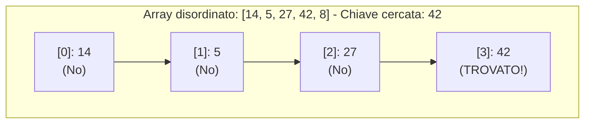
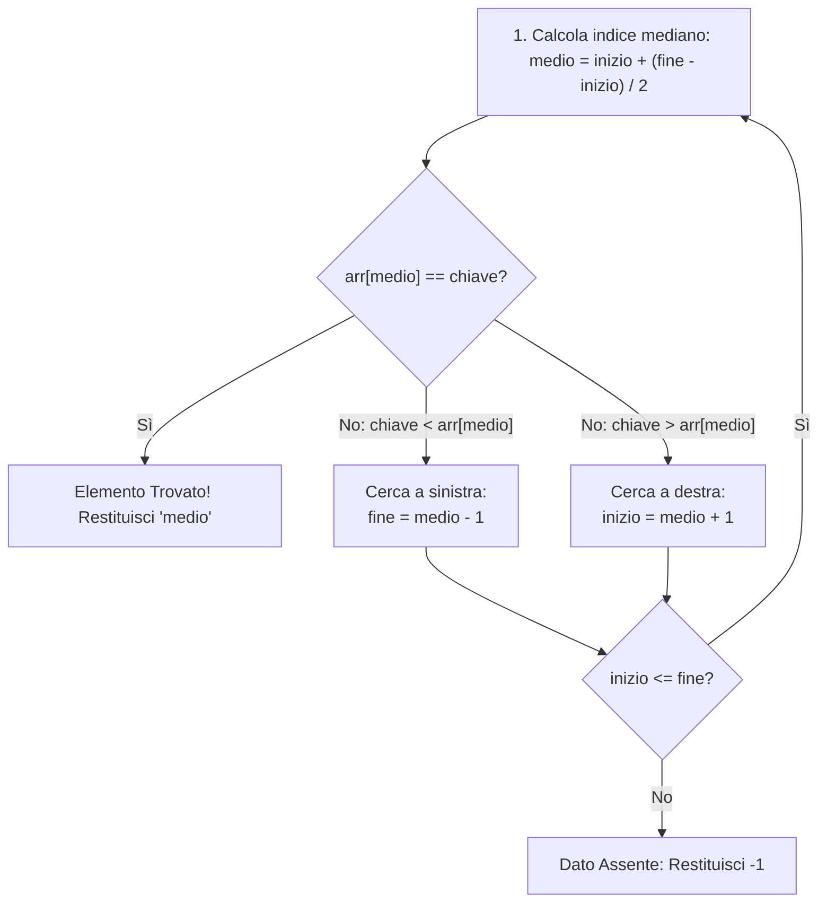

Cercare se un elemento è presente all'interno di una collezione di dati (e individuare la sua posizione) è un problema cardine dell'informatica.

In C++ gli algoritmi di ricerca standard su vettori sono due:
1. **Ricerca Lineare (o Sequenziale)**: elementare, funziona su **qualsiasi array**.
2. **Ricerca Binaria (o Dicotomica)**: velocissima, ma richiede tassativamente che l'array sia **già ordinato**.

---
## 1. Ricerca Lineare (Sequenziale)

### Come Funziona
Scorre il vettore cella per cella dall'indice `0` all'indice `N - 1`. Non appena trova il valore cercato restituisce l'indice corrente; se termina il vettore senza successo restituisce `-1`.



```cpp
int ricercaLineare(const int arr[], int dimensione, int chiave) {
    for (int i = 0; i < dimensione; i++) {
        if (arr[i] == chiave) {
            return i; // Trovato all'indice i
        }
    }
    return -1; // Non presente
}
```

### Complessità Computazionale
- **Caso Migliore**: $O(1)$ — L'elemento cercato è il primo esaminato.
- **Caso Peggiore e Medio**: $O(n)$ — L'elemento è l'ultimo o assente, costringendo a esaminare tutti gli $n$ elementi.

---
## 2. Ricerca Binaria (Dicotomica)
> [!IMPORTANT]
> **Prerequisito Assoluto**: La ricerca binaria richiede un **vettore obbligatoriamente già ordinato** (crescente o decrescente). Se l'array è disordinato l'algoritmo fornirà risultati totalmente errati!

### Logica del "Divide et Impera"
Invece di controllare un elemento alla volta, a ogni confronto **dimezziamo lo spazio di ricerca**:



> [!TIP]
> **Perché non calcolare `(inizio + fine) / 2`?**
> Se l'array contiene miliardi di elementi, la somma `inizio + fine` può superare il valore massimo di un intero a 32 bit ($2.147.483.647$), causando un **Integer Overflow**.
> La formula `inizio + (fine - inizio) / 2` è algebricamente identica ma totalmente al sicuro da qualsiasi overflow.

### Codice C++ (Versione Iterativa)
```cpp
int ricercaBinaria(const int arr[], int dimensione, int chiave) {
    int inizio = 0;
    int fine = dimensione - 1;

    while (inizio <= fine) {
        int medio = inizio + (fine - inizio) / 2;

        if (arr[medio] == chiave) {
            return medio; // Trovato!
        }

        if (arr[medio] < chiave) {
            inizio = medio + 1; // Sposta ricerca nella metà destra
        } else {
            fine = medio - 1;   // Sposta ricerca nella metà sinistra
        }
    }

    return -1; // Dato non presente nell'array
}
```

### Codice C++ (Versione Ricorsiva)
```cpp
int ricercaBinariaRicorsiva(const int arr[], int inizio, int fine, int chiave) {
    if (inizio > fine) {
        return -1; // Caso base di fallimento
    }

    int medio = inizio + (fine - inizio) / 2;

    if (arr[medio] == chiave) {
        return medio; // Caso base di successo
    }

    if (arr[medio] < chiave) {
        return ricercaBinariaRicorsiva(arr, medio + 1, fine, chiave); // Ricorsione destra
    } else {
        return ricercaBinariaRicorsiva(arr, inizio, medio - 1, chiave); // Ricorsione sinistra
    }
}
```

> [!INFO] 🖼️ Placeholder Immagine: Schema visivo ad albero del dimezzamento per la ricerca binaria
> *Suggerimento per Obsidian: inserisci qui un disegno che illustra il restringimento progressivo dei puntatori inizio, medio e fine.*
> `![[Pasted image binary_search_tree.png|550]]`

---
## 3. Confronto di Efficienza: Lineare vs Binaria
La complessità temporale della ricerca binaria è logaritmica: **$O(\log_2 n)$**.

| Dimensione Vettore ($n$) | Passi Massimi (Lineare $O(n)$) | Passi Massimi (Binaria $O(\log n)$) |
| :--- | :--- | :--- |
| **10** elementi | 10 | 4 |
| **1.000** elementi | 1.000 | 10 |
| **1.000.000** (1 milione) | 1.000.000 | **solo 20 passi!** |
| **1.000.000.000** (1 miliardo) | 1.000.000.000 | **solo 30 passi!** |

---
## 4. Programma Completo di Test
```cpp
#include <iostream>
using namespace std;

int ricercaBinaria(const int arr[], int dim, int chiave);

int main() {
    // Array ordinato in senso crescente
    const int N = 7;
    int dati[N] = {4, 9, 15, 23, 38, 51, 77};

    int bersaglio = 38;
    int posizione = ricercaBinaria(dati, N, bersaglio);

    if (posizione != -1) {
        cout << "Elemento " << bersaglio << " trovato all'indice: " << posizione << endl;
    } else {
        cout << "Elemento non trovato!" << endl;
    }

    return 0;
}

int ricercaBinaria(const int arr[], int dim, int chiave) {
    int inizio = 0, fine = dim - 1;
    while (inizio <= fine) {
        int medio = inizio + (fine - inizio) / 2;
        if (arr[medio] == chiave) return medio;
        if (arr[medio] < chiave) inizio = medio + 1;
        else fine = medio - 1;
    }
    return -1;
}
```
