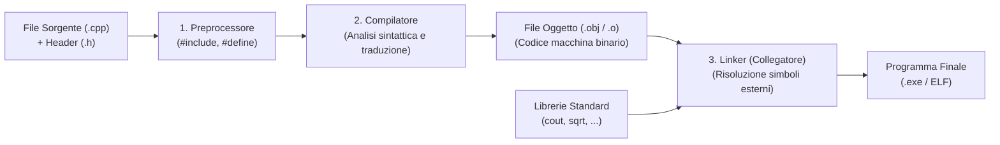

Il **C++** è uno dei linguaggi di programmazione più potenti e diffusi nei settori in cui sono richieste **massime prestazioni**, **bassa latenza** e **controllo diretto sull'hardware** (game engine come Unreal Engine, sistemi operativi, software aerospaziale, finanza ad alta frequenza e intelligenza artificiale).

Ideato nel **1979** da **Bjarne Stroustrup** presso i Bell Laboratories come estensione del linguaggio C, fu chiamato inizialmente *"C with Classes"* (*C con le Classi*). Nel 1983 assunse il nome definitivo di **C++** (richiamando l'operatore di incremento `++` del C).

---
## 1. Caratteristiche Fondamentali

### A. Linguaggio Compilato Nativo
A differenza di linguaggi interpretati (come Python o JavaScript) o basati su bytecode e macchine virtuali (come Java o C#), il codice C++ viene compilato **direttamente in linguaggio macchina binario** per la CPU target. Non esiste alcun livello intermedio di emulazione o virtual machine.

### B. Tipizzazione Statica e Forte
- **Statica**: il tipo di ogni variabile deve essere noto prima della compilazione e non può mutare a runtime.
- **Forte**: il compilatore impedisce conversioni implicite pericolose tra tipi non correlati.

### C. Linguaggio Multi-Paradigma
Il C++ permette di combinare liberamente più stili di programmazione:
1. **Procedurale / Imperativo**: codice strutturato in funzioni e flussi sequenziali (come in C).
2. **Orientato agli Oggetti (OOP)**: classi, incapsulamento, ereditarietà e polimorfismo.
3. **Generico (Template)**: algoritmi e strutture dati indipendenti dal tipo di dato con la STL (*Standard Template Library*).
4. **Funzionale**: supporto moderno a funzioni lambda e chiusure (da C++11 in poi).

### D. Principio del "Zero-Overhead"
> *"Ciò che non usi, non lo paghi. E ciò che usi, non potresti scriverlo a mano in modo più efficiente."*

Se una funzionalità avanzata del linguaggio non viene impiegata, il compilatore non genera un solo byte di overhead in memoria o in tempo di calcolo.

### E. Gestione Deterministica della Memoria (RAII)
Il C++ non utilizza un *Garbage Collector* automatico. La gestione della memoria è nelle mani dello sviluppatore mediante il paradigma **RAII** (*Resource Acquisition Is Initialization*): le risorse vengono allocate all'inizializzazione dell'oggetto nel costruttore e **rilasciate in modo deterministico e immediato** nel distruttore non appena l'oggetto esce dal suo scope `{ }`.

---
## 2. Il Ciclo di Compilazione (Dal Sorgente all'Eseguibile)
La trasformazione di un file sorgente `.cpp` nel programma finale `.exe` avviene attraverso **tre fasi rigorose**:

### 1. Preprocessing (Preprocessore)
- Interpreta le direttive che iniziano con **`#`**.
- Sostituisce `#include <file>` con il testo effettivo del file header.
- Espande le costanti e macro dichiarate con `#define`.
- Elimina tutti i commenti (`//` e `/* */`).
- Genera un'unica sequenza continua di codice C++ detta **Unità di Traduzione**.

### 2. Compilazione (Compilatore)
- Effettua l'analisi lessicale, sintattica e semantica.
- Ottimizza il codice per la CPU di destinazione.
- Traduce il codice C++ in istruzioni in linguaggio macchina salvate nei **File Oggetto** (`.obj` su Windows, `.o` su Linux).

### 3. Linking (Collegatore)
- Unisce tra loro i vari file oggetto che compongono il progetto.
- Risolve i riferimenti esterni (ad esempio individua dove risiede la funzione `std::cout` nella libreria standard).
- Genera il file binario finale eseguibile (`.exe`).

> [!INFO] 🖼️ Placeholder Immagine: Schema visuale della pipeline di compilazione del C++
> *Suggerimento per Obsidian: inserisci qui un diagramma riassuntivo del processo gcc / clang con i vari file intermedi (.i, .s, .o, .exe).*
> `![[Pasted image pipeline_compilazione.png|600]]`

---
## 3. L'Evoluzione degli Standard C++
Il C++ è un linguaggio in continua modernizzazione governato dal comitato ISO:

| Standard | Anno | Novità Principali |
| :--- | :--- | :--- |
| **C++98 / C++03** | 1998/2003 | Prima standardizzazione formale ISO, introduzione della STL e template. |
| **C++11** | 2011 | **Rivoluzione del linguaggio**: `auto`, `nullptr`, *range-based for*, lambda, smart pointer, move semantics. |
| **C++14 / C++17** | 2014/2017 | `std::optional`, `std::filesystem`, `if constexpr`, miglioramenti alle lambda. |
| **C++20** | 2020 | *Concepts*, *Ranges*, *Coroutines*, Moduli (`import`). |

---
## 4. Confronto tra Linguaggi
| Aspetto | C | C++ | Java / Python / C# |
| :--- | :--- | :--- | :--- |
| **Paradigmi** | Solo procedurale | Multi-paradigma (OOP, Generico, Funzionale) | Prevalentemente OOP / Multi-paradigma |
| **Classi ed Oggetti** | No | Sì (pieno supporto) | Sì (obbligatorio in Java) |
| **Gestione Memoria** | Manuale (`malloc`/`free`) | Deterministica (RAII, `new`/`delete`, Smart Pointer) | Automatica con Garbage Collector |
| **Velocità Esecuzione** | Massima | Massima (pari al C) | Minore (dovuta a VM / Garbage Collector) |
| **Esecuzione** | Binario nativo | Binario nativo | Bytecode interpretato o JIT compilato |
