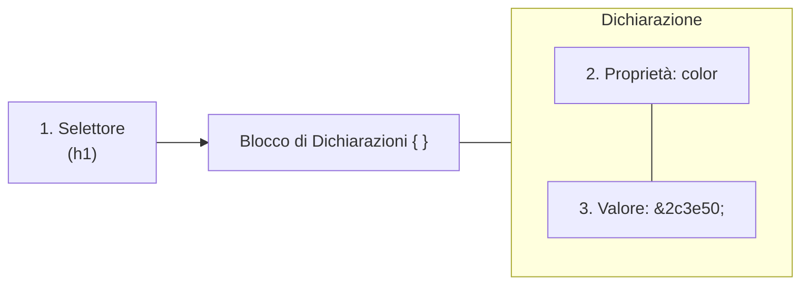
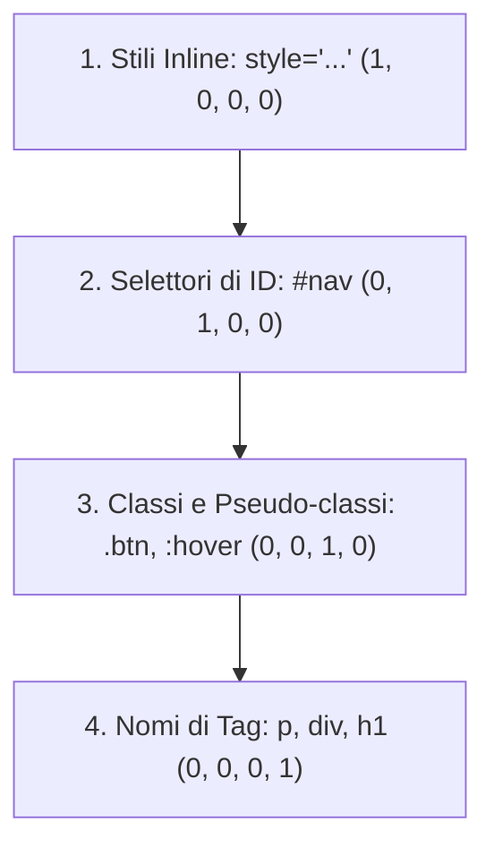
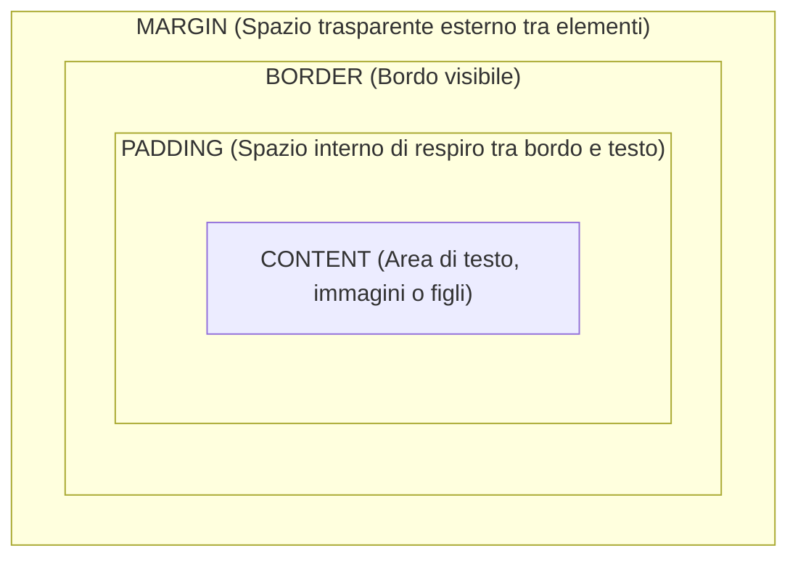
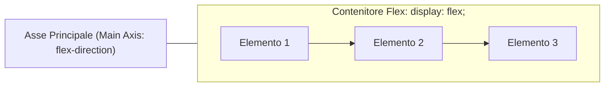

> [!SUMMARY] ⚡ In Sintesi (A Colpo d'Occhio)
> - **Ruolo**: il CSS gestisce ==l'aspetto estetico e la disposizione spaziale== degli elementi HTML.
> - **Inclusione**: usa sempre il foglio di stile ==esterno con `<link rel="stylesheet">`==.
> - **Specificità**: chi vince tra regole in conflitto? ==Inline (1000) > ID (100) > Classe (10) > Tag (1)==.
> - **Il Box Model**: ogni elemento è una scatola formata da ==Content $\rightarrow$ Padding $\rightarrow$ Border $\rightarrow$ Margin==.
> - **Regola Salvavita**: imposta sempre ==`box-sizing: border-box;`== per non far "esplodere" le dimensioni con il padding.
> - **Layout**: ==Flexbox== per allineamenti su un asse; ==CSS Grid== per gabbie bidimensionali.

---

## Indice

- [[#Cos'è il CSS e Sintassi delle Regole]]
- [[#Come Includere il CSS in HTML]]
- [[#I Selettori CSS]]
- [[#La Cascata e la Specificità]]
- [[#Il Box Model]]
- [[#Colori, Tipografia e Unità di Misura]]
- [[#La Proprietà display]]
- [[#Posizionamento (position)]]
- [[#Layout Moderno con Flexbox]]
- [[#Layout Moderno con CSS Grid]]
- [[#Responsive Design e Media Queries]]
- [[#Esempi Pratici di Componenti UI]]

---

## Cos'è il CSS e Sintassi delle Regole

Il **CSS** (*Cascading Style Sheets* - Fogli di Stile a Cascata) è il linguaggio che governa l'estetica, la formattazione e la disposizione spaziale dei contenuti HTML.

Una regola di stile è composta da tre elementi fondamentali:



```css
h1 {
    color: #2c3e50;       /* Colore del testo */
    font-size: 2.2rem;     /* Dimensione carattere */
    text-align: center;    /* Allineamento al centro */
}
```

---

## Come Includere il CSS in HTML

| Metodo | Dove si trova | Come si dichiara | Giudizio |
| :--- | :--- | :--- | :--- |
| **Esterno (`<link>`)** | File `.css` separato | `<link rel="stylesheet" href="style.css">` dentro `<head>` | ✅ ==Best practice assoluta== (riutilizzabile e in cache) |
| **Interno (`<style>`)** | Dentro la pagina HTML | `<style> body { ... } </style>` dentro `<head>` | ⚠️ Utile solo per test rapidi o landing page singole |
| **Inline (`style="..."`)** | Attributo nel tag HTML | `<p style="color: red;">` | ❌ ==Da evitare== (disordinato e ingestibile) |

---

## I Selettori CSS

### 1. Selettori di Base
- **Tag / Tipo**: seleziona tutti i tag indicati (`p`, `h2`, `button`).
- **Classe (`.`)**: seleziona tutti gli elementi con quell'attributo `class`. Riutilizzabile ovunque:
  ```css
  .evidenziato { background-color: #fff3cd; }
  ```
- **ID (`#`)**: seleziona l'unico elemento con quell'attributo `id`. Deve essere univoco per pagina:
  ```css
  #intestazione-principale { border-bottom: 2px solid #333; }
  ```
- **Universale (`*`)**: seleziona tutti gli elementi della pagina senza eccezioni.

### 2. Combinatori
- **Discendente (Spazio)**: qualsiasi `p` dentro un `article` (anche molto annidato):
  ```css
  article p { line-height: 1.6; }
  ```
- **Figlio Diretto (`>`)**: solo i figli di primo livello:
  ```css
  ul > li { list-style: none; }
  ```
- **Fratello Adiacente (`+`)**: il primo elemento immediatamente successivo:
  ```css
  h2 + p { font-size: 1.1rem; }
  ```

---

## La Cascata e il Calcolo della Specificità

Quando più regole si applicano al medesimo elemento, il browser assegna una priorità calcolata matematicamente come una quaterna di valori:

$$\text{Punteggio} = (\text{Inline}, \text{ID}, \text{Classi/Pseudo-classi}, \text{Tag})$$



> [!DANGER] 🚫 Attenzione a `!important`
> La direttiva `!important` annulla e scavalca le regole di specificità.  
> Va usata con estrema parsimonia solo per sovrascrivere fogli di stile di librerie terze, altrimenti genera conflitti ingestibili!

---

## Il Box Model

> [!QUESTION] ❓ Domanda d'Esame: Qual è la differenza tra Padding e Margin?
> - **Padding**: è lo spazio ==interno== alla scatola (tra il testo e il bordo visibile).
> - **Margin**: è lo spazio vuoto ==esterno== alla scatola (che distanzia questo elemento dagli altri vicini).



> [!SUCCESS] 🎯 La Regola Salvavita: `box-sizing: border-box`
> Di default (`content-box`), aggiungendo `padding: 20px` a una scatola larga `200px`, la larghezza visibile totale diventa $240\text{px}$, rompendo la griglia!  
> Inserisci sempre in cima al tuo file CSS questo reset universale:
> ```css
> *, *::before, *::after {
>     box-sizing: border-box; /* La larghezza dichiarata include padding e bordi! */
> }
> ```

> [!INFO] 🖼️ Placeholder Immagine: Il Box Model visualizzato nel DevTools del browser
> *Suggerimento per Obsidian: inserisci qui uno screenshot del pannello Elements -> Computed di Google Chrome con le 4 scatole concentriche.*  
> `![[Pasted image chrome_box_model.png|500]]`

---

## La Proprietà `display`

| Valore | Va a capo? | Accetta `width` e `height`? | Esempi tipici |
| :--- | :--- | :--- | :--- |
| **`block`** | ==Sì== (occupa tutto il 100% orizzontale) | Sì | `<div>`, `<p>`, `<h1>`, `<article>` |
| **`inline`** | ==No== (si affianca sulla stessa riga) | No (ignora dimensioni e margini verticali) | `<span>`, `<a>`, `<strong>` |
| **`inline-block`** | ==No== (si affianca sulla stessa riga) | ==Sì== (accetta dimensioni complete) | `<button>`, `<input>`, `` |
| **`none`** | L'elemento scompare del tutto dal rendering | | |

---

## Layout Moderno con Flexbox

Flexbox governa la disposizione e la spaziatura degli elementi lungo ==un singolo asse== (riga o colonna).



```css
.container {
    display: flex;                  /* Attiva Flexbox */
    flex-direction: row;            /* row (orizzontale) o column (verticale) */
    justify-content: space-between; /* Distribuzione sull'asse principale */
    align-items: center;            /* Allineamento sull'asse trasversale */
    gap: 1.5rem;                    /* Spazio uniforme tra gli elementi */
    flex-wrap: wrap;                /* Manda a capo gli elementi se lo spazio finisce */
}

.item {
    flex: 1;                        /* Distribuisce lo spazio disponibile in parti uguali */
}
```

---

## Responsive Design e Media Queries

Permette alla pagina di adattarsi all'istante a smartphone, tablet e monitor desktop:

```css
/* Stile Desktop */
.layout-colonne {
    display: flex;
    flex-direction: row;
}

/* Smartphone / Tablet (schermo 768px o inferiore) */
@media (max-width: 768px) {
    .layout-colonne {
        flex-direction: column; /* Le colonne si incolonnano in verticale */
    }
}
```

---

## Esempi Pratici di Componenti UI

### 1. Barra di Navigazione Responsive (Navbar)
```html
<nav class="navbar">
    <div class="logo">DevAppunti</div>
    <ul class="nav-links">
        <li><a href="#">Home</a></li>
        <li><a href="#">C++</a></li>
        <li><a href="#">Web</a></li>
    </ul>
</nav>
```

```css
.navbar {
    display: flex;
    justify-content: space-between;
    align-items: center;
    background-color: #2c3e50;
    padding: 1rem 2rem;
}

.navbar .logo {
    color: white;
    font-size: 1.4rem;
    font-weight: bold;
}

.navbar .nav-links {
    display: flex;
    gap: 1.5rem;
    list-style: none;
    margin: 0;
}

.navbar .nav-links a {
    color: white;
    text-decoration: none;
    transition: color 0.2s;
}

.navbar .nav-links a:hover {
    color: #3498db;
}
```

### 2. Card UI Moderna con Ombra e Hover Effect
```html
<div class="card">
    <div class="card-content">
        <h3>Titolo Card</h3>
        <p>Descrizione sintetica del contenuto o dell'argomento.</p>
        <button class="btn">Approfondisci</button>
    </div>
</div>
```

```css
.card {
    background: white;
    border-radius: 12px;
    box-shadow: 0 4px 12px rgba(0, 0, 0, 0.08);
    max-width: 300px;
    overflow: hidden;
    transition: transform 0.25s ease, box-shadow 0.25s ease;
}

.card:hover {
    transform: translateY(-5px);
    box-shadow: 0 8px 24px rgba(0, 0, 0, 0.15);
}

.card-content {
    padding: 1.25rem;
}

.btn {
    background-color: #3498db;
    color: white;
    border: none;
    padding: 0.6rem 1.2rem;
    border-radius: 6px;
    cursor: pointer;
    font-weight: 600;
}
```
