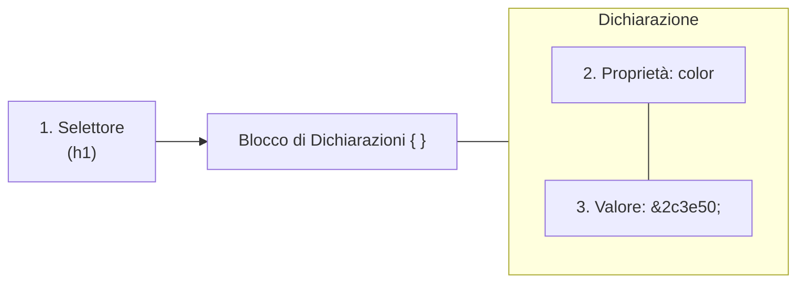
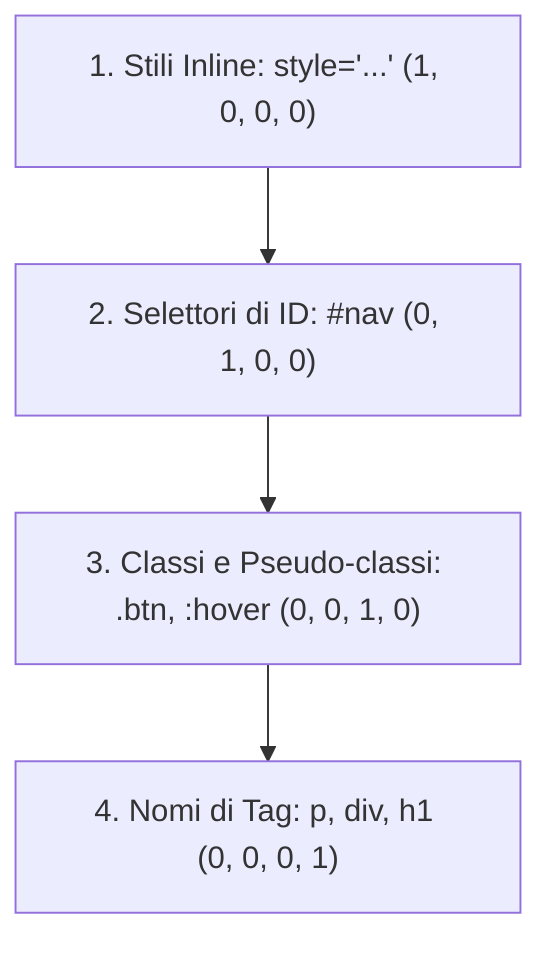
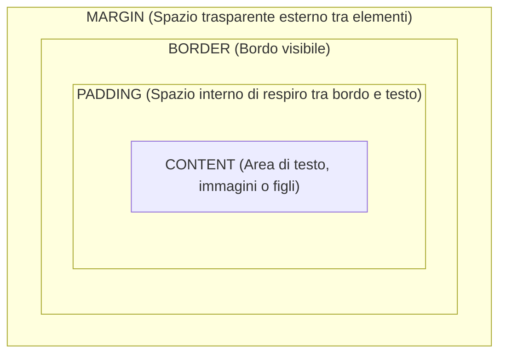
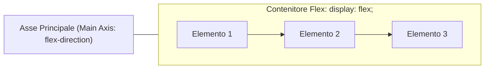

## Indice
- [[#Cos'è il CSS e Sintassi delle Regole]]
- [[#Come Includere il CSS in HTML]]
- [[#I Selettori CSS]]
- [[#La Cascata e la Specificità]]
- [[#Il Box Model]]
- [[#Colori, Tipografia e Unità di Misura]]
- [[#La Proprietà display]]
- [[#Posizionamento (position)]]
- [[#Layout Moderno con Flexbox]]
- [[#Layout Moderno con CSS Grid]]
- [[#Responsive Design e Media Queries]]
- [[#Esempi Pratici di Componenti UI]]

---
## Cos'è il CSS e Sintassi delle Regole
Il **CSS** (*Cascading Style Sheets* - Fogli di Stile a Cascata) è il linguaggio che governa l'estetica, la formattazione e la disposizione spaziale dei contenuti HTML.

Una regola di stile è composta da tre elementi fondamentali:



```css
h1 {
    color: #2c3e50;       /* Colore del testo */
    font-size: 2.2rem;     /* Dimensione carattere */
    text-align: center;    /* Allineamento al centro */
}
```

---
## Come Includere il CSS in HTML
| Metodo | Dove si trova | Come si dichiara | Giudizio |
| :--- | :--- | :--- | :--- |
| **Esterno (`<link>`)** | File `.css` separato | `<link rel="stylesheet" href="style.css">` dentro `<head>` | ✅ **Best practice assoluta** (riutilizzabile e in cache) |
| **Interno (`<style>`)** | Dentro la pagina HTML | `<style> body { ... } </style>` dentro `<head>` | ⚠️ Utile per prototipi o landing page singole |
| **Inline (`style="..."`)** | Attributo nel tag HTML | `<p style="color: red;">` | ❌ **Da evitare** (disordinato e impossibile da manutenere) |

---
## I Selettori CSS

### 1. Selettori di Base
- **Tag / Tipo**: seleziona tutti i tag indicati (`p`, `h2`, `button`).
- **Classe (`.`)**: seleziona tutti gli elementi con quell'attributo `class`. Riutilizzabile ovunque:
```css
  .evidenziato { background-color: #fff3cd; }
  ```
- **ID (`#`)**: seleziona l'unico elemento con quell'attributo `id`. Deve essere univoco per pagina:
```css
  #intestazione-principale { border-bottom: 2px solid #333; }
  ```
- **Universale (`*`)**: seleziona tutti gli elementi della pagina senza eccezioni.

### 2. Combinatori
- **Discendente (Spazio)**: qualsiasi `p` dentro un `article` (anche molto annidato):
```css
  article p { line-height: 1.6; }
  ```
- **Figlio Diretto (`>`)**: solo i figli di primo livello:
```css
  ul > li { list-style: none; }
  ```
- **Fratello Adiacente (`+`)**: il primo elemento immediatamente successivo:
```css
  h2 + p { font-size: 1.1rem; }
  ```

### 3. Pseudo-Classi e Pseudo-Elementi
```css
/* Stato: al passaggio del puntatore del mouse */
.btn:hover {
    background-color: #2980b9;
}

/* Stato: campo attivo con cursore di digitazione */
input:focus {
    border-color: #3498db;
    outline: none;
}

/* Elemento: righe pari alternate di una tabella */
tr:nth-child(even) {
    background-color: #f8f9fa;
}

/* Inserisce elementi decorativi prima o dopo il testo */
.titolo::before {
    content: "📌 ";
}
```

---
## La Cascata e il Calcolo della Specificità
Quando più regole si applicano al medesimo elemento, il browser assegna una priorità calcolata matematicamente come una quaterna di valori:

$$\text{Punteggio} = (\text{Inline}, \text{ID}, \text{Classi/Pseudo-classi}, \text{Tag})$$



### Esempio di scontro tra regole:
1. `p` ha punteggio `(0, 0, 0, 1)`
2. `.testo` ha punteggio `(0, 0, 1, 0)` $\rightarrow$ **Vince la classe!**
3. `#banner p` ha punteggio `(0, 1, 0, 1)` $\rightarrow$ **Vince l'ID!**

> [!WARNING]
> La direttiva `!important` annulla le regole di specificità. Va usata con estrema parsimonia solo per sovrascrivere fogli di stile di librerie terze, altrimenti genera conflitti ingestibili.

---
## Il Box Model
Nel rendering del browser **ogni singolo elemento HTML è una scatola rettangolare**.



> [!INFO] 🖼️ Placeholder Immagine: Il Box Model visualizzato nel DevTools del browser
> *Suggerimento per Obsidian: inserisci qui uno screenshot del pannello Elements -> Computed di Google Chrome con le 4 scatole concentriche.*
> `![[Pasted image chrome_box_model.png|500]]`

### La Proprietà Salvavita: `box-sizing: border-box`
Di default (`content-box`), se imposti `width: 200px` e poi aggiungi `padding: 20px`, la scatola diventerà larga $200 + 20 + 20 = 240\text{px}$, distruggendo spesso la gabbia grafica!

Impostando universamente `box-sizing: border-box`, la larghezza dichiarata **comprende già al suo interno padding e bordi**:

```css
*, *::before, *::after {
    box-sizing: border-box; /* Reset universale fondamentale */
}
```

---
## Colori, Tipografia e Unità di Misura

### Unità di Misura Relative (Responsive)
- **`rem`**: proporzionale alla dimensione del font impostata sull'`<html>` (di base $1\text{rem} = 16\text{px}$). Garantisce l'accessibilità se l'utente ingrandisce i caratteri del browser.
- **`%`**: percentuale rispetto alla larghezza del contenitore padre.
- **`vw` / `vh`**: $1\%$ della larghezza (*viewport width*) o altezza (*viewport height*) della finestra del browser.

---
## La Proprietà `display`
| Valore | Va a capo? | Accetta `width` e `height`? | Esempi tipici |
| :--- | :--- | :--- | :--- |
| **`block`** | **Sì** (occupa tutto il 100% orizzontale) | Sì | `<div>`, `<p>`, `<h1>`, `<article>` |
| **`inline`** | **No** (si affianca sulla stessa riga) | No (ignora dimensioni e margini verticali) | `<span>`, `<a>`, `<strong>` |
| **`inline-block`** | **No** (si affianca sulla stessa riga) | **Sì** (accetta dimensioni complete) | `<button>`, `<input>`, `` |
| **`none`** | L'elemento scompare dal rendering senza occupare spazio | | |

---
## Posizionamento (`position`)
- **`static`**: posizionamento naturale nel normale flusso della pagina.
- **`relative`**: permette di traslare l'elemento con `top`, `left`, ecc., senza alterare lo spazio occupato dagli altri. È il punto di riferimento cruciale per i figli `absolute`!
- **`absolute`**: rimosso dal normale flusso e ancorato esattamente alle coordinate indicate rispetto al più vicino genitore con `position: relative`.
- **`fixed`**: ancorato alla finestra del browser durante lo scroll della pagina (ideale per navbar fisse o pulsanti chat).
- **`sticky`**: si comporta come `relative` finché non si raggiunge una soglia di scroll, dopodiché si "incolla" allo schermo.

---
## Layout Moderno con Flexbox
Flexbox governa la disposizione degli elementi lungo **un singolo asse** (o riga o colonna).



```css
.container {
    display: flex;                  /* Attiva Flexbox */
    flex-direction: row;            /* row (orizzontale) o column (verticale) */
    justify-content: space-between; /* Distribuzione sull'asse principale */
    align-items: center;            /* Allineamento sull'asse trasversale */
    gap: 1.5rem;                    /* Spazio uniforme tra gli elementi */
    flex-wrap: wrap;                /* Manda a capo gli elementi se lo spazio finisce */
}

.item {
    flex: 1;                        /* Distribuisce lo spazio disponibile in parti uguali */
}
```

---
## Layout a Griglia con CSS Grid
Per layout bidimensionali complessi (righe e colonne contemporaneamente):

```css
.galleria {
    display: grid;
    /* Crea 3 colonne uguali che occupano 1 frazione (1fr) di spazio */
    grid-template-columns: repeat(3, 1fr);
    gap: 20px;
}
```

---
## Responsive Design e Media Queries
Permette alla pagina di adattarsi all'istante a smartphone, tablet e monitor desktop.

```css
/* Layout per Desktop */
.layout-colonne {
    display: flex;
    flex-direction: row;
}

/* Quando la larghezza dello schermo è 768px o inferiore (Tablet / Smartphone) */
@media (max-width: 768px) {
    .layout-colonne {
        flex-direction: column; /* Le colonne si incolonnano in verticale */
    }
}
```

---
## Esempi Pratici di Componenti UI

### 1. Barra di Navigazione Responsive (Navbar)
```html
<nav class="navbar">
    <div class="logo">DevAppunti</div>
    <ul class="nav-links">
        <li><a href="#">Home</a></li>
        <li><a href="#">C++</a></li>
        <li><a href="#">Web</a></li>
    </ul>
</nav>
```

```css
.navbar {
    display: flex;
    justify-content: space-between;
    align-items: center;
    background-color: #2c3e50;
    padding: 1rem 2rem;
}

.navbar .logo {
    color: white;
    font-size: 1.4rem;
    font-weight: bold;
}

.navbar .nav-links {
    display: flex;
    gap: 1.5rem;
    list-style: none;
    margin: 0;
}

.navbar .nav-links a {
    color: white;
    text-decoration: none;
    transition: color 0.2s;
}

.navbar .nav-links a:hover {
    color: #3498db;
}
```

### 2. Card UI Moderna con Ombra e Hover Effect
```html
<div class="card">
    <div class="card-content">
        <h3>Titolo Card</h3>
        <p>Descrizione sintetica del contenuto o dell'argomento.</p>
        <button class="btn">Approfondisci</button>
    </div>
</div>
```

```css
.card {
    background: white;
    border-radius: 12px;
    box-shadow: 0 4px 12px rgba(0, 0, 0, 0.08);
    max-width: 300px;
    overflow: hidden;
    transition: transform 0.25s ease, box-shadow 0.25s ease;
}

.card:hover {
    transform: translateY(-5px);
    box-shadow: 0 8px 24px rgba(0, 0, 0, 0.15);
}

.card-content {
    padding: 1.25rem;
}

.btn {
    background-color: #3498db;
    color: white;
    border: none;
    padding: 0.6rem 1.2rem;
    border-radius: 6px;
    cursor: pointer;
    font-weight: 600;
}
```
