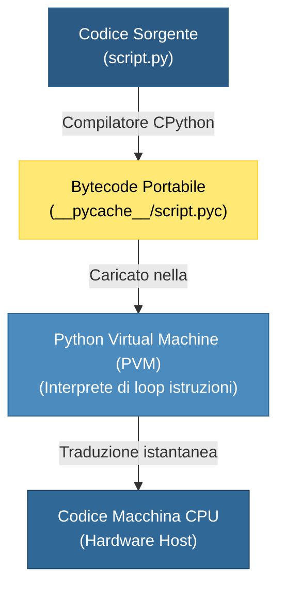
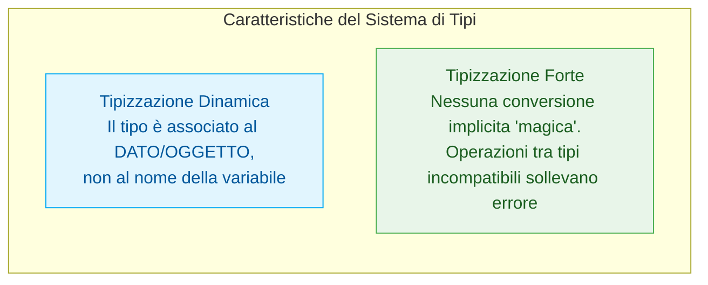

> [!SUMMARY] ⚡ In Sintesi (A Colpo d'Occhio)
> - **Natura**: Linguaggio ad alto livello, multi-paradigma (imperativo, OOP, funzionale), interpretato tramite ==bytecode su PVM==.
> - **Filosofia (*Zen di Python*)**: *"Readability counts"* — la leggibilità e l'espressività del codice hanno la priorità assoluta su tutto.
> - **Tipizzazione Dinamica**: il tipo appartiene all'==oggetto== in memoria Heap, non alla variabile (niente `int x;`).
> - **Tipizzazione Forte**: vietate conversioni implicite incoerenti (es. `"ciao" + 5` solleva ==`TypeError`==, a differenza di JS).
> - **Memoria Automatica**: niente puntatori manuali né `delete`; liberazione automatica gestita da ==Reference Counting== e ==Garbage Collector==.
> - **Esecuzione**: Compilazione trasparente in file `.pyc` (memorizzati in `__pycache__`) eseguiti dalla **Python Virtual Machine (PVM)**.

---

## 1. Cos'è Python e la sua Filosofia

Ideato nel **1991** dall'informatico olandese **Guido van Rossum** e battezzato in onore del gruppo comico britannico *Monty Python*, Python è oggi il linguaggio di riferimento mondiale per intelligenza artificiale, data science, automazione, scripting di sistema e sviluppo backend web.

A differenza del C++ (progettato per dare il massimo controllo sull'hardware e la massima velocità d'esecuzione), Python è progettato per massimizzare la **produttività dello sviluppatore** e la **chiarezza del codice**.

> [!NOTE] 📜 Lo Zen di Python (PEP 20)
> Aprendo una shell Python e digitando `import this`, viene stampato il manifesto filosofico del linguaggio scritto da Tim Peters:
> - *Beautiful is better than ugly.* (Bello è meglio di brutto)
> - *Explicit is better than implicit.* (Esplicito è meglio di implicito)
> - *Simple is better than complex.* (Semplice è meglio di complesso)
> - *Readability counts.* (La leggibilità conta)
> - *There should be one-- and preferably only one --obvious way to do it.* (Dovrebbe esserci un solo modo evidente per fare una cosa)

---

## 2. Come Funziona l'Esecuzione: Il Modello Bytecode e PVM

Spesso si definisce Python come un linguaggio *"interpretato"*, ma tecnicamente è un **linguaggio a esecuzione virtuale su Bytecode** (in modo del tutto analogo a Java o C#).

Quando lanciamo un comando come `python main.py`, avvengono due passaggi trasparenti:



1. **Compilazione in Bytecode**:
   - Il compilatore Python analizza la sintassi e traduce il testo in istruzioni binarie ad alto livello chiamate **Bytecode**.
   - Per non ricompilare a ogni avvio, il bytecode viene salvato su disco nella cartella `__pycache__` con estensione `.pyc`. Se il file `.py` non viene modificato, all'avvio successivo Python userà direttamente il file compilato.
2. **Esecuzione tramite PVM (Python Virtual Machine)**:
   - La PVM è un motore software che legge sequenzialmente le istruzioni di bytecode e le esegue traducendole in chiamate alle primitive del sistema operativo sottostante.

> [!TIP] 💡 Implementazioni di Python
> L'implementazione ufficiale e standard di riferimento è scritta in linguaggio C ed è denominata **CPython**. Ne esistono altre specializzate: **PyPy** (con compilatore Just-In-Time per prestazioni estreme), **Jython** (per integrarsi nell'ecosistema Java/JVM) e **MicroPython** (per microcontrollori e IoT).

---

## 3. Il Sistema dei Tipi: Dinamico e Forte

Il sistema dei tipi di Python è definito da due caratteristiche precise che spesso i programmatori alle prime armi confondono:



### A. Tipizzazione Dinamica (Dynamic Typing)
In C++ dichiariamo la scatola e il suo tipo (`int x = 10;`). In Python dichiariamo solo l'etichetta associata all'oggetto:
```python
x = 10          # x punta a un oggetto intero
print(type(x))  # <class 'int'>

x = "Antigravity"  # La stessa variabile x ora punta a una stringa!
print(type(x))  # <class 'str'>
```

### B. Tipizzazione Forte (Strong Typing)
In linguaggi a tipizzazione debole (come JavaScript o PHP), sommare un numero e una stringa produce conversioni automatiche bizzarre (`"5" + 2` diventa `"52"`). Python **rifiuta categoricamente** questo comportamento:
```python
numero = 10
testo = "20"

# print(numero + testo)  <-- ERRORE FATALE!
# TypeError: unsupported operand type(s) for +: 'int' and 'str'

# Conversione esplicita obbligatoria (Casting):
print(numero + int(testo))   # 30 (somma algebrica)
print(str(numero) + testo)   # "1020" (concatenazione di stringhe)
```

> [!DANGER] 🚫 Attenzione al Typing Dinamico nei Grandi Progetti
> Poiché non serve dichiarare i tipi, è facile commettere errori di svista passando per sbaglio un testo dove una funzione si aspetta un numero. Dal Python 3.5 in poi è buona pratica usare i ==Type Hints== (es. `def calcola(x: int) -> float:`).

---

## 4. Gestione della Memoria e Garbage Collection

In C++ lo sviluppatore deve gestire manualmente la vita degli oggetti con allocazioni su Stack o con `new` e `delete` su Heap.
In Python:
1. **Ogni singolo dato vive nello Heap**: numeri, stringhe, liste, funzioni e classi sono tutti **oggetti**.
2. **Reference Counting (Conteggio dei Riferimenti)**:
   - Ogni oggetto memorizza un contatore interno (`ob_refcnt`).
   - Quando crei una variabile che punta all'oggetto, il contatore sale di 1.
   - Quando una variabile esce dallo scope o viene riassegnata, il contatore scende di 1.
   - **Appena il contatore raggiunge zero**, la memoria dell'oggetto viene deallocata all'istante!
3. **Garbage Collector per Riferimenti Circolari**:
   - Per gestire casi complessi in cui l'oggetto A punta all'oggetto B e viceversa (riferimento ciclico), un modulo automatico di Garbage Collection in background scansiona la memoria ed elimina le isole isolate di oggetti non più raggiungibili dal programma.

---

## 5. Tabella Comparativa: C++ vs Python

| Parametro | C++ | Python |
| :--- | :--- | :--- |
| **Paradigma** | Multi-paradigma orientato alle prestazioni | Multi-paradigma orientato all'espressività |
| **Traduzione del codice** | **Compilazione AOT** (*Ahead-Of-Time*) direttamente in codice macchina nativo | **Bytecode** intermedio eseguito da Macchina Virtuale (**PVM**) |
| **Dichiarazione Tipi** | **Statica**: obbligatoria (`int x = 5;`) | **Dinamica**: dedotta a runtime (`x = 5`) |
| **Controllo Tipi** | Rigido a tempo di compilazione | Rigido a tempo di esecuzione (**Strong Typing**) |
| **Gestione Memoria** | Manuale (`new`/`delete`, puntatori, RAII) | Automatica (**Reference Counting** + **Garbage Collector**) |
| **Sintassi e Blocchi** | Parentesi graffe `{}` e punto e virgola `;` | **Indentazione obbligatoria** a 4 spazi e a-capo |
| **Velocità di Esecuzione** | Estrema (vicina al metallo dell'hardware) | Più lenta (compensata da librerie interne scritte in C/C++) |
| **Velocità di Sviluppo** | Medio-bassa (più codice cerimoniale da scrivere) | Altissima (prototipazione immediata in poche righe) |

---

## 6. Domande d'Esame e Concetti Fondamentali

> [!QUESTION] ❓ Domande Tipiche di Verifica
> 1. *Cosa significa che Python è a tipizzazione dinamica ma forte?*  
>    **Risposta**: Dinamica perché le variabili non hanno un tipo rigido ma sono etichette che possono puntare a dati di qualsiasi tipo; Forte perché Python non esegue conversioni di tipo implicite e non permette operazioni tra tipi non compatibili.
> 2. *A cosa servono i file `.pyc` dentro la cartella `__pycache__`?*  
>    **Risposta**: Contengono il bytecode precompilato dello script. Evitano di dover rianalizzare la grammatica del codice ad ogni esecuzione, velocizzando l'avvio.
> 3. *Come fa Python a sapere quando cancellare un dato dalla RAM?*  
>    **Risposta**: Tramite il Reference Counting. Ogni dato tiene traccia di quante variabili lo stanno puntando; quando il contatore arriva a zero, la memoria viene deallocata all'istante.

---

## 7. Codice di Verifica dell'Ambiente

> [!EXAMPLE]- 🧪 Programma Completo: Ispezione dell'Ambiente Python
> Copia ed esegui questo codice per visualizzare le caratteristiche della tua installazione:
> ```python
> import sys
> import platform
> 
> def report_sistema():
>     print("=" * 45)
>     print("  ANALISI AMBIENTE PYTHON")
>     print("=" * 45)
>     print(f"Versione Python      : {platform.python_version()}")
>     print(f"Implementazione      : {platform.python_implementation()}")
>     print(f"Sistema Operativo    : {platform.system()} {platform.release()}")
>     print(f"Architettura Hardware: {platform.machine()}")
>     print(f"Percorso Eseguibile  : {sys.executable}")
>     print("=" * 45)
>     
>     # Verifica reference counting di un intero
>     numero = 42000
>     print(f"ID Oggetto in memoria: {hex(id(numero))}")
>     print(f"Numero di riferimenti: {sys.getrefcount(numero) - 1}")
>     print("=" * 45)
> 
> if __name__ == "__main__":
>     report_sistema()
> ```
