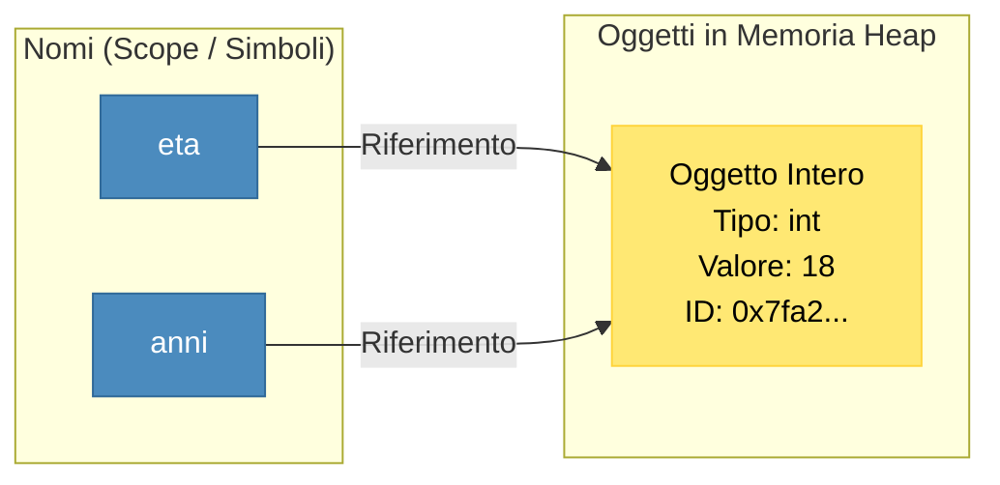

> [!SUMMARY] ⚡ In Sintesi (A Colpo d'Occhio)
> - **Variabile come Etichetta (Binding)**: una variabile non è una scatola fissa di memoria, ma un ==nome che punta a un oggetto== nello Heap.
> - **Tipi Base Immutabili**: `int` (interi a precisione infinita, niente overflow!), `float` (64-bit IEEE 754), `str` (testo Unicode immutabile), `bool` (`True`/`False`), `None` (assenza di valore).
> - **Type Annotations**: `x: int = 10` documenta il tipo atteso senza bloccare l'esecuzione a runtime.
> - **Input/Output**: `print(f"Risultato: {x:.2f}", end="\n")` e `input()`.
> - **Trap di `input()`**: `input()` legge ==SEMPRE una stringa==; per fare calcoli numerici è obbligatorio il casting esplicito `int(input())`.
> - **Operatori Chiave**: `/` (divisione decimale reale), `//` (divisione intera con troncamento), `%` (modulo), `**` (elevamento a potenza).

---

## 1. Il Modello di Variabile: Scatola (C++) vs Etichetta (Python)

In linguaggi come il C++, una variabile è una cella fissa di memoria RAM con un tipo prefissato:
In **Python**, invece, **tutto è un oggetto** allocato nello Heap. Una variabile è semplicemente un'**etichetta (binding)** legata con un riferimento a un oggetto.



Se scriviamo:
```python
eta = 18
anni = eta
```
Non stiamo duplicando il numero `18` in due celle diverse: abbiamo semplicemente creato due etichette (`eta` e `anni`) che puntano allo **stesso identico oggetto** in memoria!

---

## 2. I Tipi di Dato Primitivi

Tutti i tipi primitivi standard in Python sono **immutabili**: una volta creato l'oggetto, il suo valore interno non può essere modificato. Se assegni un nuovo valore, viene creato un nuovo oggetto nello Heap.

| Tipo | Descrizione | Esempio | Note & Differenze con C++ |
| :--- | :--- | :--- | :--- |
| **`int`** | Numero intero con segno | `x = 42` | **Precisione arbitraria infinita**: non va mai in overflow (a differenza di `int32` o `int64` in C++). |
| **`float`** | Numero in virgola mobile | `pi = 3.14159` | Equivale al `double` del C++ (64 bit in virgola mobile standard IEEE 754). |
| **`str`** | Sequenza di caratteri Unicode | `msg = "Ciao!"` | Racchiuso tra apici singoli `'...'` o doppi `"..."`. Immutabile. |
| **`bool`** | Valore di verità booleano | `attivo = True` | Solo due valori possibili: `True` o `False` (con la prima lettera maiuscola!). |
| **`NoneType`** | Assenza di valore o valore nullo | `risultato = None` | Il valore speciale `None` corrisponde al concetto di `null` o `nullptr`. |

### La Meraviglia degli Interi senza Overflow
In C++, un intero a 32 bit oltrepassa i $2.147.483.647$ e genera un overflow silenzioso diventando negativo. In Python la memoria per gli interi cresce dinamicamente:
```python
valore_gigante = 2 ** 100
print(valore_gigante)
# Stampa: 1267650600228229401496703205376 (Calcolo esatto perfetto!)
```

---

## 3. Ispezione dei Tipi: `type()` vs `isinstance()`

Per verificare il tipo effettivo a cui punta una variabile possiamo usare due funzioni:

```python
x = 42

# 1. Verifica con type() (confronto stretto)
print(type(x))             # <class 'int'>
print(type(x) is int)      # True

# 2. Verifica con isinstance() (CONSIGLIATA: rispetta l'ereditarietà OOP)
print(isinstance(x, int))   # True
print(isinstance(x, (int, float))) # True (verifica multipla)
```

> [!SUCCESS] 🎯 Regola d'Oro
> Nei controlli di validazione dei parametri all'interno dei tuoi programmi, preferisci sempre **`isinstance(dato, Tipo)`** rispetto a `type(dato) == Tipo`, poiché `isinstance` supporta l'ereditarietà delle classi.

---

## 4. Type Hints (Annotazioni di Tipo Moderne)

Introdotte con la **PEP 484**, le annotazioni di tipo rendono il codice Python auto-esplicativo e permettono agli strumenti di analisi (come i linter degli IDE) di individuare bug prima dell'esecuzione:

```python
# Sintassi: nome_variabile: Tipo = valore_iniziale
studente: str = "Alessandro"
eta: int = 18
media_voti: float = 8.75
promosso: bool = True
```

> [!NOTE]
> Le annotazioni di tipo **non influenzano le prestazioni a runtime** e Python non blocca l'esecuzione se assegni un tipo diverso. Servono per la documentazione, la leggibilità e l'autocompletamento dell'editor.

---

## 5. Input e Output da Terminale

### A. Output Avanzato con `print()` e le f-strings
La funzione `print()` accetta parametri speciali come `sep` (separatore tra gli argomenti) ed `end` (carattere finale, di default `\n`):

```python
print("Mela", "Pera", "Banana", sep=" - ")  # Mela - Pera - Banana
print("Attendere", end="...")
print(" Fatto!")  # Stampa sulla stessa riga: Attendere... Fatto!
```

Il modo più moderno, efficiente e pulito per formattare stringhe è l'uso delle **f-strings** (prefisso `f"`):
```python
nome = "Luca"
saldo = 1250.456

# Interpolazione diretta ed espressioni matematiche
print(f"Benvenuto {nome.upper()}, il tuo saldo è €{saldo:.2f}!")
# Output: Benvenuto LUCA, il tuo saldo è €1250.46!
```

### B. Input da Tastiera con `input()`
La funzione `input(messaggio)` sospende il programma in attesa che l'utente scriva e prema Invio.

> [!DANGER] 🚫 La Trappola più Frequente di `input()`
> `input()` restituisce **SEMPRE e SOLO una stringa (`str`)**, anche se l'utente digita delle cifre!
> ```python
> a = input("Inserisci primo numero: ")  # Utente digita: 5
> b = input("Inserisci secondo numero: ") # Utente digita: 3
> print(a + b) # Stampa: "53" (concatenazione testuale!)
> ```
> Per eseguire somme matematiche, è **obbligatorio effettuare il casting**:
> ```python
> num1 = int(input("Inserisci primo numero: "))
> num2 = int(input("Inserisci secondo numero: "))
> print(num1 + num2) # Stampa: 8 (somma numerica corretta)
> ```

---

## 6. Operatori Aritmetici

Python possiede operatori matematici dedicati che evitano i classici trabocchetti di linguaggi a tipizzazione debole:

| Operatore | Significato | Esempio | Risultato | Note |
| :--- | :--- | :--- | :--- | :--- |
| `+` | Somma algebrica o concatenazione | `10 + 5` | `15` | Se usato tra stringhe fa concatenazione (`"a" + "b"` $\rightarrow$ `"ab"`). |
| `-` | Sottrazione | `10 - 3` | `7` | |
| `*` | Moltiplicazione o ripetizione | `4 * 3` | `12` | Se usato tra stringa e int ripete il testo (`"-" * 5` $\rightarrow$ `"-----"`). |
| **`/`** | **Divisione reale (decimale)** | `5 / 2` | **`2.5`** | **Restituisce sempre un `float`**, anche se i due operandi sono interi! |
| **`//`** | **Divisione intera (Floor Div)** | `5 // 2` | **`2`** | Tronca all'intero inferiore più vicino. |
| **`%`** | **Modulo (Resto)** | `5 % 2` | **`1`** | Resto della divisione euclidea intera. |
| **`**`** | **Elevamento a potenza** | `2 ** 8` | **`256`** | $2^8 = 256$, non serve importare librerie esterne. |

### Operatori di Assegnazione Composta
Come in C++, possiamo combinare calcolo e riassegnazione:
```python
punti = 100
punti += 10    # punti = punti + 10 -> 110
punti //= 2    # divisione intera -> 55
punti **= 2    # elevamento al quadrato -> 3025
```

---

## 7. Domande d'Esame e Concetti Chiave

> [!QUESTION] ❓ Domande di Verifica
> 1. *Qual è la differenza tra l'operatore `/` e l'operatore `//` in Python?*  
>    **Risposta**: `/` calcola la divisione reale restituendo sempre un `float` (es. `7 / 2` produce `3.5`). L'operatore `//` esegue la divisione intera troncata al pavimento (es. `7 // 2` produce `3`).
> 2. *Se eseguo `a = 10` e poi `b = a`, cosa succede fisicamente in memoria?*  
>    **Risposta**: Viene creato un singolo oggetto intero `10` nello Heap; le due variabili `a` e `b` puntano contemporaneamente allo stesso indirizzo di memoria dell'oggetto.
> 3. *Cosa succede se provi a sommare un numero intero e una stringa numerica (es. `10 + "5"`)?*  
>    **Risposta**: Python solleva un'eccezione `TypeError` perché è un linguaggio a tipizzazione forte e rifiuta conversioni implicite ambigue.

---

## 8. Programma Esecutivo Completo

> [!EXAMPLE]- 🧪 Programma Completo: Calcolatore di Spesa con Scontrino
> ```python
> def calcolatore_spesa():
>     print("--- GESTIONE CASSA AUTOMATICA ---")
>     
>     prodotto: str = input("Nome del prodotto: ")
>     prezzo_unitario: float = float(input("Prezzo unitario (€): "))
>     quantita: int = int(input("Quantità acquistata: "))
>     percentuale_iva: float = 22.0
>     
>     subtotale: float = prezzo_unitario * quantita
>     importo_iva: float = subtotale * (percentuale_iva / 100)
>     totale: float = subtotale + importo_iva
>     
>     # Stampa scontrino con formattazione tabellare f-string
>     print("\n" + "=" * 40)
>     print(f"{'SCONTRINO FISCALE':^40}")
>     print("=" * 40)
>     print(f"Articolo:        {prodotto.strip().capitalize()}")
>     print(f"Prezzo x Qta:    €{prezzo_unitario:.2f} x {quantita}")
>     print(f"Subtotale netto: €{subtotale:.2f}")
>     print(f"IVA ({percentuale_iva:.0f}%):       €{importo_iva:.2f}")
>     print("-" * 40)
>     print(f"TOTALE DA PAGARE: €{totale:.2f}")
>     print("=" * 40)
> 
> if __name__ == "__main__":
>     calcolatore_spesa()
> ```
