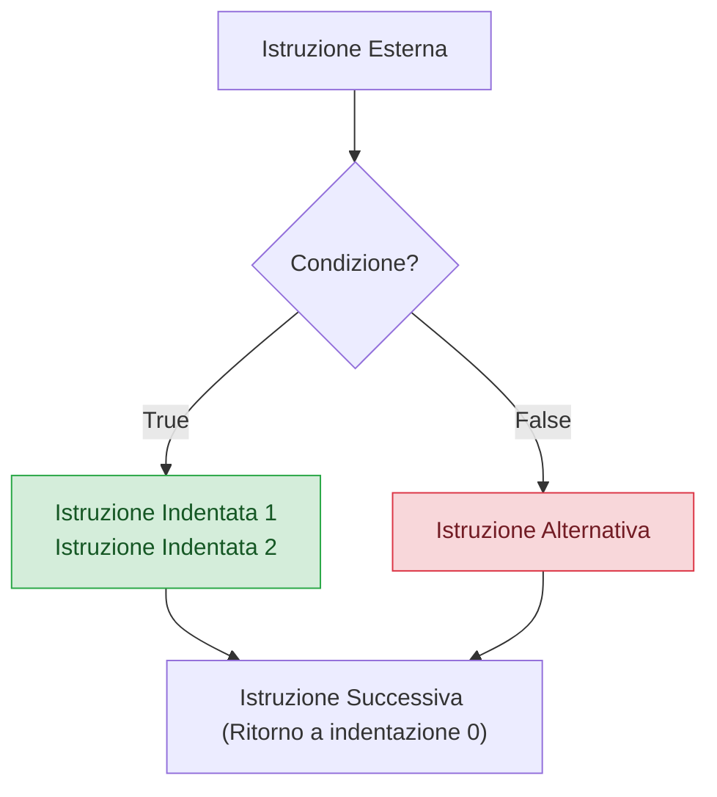

> [!SUMMARY] ⚡ In Sintesi (A Colpo d'Occhio)
> - **Indentazione Obbligatoria**: in Python i blocchi di codice non usano le parentesi graffe `{}`, ma ==esattamente 4 spazi di rientro==.
> - **Selezione**: `if`, `elif` (contrazione di *else if*), `else`.
> - **Operatori Logici Parola**: `and`, `or`, `not` (sostituiscono i simboli `&&`, `||`, `!` del C++).
> - **Chained Comparisons**: confronti a catena naturali (es. `18 <= voto <= 30`).
> - **Operatore Ternario**: `stato = "Promosso" if voto >= 18 else "Bocciato"`.
> - **Pattern Matching Moderno**: costrutto `match - case` (da Python 3.10+) senza bisogno di `break` anti-fallthrough.
> - **Iterazione Pythonica**: `for ... in range(n)`, `enumerate()` per indice + elemento contemporanei, e clausola speciale `else` nei cicli.

---

## 1. L'Indentazione Significativa: La Regola d'Oro di Python

In C++ le parentesi graffe `{}` delimitano i blocchi di codice e l'indentazione è solo una convenzione estetica. In **Python l'indentazione è parte integrante della grammatica del linguaggio**:



> [!DANGER] 🚫 Errore Comune: `IndentationError` e `TabError`
> Non mescolare mai **Tabulazioni (Tab)** e **Spazi**. Lo standard ufficiale PEP 8 impone l'uso di **4 spazi per ciascun livello di indentazione**. Se l'allineamento è errato, il programma non parte nemmeno!

---

## 2. Selezione Condizionale: `if`, `elif`, `else`

La sintassi prevede la parola chiave seguita dalla condizione e dal simbolo di due punti **`:`**:

```python
eta = 17

if eta >= 18:
    print("Sei maggiorenne: puoi votare.")
elif eta >= 14:
    print("Sei un teenager: puoi guidare un ciclomotore.")
else:
    print("Sei minorenne.")
```

### Operatori Logici e Relazionali
A differenza dei simboli matematici crudi del C++ (`&&`, `||`, `!`), Python usa parole inglesi pulite:
- **`and`**: vero se entrambe le condizioni sono vere (con cortocircuito: se la prima è falsa, la seconda non viene nemmeno valutata).
- **`or`**: vero se almeno una condizione è vera.
- **`not`**: negazione logica (`not True` $\rightarrow$ `False`).
- **`in` / `not in`**: verifica immediata di appartenenza ad una sequenza o stringa:
  ```python
  if "admin" in ruolo_utente:
      print("Accesso consentito")
  ```

### Confronti a Catena (Chained Comparisons)
In C++ dobbiamo scrivere `voto >= 18 && voto <= 30`. In Python la sintassi è speculare a quella della matematica scolastica:
```python
voto = 27
if 18 <= voto <= 30:
    print("Voto valido per il superamento dell'esame.")
```

### Operatore Ternario (Espressione Condizionale Monoriga)
Consente di assegnare un valore in base a una condizione in una sola riga leggibile:
```python
voto = 15
esito = "Superato" if voto >= 18 else "Non superato"
print(esito)  # Non superato
```

---

## 3. Selezione Multipla Moderna: `match - case`

Introdotto in **Python 3.10** (PEP 634), il costrutto `match - case` supera lo `switch-case` del C++ grazie al **Pattern Matching Strutturale**:
1. Non richiede la parola chiave `break` (nessun rischio di *fallthrough* accidentale).
2. Usa il carattere di sottolineatura **`_`** come caso predefinito (*default wildcard*).
3. Permette di unire più casi con la barra verticale `|`.

```python
comando = "SALVA"

match comando.upper():
    case "AVVIA" | "START":
        print("Sistema avviato.")
    case "FERMA" | "STOP":
        print("Arresto del sistema.")
    case "SALVA":
        print("Dati salvati su disco.")
    case _:
        print("Comando non riconosciuto!")
```

---

## 4. Cicli Iterativi: `while` e `for`

### A. Ciclo `while` e la Clausola `while ... else`
Il ciclo `while` esegue il blocco finché la condizione resta vera.

```python
conteggio = 3
while conteggio > 0:
    print(f"Conto alla rovescia: {conteggio}")
    conteggio -= 1
else:
    print("Lancio avvenuto con successo!")
```

> [!TIP] 💡 La Clausola `else` nei Cicli
> Il blocco `else` abbinato a un ciclo `while` (o `for`) viene eseguito **solo se il ciclo è giunto al termine naturale** (senza essere interrotto bruscamente da un'istruzione `break`). È l'ideale per le ricerche!

### B. Ciclo `for` e la Funzione `range()`
In Python il ciclo `for` non è un contatore manuale con indici, ma un **iteratore che attraversa una sequenza**:

```python
# Sintassi di range: range(inizio, fine_esclusa, passo)
# Intervallo semi-aperto [0, 5) -> genera 0, 1, 2, 3, 4
for i in range(5):
    print(i, end=" ")
# Output: 0 1 2 3 4
```

Esempi di parametri con `range`:
- `range(1, 6)` $\rightarrow$ genera $1, 2, 3, 4, 5$.
- `range(10, 0, -2)` $\rightarrow$ conto alla rovescia con passo $-2$: $10, 8, 6, 4, 2$.

---

## 5. Strumenti Iterativi Idiomatici: `enumerate()` e `zip()`

> [!SUCCESS] 🎯 Regola d'Oro Pythonica
> Non usare mai variabili contatore manuali prima del ciclo (`i = 0; while ... i += 1`). Python offre funzioni native integrate progettate appositamente.

### 1. `enumerate()`: Indice e Valore Insieme
Quando scorri una lista e hai bisogno sia dell'indice numerico sia dell'elemento:
```python
linguaggi = ["Python", "C++", "JavaScript", "Rust"]

for indice, nome in enumerate(linguaggi, start=1):
    print(f"{indice}. {nome}")
# Output:
# 1. Python
# 2. C++
# 3. JavaScript
# 4. Rust
```

### 2. `zip()`: Scorrere Più Liste in Parallelo
Evita di accedere tramite indici a vettori paralleli:
```python
nomi = ["Mario", "Luigi", "Peach"]
punti = [1200, 950, 1500]

for n, p in zip(nomi, punti):
    print(f"Giocatore: {n} - Punteggio: {p}")
```

---

## 6. Salto di Flusso: `break`, `continue` e `pass`

- **`break`**: termina immediatamente il ciclo più interno.
- **`continue`**: salta all'iterazione successiva ignorando il codice rimanente nel blocco.
- **`pass`**: istruzione "segnaposto" (*no-operation*). Serve quando la sintassi richiede un blocco di codice ma non si vuole eseguire nulla (es. funzioni o classi ancora da implementare).

```python
for num in range(1, 10):
    if num % 2 == 0:
        continue  # Salta i numeri pari
    if num == 7:
        print("Trovato il numero 7! Arresto anticipato.")
        break     # Termina il ciclo
    print(f"Numero dispari: {num}")
```

---

## 7. Domande d'Esame e Concetti Chiave

> [!QUESTION] ❓ Domande di Verifica
> 1. *Cosa succede se in un programma Python si usa un'indentazione incoerente (es. a volte 2 spazi e a volte 4)?*  
>    **Risposta**: L'interprete rifiuta di eseguire il programma e genera un'eccezione `IndentationError` prima del runtime.
> 2. *Come funziona la clausola `else` applicata a un ciclo `for`?*  
>    **Risposta**: Il blocco `else` viene eseguito se il ciclo termina normalmente dopo aver consumato tutti gli elementi. Se il ciclo viene interrotto prima con un'istruzione `break`, il blocco `else` viene saltato.
> 3. *Quali vantaggi offre il `match-case` rispetto allo `switch` del C++?*  
>    **Risposta**: Non necessita di `break` a fine di ogni caso, non soffre di fallthrough accidentale, consente di verificare tipi complessi, sequenze e applicare filtri di guardia (`if`).

---

## 8. Programma Esecutivo Completo

> [!EXAMPLE]- 🧪 Programma Completo: Gioco "Indovina il Numero Segreto"
> ```python
> import random
> 
> def gioca_indovinello():
>     numero_segreto: int = random.randint(1, 50)
>     tentativi_massimi: int = 5
>     
>     print("=== BENVENUTO NEL GIOCO DELL'INDOVINELLO ===")
>     print(f"Ho scelto un numero tra 1 e 50. Hai a disposizione {tentativi_massimi} tentativi!\n")
>     
>     for tentativo in range(1, tentativi_massimi + 1):
>         scelta_utente = input(f"Tentativo {tentativo}/{tentativi_massimi} - Inserisci numero (o 'esci'): ")
>         
>         if scelta_utente.lower().strip() == "esci":
>             print("Partita interrotta dall'utente.")
>             break
>             
>         if not scelta_utente.isdigit():
>             print("⚠️ Inserisci un numero intero valido!")
>             continue
>             
>         valore = int(scelta_utente)
>         
>         if valore == numero_segreto:
>             print(f"🎉 COMPLIMENTI! Hai indovinato il numero {numero_segreto} al tentativo {tentativo}!")
>             break
>         elif valore < numero_segreto:
>             print("📈 Troppo basso! Prova un numero più alto.")
>         else:
>             print("📉 Troppo alto! Prova un numero più basso.")
>     else:
>         # Viene eseguito SOLO se i tentativi finiscono senza break
>         print(f"\n❌ Tentativi esauriti! Il numero segreto era: {numero_segreto}.")
> 
> if __name__ == "__main__":
>     gioca_indovinello()
> ```
