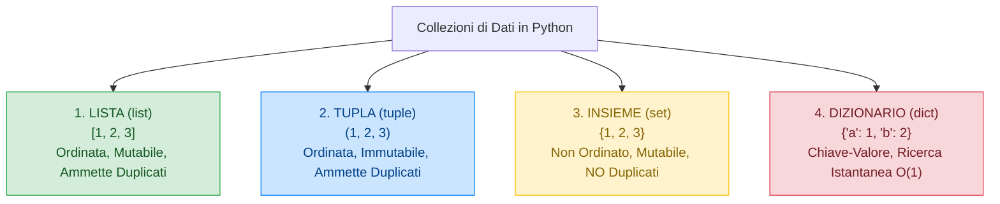
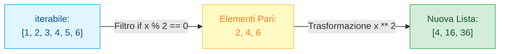

> [!SUMMARY] ⚡ In Sintesi (A Colpo d'Occhio)
> - **Le 4 Strutture Native**:
>   - ==`list`==: ordinata, mutabile, eterogenea (`[1, 2, "tre"]`).
>   - ==`tuple`==: ordinata, immutabile, protetta da scritture accidentali (`(10, 20)`).
>   - ==`set`==: non ordinata, elementi univoci (elimina duplicati all'istante), ricerca in $O(1)$.
>   - ==`dict`==: coppie chiave-valore ad accesso istantaneo hash table $O(1)$ (`{"nome": "Luca"}`).
> - **Indici Negativi**: `lista[-1]` restituisce l'ultimo elemento, `lista[-2]` il penultimo.
> - **Slicing**: estrazione fette con ==`lista[inizio:fine_esclusa:passo]`==; per invertire una lista: ==`lista[::-1]`==.
> - **List Comprehension**: sintassi compatta ad alta velocità `[x**2 for x in lista if x > 0]`.

---

## 1. Panoramica delle 4 Strutture Dati Native

In C++ per collezionare dati si usano gli array statici `int v[100]` o i contenitori della STL come `std::vector` e `std::map`.
Python integra nel suo nucleo **4 collezioni native ad altissimo livello**:



| Tipo | Sintassi | Ordinata? | Mutabile? | Duplicati? | Caso d'Uso Principale |
| :--- | :--- | :--- | :--- | :--- | :--- |
| **`list`** | `[a, b, c]` | **Sì** | **Sì** | **Sì** | Sequenze dinamiche di elementi generici. |
| **`tuple`** | `(a, b, c)` | **Sì** | **No** | **Sì** | Record fissi, coordinate geografiche, chiavi immutabili. |
| **`set`** | `{a, b, c}` | **No** | **Sì** | **No** | Test di appartenenza ultra-veloce $O(1)$, eliminazione duplicati. |
| **`dict`** | `{k: v}` | **Sì** (da Py 3.7+) | **Sì** | Solo valori | Tabelle di associazione, database in memoria, record JSON. |

---

## 2. Le Liste (`list`): Array Dinamico

Una lista è una sequenza flessibile in cui gli elementi possono essere di qualunque tipo (anche eterogenei):

```python
numeri = [10, 20, 30, 40, 50]
misto = [1, "Python", 3.14, True]
vuota = []
```

### Indicizzazione Zero-Based e Indici Negativi
In Python possiamo contare anche partendo dalla fine della lista con il segno meno:
```python
voti = [24, 28, 30, 18, 27]

print(voti[0])   # 24 (primo elemento)
print(voti[-1])  # 27 (ultimo elemento: niente più 'voti[len(voti) - 1]' come in C++!)
print(voti[-2])  # 18 (penultimo elemento)
```

### Lo Slicing: Estrazione di Sottosequenze
Lo slicing estrae una porzione della lista generando una nuova lista con la sintassi `lista[start:stop:step]`:

```python
lettere = ['A', 'B', 'C', 'D', 'E', 'F']

print(lettere[1:4])   # ['B', 'C', 'D'] (da indice 1 a indice 4 ESCLUSO)
print(lettere[:3])    # ['A', 'B', 'C'] (dall'inizio fino a indice 3 escluso)
print(lettere[3:])    # ['D', 'E', 'F'] (da indice 3 fino alla fine)
print(lettere[::2])   # ['A', 'C', 'E'] (tutti con passo 2)
print(lettere[::-1])  # ['F', 'E', 'D', 'C', 'B', 'A'] (LISTA INVERTITA!)
```

### Metodi Fondamentali delle Liste

```python
valori = [10, 20, 30]

# Inserimento
valori.append(40)          # Inserisce in coda -> [10, 20, 30, 40]
valori.insert(1, 15)       # Inserisce all'indice 1 -> [10, 15, 20, 30, 40]
valori.extend([50, 60])    # Aggiunge più elementi -> [..., 50, 60]

# Rimozione
elemento = valori.pop()    # Rimuove e restituisce l'ultimo (60)
valori.remove(15)          # Cerca ed elimina il primo valore uguale a 15
del valori[0]              # Elimina per posizione (indice 0)

# Statistiche integrate
print(len(valori))         # Lunghezza
print(min(valori))         # Valore minimo
print(max(valori))         # Valore massimo
print(sum(valori))         # Somma di tutti gli elementi
```

---

## 3. Matrici in Python (Liste di Liste)

Una matrice è rappresentata come una lista contenente altre liste:

```python
matrice = [
    [1, 2, 3],
    [4, 5, 6],
    [7, 8, 9]
]

# Accesso: matrice[riga][colonna]
print(matrice[1][2]) # Stampa 6 (riga 1, colonna 2)
```

> [!DANGER] 🚫 Trappola di Inizializzazione delle Matrici
> **NON inizializzare mai una matrice in questo modo**:
> ```python
> righe, colonne = 3, 3
> errata = [[0] * colonne] * righe # GRAVISSIMO ERRORE!
> ```
> Questo comando crea 3 righe che puntano **tutte alla medesima riga in memoria**: modificando `errata[0][0] = 5`, tutte e 3 le righe vedranno il 5!  
> **Il modo corretto è usare una list comprehension**:
> ```python
> corretta = [[0 for _ in range(colonne)] for _ in range(righe)]
> ```

---

## 4. List Comprehensions: Il Superpotere di Python

Le **List Comprehensions** permettono di generare, trasformare e filtrare liste con una sintassi concisa, elegante e più veloce dei cicli standard:

$$\text{Risultato} = [\text{espressione } \mathbf{for} \text{ elemento } \mathbf{in} \text{ iterabile } \mathbf{if} \text{ condizione}]$$



### Confronto di Sintassi:
```python
# Modo Classico (con ciclo for e append):
quadrati = []
for x in range(1, 11):
    if x % 2 == 0:
        quadrati.append(x ** 2)

# Modo Pythonico con List Comprehension:
quadrati = [x ** 2 for x in range(1, 11) if x % 2 == 0]
# Risultato: [4, 16, 36, 64, 100]
```

---

## 5. Le altre Collezioni: Tuple, Insiemi e Dizionari

### A. Le Tuple (`tuple`)
Identiche alle liste, ma racchiuse da parentesi tonde e **immutabili** (impossibile fare `.append()` o cambiare elementi):
```python
punto = (10, 25)
# punto[0] = 15  <-- TypeError: 'tuple' object does not support item assignment

# Unpacking istantaneo delle tuple:
x, y = punto
print(f"X={x}, Y={y}")
```

### B. Gli Insiemi (`set`)
Collezione di elementi unici, racchiusi tra graffe `{}`:
```python
numeri_con_duplicati = [1, 2, 2, 3, 4, 4, 4, 5]
unici = set(numeri_con_duplicati)
print(unici)  # {1, 2, 3, 4, 5} -> duplicati eliminati all'istante!

# Operazioni insiemistiche
a = {1, 2, 3}
b = {3, 4, 5}
print(a | b)  # Unione: {1, 2, 3, 4, 5}
print(a & b)  # Intersezione: {3}
```

### C. I Dizionari (`dict`)
Mappano una chiave univoca ad un valore associato:
```python
studente = {
    "matricola": 45892,
    "nome": "Marco",
    "corso": "Informatica",
    "voti": [28, 30, 27]
}

# Accesso e modifica
print(studente["nome"])       # Marco
studente["media"] = 28.3      # Inserisce nuova coppia chiave-valore

# Accesso sicuro con .get() (non crasha se la chiave non esiste!)
print(studente.get("email", "Non fornita"))  # Restituisce il default senza eccezioni
```

---

## 6. Domande d'Esame e Concetti Chiave

> [!QUESTION] ❓ Domande di Verifica
> 1. *Qual è il vantaggio computazionale di usare un `set` o un `dict` per cercare un elemento rispetto a una `list`?*  
>    **Risposta**: La ricerca in una lista richiede tempo lineare $O(n)$ scorrendo tutti gli elementi. In `set` e `dict`, basati su tabella hash, la verifica di esistenza avviene in tempo costante medio $O(1)$.
> 2. *Cosa restituisce l'espressione `lista[::-1]`?*  
>    **Risposta**: Restituisce una copia superficiale della lista con gli elementi ordinati in senso inverso, grazie al passo $-1$ dello slicing.
> 3. *Perché `[[0] * 3] * 3` è una trappola pericolosa?*  
>    **Risposta**: Perché duplica per tre volte il riferimento alla medesima riga, anziché allocare tre liste distinte in memoria.

---

## 7. Programma Esecutivo Completo

> [!EXAMPLE]- 🧪 Programma Completo: Analizzatore di Registro Elettronico
> ```python
> def analizza_classe():
>     studenti = [
>         {"nome": "Alice", "voti": [8, 9, 7, 10]},
>         {"nome": "Bob", "voti": [5, 6, 6, 4]},
>         {"nome": "Carla", "voti": [9, 10, 9, 9]},
>         {"nome": "Davide", "voti": [6, 7, 6, 8]}
>     ]
>     
>     print("=== REPORT RENDIMENTO CLASSE ===")
>     
>     # Calcolo medie con List Comprehensions e dizionari
>     medie = {s["nome"]: sum(s["voti"]) / len(s["voti"]) for s in studenti}
>     
>     for nome, media in medie.items():
>         esito = "PROMOSSO" if media >= 6 else "DA RECUPERARE"
>         print(f"Studente: {nome:<10} | Media: {media:4.2f} | Stato: {esito}")
>         
>     # Filtraggio studenti eccellenti (media >= 8.5)
>     eccellenze = [nome for nome, media in medie.items() if media >= 8.5]
>     print("\n🌟 Studenti con borsa di studio (media >= 8.5):", eccellenze)
>     
>     # Insieme dei voti unici registrati
>     tutti_i_voti = [v for s in studenti for v in s["voti"]]
>     voti_distinti = sorted(set(tutti_i_voti))
>     print("📊 Voti differenti assegnati nella classe:", voti_distinti)
> 
> if __name__ == "__main__":
>     analizza_classe()
> ```
