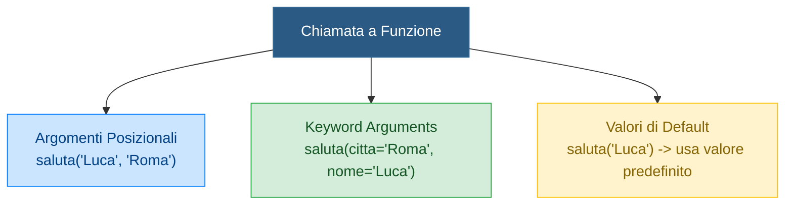
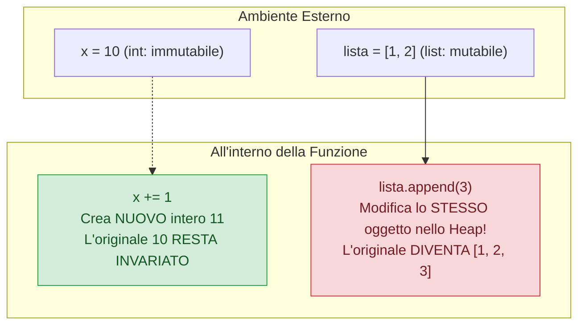
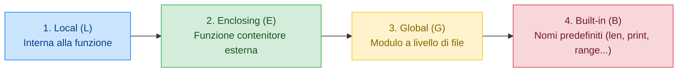

> [!SUMMARY] ⚡ In Sintesi (A Colpo d'Occhio)
> - **Dichiarazione**: keyword ==`def nome_funzione(parametri):`==; se non c'è `return`, restituisce implicitamente ==`None`==.
> - **Argomenti Flessibili**: supporta argomenti posizionali, nominali (*Keyword Arguments* `f(x=10)`), e valori di default.
> - **`*args` e `**kwargs`**: `*args` raccoglie argomenti posizionali extra in una ==tupla==; `**kwargs` raccoglie argomenti con nome in un ==dizionario==.
> - **Pass-by-Object-Reference**: se passi un oggetto mutabile (es. una lista) e ne modifichi il contenuto, la modifica sarà visibile anche all'esterno.
> - **Scope LEGB**: la ricerca delle variabili avviene nell'ordine ==Local $\rightarrow$ Enclosing $\rightarrow$ Global $\rightarrow$ Built-in==.
> - **Lambda Functions**: funzioni anonime monoriga per trasformazioni rapide `lambda x: x * 2`.

---

## 1. Definizione e Chiamata di Funzione

In Python le funzioni si definiscono con la parola chiave **`def`**. Non è necessario specificare il tipo di ritorno: se la funzione termina senza un'istruzione `return` esplicita, restituirà automaticamente il valore speciale `None`.

```python
def calcola_area_rettangolo(base: float, altezza: float) -> float:
    """Calcola e restituisce l'area di un rettangolo (Docstring)."""
    return base * altezza

# Chiamata
area = calcola_area_rettangolo(5.0, 3.0)
print(f"Area: {area}")  # Area: 15.0
```

> [!TIP] 💡 Docstring (Documentazione Integrata)
> La stringa su tre apici `"""..."""` posta subito sotto la definizione della funzione è la **Docstring**. Viene letta automaticamente da `help(nome_funzione)` e mostrata dagli IDE durante la scrittura del codice.

---

## 2. Parametri e Flessibilità degli Argomenti

In C++ gli argomenti devono corrispondere rigidamente all'ordine e al tipo dichiarato. In Python abbiamo una flessibilità straordinaria:



### Parametri con Valori di Default
```python
def connetti_db(host: str, porta: int = 3306, timeout: int = 10):
    print(f"Connessione a {host}:{porta} (timeout={timeout}s)")

connetti_db("localhost")                   # Usa porta 3306 e timeout 10
connetti_db("192.168.1.1", 5432)           # Sovrascrive solo porta
connetti_db("10.0.0.1", timeout=30)        # Usa keyword argument per saltare la porta
```

> [!DANGER] 🚫 Errore Critico: Default Mutabili (*The Mutable Default Trap*)
> **NON usare MAI oggetti mutabili (liste, dizionari) come valori di default!**
> ```python
> def aggiungi_elemento(item, lista=[]): # ERRORE PESSIMO!
>     lista.append(item)
>     return lista
> 
> print(aggiungi_elemento(1))  # [1]
> print(aggiungi_elemento(2))  # [1, 2]  <- La lista è la stessa della chiamata prima!
> ```
> Il parametro di default viene creato **una sola volta** quando la funzione viene definita in memoria.  
> **Soluzione Corretta (Pattern Idiomatico):**
> ```python
> def aggiungi_elemento(item, lista=None):
>     if lista is None:
>         lista = []  # Crea una nuova lista ad OGNI invocazione
>     lista.append(item)
>     return lista
> ```

---

## 3. Parametri Arbitrari: `*args` e `**kwargs`

Quando non sappiamo a priori quanti argomenti l'utente passerà alla funzione:

### `*args` (Argomenti Posizionali Arbitrari)
Raccoglie tutti gli argomenti posizionali extra in una **tupla**:
```python
def somma_tutti(*numeri):
    # 'numeri' è una tupla contenente tutti gli argomenti passati
    totale = 0
    for n in numeri:
        totale += n
    return totale

print(somma_tutti(1, 2, 3))          # 6
print(somma_tutti(10, 20, 30, 40))   # 100
```

### `**kwargs` (Keyword Arguments Arbitrari)
Raccoglie tutti gli argomenti con nome non previsti in un **dizionario**:
```python
def crea_profilo(nome: str, **dettagli):
    # 'dettagli' è un dizionario chiave: valore
    print(f"Profilo di: {nome}")
    for k, v in dettagli.items():
        print(f" - {k.capitalize()}: {v}")

crea_profilo("Alessandro", ruolo="Admin", citta="Milano", livello=4)
```

---

## 4. Meccanismo di Passaggio: *Pass-by-Object-Reference*

In C++ abbiamo passaggio per valore (`int x`) e per riferimento (`int &x`).  
In Python esiste un unico meccanismo detto **Pass-by-Object-Reference** (o *Call-by-Sharing*):
- Alla funzione viene passato il **riferimento all'oggetto originale**.
- Se l'oggetto è **immutabile** (`int`, `float`, `str`, `tuple`), qualsiasi operazione di riassegnazione dentro la funzione fa puntare la variabile locale a un NUOVO oggetto, lasciando invariato l'originale esterno.
- Se l'oggetto è **mutabile** (`list`, `dict`, `set`), modificarne lo stato interno (es. con `.append()` o assegnando un indice) **altera l'oggetto originale anche fuori dalla funzione**!



---

## 5. Scope e Visibilità: La Regola LEGB

Quando Python incontra una variabile dentro una funzione, la cerca secondo la gerarchia rigorosa **LEGB**:



### La Parola Chiave `global`
In lettura possiamo leggere variabili globali senza problemi. Ma se tentiamo di **assegnare** un valore a una variabile globale dentro una funzione, Python creerà una nuova variabile locale, a meno di non usare la keyword `global`:

```python
contatore = 0

def incrementa():
    global contatore  # Dichiara esplicitamente che vogliamo modificare la globale
    contatore += 1

incrementa()
print(contatore)  # 1
```

> [!WARNING] ⚠️ Best Practice
> L'uso di `global` è fortemente sconsigliato nei progetti seri perché crea effetti collaterali e rende il codice difficile da debuggare. Preferisci sempre passare i dati come argomenti e restituire il nuovo valore con `return`.

---

## 6. Funzioni Lambda (Funzioni Anonime)

Una **lambda** è una funzione compatta e monoriga, definita senza un nome tramite la sintassi:
$$\mathbf{lambda} \text{ parametri}: \text{espressione}$$

```python
# Lambda che raddoppia un numero
doppio = lambda x: x * 2
print(doppio(5))  # 10

# Uso tipico: criterio di ordinamento personalizzato per una lista
studenti = [("Alice", 28), ("Bob", 22), ("Carla", 30)]
# Ordina per voto (secondo elemento della tupla)
studenti.sort(key=lambda s: s[1], reverse=True)
print(studenti)  # [('Carla', 30), ('Alice', 28), ('Bob', 22)]
```

---

## 7. Domande d'Esame e Concetti Chiave

> [!QUESTION] ❓ Domande di Verifica
> 1. *Cosa succede se dichiaro un parametro di default come lista vuota: `def func(v=[]):`?*  
>    **Risposta**: La lista viene creata solo all'interpretazione iniziale della funzione. Tutte le successive invocazioni che omettono l'argomento condivideranno la medesima lista in memoria, accumulando dati in modo anomalo.
> 2. *Qual è la differenza pratica tra `*args` e `**kwargs`?*  
>    **Risposta**: `*args` impacchetta un numero imprecisato di argomenti posizionali in una tupla ordinata; `**kwargs` impacchetta argomenti con nome (chiave=valore) in un dizionario.
> 3. *Cosa stabilisce la regola LEGB per la risoluzione dei nomi?*  
>    **Risposta**: Stabilisce la sequenza di ricerca: cerca prima nello scope Locale, poi nelle funzioni Racchiudenti (Enclosing), poi nello scope Globale del modulo e infine nei Built-in del linguaggio.

---

## 8. Programma Esecutivo Completo

> [!EXAMPLE]- 🧪 Programma Completo: Motore di Calcolo Matematico Modulare
> ```python
> def statistiche(*numeri: float, arrotonda: int = 2, **metadati) -> dict:
>     """
>     Calcola statistiche su un numero arbitrario di cifre e allega metadati.
>     Dimostra l'uso congiunto di *args, default kwargs e **kwargs.
>     """
>     if not numeri:
>         return {"errore": "Nessun numero fornito"}
>         
>     totale: float = sum(numeri)
>     media: float = totale / len(numeri)
>     val_min: float = min(numeri)
>     val_max: float = max(numeri)
>     
>     report = {
>         "conteggio": len(numeri),
>         "somma": round(totale, arrotonda),
>         "media": round(media, arrotonda),
>         "min": round(val_min, arrotonda),
>         "max": round(val_max, arrotonda),
>         "info_aggiuntive": metadati
>     }
>     return report
> 
> if __name__ == "__main__":
>     risultato = statistiche(
>         14.555, 22.3, 8.91, 100.25, 4.0,
>         arrotonda=1,
>         operatore="Prof. Caseti",
>         materia="Informatica",
>         sessione="Esami 2026"
>     )
>     
>     print("=== RISULTATO ELABORAZIONE DATI ===")
>     for chiave, valore in risultato.items():
>         print(f"{chiave:<16}: {valore}")
> ```
