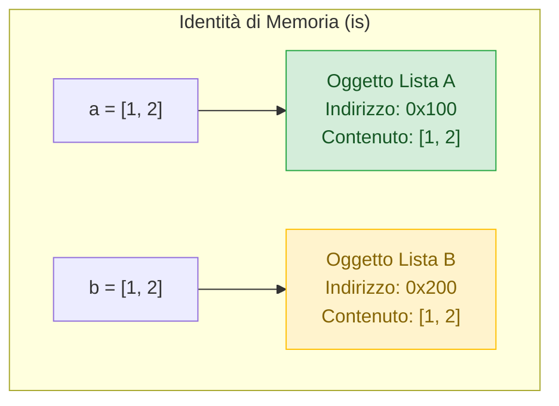
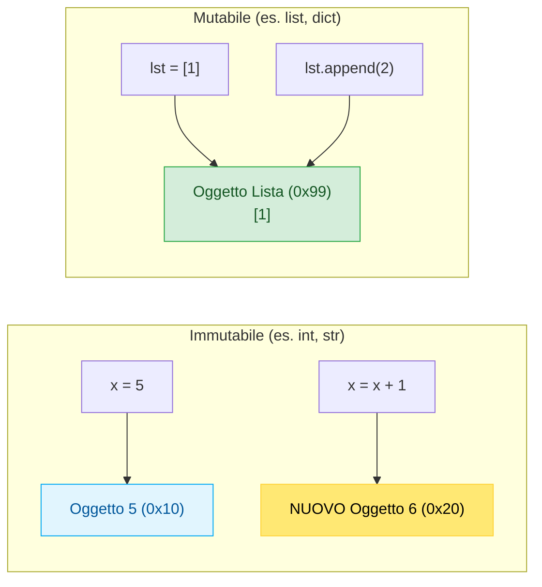
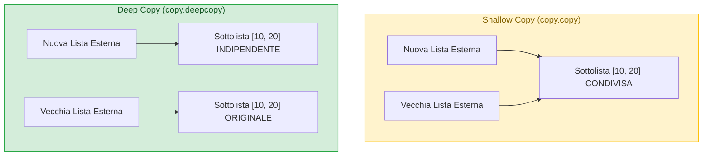

> [!SUMMARY] ⚡ In Sintesi (A Colpo d'Occhio)
> - **Niente Puntatori Espliciti, ma Riferimenti Ovunque**: in Python ogni variabile è un ==riferimento opaco ad un `PyObject` nello Heap==.
> - **Indirizzo di Memoria**: la funzione ==`id(x)`== restituisce l'indirizzo fisico univoco dell'oggetto (visualizzabile in esadecimale con `hex(id(x))`).
> - **`==` vs `is`**:
>   - `==` verifica l'**uguaglianza di valore** (hanno lo stesso contenuto?).
>   - `is` verifica l'**identità di memoria** (`id(a) == id(b)`: sono lo stesso identico oggetto fisico?).
> - **Tipi Mutabili vs Immutabili**:
>   - **Immutabili** (`int`, `float`, `str`, `tuple`): modificarli genera un nuovo oggetto.
>   - **Mutabili** (`list`, `dict`, `set`): modifiche sul posto (*in-place*).
> - **Copia di Oggetti**: `b = a` copia solo il puntatore; usa ==`copy.copy()`== per la shallow copy e ==`copy.deepcopy()`== per duplicare strutture annidate.
> - **Garbage Collector**: basato principalmente su ==Reference Counting== (deallocazione immediata a contatore zero) assistito da un ciclo-rilevatore per i riferimenti circolari.

---

## 1. Ci sono i Puntatori in Python?

Gli studenti provenienti dal C++ spesso chiedono: *"Dov'è finito l'operatore asterisco `*` e l'operatore ampersand `&`?"*.

La risposta è: **in Python non puoi manipolare direttamente i puntatori, ma ogni singola variabile è già, concettualmente, un puntatore.**

Sotto il cofano in CPython, qualsiasi dato è una struttura C chiamata `PyObject`:
```c
// Struttura concettuale interna di CPython
struct _object {
    _PyObject_HEAD_EXTRA // Riferimenti per la lista del GC
    Py_ssize_t ob_refcnt; // CONTATORE DI RIFERIMENTI (Reference Count)
    struct _typeobject *ob_type; // PUNTATORE AL TIPO DELL'OGGETTO
};
```

Quando creiamo `x = 1000`, la variabile `x` non contiene il numero $1000$: contiene l'**indirizzo di memoria** della struct `PyObject` allocata nello Heap.

### Ispezionare la RAM: La Funzione `id()`
La funzione nativa `id(oggetto)` restituisce l'identificatore univoco dell'oggetto, che in CPython corrisponde esattamente al suo **indirizzo fisico di memoria RAM**:

```python
x = 1000
print(f"Indirizzo decimale: {id(x)}")
print(f"Indirizzo esadecimale RAM: {hex(id(x))}") # es. 0x7fa8102b3f50
```

---

## 2. La Differenza Vitale: `==` vs `is`

Uno degli errori logici più subdoli nei programmi Python è confondere l'uguaglianza con l'identità:



| Operatore | Cosa Confronta? | Metodo Interno Invocato | Domanda Chiave |
| :--- | :--- | :--- | :--- |
| **`==`** | **Valore (Contenuto)** | `a.__eq__(b)` | *I due oggetti hanno lo stesso contenuto logico?* |
| **`is`** | **Identità (Indirizzo RAM)** | `id(a) == id(b)` | *Le due etichette puntano allo stesso identico oggetto fisico?* |

### Esempio Pratico:
```python
lista1 = [1, 2, 3]
lista2 = [1, 2, 3]
lista3 = lista1

print(lista1 == lista2)  # True  (hanno gli stessi numeri all'interno)
print(lista1 is lista2)  # False (sono due liste DISTINTE in memoria RAM!)

print(lista1 is lista3)  # True  (puntano allo STESSO identico blocco di memoria)
```

> [!SUCCESS] 🎯 Regola d'Oro per il confronto con `None`
> Per verificare se una variabile è vuota o nulla, usa **sempre `is None`** (o `is not None`) e mai `== None`. `None` è un singleton garantito in tutta la vita del processo Python!

---

## 3. Mutabilità vs Immutabilità

Comprendere la mutabilità è fondamentale per non introdurre bug invisibili:



- **Tipi Immutabili** (`int`, `float`, `str`, `tuple`, `bool`): non possono cambiare stato. Qualsiasi alterazione crea un nuovo oggetto in un nuovo indirizzo RAM.
- **Tipi Mutabili** (`list`, `dict`, `set`, istanze di classi): possono essere modificati direttamente nella loro cella di memoria originale.

---

## 4. Copia di Oggetti: Assegnazione, Copia Superficiale e Profonda

Quando devi duplicare una collezione mutabile, l'operatore di assegnazione `=` **NON copia i dati**, ma copia solo il riferimento!

```python
# 1. Assegnazione semplice (effetto specchio):
a = [1, 2, 3]
b = a
b.append(99)
print(a)  # [1, 2, 3, 99] -> Anche 'a' è stata modificata!
```

Per ottenere copie reali indipendenti usiamo il modulo nativo **`copy`**:

```python
import copy

originale = [[10, 20], [30, 40]]

# 2. Shallow Copy (Copia Superficiale):
superficiale = copy.copy(originale)  # oppure: originale[:]
# Copia la lista esterna, MA le sottoliste interne sono ancora condivise!
superficiale[0][0] = 999
print(originale[0][0])  # 999 -> Il dato interno è cambiato anche nell'originale!

# 3. Deep Copy (Copia Profonda Totale):
profonda = copy.deepcopy(originale)
profonda[0][0] = 111
print(originale[0][0])  # 999 -> L'originale è TOTALMENTE PROTETTO!
```



---

## 5. Come Funziona il Garbage Collector in Python

Python gestisce la memoria automaticamente tramite due meccanismi complementari:

### A. Reference Counting (Conteggio dei Riferimenti)
- È il meccanismo primario.
- Ogni oggetto memorizza quante variabili o collezioni lo stanno referenziando.
- **Nel momento esatto in cui il contatore scende a 0**, la memoria occupata dall'oggetto viene liberata e restituita all'allocatore di sistema immediatamente.

```python
import sys

x = ["oggetto", "di", "test"]
print(sys.getrefcount(x) - 1)  # 1 riferimento (la variabile x)

y = x
print(sys.getrefcount(x) - 1)  # 2 riferimenti (x e y)

del y  # Rimuove il riferimento y
print(sys.getrefcount(x) - 1)  # Torna a 1
```

### B. Cyclic Garbage Collector (Rilevatore di Cicli)
Cosa succede se due oggetti si puntano a vicenda ma non sono più raggiungibili dal programma?
```python
a = []
b = []
a.append(b)  # 'a' punta a 'b'
b.append(a)  # 'b' punta a 'a'
del a
del b
# I loro reference count non arrivano mai a 0 a causa del ciclo!
```
Per evitare *memory leaks*, interviene il **Garbage Collector generazionale** (modulo `gc`), che periodicamente ispeziona lo Heap, individua isole isolate di riferimenti circolari e le distrugge forzatamente.

---

## 6. Domande d'Esame e Concetti Chiave

> [!QUESTION] ❓ Domande di Verifica
> 1. *Qual è la differenza fondamentale tra l'operatore `==` e l'operatore `is`?*  
>    **Risposta**: `==` verifica se i due operandi hanno lo stesso valore o contenuto logico chiamando `__eq__()`. L'operatore `is` verifica se puntano allo stesso indirizzo di memoria fisico in RAM (`id(a) == id(b)`).
> 2. *Quando è strettamente necessario usare `copy.deepcopy()` al posto di una copia normale?*  
>    **Risposta**: Quando la struttura da duplicare contiene elementi mutabili annidati (come liste di liste o dizionari di dizionari); una shallow copy duplicherebbe solo il contenitore esterno lasciando condivisi gli oggetti interni.
> 3. *Come gestisce Python la memoria quando una variabile viene cancellata con `del`?*  
>    **Risposta**: L'istruzione `del` decrementa di 1 il reference counter dell'oggetto. Se il contatore raggiunge lo zero, l'oggetto viene deallocato istantaneamente dal motore CPython.

---

## 7. Programma Esecutivo Completo

> [!EXAMPLE]- 🧪 Programma Completo: Ispezione Pratica di Memoria e Riferimenti
> ```python
> import copy
> import sys
> 
> def dimostra_memoria():
>     print("=== 1. ANALISI IDENTITÀ E INDIRIZZI RAM ===")
>     lista_a = [10, 20, 30]
>     lista_b = [10, 20, 30]
>     lista_c = lista_a
>     
>     print(f"lista_a -> Indirizzo: {hex(id(lista_a))} | Valore: {lista_a}")
>     print(f"lista_b -> Indirizzo: {hex(id(lista_b))} | Valore: {lista_b}")
>     print(f"lista_c -> Indirizzo: {hex(id(lista_c))} | Valore: {lista_c}")
>     
>     print(f"\nlista_a == lista_b: {lista_a == lista_b} (Stesso valore)")
>     print(f"lista_a is lista_b: {lista_a is lista_b} (Oggetti fisici distinti)")
>     print(f"lista_a is lista_c: {lista_a is lista_c} (Stesso identico oggetto)")
>     
>     print("\n=== 2. DIMOSTRAZIONE DI SHALLOW VS DEEP COPY ===")
>     registro_originale = [["Mario", 8], ["Luigi", 7]]
>     
>     copia_superficiale = copy.copy(registro_originale)
>     copia_profonda = copy.deepcopy(registro_originale)
>     
>     # Modifichiamo il voto di Mario nella copia superficiale
>     copia_superficiale[0][1] = 10
>     
>     print(f"Originale dopo mod shallow: {registro_originale} (MODIFICATO INVOLONTARIAMENTE!)")
>     
>     # Modifichiamo il voto di Luigi nella copia profonda
>     copia_profonda[1][1] = 4
>     print(f"Originale dopo mod deep:    {registro_originale} (PROTETTO E INVARIATO!)")
>     print(f"Copia profonda indipendente: {copia_profonda}")
> 
> if __name__ == "__main__":
>     dimostra_memoria()
> ```
