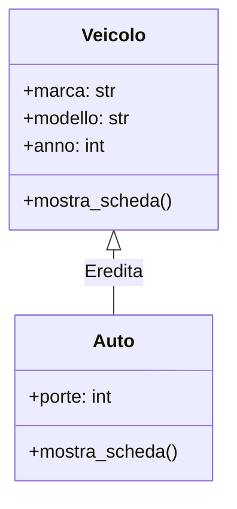

> [!SUMMARY] ⚡ In Sintesi (A Colpo d'Occhio)
> - **Classe e Istanza**: lo stampo concettuale (`class`) e l'oggetto concreto in memoria.
> - **Costruttore `__init__`**: metodo speciale eseguito automaticamente alla creazione dell'oggetto.
> - **Il parametro `self`**: riferimento esplicito all'istanza corrente (l'equivalente del puntatore `this->` in C++).
> - **Incapsulamento**: nessuna parola chiave rigida (`public`/`private`); convenzione con ==`_nome`== (protetto) e ==`__nome`== (privato con *Name Mangling*).
> - **`@property`**: crea getter e setter eleganti mantenendo la sintassi ad accesso diretto (`obj.saldo = 100`).
> - **Dunder Methods**: metodi speciali con doppio underscore (`__str__`, `__len__`, `__eq__`) per integrare gli oggetti con la sintassi nativa di Python.
> - **`@dataclass`**: crea classi dati complete e auto-documentate in 3 righe (la moderna alternativa alle `struct` di C++).

---

## 1. Classi, Istanze e il Ruolo di `self`

In Python definiamo una classe con la parola chiave `class`. Per convenzione PEP 8, i nomi delle classi usano la notazione **PascalCase** (es. `ContoBancario`).



### Il Costruttore `__init__` e il Parametro `self`
```python
class Automobile:
    # Costruttore (inizializzatore dello stato dell'oggetto)
    def __init__(self, marca: str, modello: str, cavalli: int):
        self.marca = marca       # Attributo d'istanza
        self.modello = modello   # Attributo d'istanza
        self.cavalli = cavalli   # Attributo d'istanza

    # Metodo di istanza
    def scheda_tecnica(self) -> str:
        return f"{self.marca} {self.modello} ({self.cavalli} CV)"

# Istanziazione (NON si usa la keyword 'new' come in C++ o Java!)
mia_auto = Automobile("Alfa Romeo", "Giulia", 280)
print(mia_auto.scheda_tecnica())
```

> [!QUESTION] ❓ Perché `self` deve essere sempre il primo parametro?
> In C++, il puntatore `this` viene passato implicitamente dietro le quinte. In Python, coerentemente con il principio dello Zen *"Explicit is better than implicit"*, il riferimento all'oggetto viene dichiarato esplicitamente nella firma del metodo come `self`. Quando chiami `mia_auto.scheda_tecnica()`, Python la traduce automaticamente in `Automobile.scheda_tecnica(mia_auto)`.

---

## 2. Attributi di Istanza vs Attributi di Classe

- **Attributi di Istanza**: definiti dentro `__init__` con `self.nome`; ogni singolo oggetto ha i propri valori indipendenti.
- **Attributi di Classe**: definiti a livello di corpo classe (fuori da qualsiasi metodo); sono variabili condivise da **tutte le istanze** (l'equivalente delle variabili `static` del C++).

```python
class Utente:
    contatore_iscritti = 0  # Attributo di classe condiviso!

    def __init__(self, username: str):
        self.username = username  # Attributo di singola istanza
        Utente.contatore_iscritti += 1

u1 = Utente("Alessandro")
u2 = Utente("Beatrice")
print(Utente.contatore_iscritti)  # 2 (condiviso da entrambi!)
```

---

## 3. Incapsulamento Pythonico e Name Mangling

La filosofia di Python è pragmatica: *"We are all consenting adults here"* (siamo tutti adulti consenzienti). Non esistono blocchi invalicabili imposti dal compilatore, ma convenzioni sintattiche ben definite:

1. **Pubblico (`nome`)**: accessibile liberamente da chiunque.
2. **Protetto (`_nome`)**: convenzione che indica agli sviluppatori che la variabile è destinata a uso interno; non andrebbe modificata dall'esterno.
3. **Privato (`__nome`)**: attiva il **Name Mangling**. L'interprete rinomina internamente la variabile in `_NomeClasse__nome` per evitare collisioni accidentali nelle sottoclassi:

```python
class Cassaforte:
    def __init__(self, combinazione: str):
        self.__combinazione = combinazione  # Privato con name mangling

c = Cassaforte("1234")
# print(c.__combinazione)  <-- AttributeError: 'Cassaforte' object has no attribute '__combinazione'

# In realtà Python l'ha solo rinominata:
print(c._Cassaforte__combinazione)  # "1234" (raggiungibile se si sa dove cercare!)
```

---

## 4. Proprietà Avanzate: `@property` (Getter e Setter)

In linguaggi rigidi si è costretti a scrivere metodi verbosi come `get_stipendio()` e `set_stipendio()`.  
In Python, il decoratore **`@property`** permette di incapsulare logica e controlli di validazione mantenendo all'esterno la sintassi naturale di un semplice attributo:

```python
class Termometro:
    def __init__(self, gradi: float = 0.0):
        self._celsius = gradi

    @property
    def celsius(self) -> float:
        """Getter: invocato quando si legge t.celsius"""
        return self._celsius

    @celsius.setter
    def celsius(self, valore: float):
        """Setter: invocato quando si assegna t.celsius = ..."""
        if valore < -273.15:
            raise ValueError("Temperatura impossibile: inferiore allo Zero Assoluto (-273.15°C)!")
        self._celsius = valore

t = Termometro(25.0)
print(t.celsius)     # Chiama il getter -> 25.0
t.celsius = 30.5     # Chiama il setter -> aggiorna con successo
# t.celsius = -300   # Blocca l'esecuzione e solleva ValueError!
```

---

## 5. Metodi Speciali (Dunder Methods)

I metodi circondati da doppio underscore (*Double Underscore*, detti colloquialmente **dunder**) consentono di insegnare a Python come interagire con le tue classi personalizzate:

| Dunder Method | Quando Viene Invocato? | Equivalente C++ |
| :--- | :--- | :--- |
| **`__str__(self)`** | Invocato da `print(obj)` o `str(obj)` per gli utenti | `friend ostream& operator<<` |
| **`__repr__(self)`** | Rappresentazione tecnica per programmatori e log di debug | Debugger inspector |
| **`__len__(self)`** | Invocato dalla funzione `len(obj)` | Metodo `.size()` |
| **`__eq__(self, altro)`** | Invocato dall'operatore di uguaglianza `obj1 == obj2` | `operator==` |
| **`__lt__(self, altro)`** | Invocato dall'operatore minore `obj1 < obj2` (usato da `sort()`) | `operator<` |

```python
class Libro:
    def __init__(self, titolo: str, pagine: int):
        self.titolo = titolo
        self.pagine = pagine

    def __str__(self):
        return f"Libro: '{self.titolo}' ({self.pagine} pag.)"

    def __len__(self):
        return self.pagine

libro = Libro("Il Nome della Rosa", 512)
print(libro)       # Chiama __str__ -> Libro: 'Il Nome della Rosa' (512 pag.)
print(len(libro))  # Chiama __len__ -> 512
```

---

## 6. Ereditarietà e Chiamata a `super()`

L'ereditarietà si esprime passando la classe base tra le parentesi tonde della sottoclasse:

```python
class Persona:
    def __init__(self, nome: str, codice_fiscale: str):
        self.nome = nome
        self.codice_fiscale = codice_fiscale

    def descrivi(self):
        return f"Persona: {self.nome} ({self.codice_fiscale})"

class Studente(Persona):
    def __init__(self, nome: str, codice_fiscale: str, matricola: int):
        # Invocazione del costruttore genitore tramite super()
        super().__init__(nome, codice_fiscale)
        self.matricola = matricola

    # Overriding (sovrascrittura) del metodo descrivi
    def descrivi(self):
        return f"Studente: {self.nome}, Matr: {self.matricola}"
```

---

## 7. Strutture Dati Moderne: Le `@dataclass`

In C++ per raggruppare dati si usa spesso una `struct`. In Python moderno (da Python 3.7+), la libreria standard offre il modulo **`dataclasses`**: con il decoratore `@dataclass`, Python scrive automaticamente al posto tuo il costruttore `__init__`, la stampa formattata `__repr__` e il confronto `__eq__`!

```python
from dataclasses import dataclass

@dataclass
class Prodotto:
    nome: str
    prezzo: float
    scorte: int = 0

# Genera automaticamente __init__, __repr__ e __eq__!
p1 = Prodotto("Tastiera Meccanica", 89.99, 12)
p2 = Prodotto("Tastiera Meccanica", 89.99, 12)

print(p1)          # Prodotto(nome='Tastiera Meccanica', prezzo=89.99, scorte=12)
print(p1 == p2)    # True (confronto automatico di tutti i campi!)
```

> [!SUCCESS] 🎯 Quando Usare le Dataclass?
> Usa sempre `@dataclass` quando crei classi che fungono primariamente da contenitori di dati strutturati (es. record di database, pacchetti di rete, configurazioni, coordinate geometriche).

---

## 8. Domande d'Esame e Concetti Chiave

> [!QUESTION] ❓ Domande di Verifica
> 1. *Qual è la differenza fondamentale tra attributi di istanza e attributi di classe?*  
>    **Risposta**: Gli attributi di istanza (`self.x`) appartengono al singolo oggetto e ciascuna istanza possiede una copia indipendente. Gli attributi di classe sono dichiarati nel corpo della classe e sono condivisi tra tutte le istanze dello stesso tipo.
> 2. *A cosa serve la funzione `super()` nell'ereditarietà?*  
>    **Risposta**: Restituisce un proxy temporaneo che permette di delegare chiamate ai metodi della classe genitore, garantendo la corretta inizializzazione dello stato ereditato.
> 3. *Cosa realizza tecnicamente il decoratore `@property`?*  
>    **Risposta**: Trasforma un metodo in un getter di sola lettura (o con validazione se abbinato a un `@setter`), consentendo di accedervi come se fosse un normale attributo senza parentesi tonde.

---

## 9. Programma Esecutivo Completo

> [!EXAMPLE]- 🧪 Programma Completo: Sistema di Gestione Conto Bancario con Eccezioni e Dunder
> ```python
> class SaldoInsufficienteError(Exception):
>     """Eccezione personalizzata per prelievi oltre il limite."""
>     pass
> 
> class ContoBancario:
>     tasso_interesse_base: float = 0.015  # Attributo di classe (1.5%)
> 
>     def __init__(self, intestatario: str, iban: str, saldo_iniziale: float = 0.0):
>         self.intestatario = intestatario
>         self.iban = iban
>         self._saldo = max(0.0, saldo_iniziale)
>         self._movimenti: list[str] = [f"Apertura conto con saldo €{self._saldo:.2f}"]
> 
>     @property
>     def saldo(self) -> float:
>         """Getter sicuro per la consultazione del saldo."""
>         return self._saldo
> 
>     def deposita(self, importo: float) -> None:
>         if importo <= 0:
>             raise ValueError("L'importo del deposito deve essere positivo!")
>         self._saldo += importo
>         self._movimenti.append(f"Deposito: +€{importo:.2f}")
> 
>     def preleva(self, importo: float) -> None:
>         if importo <= 0:
>             raise ValueError("L'importo da prelevare deve essere positivo!")
>         if importo > self._saldo:
>             raise SaldoInsufficienteError(f"Impossibile prelevare €{importo:.2f}: saldo disponibile €{self._saldo:.2f}")
>         self._saldo -= importo
>         self._movimenti.append(f"Prelievo: -€{importo:.2f}")
> 
>     def __str__(self) -> str:
>         return f"Conto [{self.iban}] di {self.intestatario} | Saldo: €{self._saldo:.2f}"
> 
>     def __len__(self) -> int:
>         return len(self._movimenti)
> 
> if __name__ == "__main__":
>     conto = ContoBancario("Alessandro Caseti", "IT99X0123456789012345678901", 1000.0)
>     conto.deposita(250.50)
>     conto.preleva(100.0)
>     
>     print(conto)
>     print(f"Numero totale di operazioni registrate: {len(conto)}")
>     
>     try:
>         conto.preleva(5000.0)  # Tentativo di prelievo oltre limite
>     except SaldoInsufficienteError as errore:
>         print(f"⚠️ Operazione negata: {errore}")
> ```
