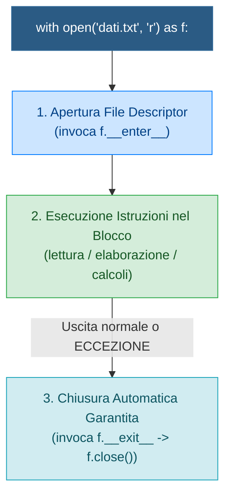

> [!SUMMARY] ⚡ In Sintesi (A Colpo d'Occhio)
> - **Regola d'Oro**: usa **SEMPRE** il Context Manager ==`with open(...) as f:`== (garantisce la chiusura immediata del file anche in caso di crash).
> - **Encoding Esplicito**: specifica sempre ==`encoding="utf-8"`== per evitare bug di caratteri accentati (soprattutto su sistemi Windows).
> - **Modalità Principali**: `'r'` (lettura), `'w'` (scrittura distruttiva da zero), `'a'` (append in coda), `'b'` (binario per immagini/PDF).
> - **Lettura ad Alta Efficienza**: per file di grandi dimensioni usa ==`for riga in f:`== (legge riga per riga senza saturare la RAM).
> - **Gestione Eccezioni**: blocco ==`try - except FileNotFoundError - finally`==.
> - **Formati Strutturati Standard**: moduli integrati ==`json`== (`json.dump` / `json.load`) e ==`csv`== (`csv.DictReader`).

---

## 1. Il Context Manager: `with open(...)`

In C++ per gestire i file si istanziano oggetti `ifstream` o `ofstream` e si invoca `.close()`. Se si verifica un'eccezione prima del `close()`, il file rischia di rimanere bloccato dal sistema operativo o corrotto.

In Python, la sintassi idiomatica impone l'uso del **Context Manager** tramite la parola chiave **`with`**:



> [!SUCCESS] 🎯 Regola d'Oro
> Non chiamare mai `open()` in modo "nudo" (`f = open(...)`). L'istruzione `with open(...) as f:` garantisce che il file venga **sempre chiuso**, anche in caso di errori imprevisti a runtime.

---

## 2. Modalità di Apertura ed Encoding

La funzione `open()` accetta il percorso del file, la modalità e l'encoding:
$$\mathbf{open}(\text{percorso}, \text{mode}='r', \text{encoding}='utf-8')$$

| Modalità | Nome | Comportamento se il file ESISTE | Comportamento se NON esiste |
| :--- | :--- | :--- | :--- |
| **`'r'`** | Read (Default) | Apre il cursore all'inizio per la lettura | **Solleva `FileNotFoundError`** |
| **`'w'`** | Write | **Sovrascrive e azzera il contenuto!** | Crea un nuovo file vuoto |
| **`'a'`** | Append | Sposta il cursore alla fine (aggiunge in coda) | Crea un nuovo file vuoto |
| **`'r+'`** | Read + Write | Consente sia lettura che scrittura in-place | **Solleva `FileNotFoundError`** |
| **`'b'`** | Binary | Modalità binaria (es. `'rb'`, `'wb'` per immagini, zip) | Dipende dalla lettera associata |

> [!WARNING] ⚠️ La Trappola dell'Encoding su Windows
> Se ometti `encoding="utf-8"`, Windows utilizzerà la codifica legacy di sistema (spesso `cp1252`), causando crash con errori del tipo `UnicodeDecodeError` quando il file contiene lettere accentate (`è`, `à`, `ù`) o emoji!

---

## 3. Tecniche di Lettura del Testo

Python offre diversi modi per consumare il contenuto di un file di testo:

### 1. Iterazione Diretta Riga per Riga (Metodo Consigliato)
È il metodo più efficiente in assoluto perché legge le righe una alla volta come un flusso (*stream*), consumando pochissima memoria anche con file da diversi gigabyte:
```python
with open("studenti.txt", "r", encoding="utf-8") as f:
    for riga in f:
        # riga.strip() rimuove spazi bianchi e il terminatore \n
        print(f"Letta: {riga.strip()}")
```

### 2. Lettura Completa con `.read()` o `.readlines()`
```python
with open("config.txt", "r", encoding="utf-8") as f:
    # f.read() carica l'INTERO contenuto in un'unica stringa
    tutto_il_testo = f.read()

with open("lista.txt", "r", encoding="utf-8") as f:
    # f.readlines() carica tutte le righe in una lista di stringhe
    righe = f.readlines()
```

---

## 4. Tecniche di Scrittura

Per scrivere usiamo `.write()` o `.writelines()`:

```python
nomi = ["Mario Rossi", "Giulia Bianchi", "Luca Verdi"]

with open("elenco.txt", "w", encoding="utf-8") as f:
    for nome in nomi:
        # Nota: write() NON aggiunge il carattere a-capo in automatico!
        f.write(f"{nome}\n")
```

---

## 5. Gestione Robusta degli Errori: `try - except - finally`

La gestione dei file è intrinsecamente soggetta a errori di sistema (file mancante, permessi negati, disco pieno). Un programma professionale deve gestire queste situazioni con eleganza:

```python
try:
    with open("dati_segreti.txt", "r", encoding="utf-8") as f:
        contenuto = f.read()
except FileNotFoundError:
    print("⚠️ Errore: Il file richiesto non esiste sul percorso specificato.")
except PermissionError:
    print("🚫 Errore: Permessi insufficienti per leggere il file!")
except Exception as e:
    print(f"❌ Errore imprevisto durante l'I/O: {e}")
else:
    print("✅ File letto con successo!")
finally:
    print("Pulizia e termine della procedura.")
```

---

## 6. Formati Strutturati: JSON e CSV

Nei progetti reali i dati non sono quasi mai solo semplice testo grezzo, ma record formattati. La libreria standard di Python include moduli integrati per gestirli senza installare librerie esterne.

### A. Il Modulo `json` (Dati Strutturati e API Web)
```python
import json

dati_utente = {
    "username": "casetti_a",
    "punteggio": 1500,
    "preferenze": {"tema": "dark", "notifiche": True}
}

# 1. Scrittura su file JSON: json.dump()
with open("utente.json", "w", encoding="utf-8") as f:
    json.dump(dati_utente, f, indent=4)

# 2. Lettura da file JSON: json.load()
with open("utente.json", "r", encoding="utf-8") as f:
    dati_letti = json.load(f)
    print(dati_letti["preferenze"]["tema"])  # dark
```

### B. Il Modulo `csv` (Tabelle e Fogli di Calcolo)
```python
import csv

# Scrittura di un file CSV con DictWriter
studenti = [
    {"Matricola": "A101", "Nome": "Sara", "Voto": 28},
    {"Matricola": "A102", "Nome": "Davide", "Voto": 30}
]

with open("registro.csv", "w", newline="", encoding="utf-8") as f:
    campi = ["Matricola", "Nome", "Voto"]
    writer = csv.DictWriter(f, fieldnames=campi)
    writer.writeheader()
    writer.writerows(studenti)

# Lettura con DictReader
with open("registro.csv", "r", encoding="utf-8") as f:
    reader = csv.DictReader(f)
    for riga in reader:
        print(f"Studente: {riga['Nome']} (Voto: {riga['Voto']})")
```

---

## 7. Domande d'Esame e Concetti Chiave

> [!QUESTION] ❓ Domande di Verifica
> 1. *Perché è fondamentale usare `with open(...)` rispetto a `open()` semplice?*  
>    **Risposta**: Perché il costrutto `with` sfrutta il protocollo del Context Manager, assicurando che la chiamata di chiusura `.close()` sul file avvenga in modo garantito al termine del blocco, perfino se si verifica un crash o viene sollevata un'eccezione.
> 2. *Qual è il vantaggio dell'iterazione diretta `for riga in f:` rispetto a `f.readlines()`?*  
>    **Risposta**: `f.readlines()` carica tutte le righe del file simultaneamente nella RAM sotto forma di lista, rischiando di saturare la memoria in caso di file molto grandi. L'iterazione `for riga in f:` carica una sola riga alla volta sfruttando un generatore a flusso.
> 3. *Cosa fa la modalità `'w'` se il file esiste già?*  
>    **Risposta**: Troncamento immediato: il contenuto preesistente del file viene completamente cancellato e azzerato senza richiedere conferme.

---

## 8. Programma Esecutivo Completo

> [!EXAMPLE]- 🧪 Programma Completo: Gestore di Log e Salvataggio JSON
> ```python
> import json
> import os
> from datetime import datetime
> 
> FILE_CONFIG = "sessione.json"
> FILE_LOG = "eventi.log"
> 
> def registra_evento(messaggio: str):
>     timestamp = datetime.now().strftime("%Y-%m-%d %H:%M:%S")
>     with open(FILE_LOG, "a", encoding="utf-8") as f:
>         f.write(f"[{timestamp}] {messaggio}\n")
> 
> def salva_stato(dati: dict):
>     with open(FILE_CONFIG, "w", encoding="utf-8") as f:
>         json.dump(dati, f, indent=4, ensure_ascii=False)
>     registra_evento("Salvataggio stato configurazione completato.")
> 
> def carica_stato() -> dict:
>     if not os.path.exists(FILE_CONFIG):
>         registra_evento("File configurazione non trovato. Creato stato iniziale.")
>         return {"accessi": 0, "ultimo_utente": "Ospite"}
>         
>     try:
>         with open(FILE_CONFIG, "r", encoding="utf-8") as f:
>             stato = json.load(f)
>             registra_evento("Stato configurazione caricato con successo.")
>             return stato
>     except Exception as e:
>         registra_evento(f"Errore lettura JSON: {e}")
>         return {"accessi": 0, "ultimo_utente": "Ripristino Fallback"}
> 
> if __name__ == "__main__":
>     stato = carica_stato()
>     stato["accessi"] += 1
>     stato["ultimo_utente"] = "Alessandro Caseti"
>     
>     salva_stato(stato)
>     print(f"Operazione completata. Accessi totali: {stato['accessi']}")
> ```
