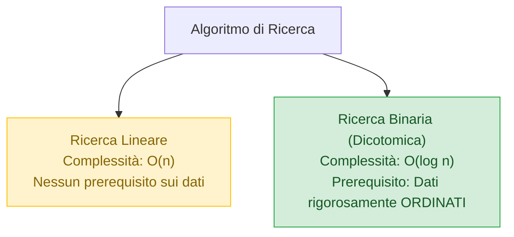
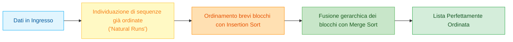

> [!SUMMARY] ⚡ In Sintesi (A Colpo d'Occhio)
> - **Ricerca**:
>   - **Lineare**: $O(n)$, funziona su qualsiasi lista; implementata nativamente con ==`elem in lista`==.
>   - **Binaria (Dicotomica)**: $O(\log n)$, richiede lista **pre-ordinata**; disponibile nativamente con ==`import bisect`==.
> - **Didattica dell'Ordinamento**: Bubble Sort e Selection Sort implementabili in poche righe grazie allo scambio pythonico ==`a, b = b, a`==.
> - **Timsort (Lo Standard di Sistema)**: algoritmo ibrido (Merge Sort + Insertion Sort) stabile con complessità da ==$O(n)$== nel caso migliore a ==$O(n \log n)$== nel caso peggiore.
> - **`sort()` vs `sorted()`**:
>   - ==`lista.sort()`==: ordina **sul posto** (*in-place*), muta l'originale e restituisce `None`.
>   - ==`sorted(iterabile)`==: crea e restituisce una **nuova lista ordinata**, lasciando l'originale intatto.
> - **Ordinamento Avanzato**: uso del parametro ==`key=lambda x: ...`== per ordinare collezioni complesse per campi specifici.

---

## 1. Algoritmi di Ricerca: Lineare vs Binaria



### A. Ricerca Lineare (Sequenziale)
Scorre gli elementi uno dopo l'altro dall'inizio alla fine.  
In Python possiamo scriverla manualmente oppure affidarci all'operatore nativo `in`:

```python
# Modo manuale:
def ricerca_lineare(lista: list, bersaglio) -> int:
    for i, valore in enumerate(lista):
        if valore == bersaglio:
            return i  # Trovato: restituisce l'indice
    return -1         # Non trovato

# Modo nativo pythonico:
numeri = [40, 10, 85, 90, 12]
if 85 in numeri:
    indice = numeri.index(85)
    print(f"85 trovato all'indice {indice}")
```

### B. Ricerca Binaria (Dicotomica)
Funziona solo su liste già ordinate: confronta l'elemento centrale e dimezza lo spazio di ricerca a ogni passaggio, riducendo le operazioni a $O(\log_2 n)$.

```python
def ricerca_binaria(lista: list, bersaglio: int) -> int:
    basso = 0
    alto = len(lista) - 1

    while basso <= alto:
        medio = (basso + alto) // 2
        if lista[medio] == bersaglio:
            return medio
        elif lista[medio] < bersaglio:
            basso = medio + 1
        else:
            alto = medio - 1
            
    return -1
```

> [!TIP] 💡 Il Modulo Nativo `bisect`
> Python include il modulo `bisect` compilato in C per la ricerca e l'inserimento ordinato istantaneo:
> ```python
> import bisect
> lista_ordinata = [10, 20, 30, 40, 50]
> pos = bisect.bisect_left(lista_ordinata, 30)  # Restituisce 2
> ```

---

## 2. Gli Algoritmi Didattici di Ordinamento

Anche se nella pratica si usano sempre gli strumenti nativi, l'implementazione degli algoritmi classici è fondamentale per comprendere la complessità computazionale:

### A. Bubble Sort Ottimizzato
Sfrutta la caratteristica eleganza di Python: lo **scambio multiplo di variabili in una riga** (`a, b = b, a`) che non richiede variabili ausiliarie `temp` come in C++:

```python
def bubble_sort(arr: list) -> list:
    n = len(arr)
    for i in range(n):
        scambiato = False
        for j in range(0, n - i - 1):
            if arr[j] > arr[j + 1]:
                # Scambio pythonico istantaneo
                arr[j], arr[j + 1] = arr[j + 1], arr[j]
                scambiato = True
        if not scambiato:
            break  # Ottimizzazione: lista già ordinata!
    return arr
```

### B. Selection Sort (Ordinamento per Selezione)
Cerca progressivamente il valore minimo e lo scambia con l'elemento di testa:

```python
def selection_sort(arr: list) -> list:
    n = len(arr)
    for i in range(n):
        min_idx = i
        for j in range(i + 1, n):
            if arr[j] < arr[min_idx]:
                min_idx = j
        arr[i], arr[min_idx] = arr[min_idx], arr[i]
    return arr
```

---

## 3. L'Algoritmo di Sistema: Timsort

Quando chiami un ordinamento in Python, non stai eseguendo un semplice QuickSort o MergeSort, ma **Timsort**, un algoritmo ibrido ad altissima efficienza ideato nel 2002 da **Tim Peters**.



### Perché Timsort è Rivoluzionario?
1. **Complessità nel Caso Migliore**: $O(n)$ quando i dati sono già (o quasi) ordinati, invece di $O(n \log n)$.
2. **Caso Peggiore e Medio**: $O(n \log n)$ garantito matematicamente (nessun caso degenere $O(n^2)$ come il QuickSort).
3. **Stabilità**: è un algoritmo **stabile** (preserva l'ordine relativo originale degli elementi aventi chiavi identiche).

| Algoritmo | Caso Migliore | Caso Medio | Caso Peggiore | Memoria Extra | Stabile? |
| :--- | :--- | :--- | :--- | :--- | :--- |
| **Bubble Sort** | $O(n)$ | $O(n^2)$ | $O(n^2)$ | $O(1)$ | Sì |
| **Selection Sort**| $O(n^2)$ | $O(n^2)$ | $O(n^2)$ | $O(1)$ | No |
| **Quick Sort** | $O(n \log n)$ | $O(n \log n)$ | $O(n^2)$ | $O(\log n)$ | No |
| **Timsort (Python)**| **$O(n)$** | **$O(n \log n)$** | **$O(n \log n)$** | $O(n)$ | **Sì** |

---

## 4. `sort()` vs `sorted()`: Non Confonderli!

```python
numeri = [5, 2, 9, 1, 7]

# 1. METODO .sort() (In-place: muta l'oggetto originale)
risultato = numeri.sort()
print(numeri)     # [1, 2, 5, 7, 9] (La lista originale è cambiata!)
print(risultato)  # None (NON restituisce una lista, restituisce None!)

# 2. FUNZIONE sorted() (Out-of-place: genera una NUOVA lista)
originale = [5, 2, 9, 1, 7]
nuova_ordinata = sorted(originale)
print(originale)       # [5, 2, 9, 1, 7] (L'originale è INVARIATO!)
print(nuova_ordinata)  # [1, 2, 5, 7, 9]
```

> [!DANGER] 🚫 Errore da Principiante
> Scrivere `mia_lista = mia_lista.sort()` **cancella la tua lista** sostituendola con `None`! Usa `.sort()` solo come istruzione autonoma.

---

## 5. Ordinamento Personalizzato con `key` e Funzioni Lambda

Il parametro `key` accetta una funzione (spesso una lambda) che calcola il criterio di comparazione per ogni elemento:

```python
studenti = [
    {"nome": "Luca", "eta": 19, "media": 7.5},
    {"nome": "Anna", "eta": 18, "media": 9.2},
    {"nome": "Marco", "eta": 21, "media": 6.8}
]

# 1. Ordina per media decrescente (dal più bravo al meno bravo)
classifica = sorted(studenti, key=lambda s: s["media"], reverse=True)
for pos, s in enumerate(classifica, start=1):
    print(f"{pos}. {s['nome']} - Media: {s['media']}")

# 2. Ordinamento multi-livello (prima per età crescente, poi per media decrescente):
# Sfruttiamo una tupla come chiave di ordinamento!
multi_ordinati = sorted(studenti, key=lambda s: (s["eta"], -s["media"]))
```

---

## 6. Domande d'Esame e Concetti Chiave

> [!QUESTION] ❓ Domande di Verifica
> 1. *Qual è la differenza fondamentale tra il metodo `.sort()` e la funzione `sorted()`?*  
>    **Risposta**: `.sort()` modifica direttamente sul posto la lista originale restituendo `None`. La funzione `sorted()` non altera la collezione di partenza e restituisce una nuova lista con gli elementi ordinati.
> 2. *Qual è il prerequisito indispensabile per poter eseguire una Ricerca Binaria?*  
>    **Risposta**: La sequenza di elementi deve essere già rigorosamente ordinata prima di avviare l'algoritmo.
> 3. *Cosa significa che l'algoritmo Timsort è "stabile"?*  
>    **Risposta**: Significa che se due elementi hanno lo stesso valore di chiave, il loro ordine relativo iniziale nella sequenza originale viene preservato esattamente anche dopo l'ordinamento.

---

## 7. Programma Esecutivo Completo

> [!EXAMPLE]- 🧪 Programma Completo: Benchmark di Confronto Prestazionale tra Algoritmi
> ```python
> import random
> import time
> 
> def benchmark_ordinamento():
>     # Generiamo una lista di 2000 numeri casuali
>     dimensione = 2000
>     dati_casuali = [random.randint(1, 10000) for _ in range(dimensione)]
>     
>     print(f"=== BENCHMARK ORDINAMENTO SU {dimensione} ELEMENTI ===")
>     
>     # 1. Test Bubble Sort
>     copia_bubble = dati_casuali.copy()
>     t0 = time.perf_counter()
>     # Implementazione Bubble Sort
>     n = len(copia_bubble)
>     for i in range(n):
>         scambio = False
>         for j in range(0, n - i - 1):
>             if copia_bubble[j] > copia_bubble[j + 1]:
>                 copia_bubble[j], copia_bubble[j + 1] = copia_bubble[j + 1], copia_bubble[j]
>                 scambio = True
>         if not scambio:
>             break
>     t_bubble = time.perf_counter() - t0
>     print(f"1. Bubble Sort (O(n²)) : {t_bubble:.4f} secondi")
>     
>     # 2. Test Timsort nativo di Python (C-speed)
>     copia_timsort = dati_casuali.copy()
>     t0 = time.perf_counter()
>     copia_timsort.sort()
>     t_timsort = time.perf_counter() - t0
>     print(f"2. Python Timsort (O(n log n)): {t_timsort:.6f} secondi")
>     
>     fattore = t_bubble / t_timsort if t_timsort > 0 else 0
>     print("-" * 45)
>     print(f"🚀 Timsort è stato circa {fattore:.1f}x volte più veloce del Bubble Sort!")
> 
> if __name__ == "__main__":
>     benchmark_ordinamento()
> ```
