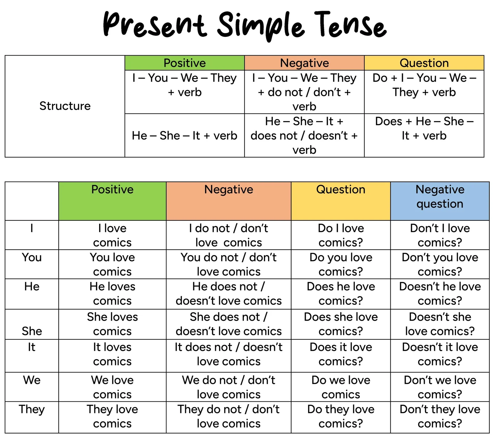

# **Present Tenses**
## 1. Present Simple
Used to talk about habits, routines, general truths and permanent states.
#### Requirements:
- Does not require a time expression
- Requires an -s/-es ending on the verb for the 3rd person singular

#### Structure:

#### Usage:
- Habit/routine: I **brush** my teeth every morning.
- General truth: Water **boils** at 100°C.
- Permanent state: She **owns** a small bookshop.
- Fixed timetable: The film **starts** at 8 pm.
- Instructions: First, you **mix** the flour and the sugar.

> [!NOTE]- TRADUZIONE
> Si usa per parlare di abitudini, routine, verità generali e stati permanenti.
> **Requisiti:**
> - Non richiede un'espressione di tempo
> - Richiede la desinenza -s/-es sul verbo alla terza persona singolare
>
> **Struttura:**
> `Soggetto + verbo (forma base) / verbo + s,es (terza persona singolare)`
> Negativa: `Soggetto + don't/doesn't + verbo (forma base)`
> Interrogativa: `Do/Does + soggetto + verbo (forma base)?`
>
> **Uso:**
> - Abitudine/routine: I **brush** my teeth every morning. (Mi lavo i denti ogni mattina.)
> - Verità generale: Water **boils** at 100°C. (L'acqua bolle a 100°C.)
> - Stato permanente: She **owns** a small bookshop. (Lei possiede una piccola libreria.)
> - Orario fisso: The film **starts** at 8 pm. (Il film inizia alle 20.)
> - Istruzioni: First, you **mix** the flour and the sugar. (Prima, mescoli la farina e lo zucchero.)

## 2. Present Continuous
Used to talk about actions that are happening now or around now.
#### Requirements:
- Does not require a time expression
- Not normally used with stative verbs (know, believe, want, own, love, etc.), unless they take on a dynamic meaning

#### Structure:

#### Usage:
- Action in progress now: She **is cooking** dinner right now.
- Temporary situation: I **am staying** at my cousin's house this week.
- Changing trend: The climate **is changing** rapidly.
- Complaint with "always": He **is always leaving** his shoes in the hallway.

> [!NOTE]- TRADUZIONE
> Si usa per parlare di azioni che stanno accadendo ora o in questo periodo.
> **Requisiti:**
> - Non richiede un'espressione di tempo
> - Non si usa normalmente con i verbi di stato (know, believe, want, own, love, ecc.), a meno che non assumano un significato dinamico
>
> **Struttura:**
> `Soggetto + am/is/are + verbo-ing`
> Negativa: `Soggetto + am/is/are + not + verbo-ing`
> Interrogativa: `Am/Is/Are + soggetto + verbo-ing?`
>
> **Uso:**
> - Azione in corso ora: She **is cooking** dinner right now. (Sta cucinando la cena proprio ora.)
> - Situazione temporanea: I **am staying** at my cousin's house this week. (Sto stando a casa di mio cugino questa settimana.)
> - Tendenza in cambiamento: The climate **is changing** rapidly. (Il clima sta cambiando rapidamente.)
> - Lamentela con "always": He **is always leaving** his shoes in the hallway. (Lascia sempre le scarpe nell'ingresso.)

## 3. Present Perfect
Used to connect the past to the present, without saying exactly when something happened.
#### Requirements:
- Does not require/want a specific time expression (no yesterday, in 2020, last week)
- Often used with ever, never, just, yet, already, for, since

#### Structure:
![[Pasted image 20260712220155.jpg|697]]

#### Usage:
- No specific time expression: I **have visited** Paris.
- Life experience: She **has never eaten** sushi.
- Action started in the past, still relevant: He **has lived** in Turin for ten years.
- Action just finished: We **have just finished** the report.
- Action not yet completed: They **haven't arrived** yet.
- Result visible now: I **have lost** my keys.

> [!NOTE]- TRADUZIONE
> Si usa per collegare il passato al presente, senza dire esattamente quando è successo qualcosa.
> **Requisiti:**
> - Non richiede/non vuole un'espressione di tempo specifica (niente yesterday, in 2020, last week)
> - Si usa spesso con ever, never, just, yet, already, for, since
>
> **Struttura:**
> `Soggetto + have/has + participio passato`
> Negativa: `Soggetto + have/has + not + participio passato`
> Interrogativa: `Have/Has + soggetto + participio passato?`
>
> **Uso:**
> - Nessuna espressione di tempo specifica: I **have visited** Paris. (Ho visitato Parigi.)
> - Esperienza di vita: She **has never eaten** sushi. (Non ha mai mangiato sushi.)
> - Azione iniziata nel passato, ancora rilevante: He **has lived** in Turin for ten years. (Vive a Torino da dieci anni.)
> - Azione appena finita: We **have just finished** the report. (Abbiamo appena finito il rapporto.)
> - Azione non ancora completata: They **haven't arrived** yet. (Non sono ancora arrivati.)
> - Risultato visibile ora: I **have lost** my keys. (Ho perso le chiavi.)

## 4. Present Perfect Continuous
Used to emphasise the duration of an action that started in the past and is connected to the present.
#### Requirements:
- Requires for/since (or another duration expression) to specify the length of the action
- Not normally used with stative verbs

#### Structure:
![[Pasted image 20260712220218.jpg|697]]

#### Usage:
- Action started in the past, continued to now: I **have been studying** English since 2020.
- Action just finished, effects visible: She is tired because she **has been running**.
- Emphasis on duration: They **have been waiting** for two hours.

> [!NOTE]- TRADUZIONE
> Si usa per dare enfasi alla durata di un'azione iniziata nel passato e collegata al presente.
> **Requisiti:**
> - Richiede for/since (o un'altra espressione di durata) per specificare quanto è durata l'azione
> - Non si usa normalmente con i verbi di stato
>
> **Struttura:**
> `Soggetto + have/has been + verbo-ing (+ for/since + tempo)`
> Negativa: `Soggetto + have/has + not + been + verbo-ing`
> Interrogativa: `Have/Has + soggetto + been + verbo-ing?`
>
> **Uso:**
> - Azione iniziata nel passato, continuata fino ad ora: I **have been studying** English since 2020. (Studio inglese dal 2020.)
> - Azione appena finita, effetti visibili: She is tired because she **has been running**. (È stanca perché ha corso.)
> - Enfasi sulla durata: They **have been waiting** for two hours. (Aspettano da due ore.)

---
# **Past Tenses**
## 5. Past Simple
Used to talk about a completed action in the past.
#### Requirements:
- Requires a time expression (yesterday, last week, in 2010, etc.)

#### Structure:

#### Usage:
- With a time expression: I **visited** Rome last year.
- Concluded past action: She **closed** the door and **left**.
- Sequence of concluded actions: He **woke up**, **had** breakfast and **went** to work.
- Dead people/historical facts: Leonardo da Vinci **painted** the Mona Lisa.

> [!NOTE]- TRADUZIONE
> Si usa per parlare di un'azione conclusa nel passato.
> **Requisiti:**
> - Richiede un'espressione di tempo (yesterday, last week, in 2010, ecc.)
>
> **Struttura:**
> `Soggetto + verbo (forma passata) + espressione di tempo`
> Negativa: `Soggetto + did + not + verbo (forma base)`
> Interrogativa: `Did + soggetto + verbo (forma base)?`
>
> **Uso:**
> - Con un'espressione di tempo: I **visited** Rome last year. (Ho visitato Roma l'anno scorso.)
> - Azione passata conclusa: She **closed** the door and **left**. (Ha chiuso la porta ed è uscita.)
> - Sequenza di azioni concluse: He **woke up**, **had** breakfast and **went** to work. (Si è svegliato, ha fatto colazione ed è andato al lavoro.)
> - Persone morte/fatti storici: Leonardo da Vinci **painted** the Mona Lisa. (Leonardo da Vinci dipinse la Gioconda.)

## 6. Past Continuous
Used to describe an action that was in progress at a specific moment in the past.
#### Requirements:
- Requires a specific past moment or another action to relate to (often introduced by when/while)

#### Structure:
![[Pasted image 20260713134922.png|697]]

#### Usage:
- Action in progress at a specific past moment: At 8 pm I **was having** dinner.
- Background/description: The sun **was shining** and the birds **were singing**.
- Two simultaneous actions (while): While I **was cooking**, she **was setting** the table.
- Interrupted action: I **was watching** TV when the phone **rang**.

> [!NOTE]- TRADUZIONE
> Si usa per descrivere un'azione che era in corso in un momento preciso del passato.
> **Requisiti:**
> - Richiede un momento preciso del passato o un'altra azione a cui riferirsi (spesso introdotta da when/while)
>
> **Struttura:**
> `Soggetto + was/were + verbo-ing`
> Negativa: `Soggetto + was/were + not + verbo-ing`
> Interrogativa: `Was/Were + soggetto + verbo-ing?`
>
> **Uso:**
> - Azione in corso in un momento preciso del passato: At 8 pm I **was having** dinner. (Alle 20 stavo cenando.)
> - Sfondo/descrizione: The sun **was shining** and the birds **were singing**. (Il sole splendeva e gli uccelli cantavano.)
> - Due azioni contemporanee (while): While I **was cooking**, she **was setting** the table. (Mentre cucinavo, lei apparecchiava la tavola.)
> - Azione interrotta: I **was watching** TV when the phone **rang**. (Stavo guardando la TV quando il telefono ha squillato.)

## 7. Past Perfect
Used to show that an action happened and finished before another action in the past.
#### Requirements:
- Requires a reference to another, more recent past action (often with before/after)
- Cannot be used alone to describe a single past action

#### Structure:
![[Pasted image 20260713134939.jpg|697]]

#### Usage:
- Action concluded before another past action: She **had left** before I arrived.
- With "after": After they **had finished** dinner, they went for a walk.
- Sequence between two past facts: I **had never seen** snow before I moved to Turin.

> [!NOTE]- TRADUZIONE
> Si usa per mostrare che un'azione è avvenuta e si è conclusa prima di un'altra azione nel passato.
> **Requisiti:**
> - Richiede un riferimento a un'altra azione passata più recente (spesso con before/after)
> - Non può essere usato da solo per descrivere una singola azione passata
>
> **Struttura:**
> `Soggetto + had + verbo (participio passato) + before + soggetto + verbo (passato)`
> `After + soggetto + had + verbo (participio passato), soggetto + verbo (passato)`
> Negativa: `Soggetto + had + not + participio passato`
> Interrogativa: `Had + soggetto + participio passato?`
>
> **Uso:**
> - Azione conclusa prima di un'altra azione passata: She **had left** before I arrived. (Era già andata via prima che io arrivassi.)
> - Con "after": After they **had finished** dinner, they went for a walk. (Dopo che ebbero finito di cenare, andarono a fare una passeggiata.)
> - Sequenza tra due fatti passati: I **had never seen** snow before I moved to Turin. (Non avevo mai visto la neve prima di trasferirmi a Torino.)

## 8. Past Perfect Continuous
Used to emphasise the duration of an action that happened before another past action.
#### Requirements:
- Requires for + duration to emphasise how long the action lasted
- Requires a reference to another past action

#### Structure:
![[Pasted image 20260713134954.jpg|697]]

#### Usage:
- Duration of an action before another past action: I **had been working** for five hours before I **took** a break.
- Cause of a past situation: She was tired because she **had been studying** all night.

> [!NOTE]- TRADUZIONE
> Si usa per dare enfasi alla durata di un'azione avvenuta prima di un'altra azione passata.
> **Requisiti:**
> - Richiede for + durata per enfatizzare quanto è durata l'azione
> - Richiede un riferimento a un'altra azione passata
>
> **Struttura:**
> `Soggetto + had been + verbo-ing + for + tempo + before...`
> Negativa: `Soggetto + had + not + been + verbo-ing`
> Interrogativa: `Had + soggetto + been + verbo-ing?`
>
> **Uso:**
> - Durata di un'azione prima di un'altra azione passata: I **had been working** for five hours before I **took** a break. (Lavoravo da cinque ore prima di fare una pausa.)
> - Causa di una situazione passata: She was tired because she **had been studying** all night. (Era stanca perché aveva studiato tutta la notte.)

---
# **Future Tenses**
## 9. Future Simple
The Future Simple category includes several ways to express future actions: WILL, Going to, Present Simple, Present Continuous, and Shall.

> [!NOTE]- TRADUZIONE
> La categoria Future Simple comprende diversi modi per esprimere azioni future: WILL, Going to, Present Simple, Present Continuous e Shall.

### WILL
Used for decisions, promises and predictions about the future that we are not fully sure about.
#### Requirements:
- Does not require a plan made in advance (used for decisions made on the spot)

#### Structure:

#### Usage:
- Spontaneous decision/offer: The phone is ringing — I **will answer** it.
- Promise: I **will call** you tomorrow, I promise.
- Uncertain prediction/personal opinion: I think it **will rain** tomorrow.
- Request: **Will** you help me with this bag?

> [!NOTE]- TRADUZIONE
> Si usa per decisioni, promesse e previsioni sul futuro di cui non siamo del tutto sicuri.
> **Requisiti:**
> - Non richiede un piano fatto in anticipo (si usa per decisioni prese lì per lì)
>
> **Struttura:**
> `Soggetto + will + verbo (forma base)`
> Negativa: `Soggetto + will + not (won't) + verbo (forma base)`
> Interrogativa: `Will + soggetto + verbo (forma base)?`
>
> **Uso:**
> - Decisione spontanea/offerta: The phone is ringing — I **will answer** it. (Il telefono sta squillando — rispondo io.)
> - Promessa: I **will call** you tomorrow, I promise. (Ti chiamerò domani, promesso.)
> - Previsione incerta/opinione personale: I think it **will rain** tomorrow. (Penso che domani pioverà.)
> - Richiesta: **Will** you help me with this bag? (Mi aiuti con questa borsa?)

### Going to
Used for plans already decided and predictions based on evidence we can see now.
#### Requirements:
- Requires the intention/plan to already exist before the moment of speaking
- Requires visible evidence for predictions

#### Structure:

#### Usage:
- Plan already decided: I **am going to study** medicine at university.
- Prediction based on evidence: Look at those clouds — it **is going to rain**.
- Stated intention: They **are going to renovate** the kitchen next month.

> [!NOTE]- TRADUZIONE
> Si usa per piani già decisi e previsioni basate su prove che possiamo vedere ora.
> **Requisiti:**
> - Richiede che l'intenzione/il piano esista già prima del momento in cui si parla
> - Richiede prove visibili per le previsioni
>
> **Struttura:**
> `Soggetto + be (am/is/are) + going to + verbo (forma base)`
> Negativa: `Soggetto + be + not + going to + verbo`
> Interrogativa: `Be + soggetto + going to + verbo?`
>
> **Uso:**
> - Piano già deciso: I **am going to study** medicine at university. (Studierò medicina all'università.)
> - Previsione basata su prove: Look at those clouds — it **is going to rain**. (Guarda quelle nuvole — pioverà.)
> - Intenzione dichiarata: They **are going to renovate** the kitchen next month. (Ristruttureranno la cucina il mese prossimo.)

### Present Simple (future use)
Used for future events that follow a fixed timetable or a scheduled routine.
#### Requirements:
- Requires a fixed timetable or schedule, or a subordinate time clause (when, as soon as, after, before, until)
- Does not want "will" inside these subordinate time clauses

#### Structure:
`Subject + verb (base form / verb+s)`

#### Usage:
- Fixed timetable: The train **leaves** at 6:45 tomorrow morning.
- After "when": I will call you when I **arrive**.
- After "as soon as": She will let you know as soon as she **hears** anything.
- After "before/after/until": Wait here until I **come** back.

> [!NOTE]- TRADUZIONE
> Si usa per eventi futuri che seguono un orario fisso o una programmazione.
> **Requisiti:**
> - Richiede un orario fisso o una programmazione, oppure una proposizione temporale (when, as soon as, after, before, until)
> - Non vuole "will" all'interno di queste proposizioni temporali
>
> **Struttura:**
> `Soggetto + verbo (forma base / verbo+s)`
>
> **Uso:**
> - Orario fisso: The train **leaves** at 6:45 tomorrow morning. (Il treno parte alle 6:45 domani mattina.)
> - Dopo "when": I will call you when I **arrive**. (Ti chiamerò quando arriverò.)
> - Dopo "as soon as": She will let you know as soon as she **hears** anything. (Ti farà sapere non appena avrà notizie.)
> - Dopo "before/after/until": Wait here until I **come** back. (Aspetta qui finché non torno.)

### Present Continuous (future use)
Used for future plans already arranged with other people, for a specific time and place.
#### Requirements:
- Requires a specific arrangement (time and/or place) already made with someone else

#### Structure:
`Subject + am/is/are + verb-ing + (time/place expression)`

#### Usage:
- Plan already fixed with other people: I **am meeting** Sara at the cinema at 8 pm.
- Confirmed event: We **are flying** to Spain next Friday.

> [!NOTE]- TRADUZIONE
> Si usa per piani futuri già organizzati con altre persone, per un orario e/o un luogo specifici.
> **Requisiti:**
> - Richiede un accordo specifico (orario e/o luogo) già preso con qualcun altro
>
> **Struttura:**
> `Soggetto + am/is/are + verbo-ing + (espressione di tempo/luogo)`
>
> **Uso:**
> - Piano già fissato con altre persone: I **am meeting** Sara at the cinema at 8 pm. (Incontro Sara al cinema alle 20.)
> - Evento confermato: We **are flying** to Spain next Friday. (Voliamo in Spagna venerdì prossimo.)

### Shall
Used mainly with I/We for polite suggestions and offers.
#### Requirements:
- Used almost only with I/We
- Does not require a plan made in advance

#### Structure:
`Shall + I/we + verb (base form)?`

#### Usage:
- Polite proposal: **Shall** we go for a walk?
- Offer: **Shall** I open the window for you?
- Formal future (rare, BrE): I **shall** be there by noon.

> [!NOTE]- TRADUZIONE
> Si usa principalmente con "I" e "we" per proposte e offerte cortesi.
> **Requisiti:**
> - Si usa quasi solo con I/We
> - Non richiede un piano fatto in anticipo
>
> **Struttura:**
> `Shall + I/we + verbo (forma base)?`
>
> **Uso:**
> - Proposta cortese: **Shall** we go for a walk? (Andiamo a fare una passeggiata?)
> - Offerta: **Shall** I open the window for you? (Ti apro la finestra?)
> - Futuro formale (raro, inglese britannico): I **shall** be there by noon. (Sarò lì entro mezzogiorno.)

## 10. Future Continuous
Used for an action that will be in progress at a specific moment in the future.
#### Requirements:
- Requires a specific future moment to be in progress at

#### Structure:

#### Usage:
- Action in progress at a precise future moment: This time tomorrow, I **will be flying** to London.
- Routine/planned future action, stated without emphasis: I **will be seeing** him at the meeting anyway.
- Polite question about someone's plans: **Will** you **be using** the car this evening?

> [!NOTE]- TRADUZIONE
> Si usa per un'azione che sarà in corso in un momento preciso nel futuro.
> **Requisiti:**
> - Richiede un momento futuro specifico in cui l'azione sarà in corso
>
> **Struttura:**
> `Soggetto + will be + verbo-ing`
> Negativa: `Soggetto + will + not + be + verbo-ing`
> Interrogativa: `Will + soggetto + be + verbo-ing?`
>
> **Uso:**
> - Azione in corso in un momento futuro preciso: This time tomorrow, I **will be flying** to London. (A quest'ora domani, starò volando verso Londra.)
> - Azione futura di routine/programmata, detta senza enfasi: I **will be seeing** him at the meeting anyway. (Lo vedrò comunque alla riunione.)
> - Domanda cortese sui piani di qualcuno: **Will** you **be using** the car this evening? (Userai la macchina stasera?)

## 11. Future Perfect
Used for an action that will be completed by a certain point in the future.
#### Requirements:
- Requires a future deadline, usually introduced by "by" or "by the time"

#### Structure:

#### Usage:
- Action completed by a future point: By next year, I **will have finished** my degree.
- With "by the time": By the time you arrive, we **will have eaten** dinner.

> [!NOTE]- TRADUZIONE
> Si usa per un'azione che sarà completata entro un determinato momento nel futuro.
> **Requisiti:**
> - Richiede una scadenza futura, di solito introdotta da "by" o "by the time"
>
> **Struttura:**
> `Soggetto + will have + participio passato + by + tempo`
> Negativa: `Soggetto + will + not + have + participio passato`
> Interrogativa: `Will + soggetto + have + participio passato?`
>
> **Uso:**
> - Azione completata entro un momento futuro: By next year, I **will have finished** my degree. (Entro l'anno prossimo avrò finito la laurea.)
> - Con "by the time": By the time you arrive, we **will have eaten** dinner. (Quando arriverai, avremo già cenato.)

## 12. Future Perfect Continuous
Used to emphasise the duration of an action up to a specific point in the future.
#### Requirements:
- Requires for + duration and a future deadline (by + time)

#### Structure:

#### Usage:
- Duration of an action up to a future point: By December, I **will have been living** in Turin for five years.
- Emphasis on continuous duration up to the future: Next month, she **will have been working** here for a decade.

> [!NOTE]- TRADUZIONE
> Si usa per dare enfasi alla durata di un'azione fino a un momento preciso nel futuro.
> **Requisiti:**
> - Richiede for + durata e una scadenza futura (by + tempo)
>
> **Struttura:**
> `Soggetto + will have been + verbo-ing + for + tempo + by + tempo`
> Negativa: `Soggetto + will + not + have + been + verbo-ing`
> Interrogativa: `Will + soggetto + have + been + verbo-ing?`
>
> **Uso:**
> - Durata di un'azione fino a un punto futuro: By December, I **will have been living** in Turin for five years. (A dicembre vivrò a Torino da cinque anni.)
> - Enfasi sulla durata continuativa fino al futuro: Next month, she **will have been working** here for a decade. (Il mese prossimo lavorerà qui da un decennio.)

