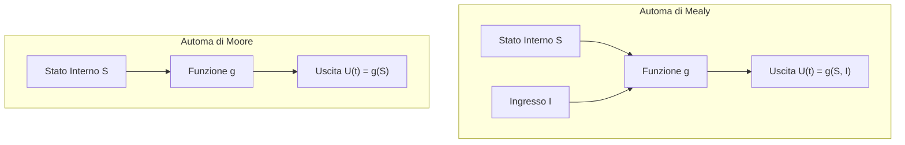
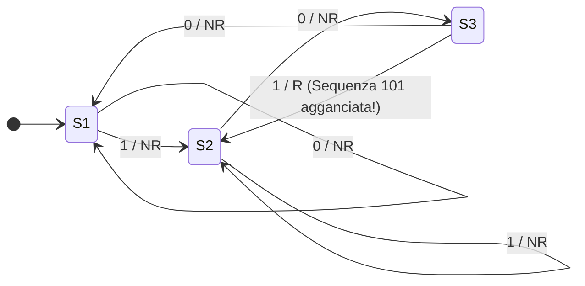

---
title: "Automa di Moore e Riconoscitore di Sequenze (101)"
description: "Progettazione dettagliata di un automa a stati finiti di Moore per il riconoscimento della sequenza binaria 101, confronto teorico e pratico con il modello di Mealy, analisi del ritardo temporale e tabella di traccia."
tags:
  - sistemi-e-reti
  - automi
  - moore
  - mealy
  - riconoscitore-sequenze
---
# Automa di Moore e Riconoscitore di Sequenze (101)
> [!NOTE] Obiettivo del Progetto
> Progettare un automa a stati finiti deterministico che riceve in ingresso uno stream continuo di bit binari ($0$ e $1$) e genera in uscita una segnalazione di **Riconoscimento ($R$)** ogni volta che rileva la sequenza target **`101`**, emettendo **Non Riconosciuto ($NR$)** in tutti gli altri istanti.

---
## 1. Il Modello di Moore vs il Modello di Mealy
La differenza cardine risiede nel punto in cui viene calcolata l'uscita:



| Caratteristica | Automa di Mealy | Automa di Moore |
| :--- | :--- | :--- |
| **Formula Uscita** | $U(t) = g(S(t), I(t))$ | $U(t) = g(S(t))$ |
| **Collocazione Uscita** | Sugli **archi** di transizione (`i / u`) | All'interno dei **nodi/stati** (`Stato / U`) |
| **Numero di Stati** | Spesso minore ($N$ stati) | Spesso maggiore ($N + 1$ stati) per isolare l'uscita |
| **Risposta Temporale** | Immediata all'arrivo dell'ingresso | Ritardata di un ciclo di clock (stabile e senza glitch) |

---
## 2. Riconoscimento della Sequenza `101`: Approccio di Mealy
Nel modello di Mealy, l'uscita di riconoscimento $R$ viene emessa direttamente sull'arco di transizione nel momento stesso in cui arriva l'ultimo bit `'1'`.

### Definizione degli Stati:
- **$s_1$ (Reset / Vuoto):** Nessun bit valido ricevuto. Attesa del primo `'1'`.
- **$s_2$ (Visto `1`):** Primo bit valido agganciato. Attesa dello `'0'`.
- **$s_3$ (Visto `10`):** Primi due bit validi agganciati. Attesa del terzo bit `'1'`.



---
## 3. Riconoscimento della Sequenza `101`: Approccio di Moore
Nell'automa di Moore, l'uscita **non può trovarsi sull'arco**. Per segnalare il riconoscimento $R$, l'automa deve necessariamente entrare in uno **stato dedicato** la cui etichetta interna produce $R$.

### Definizione degli Stati (Prefissi Minimi):
- **$S_0$ (Prefisso $\epsilon$ / Vuoto) $\rightarrow$ Uscita: $NR$:** Nessun carattere utile della sequenza presente.
- **$S_1$ (Prefisso `1`) $\rightarrow$ Uscita: $NR$:** Ricevuto `'1'`, in attesa di `'0'`.
- **$S_2$ (Prefisso `10`) $\rightarrow$ Uscita: $NR$:** Ricevuto `'10'`, in attesa di `'1'`.
- **$S_3$ (Prefisso `101` - Riconosciuto!) $\rightarrow$ Uscita: $R$:** Sequenza `101` completata con successo!

```mermaid
stateDiagram-v2
    direction LR

    [*] --> S0

    state S0 {
        description: "Uscita = NR"
    }
    state S1 {
        description: "Uscita = NR"
    }
    state S2 {
        description: "Uscita = NR"
    }
    state S3 {
        description: "Uscita = R (OK!)"
    }

    S0 --> S0 : 0
    S0 --> S1 : 1

    S1 --> S1 : 1
    S1 --> S2 : 0

    S2 --> S0 : 0
    S2 --> S3 : 1

    S3 --> S2 : 0 (il bit finale '1' + '0' forma '10')
    S3 --> S1 : 1 (il bit finale è '1')
```

### Logica delle Transizioni di Ritorno da $S_3$:
Quando l'automa si trova nello stato di successo $S_3$ (ha appena visto `101`):
1. **Se riceve `0`:** La sequenza diventa `...1 0 1 0`. Gli ultimi due bit sono `10`, che rappresentano esattamente il prefisso dello stato $S_2$! L'automa salta quindi direttamente a **$S_2$** senza perdere il progresso.
2. **Se riceve `1`:** La sequenza diventa `...1 0 1 1`. L'ultimo bit è `1`, quindi l'automa transita nello stato **$S_1$**.

---
## 4. Tabella di Transizione e Trasformazione (Moore)
| Stato Attuale | Uscita Emessa | Prossimo Stato (Ingresso = 0) | Prossimo Stato (Ingresso = 1) |
| :---: | :---: | :---: | :---: |
| **$S_0$** (Vuoto) | **$NR$** | $S_0$ | $S_1$ |
| **$S_1$** (Visto `1`) | **$NR$** | $S_2$ | $S_1$ |
| **$S_2$** (Visto `10`) | **$NR$** | $S_0$ | $S_3$ |
| **$S_3$** (Visto `101`) | **$R$** | $S_2$ | $S_1$ |

---
## 5. Esempio Pratico con Traccia Temporale
Supponiamo di inviare la stringa binaria di ingresso: `1  0  1  0  1  1  0`

| Passo Temporale $t$ | $t_0$ | $t_1$ | $t_2$ | $t_3$ | $t_4$ | $t_5$ | $t_6$ | $t_7$ |
| :--- | :---: | :---: | :---: | :---: | :---: | :---: | :---: | :---: |
| **Bit in Ingresso** | - | **1** | **0** | **1** | **0** | **1** | **1** | **0** |
| **Stato Raggiunto** | $S_0$ | $S_1$ | $S_2$ | **$S_3$** | $S_2$ | **$S_3$** | $S_1$ | $S_2$ |
| **Uscita Moore** | $NR$ | $NR$ | $NR$ | **$R$** | $NR$ | **$R$** | $NR$ | $NR$ |

> [!TIP] Osservazione Chiave
> Notiamo che la sequenza `1 0 1 0 1` contiene **due riconoscimenti** a $t_3$ e a $t_5$ perché il bit `'1'` centrale a $t_3$ funge contemporaneamente sia da chiusura del primo `101` sia da inizio del secondo `101` (**sovrapposizione / overlapping**).
