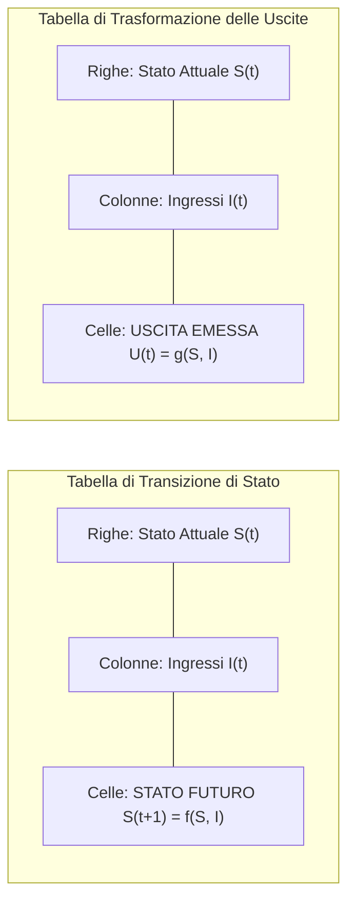
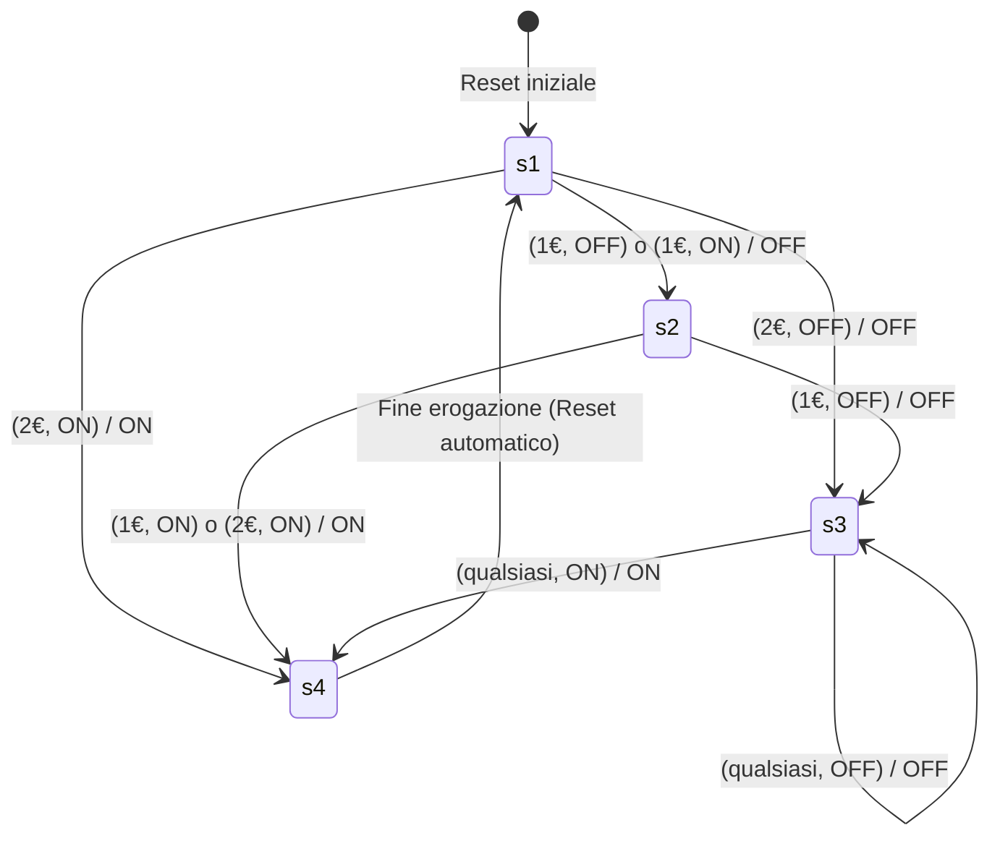

---
title: "Tabelle di Transizione e Trasformazione negli Automi"
description: "Rappresentazione tabellare degli automi a stati finiti, costruzione della tabella di transizione degli stati e della tabella di trasformazione delle uscite con caso di studio completo del distributore automatico."
tags:
  - sistemi-e-reti
  - automi
  - tabelle-di-transizione
  - sintesi-automi
---
# Tabelle di Transizione e Trasformazione negli Automi
> [!NOTE] Ruolo delle Tabelle nella Modellazione
> Mentre il **diagramma degli stati (grafo)** offre una visione intuitiva e visiva del funzionamento del sistema, le **tabelle di transizione e trasformazione** costituiscono la rappresentazione algebrico-matriciale rigorosa e completa. Sono il passaggio fondamentale indispensabile per procedere alla progettazione e alla sintesi circuitale hardware (con flip-flop e porte logiche) o all'implementazione software (con matrici o istruzioni `switch-case`).

---
## 1. Struttura Matriciale delle Tabelle
Un sistema a stati finiti descrive la propria evoluzione attraverso due matrici bidimensionali:

---
## 2. Caso di Studio: Distributore di Bibite (Costo 2 EUR)
Analizziamo il sistema reale tratto dagli appunti: un distributore automatico in cui una lattina costa **2 EUR**.

### 1. Variabili di Ingresso ($I$)
- $i_1 \in \{\text{1 EUR}, \text{2 EUR}\}$ (Valore della moneta introdotta)
- $i_2 \in \{\text{ON}, \text{OFF}\}$ (Pulsante di erogazione premuto o non premuto)

Combinazioni di ingresso simultanee:
$$(i_1, i_2) \in \{(1\text{ Euro}, \text{ON}), (2\text{ Euro}, \text{ON}), (1\text{ Euro}, \text{OFF}), (2\text{ Euro}, \text{OFF})\}$$

### 2. Variabili di Uscita ($U$)
- $u_1 \in \{\text{ON}, \text{OFF}\}$ (Attivazione del motorino di erogazione della lattina)

### 3. Insieme degli Stati ($S$)
- **$s_1$ (Attesa prima moneta):** Credito attuale = 0 EUR.
- **$s_2$ (Attesa seconda moneta):** Credito attuale = 1 EUR (manca 1 EUR al totale).
- **$s_3$ (Attesa click pulsante):** Credito attuale = 2 EUR raggiunto (credito sufficiente).
- **$s_4$ (Lattina in uscita):** Fase di rilascio prodotto e reset del sistema.

---
## 3. Tabella di Transizione (Stato Futuro $S(t+1)$)
Specifica in quale stato transita il sistema al ciclo successivo in base allo stato presente e all'azione dell'utente:

| Stato Corrente $S(t)$ | Ingresso: (1 EUR, ON) | Ingresso: (2 EUR, ON) | Ingresso: (1 EUR, OFF) | Ingresso: (2 EUR, OFF) |
| :---: | :---: | :---: | :---: | :---: |
| **$s_1$** (Credito 0 EUR) | $s_2$ (Attesa 2ª moneta) | $s_4$ (Lattina in uscita) | $s_2$ (Attesa 2ª moneta) | $s_3$ (Attesa click) |
| **$s_2$** (Credito 1 EUR) | $s_4$ (Lattina in uscita) | $s_4$ (Lattina in uscita) | $s_3$ (Attesa click) | $s_3$ (Attesa click) |
| **$s_3$** (Credito 2 EUR) | $s_4$ (Lattina in uscita) | $s_4$ (Lattina in uscita) | $s_3$ (Attesa click) | $s_3$ (Attesa click) |
| **$s_4$** (Erogazione) | $s_1$ (Reset a 0 EUR) | $s_1$ (Reset a 0 EUR) | $s_1$ (Reset a 0 EUR) | $s_1$ (Reset a 0 EUR) |

---
## 4. Tabella di Trasformazione (Uscita $U(t)$)
Specifica lo stato dell'uscita (erogazione lattina: $\text{ON}$ oppure $\text{OFF}$):

| Stato Corrente $S(t)$ | Ingresso: (1 EUR, ON) | Ingresso: (2 EUR, ON) | Ingresso: (1 EUR, OFF) | Ingresso: (2 EUR, OFF) |
| :---: | :---: | :---: | :---: | :---: |
| **$s_1$** (Credito 0 EUR) | OFF | ON | OFF | OFF |
| **$s_2$** (Credito 1 EUR) | ON | ON | OFF | OFF |
| **$s_3$** (Credito 2 EUR) | ON | ON | OFF | OFF |
| **$s_4$** (Erogazione) | ON | ON | OFF | OFF |

---
## 5. Corrispondenza con il Grafo degli Stati

> [!TIP] Come leggere la matrice
> Se il sistema si trova in **$s_2$** (l'utente ha già inserito 1 EUR) e introduce un altro **1 EUR** premendo contemporaneamente il pulsante di erogazione (**ON**):
> - Si incrocia la riga $s_2$ con la colonna (1 EUR, ON).
> - Nella Tabella di Transizione troviamo: **$s_4$** (il sistema passa allo stato di erogazione).
> - Nella Tabella di Trasformazione troviamo: **ON** (il motorino della lattina viene attivato immediatamente).

---
## 6. Dalla Tabella alla Sintesi Circuitale (Flip-Flop)
Per trasformare queste tabelle in un circuito elettronico reale:
1. **Codifica degli Stati in Binario:** Avendo 4 stati ($s_1, s_2, s_3, s_4$), servono:
   $$K = \lceil \log_2 4 \rceil = 2 \text{ bit di memoria (Flip-Flop } Q_1, Q_0)$$
   - $s_1 = 00$
   - $s_2 = 01$
   - $s_3 = 10$
   - $s_4 = 11$
2. **Mappe di Karnaugh:** Si compilano le mappe di Karnaugh per ricavare le funzioni minime booleane degli ingressi dei flip-flop (es. tipo D o tipo JK) e dell'uscita $u_1$.
3. **Realizzazione:** Si collegano i flip-flop e la rete combinatoria di porte logiche (AND, OR, NOT) ottenuta dalla semplificazione.
