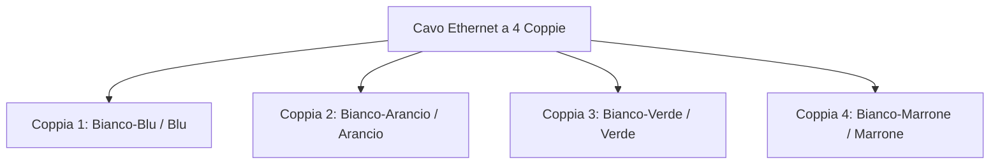
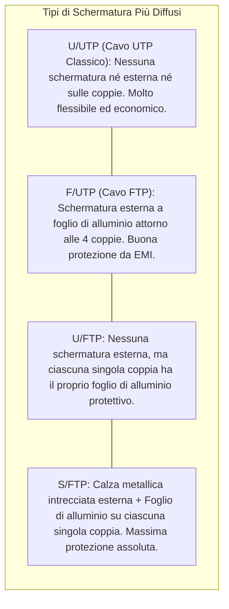

# Categorie di Cavi Ethernet e Mezzi Trasmissivi

> [!NOTE] Concetto Fondamentale
> Le **categorie di cavi** (definite dagli standard **ANSI/TIA-568** e **ISO/IEC 11801**) classificano i cavi a doppino ritorto (*Twisted Pair*) in base alle prestazioni elettriche, alla frequenza massima di lavoro (espressa in MHz) e alla velocità di trasmissione dati (Mbps o Gbps) garantita su una specifica distanza.

---

## 1. La Struttura del Cavo a Doppino Ritorto (*Twisted Pair*)

I moderni cavi di rete in rame per reti Ethernet contengono **4 coppie di conduttori in rame** (8 fili in totale), ciascuno rivestito da un isolante colorato secondo un codice standard.

> [!TIP] Perché i fili sono "ritorti" (intrecciati)?
> L'intreccio regolare delle coppie serve a **eliminare i disturbi elettromagnetici esterni** e il fenomeno della **diafonia** (*crosstalk*): i campi elettromagnetici generati dai due fili opposti della coppia si elidono reciprocamente grazie alla trasmissione differenziale del segnale. Più passi di torsione al centimetro ci sono, maggiore è l'immunità ai disturbi e la frequenza supportata.

---

## 2. Tabella Comparativa delle Categorie di Cavi in Rame

| Categoria | Frequenza Max (MHz) | Velocità Max Supportata | Distanza Massima | Utilizzo Tipico e Note |
| :--- | :---: | :---: | :---: | :--- |
| **Cat 3** | 16 MHz | 10 Mbps | 100 m | Reti storiche 10BASE-T e impianti telefonici analogici/VoIP base. |
| **Cat 5** | 100 MHz | 100 Mbps (Fast Ethernet) | 100 m | Standard ormai obsoleto, sostituito dalla Cat 5e. |
| **Cat 5e** *(enhanced)* | 100 MHz | **1 Gbps** (Gigabit Ethernet) | 100 m | Minimo indispensabile per reti domestiche economiche; sensibile alle interferenze a 1 Gbps. |
| **Cat 6** | **250 MHz** | **1 Gbps** (fino a 100 m) **10 Gbps** (fino a 55 m) | 100 m / 55 m | Standard diffuso negli uffici moderni. Dotato di un separatore centrale in plastica (*spline*) a croce tra le coppie. |
| **Cat 6A** *(augmented)*| **500 MHz** | **10 Gbps** (10GBASE-T) | **100 m** | **Standard di riferimento raccomandato per i nuovi impianti aziendali**. Garantisce 10 Gbps sull'intera tratta di 100 metri. |
| **Cat 7** | 600 MHz | 10 Gbps | 100 m | Richiede schermatura individuale su ogni coppia (S/FTP). Spesso usa connettori speciali non RJ45 (GG45 o TERA). |
| **Cat 7A** | 1000 MHz | 10 Gbps / 40 Gbps | 100 m / 50 m | Altissime prestazioni per broadcast audio/video professionale e dorsali di piano speciali. |
| **Cat 8** (8.1 / 8.2) | **2000 MHz** | **25 Gbps - 40 Gbps** | **30 m** | Specifico per Data Center (connessioni ultra-brevi ad altissima velocità tra server e switch Top-of-Rack). |

---

## 3. Codifica Internazionale delle Schermature (Norma ISO/IEC 11801)

Per evitare ambiguità, lo standard definisce la sigla di schermatura con il formato **`XX / Y TP`**:

$$\mathbf{XX} \text{ (Schermatura Esterna Complessiva)} \; / \; \mathbf{Y} \text{ (Schermatura delle Singole Coppie)} \; \mathbf{TP} \text{ (Twisted Pair)}$$

- **`U`** = *Unshielded* (Non schermato, nessuna protezione)
- **`F`** = *Foil* (Schermatura con foglio metallico in alluminio/poliestere)
- **`S`** = *Braided Shield* (Schermatura a calza metallica intrecciata in rame stagnato)
- **`SF`** = *Screened and Foiled* (Doppia schermatura esterna: calza + foglio)

> [!WARNING] Cavi Schermati e Messa a Terra
> Un cavo schermato (F/UTP o S/FTP) **richiede connettori e patch panel metallici con corretta messa a terra (GND)**. Se la schermatura non viene collegata a terra, si comporta come un'antenna captando disturbi esterni e peggiorando le prestazioni rispetto a un cavo non schermato!

---

## 4. Rame Puro vs Alluminio Ramato (CCA)

Negli ultimi anni, a causa del rincaro del rame puro (*Bare Copper*), sul mercato si sono diffusi cavi economici denominati **CCA (*Copper Clad Aluminum*)**, con anima in alluminio rivestita superficialmente da un sottile strato di rame.

| Proprietà | Rame Puro (*Bare Copper*) | Alluminio Ramato (*CCA*) |
| :--- | :--- | :--- |
| **Resistenza Elettrica** | Bassa (conduttore ottimale) | Più alta del 55-60% rispetto al rame |
| **Resistenza Meccanica** | Flessibile e resistente alle pieghe | Fragile, si spezza facilmente nella posa |
| **Compatibilità PoE (Power over Ethernet)** | ✅ **Piena compatibilità**, non scalda | ❌ **Pericoloso** (può surriscaldarsi e fondere la guaina) |
| **Certificazione Norma ISO/TIA** | ✅ Conforme a tutti gli standard | ❌ **Non a norma** per il cablaggio strutturato certificato |
| **Costo** | Più elevato | Economico |

---

## 5. Cavi in Rame vs Fibra Ottica

| Caratteristica | Cavo a Doppino in Rame (Cat 6A) | Fibra Ottica (Monomodale / Multimodale) |
| :--- | :--- | :--- |
| **Mezzo Trasmissivo** | Segnali elettrici su metallo | Impulsi luminosi (fotoni) su silice/vetro |
| **Distanza Massima** | **100 metri** per tratta orizzontale | Da **300-550 m** (multimodale) a **10-40 km** (monomodale) |
| **Immunità ai Disturbi (EMI)** | Sensibile se non schermato | **Immunità totale al 100%** (dielettrico puro) |
| **Isolamento Galvanico** | Conduce elettricità (rischio fulmini tra edifici) | **Isolamento totale** (ideale per dorsali tra palazzine diverse) |
| **Costo e Manodopera** | Basso costo apparati, crimpaggio semplice | Apparati (transceiver SFP+) e giunzioni a fusione più costosi |
| **Collocazione Tipica** | Cablaggio orizzontale verso le scrivanie | Dorsali di comprensorio (CD-BD) e montanti verticali (BD-FD) |

---

## 6. La Regola Aurea delle Distanze: Canale a 100 Metri

Secondo gli standard ISO/IEC 11801, la lunghezza massima permessa per un canale di cablaggio orizzontale permanente è pari a:

$$\text{Canale Totale (Channel Link)} = 90\text{ m (Perm. Link)} + 10\text{ m (Somma Patch Cords)} = \mathbf{100\text{ metri}}$$
