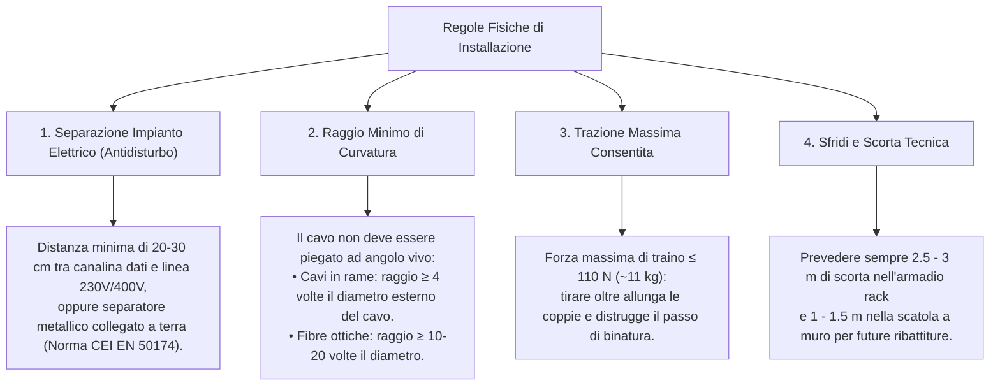
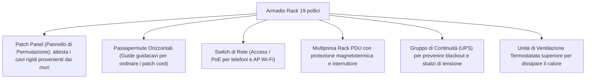
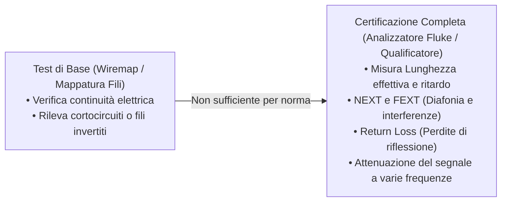

# Normativa ISO/IEC 11801 ed EN 50173 sul Cablaggio Strutturato

> [!NOTE] Cos'è la Norma ISO/IEC 11801?
> La norma **ISO/IEC 11801** (recepita a livello europeo con lo standard **EN 50173**) è l'insieme delle direttive e dei criteri tecnici internazionali che regolamentano la progettazione, la posa e il collaudo degli impianti di **cablaggio strutturato generico** all'interno di edifici civili, commerciali e campus industriali.
>
> Sebbene non sia una legge penale cogente, rappresenta la **"regola dell'arte"**: un impianto certificato a norma garantisce la totale compatibilità con qualsiasi fornitore hardware per almeno 10-15 anni e protegge legalmente installatori e committenti in caso di sinistri o contenziosi.

---

## 1. La Struttura Gerarchica del Cablaggio

La norma impone una **topologia logica a stella gerarchica** articolata su tre sottosistemi interconnessi:

```mermaid
flowchart TD
    CD["CD (Campus Distributor)<br/>Distributore di Comprensorio<br/>[Locale Tecnico Centrale + Router/Modem ISP]"]

    subgraph DORSALE_CAMPUS [1. Sottosistema di Comprensorio (Dorsale di Campus)]
        CD ==>|Fibra Ottica| BD1["BD Edificio A<br/>(Building Distributor)"]
        CD ==>|Fibra Ottica| BD2["BD Edificio B<br/>(Building Distributor)"]
    end

    subgraph DORSALE_EDIFICIO [2. Sottosistema di Edificio (Montante Verticale)]
        BD1 -->|Fibra / Rame Cat. 6A| FD2["FD Piano 2 (Floor Distributor)"]
        BD1 -->|Fibra / Rame Cat. 6A| FD1["FD Piano 1 (Floor Distributor)"]
        BD1 -->|Fibra / Rame Cat. 6A| FDT["FD Piano Terra (Floor Distributor)"]
    end

    subgraph DISTRIBUZIONE_PIANO [3. Sottosistema Orizzontale (Distribuzione di Piano)]
        FD1 -->|Cavo UTP/FTP (max 90 m)| TO["Prese Utente RJ45 (TO)<br/>[Telecommunications Outlet]"]
        TO -->|Patch Cord (max 5 m)| PC["Postazione Utente (PC/Telefono)"]
    end
```

### I Tre Distributori Chiave:
1. **CD (*Campus Distributor* - Distributore di Comprensorio):** Punto centrale di raccolta di tutti gli edifici del campus. Ospita il punto di demarcazione con il provider esterno (ISP) e i firewall principali.
2. **BD (*Building Distributor* - Distributore di Edificio):** Centro stella dell'edificio che collega la dorsale esterna alle montanti interne.
3. **FD (*Floor Distributor* - Distributore di Piano):** Armadio rack installato su ogni singolo piano per distribuire le linee verso gli uffici e le postazioni.

---

## 2. Indicazioni Fisiche e Regole di Posa

Per evitare degrado del segnale o pericoli per le persone, la posa dei cavi deve rispettare precise regole fisiche:



---

## 3. Gli Armadi Rack da 19 Pollici

Gli armadi rack costituiscono il contenitore metallico standardizzato per alloggiare in modo ordinato e sicuro gli apparati di rete, i permutatori e i gruppi di continuità.

### Dimensionamento e Unità Modulari Rack ("U")
- **Larghezza standard:** I montanti interni verticali hanno una distanza standard di **19 pollici** ($482.6\text{ mm}$), codificata dallo standard internazionale **EIA/ECA-310**.
- **L'Unità Rack ("U"):** È l'unità di misura dell'altezza verticale dei dispositivi inseribili:
  $$\mathbf{1U} = 1.75\text{ pollici} = \mathbf{44.45\text{ mm}}$$
- Un apparato contrassegnato con $1\text{U}$ occupa uno slot in altezza; apparati più grandi (server pesanti o grossi UPS) possono occupare $2\text{U}, 3\text{U}$ o $4\text{U}$.

| Tipologia Rack | Altezza Tipica | Installazione | Utilizzo Tipico |
| :--- | :---: | :--- | :--- |
| **Rack a Parete (*Wall-Mount*)** | Da $6\text{U}$ a $18\text{U}$ | Fissato a parete tassellato | Distributori di piano (FD) per piccoli e medi uffici (ospita 1-2 patch panel e switch). |
| **Armadio a Pavimento (*Free-Standing*)** | Da $24\text{U}$ a $47\text{U}$ | Poggiato su ruote o piedini regolabili | Distributori di edificio (BD), CED principali, sale server e campus distributor (CD). |

### Componenti Interni di un Rack Ben Cablato:



---

## 4. Requisiti del Locale Tecnico (Sala CED / SER)

Il locale in cui risiede l'armadio distributore (chiamato *SER - Subsystem Equipment Room* o locale CED) deve possedere precisi requisiti:
1. **Controllo del Clima:** Temperatura ambiente mantenuta stabilmente tra i **$18^\circ\text{C}$ e i $24^\circ\text{C}$** e umidità relativa compresa tra il $30\%$ e il $55\%$ (per evitare sia condense d'acqua sia cariche elettrostatiche).
2. **Sicurezza Fisica:** Porta di accesso chiusa a chiave con registrazione accessi (badge elettronico o chiave codificata).
3. **Impianto Antincendio:** Rilevatori di fumo ottici e bombole di gas inerte (come l'Inergen o Novec 1230), che estinguono il fuoco per soffocamento senza bagnare né danneggiare i circuiti elettronici.
4. **Messa a Terra (GND):** Barra equipotenziale in rame collegata direttamente alla terra dell'edificio, a cui collegare le carcasse di tutti i rack e le schermature dei cavi.

---

## 5. Collaudo e Certificazione Strumentale

Al termine della posa in opera, ogni singola tratta deve essere **collaudata e certificata** per rilasciare la dichiarazione di conformità:



> [!IMPORTANT] Garanzia del Costruttore
> Solo allegando il report strumentale stampato (*Pass*) rilasciato da un certificatore di Classe D/E/EA regolarmente calibrato, le aziende produttrici (es. Panduit, Schneider, BTicino) rilasciano la garanzia ufficiale di **20-25 anni** sull'infrastruttura di rete.
