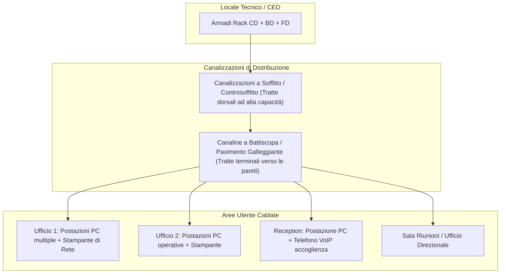

---
title: "Scenario Tipico di Cablaggio Strutturato (Norma ISO/IEC 11801 ed EN 50173)"
description: "Progetto e analisi di uno scenario reale di cablaggio strutturato: architettura di campus (CD), di edificio (BD) e di piano (FD), dorsali verticali in fibra, distribuzione orizzontale in rame a 100 metri e computo metrico da planimetria."
tags:
  - sistemi-e-reti
  - cablaggio-strutturato
  - norme-iso-osi
  - impianti-di-rete
  - rack
---
# Scenario Tipico di Cablaggio Strutturato (Norma ISO/IEC 11801)
> [!NOTE] Obiettivo del Progetto
> Analizzare la progettazione e l'implementazione pratica di un **impianto di cablaggio strutturato** per un campus multi-edificio, seguendo gli standard internazionali **ISO/IEC 11801** e la norma europea **EN 50173**, dall'architettura gerarchica dei distributori (CD, BD, FD) fino al dimensionamento dei cavi e delle postazioni su planimetria reale.

---
## 1. La Gerarchia dei Sottosistemi di Cablaggio
La normativa suddivide il cablaggio strutturato in una **topologia logica a stella gerarchica** articolata su tre livelli principali:

```mermaid
flowchart TD
    CD["CD (Campus Distributor)<br/>Distributore di Comprensorio<br/>[Locale Tecnico Centrale + Router/Modem ISP]"]

    subgraph CAMPUS_BACKBONE [Dorsale di Comprensorio / Campus Backbone]
        CD ==>|Fibra Ottica Monomodale/Multimodale| BD_A["BD Edificio A<br/>(Building Distributor)"]
        CD ==>|Fibra Ottica| BD_B["BD Edificio B<br/>(Building Distributor)"]
        CD ==>|Fibra Ottica| BD_C["BD Edificio C<br/>(Building Distributor)"]
    end

    subgraph EDIFICIO_A [Dorsale di Edificio / Montante Verticale (Edificio A)]
        BD_A -->|Fibra / Rame Cat. 6A/7| FD_2["FD Piano 2 (Floor Distributor)"]
        BD_A -->|Fibra / Rame Cat. 6A/7| FD_1["FD Piano 1 (Floor Distributor)"]
        BD_A -->|Fibra / Rame Cat. 6A/7| FD_T["FD Piano Terra (Floor Distributor)"]
    end

    subgraph DISTRIBUZIONE_ORIZZONTALE [Cablaggio Orizzontale di Piano (Max 100 metri)]
        FD_2 -->|Cavi UTP/FTP Cat. 6/6A| TO2["Prese Utente RJ45 (TO) - Piano 2"]
        FD_1 -->|Cavi UTP/FTP Cat. 6/6A| TO1["Prese Utente RJ45 (TO) - Piano 1"]
        FD_T -->|Cavi UTP/FTP Cat. 6/6A| TOT["Prese Utente RJ45 (TO) - Piano Terra"]
    end
```

---
## 2. Definizione dei Distributori e Ruoli Funzionali
### 1. CD (Campus Distributor - Distributore di Comprensorio)
- È il centro nevralgico dell'intera infrastruttura del campus.
- Ospita i router di frontiera, i collegamenti dell'operatore telefonico (ISP / Telecomunicazioni esterne) e il firewall perimetrale.
- Negli appunti è collocato nel locale tecnico al **Piano Terra dell'Edificio A**.

### 2. BD (Building Distributor - Distributore di Edificio)
- Centro stella per il singolo fabbricato.
- Interconnette la dorsale di campus proveniente dal CD con le montanti verticali interne verso i piani.
- Negli edifici B e C il BD è il punto di arrivo primario; nell'Edificio A risiede nello stesso armadio o sala rack del CD.

### 3. FD (Floor Distributor - Distributore di Piano)
- Armadio rack (tipicamente a parete o a pavimento da 19 pollici) installato a ciascun piano dell'edificio.
- Contiene:
  - **Patch Panel (Pannelli di Permutazione):** Dove vengono attestate e punzonate le tratte rigide provenienti dalle prese dei muri.
  - **Switch di Accesso (Access Switch):** Spesso dotati di supporto **PoE** (*Power over Ethernet*) per alimentare access point Wi-Fi, telefoni VoIP e telecamere IP tramite lo stesso cavo dati.
  - **Passapermute:** Guide orizzontali per ordinare le bretelle di rete (*patch cord*).
  - **UPS (Gruppo di Continuità):** Per alimentare gli switch anche in caso di blackout elettrico.

---
## 3. Le Regole delle Distanze e il Canale Orizzontale a 100 Metri
> [!IMPORTANT] La Regola Aurea dei 100 Metri
> Nel cablaggio orizzontale in rame su doppino ritorto (UTP / STP / FTP), la distanza totale massima per un canale di trasmissione dati Ethernet a norma di legge è rigorosamente pari a **100 metri**:

```mermaid
flowchart LR
    subgraph RACK_PIANO [Armadio Rack FD]
        SW["Switch"] -->|Patch Cord (max 5 m)| PP["Patch Panel"]
    end

    PP -->|Cavo Rigido Orizzontale Permanente (MAX 90 METRI)| TO["Presa Utente a Muro RJ45 (TO)"]

    subgraph POSTAZIONE [Postazione Lavoro]
        TO -->|Patch Cord Utente (max 5 m)| PC["PC / Telefono / Stampante"]
    end
```

$$\text{Lunghezza Totale Canale} = \underbrace{90\text{ m}}_{\text{Permanent Link (Cavo fisso)}} + \underbrace{10\text{ m}}_{\text{Patch Cord complessivi (Rack + Utente)}} \le 100\text{ m}$$

---
## 4. Analisi della Planimetria (Piano Terra dell'Edificio A)
Nella seconda pagina degli appunti è riportata la pianta distributiva di un piano ufficio tipo:



### Regole Pratiche di Progettazione e Dimensionamento:
1. **Numero di Prese per Postazione Lavoro:**
   - La normativa raccomanda **almeno 2 frutti RJ45 per postazione**:
     - *Presa 1:* Connessione dati PC / Workstation.
     - *Presa 2:* Telefono VoIP (o riserva per stampante / secondo terminale).
2. **Scelta dei Mezzi Fisici:**
   - **Dorsale di Campus (CD $\leftrightarrow$ BD):** Cavo in **Fibra Ottica** (preferibilmente monomodale per lunghe tratte o multimodale OM3/OM4). Vantaggi: altissima banda, distanze superiori al chilometro e **totale isolamento dielettrico** che previene guasti da fulmini tra edifici diversi con masse di terra a potenziale differente.
   - **Dorsale di Edificio (BD $\leftrightarrow$ FD):** Fibra ottica multimodale o rame Cat 6A / Cat 7.
   - **Distribuzione Orizzontale (FD $\leftrightarrow$ Prese TO):** Cavo a 4 coppie bilanciate in rame **Cat 6 / Cat 6A** (frequenza operativa 250 - 500 MHz, supporto a 1 Gbps e 10 Gbps fino a 55/100 metri).
3. **Calcolo Metrico e Scorta Cavi:**
   - Nel computo metrico dei cavi da acquistare, alle misure lineari misurate su pianta ($6x, 9x, 4x, \dots$) bisogna sempre sommare:
     - Risalita verticale all'interno dell'armadio rack (circa $2.5 - 3$ metri per consentire una comoda punzonatura e scorta).
     - Discesa verticale dalla canalina a soffitto verso la cassetta a muro dell'utente ($1.5 - 2$ metri).
     - **Margine di scorta prudenziale:** Si aggiunge un **$10\% - 15\%$** sul metraggio teorico totale per compensare curve, angoli e sfridi di posa.

---
## 5. Tabella di Sintesi delle Normative di Riferimento
| Norma | Ente Emettitore | Oggetto della Norma |
| :--- | :--- | :--- |
| **ISO/IEC 11801** | Internazionale (ISO) | Standard mondiale universale per il cablaggio strutturato generico di edifici commerciali. |
| **EN 50173** | Europeo (CENELEC) | Norma europea di recepimento per le tecnologie dell'informazione e sistemi di cablaggio. |
| **TIA/EIA-568** | Americano (ANSI) | Standard commerciale nordamericano (specifica le piedinature T568A e T568B sui connettori RJ45). |
