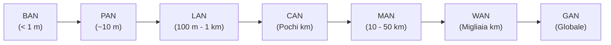

# Tipologia e Topologia delle Reti Informatiche

> [!NOTE] Distinzione Chiave
> - **Tipologia di rete:** Fa riferimento alla **dimensione geografica** e alla scala di estensione della rete (quanto distano i dispositivi tra loro).
> - **Topologia di rete:** Fa riferimento alla **forma geometrica** e alle modalità di interconnessione fisica e logica dei collegamenti tra i nodi della rete.

---

## 1. Tipologia (Classificazione per Estensione Geografica)

La tipologia indica l'area geografica e la distanza massima entro cui la rete opera:

![[Pasted image 20260421124803.png]]

| Tipologia | Nome Esteso | Raggio di Copertura | Descrizione e Applicazioni Tipiche |
| :--- | :--- | :---: | :--- |
| **BAN** | *Body Area Network* | $< 1$ metro | Reti a contatto o interne al corpo umano: sensori cardiaci, pacemaker wireless, smartwatch sanitari. |
| **PAN** | *Personal Area Network* | $\le 10$ metri | Area personale di lavoro dell'utente: interconnessione wireless Bluetooth tra smartphone, auricolari, mouse e PC. |
| **LAN** | *Local Area Network* | Fino a $1\text{ km}$ | Rete locale confinata in una stanza, abitazione, scuola o singolo edificio. Velocità molto elevate (1-10 Gbps) e costi contenuti. |
| **CAN** | *Campus Area Network* | Fino a $5\text{ km}$ | Insieme di edifici adiacenti appartenenti alla stessa entità (campus universitario, caserma, comprensorio industriale). |
| **MAN** | *Metropolitan Area Network* | $10 - 50\text{ km}$ | Copertura su scala cittadina o metropolitana: anelli metropolitani in fibra per uffici pubblici o TV via cavo municipale. |
| **WAN** | *Wide Area Network* | Centinaia/Migliaia km | Rete geografica che interconnette LAN e MAN tra città, regioni o nazioni diverse tramite linee di telecomunicazione di operatori terzi (ISP). |
| **GAN** | *Global Area Network* | Globale (Pianeta) | Rete planetaria composta dall'interconnessione globale di tutte le reti tramite satelliti e dorsali transoceaniche (**Internet**). |

---

## 2. Topologia delle Reti (Fisica e Logica)

La **topologia** definisce il modo in cui i dispositivi di rete comunicano e vengono collegati tra loro.

> [!IMPORTANT] Topologia Fisica vs Topologia Logica
> - **Topologia Fisica:** Descrive la reale disposizione geometrica e il tracciato dei cavi e delle apparecchiature.
> - **Topologia Logica:** Descrive il percorso effettivo seguito dai dati per viaggiare tra i nodi (es. una rete a stella fisica con un vecchio Hub è a tutti gli effetti un bus logico condiviso!).

I dispositivi connessi si distinguono in:
- **Dispositivi Terminali (*Host*):** Computer, stampanti di rete, telefoni VoIP, server, telecamere IP.
- **Dispositivi Intermedi (*Apparati di Rete*):** Switch (instradamento a livello Data Link), Router (instradamento a livello Network tra reti diverse), Access Point.

![[Topologia-reti-informatiche-750x600.webp]]

---

### Le Principali Topologie:

#### 1. Topologia a Bus (Lineare)
I nodi sono collegati in parallelo a un unico cavo comune (*dorsale o bus*). Alle estremità sono montati **resistori di terminazione da 50 Ohm** per assorbire i rimbalzi di segnale.
- *Vantaggi:* Pochi metri di cavo, costo iniziale minimo.
- *Svantaggi:* Se il cavo dorsale si trancia o si stacca un terminatore, l'intera rete cade (*single point of failure*).

#### 2. Topologia a Stella
Ciascun dispositivo terminale è collegato con un proprio cavo dedicato a un **apparato centrale** (concentratore: oggi esclusivamente uno **Switch**).
- *Vantaggi:* Tolleranza ai guasti elevata (se un cavo utente si rompe, solo quel PC perde la connessione). Facile da espandere e diagnosticare.
- *Svantaggi:* Se l'apparato centrale si spegne o si brucia, tutti i dispositivi della stella rimangono isolati.

#### 3. Topologia ad Albero (Stella Ramificata / Gerarchica)
È la reale configurazione di tutte le reti **LAN aziendali e del cablaggio strutturato**: una gerarchia di switch a stella (Switch di Core $\rightarrow$ Switch di Distribuzione $\rightarrow$ Switch di Accesso).
- *Vantaggi:* Massima scalabilità e modularità; traffico locale confinato senza sovraccaricare il centro della rete.

#### 4. Topologia ad Anello (*Ring*)
Ogni nodo è connesso al successivo tramite una linea punto-punto unidirezionale, chiudendo il cerchio sull'ultimo nodo.
- *Caratteristiche:* Storicamente usata da Token Ring e FDDI (doppio anello in fibra a prova di rottura).

#### 5. Topologia a Maglia (*Mesh*)
- **Maglia Completa (*Full Mesh*):** Ogni singolo nodo è direttamente connesso con tutti gli altri. Il numero di canali per $N$ nodi è:
  $$C = \frac{N(N - 1)}{2}$$
  Inviolabile contro i guasti, ma dal costo improponibile per molti nodi.
- **Maglia Parziale (*Partial Mesh*):** Collegamenti ridondanti posizionati solo tra i nodi e router strategici (la struttura portante della **dorsale Internet**).

---

## 3. Schema Riassuntivo e Comparativo

| Topologia | Consumo di Cavo | Tolleranza ai Guasti | Scalabilità | Velocità e Prestazioni | Utilizzo Principale |
| :--- | :---: | :---: | :---: | :---: | :--- |
| **Bus** | Minimo | ❌ Pessima (un taglio blocca tutto) | Molto limitata | Bassa (collisioni tra pacchetti) | Reti storiche coassiali (10BASE2), bus automobilistici (CAN bus). |
| **Stella** | Medio | ✅ Buona (guasti isolati al singolo ramo) | Alta | Elevata (con switch full-duplex) | Reti locali LAN d'ufficio, domestiche e laboratori. |
| **Albero (Stella Ramificata)** | Elevato | ✅ Ottima | Massima | Massima (segmentazione del traffico) | Cablaggi strutturati di edifici e comprensori aziendali. |
| **Anello** | Basso-Medio | ⚠️ Bassa (eccetto su anello doppio) | Media | Deterministica (gestione a gettone) | Reti metropolitane in fibra (SDH/SONET), anelli industriali. |
| **Maglia Completa** | Altissimo | ⭐ Massima in assoluto | Molto scarsa | Elevatissima (linee punto-punto) | Reti militari e data center mission-critical ad altissima sicurezza. |
| **Maglia Parziale** | Medio-Alto | ✅ Eccellente | Alta | Ottimizzata da algoritmi di routing | Dorsale mondiale di Internet e interconnessioni tra provider. |
