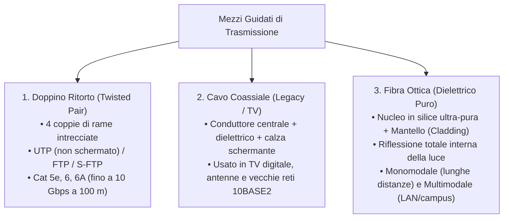
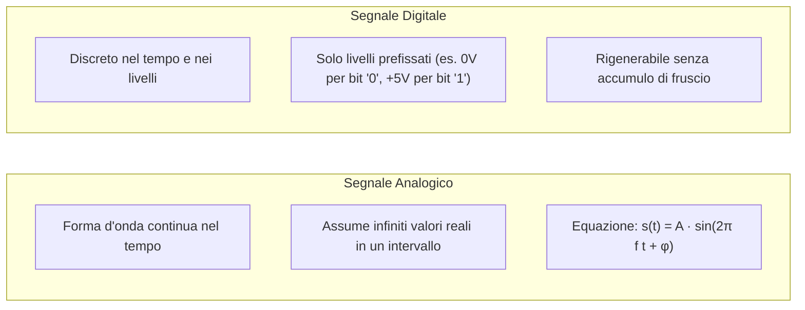

# Tipologie di Cavi, Tipi di Segnali e Canale di Comunicazione

> [!NOTE] Obiettivo della Trattazione
> Questa trattazione integra in un quadro organico i tre pilastri della trasmissione dati:
> 1. Il **mezzo trasmissivo fisico** (i cavi e le fibre ottiche).
> 2. La **natura del segnale** che viaggia sul mezzo (analogico vs digitale).
> 3. Le **proprietà fisiche e i limiti matematici del canale** (capacità, banda passante e rumore).

---

## 1. I Cavi (Mezzi Trasmissivi Guidati)

Nei sistemi di rete cablati, l'informazione è confinata e guidata all'interno di una struttura fisica materiale:



### Parametri Fisici Fondamentali dei Cavi:
- **Impedenza Caratteristica ($Z_0$):** Per i cavi Ethernet a doppino vale esattamente **$100\ \Omega$** (mentre per il coassiale TV vale $75\ \Omega$ e per il coassiale radio $50\ \Omega$). Il disadattamento di impedenza genera onde riflesse dannose.
- **Velocità di Propagazione ($v$):** Nei cavi in rame il segnale viaggia a circa $\frac{2}{3}$ della velocità della luce nel vuoto:
  $$v \approx 200.000\text{ km/s} = 2 \times 10^8\text{ m/s}$$
- **Attenuazione ($\alpha$):** Il segnale perde progressivamente energia per effetto Joule e perdite dielettriche man mano che percorre metri di cavo; si misura in decibel per cento metri ($\text{dB}/100\text{m}$) e cresce con l'aumentare della frequenza.

---

## 2. I Segnali: Analogici e Digitali

La grandezza fisica che trasporta l'informazione può presentarsi in due forme radicalmente distinte:



### Parametri d'Onda del Segnale Periodico:
1. **Ampiezza ($A$):** Il picco massimo raggiunto dalla tensione (espressa in Volt).
2. **Periodo ($T$):** Il tempo necessario a compiere un ciclo completo (in secondi $[s]$).
3. **Frequenza ($f$):** Il numero di cicli completati in un secondo, misurata in **Hertz (Hz)**:
   $$f = \frac{1}{T}$$
4. **Fase iniziale ($\varphi$):** Lo scostamento angolare dell'onda rispetto all'origine $t=0$.

### Conversione A/D e Teorema di Nyquist-Shannon
Per digitalizzare un segnale continuo (es. la voce umana da microfono):
1. **Campionamento:** Prelevare campioni a frequenza regolare $f_c$.
2. **Teorema di Shannon-Nyquist:** Per ricostruire fedelmente il segnale originale senza distorsioni da *aliasing*, la frequenza di campionamento deve essere almeno il doppio della massima frequenza del segnale:
   $$f_c \ge 2 \cdot f_{max}$$
   *(Voce umana fino a 4 kHz $\implies f_c \ge 8\text{ kHz}$)*.
3. **Quantizzazione e Codifica:** Assegnazione di un codice binario a ciascun livello di tensione campionato.

---

## 3. Il Canale di Comunicazione

Il **canale di comunicazione** è il modello matematico e fisico del percorso attraverso cui viaggia il segnale dal trasmettitore al ricevitore:

```mermaid
flowchart LR
    TX["Trasmettitore (TX)"] -->|Segnale emesso s(t)| Canale["CANALE FISICO<br/>• Larghezza di Banda B [Hz]<br/>• Attenuazione e Ritardo<br/>• Sorgente di Rumore n(t)"]
    Canale -->|Segnale ricevuto r(t) = s(t) + n(t)| RX["Ricevitore (RX)"]
```

### Limiti Teorici di Trasmissione: Nyquist e Shannon

La massima velocità teorica di trasmissione dati (in bit al secondo, **bps**) che un canale può sopportare è regolata da due celebri leggi:

#### 1. Formula di Nyquist (Canale Ideale Privo di Rumore)
Per un canale ideale con banda passante $B$ (in Hertz) che utilizza segnali a $M$ livelli discreti:
$$C = 2 \cdot B \cdot \log_2(M) \quad [\text{bps}]$$
*Con segnale binario ($M=2$): $C = 2B$ bps.*

#### 2. Teorema di Shannon-Hartley (Canale Reale Rumoroso)
Nei canali reali è sempre presente il rumore termico (rumore bianco gaussiano). La capacità massima teorica insuperabile dipende dal **rapporto segnale/rumore** ($\text{SNR} = S/N$):
$$C = B \cdot \log_2\left(1 + \frac{S}{N}\right) \quad [\text{bps}]$$

> [!IMPORTANT] Significato Ingegneristico
> Per aumentare la velocità di una connessione di rete possiamo agire solo su due parametri:
> 1. **Aumentare la banda passante $B$:** Usando cavi a frequenza più alta (es. passare da Cat 5e a 100 MHz a Cat 6A a 500 MHz, o passare alla fibra ottica).
> 2. **Migliorare il rapporto segnale/rumore ($S/N$):** Usando cavi con schermatura migliore (S/FTP) o riducendo la lunghezza della tratta.

---

## 4. Modalità di Utilizzo del Canale

| Modalità | Schema Direzionale | Descrizione | Esempi Pratici |
| :--- | :---: | :--- | :--- |
| **Simplex** | $A \longrightarrow B$ | Trasmissione unidirezionale fissa; il destinatario non può mai rispondere sulla stessa tratta. | Televisione digitale terrestre, filodiffusione, telecomando. |
| **Half-Duplex** | $A \longleftrightarrow B$ (alternato) | Trasmissione bidirezionale a turni alternati; non si può trasmettere e ascoltare contemporaneamente. | Walkie-talkie, vecchie reti Ethernet con Hub (a contesa CSMA/CD). |
| **Full-Duplex** | $A \rightleftarrows B$ (simultaneo) | Trasmissione bidirezionale contemporanea; linee fisiche di invio e ricezione separate. | Telefonata, moderni cavi Ethernet con Switch (zero collisioni). |

---

## 5. Tecniche di Multiplazione (*Multiplexing*)

La multiplazione consente a più utenti o comunicazioni indipendenti di condividere contemporaneamente la stessa risorsa fisica di canale:

- **TDM (*Time Division Multiplexing*):** L'intero canale è assegnato a turno a ciascun utente per una frazione di secondo ciclica (*timeslot*).
- **FDM (*Frequency Division Multiplexing*):** La banda del canale viene suddivisa in tante frequenze portanti parallele (es. radio FM, ADSL).
- **WDM (*Wavelength Division Multiplexing*):** Multiplazione ottica: più colori di luce laser (lunghezze d'onda differenti $\lambda$) viaggiano contemporaneamente lungo la stessa fibra ottica.
