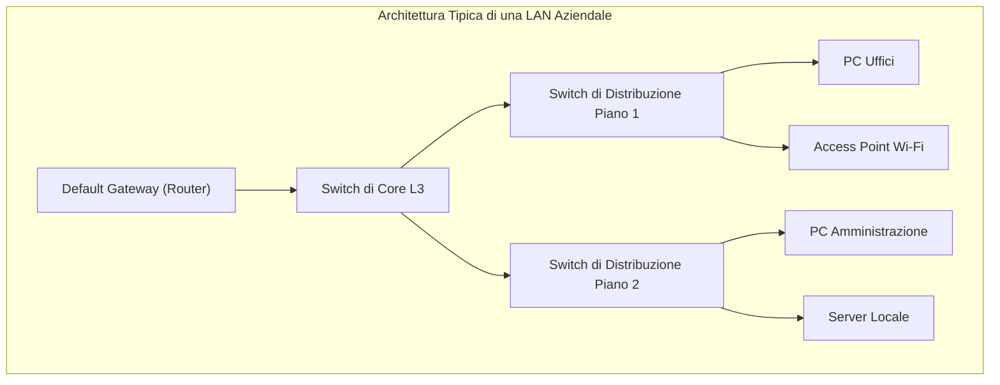

# Collegamenti di Rete: LAN e MAN

> [!NOTE] Introduzione
> L'interconnessione tra calcolatori e dispositivi digitali richiede soluzioni tecnologiche differenti a seconda dell'**estensione geografica** da coprire:
> - Le **LAN (*Local Area Network*)** operano su scala locale (stanze, uffici, edifici) su infrastrutture private ad altissima velocità.
> - Le **MAN (*Metropolitan Area Network*)** uniscono più sedi o campus distribuiti nell'arco di un'intera area metropolitana o cittadina (10 - 50 km).

---

## 1. Le Reti Locali (LAN - Local Area Network)

Una **LAN** è una rete di calcolatori confinata all'interno di un'area geografica ristretta (un'abitazione, una scuola, una sede aziendale).



### Caratteristiche Principali delle LAN:
- **Proprietà dell'infrastruttura:** L'impianto di cablaggio e gli apparati sono interamente di **proprietà privata** dell'azienda o dell'utente (nessun canone da pagare a gestori esterni).
- **Velocità di trasmissione:** Molto elevata, standard da **1 Gbps (Gigabit Ethernet)** fino a **10 Gbps**.
- **Tasso di errore (*Bit Error Rate - BER*):** Estremamente ridotto ($< 10^{-9}$), grazie alla qualità dei cavi in rame Cat 6/6A o fibre ottiche interne.
- **Bassa latenza:** I tempi di propagazione interna sono nell'ordine di frazioni di millisecondo ($< 1\text{ ms}$).

### Tecnologie Chiave in una LAN Moderna:
1. **Switching Full-Duplex:** Ogni porta dello switch costituisce un dominio di collisione separato, eliminando i conflitti di trasmissione tipici dei vecchi Hub.
2. **VLAN (Virtual LAN - Standard IEEE 802.1Q):** Segmentazione logica del traffico. Uno stesso switch fisico può ospitare reti logicamente isolate (es. VLAN 10 per gli Studenti, VLAN 20 per i Docenti, VLAN 30 per la Segreteria).
3. **Power over Ethernet (PoE - IEEE 802.3af/at/bt):** Alimentazione elettrica in corrente continua (fino a 60-90W) fornita direttamente sui 4 doppini del cavo dati per alimentare telecamere, access point e telefoni VoIP.

---

## 2. Le Reti Metropolitane (MAN - Metropolitan Area Network)

Una **MAN** interconnette molteplici sedi distaccate di una stessa organizzazione (es. le diverse facoltà di un'università in città, le sedi comunali o gli ospedali) dislocate su una distanza tipica compresa tra i **10 e i 50 km**.

```mermaid
flowchart LR
    SedeA["Sede Centrale Azienda (LAN A)"] <==>|Dorsale Fibra Ottica Monomodale / Anello Metro Ethernet| SedeB["Filiale Nord (LAN B)"]
    SedeA <==>|Ponte Radio a Microonde (Backup)| SedeC["Magazzino Logistico (LAN C)"]
```

### Tecnologie di Collegamento per Reti MAN:

#### 1. Dorsali in Fibra Ottica Monomodale
- Utilizzano fibre ottiche monomodali (*Single-Mode Fiber - SMF*) posate nel sottosuolo lungo canalizzazioni urbane (cavidotti stradali, condutture fognarie, linee di pubblica illuminazione).
- Utilizzano ricetrasmettitori laser a lunghezza d'onda di $1310\text{ nm}$ o $1550\text{ nm}$ capaci di coprire distanze fino a 40-80 km senza ripetitori intermedi.

#### 2. Metro Ethernet (Carrier Ethernet)
- È la tecnologia dominante per i servizi metropolitani offerti dagli operatori di telecomunicazioni.
- Consente alle aziende di interconnettere le proprie sedi remote **utilizzando l'interfaccia standard Ethernet RJ45 o SFP**, incapsulando il traffico attraverso la rete dell'operatore tramite tunnel **MPLS (*Multi-Protocol Label Switching*)** o **VPLS (*Virtual Private LAN Service*)**.
- Le due filiali comunicano a livello 2 come se fossero collegate allo stesso switch di rete locale.

#### 3. Ponti Radio Dedicati (Wireless MAN / FWA)
- Collegamenti punto-punto ad alta frequenza (**microonde da 10 a 80 GHz**, bande licenziate o libere a $24\text{ GHz}$ o $60\text{ GHz}$).
- Richiedono visibilità ottica perfetta (*Line of Sight - LOS*) tra le due antenne direttive paraboliche montate sui tetti degli edifici.
- Ideali per superare ostacoli orografici (fiumi, ferrovie) o come linea di backup ridondante in caso di tranciatura accidentale della fibra ottica stradale.

---

## 3. Tabella Comparativa: LAN vs MAN

| Parametro | Rete Locale (LAN) | Rete Metropolitana (MAN) |
| :--- | :--- | :--- |
| **Estensione Geografica** | Singola stanza, ufficio o edificio ($< 1\text{ km}$) | Intera città o area urbana ($10 - 50\text{ km}$) |
| **Proprietà dei Canali** | Privata (posata direttamente dal proprietario) | Spesso pubblica o affittata da carrier/provider telco |
| **Velocità Tipica** | 1 Gbps - 10 Gbps (fino a 40/100 Gbps in sale server) | Da centinaia di Mbps a 10 - 100 Gbps |
| **Latenza di Propagazione**| Trascurabile ($< 1\text{ ms}$) | Molto bassa ($2 - 10\text{ ms}$) |
| **Mezzi Trasmissivi** | Cavi a doppino Cat 6/6A, fibra multimodale, Wi-Fi | Fibra ottica monomodale, ponti radio a microonde, WDM |
| **Apparati di Riferimento**| Switch di accesso, Access Point, cavi patch | Switch Metro Ethernet, Router di frontiera, transponder ottici |
| **Costo di Manutenzione** | Spese una tantum per hardware e cavi | Canoni mensili/annuali di noleggio banda a carrier telefonici |
