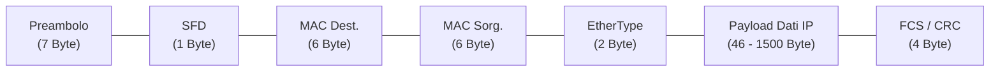
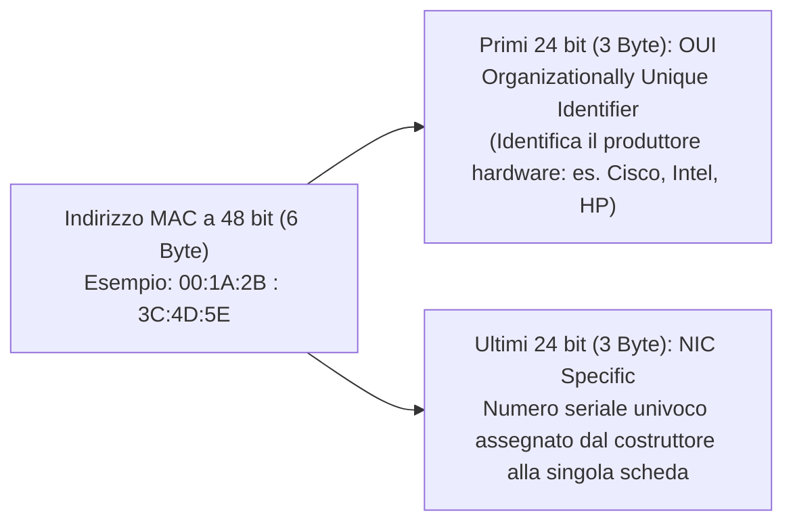
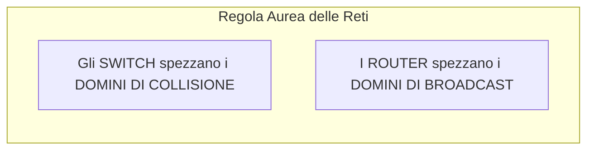

# Le Reti Ethernet: Standard IEEE 802.3, Frame e Indirizzi MAC

> [!NOTE] Cos'è Ethernet?
> **Ethernet** è la tecnologia cablata dominante utilizzata nelle reti locali (LAN) di tutto il mondo, standardizzata dal comitato internazionale IEEE con la specifica **IEEE 802.3**.
> Opera all'interno dei primi due livelli del modello ISO/OSI: il **Livello 1 (Fisico)** e il **Livello 2 (Data Link)**.

Nata storicamente negli anni '70 presso i laboratori Xerox PARC come rete a topologia a bus condiviso su cavo coassiale (10BASE5 e 10BASE2), Ethernet si è evoluta in una topologia a **stella attiva** su doppino ritorto (da 10BASE-T a 10GBASE-T) e fibra ottica, dove il centro della rete è presidiato da uno **Switch**.

![[Pasted image 20260428131702.png]]

---

## 1. Il Formato del Frame Ethernet (IEEE 802.3 / Ethernet II)

A livello Data Link, i dati provenienti dal livello Rete (es. pacchetti IP) vengono incapsulati all'interno di una **trama (*Frame*)** strutturata in campi rigorosi:

| Campo | Dimensione | Significato e Funzione |
| :--- | :---: | :--- |
| **Preambolo (*Preamble*)** | 7 Byte (56 bit) | Sequenza alternata di bit `10101010`... che permette alla scheda di rete ricevente di **sincronizzare il clock** con il segnale in arrivo. |
| **SFD (*Start Frame Delimiter*)** | 1 Byte (8 bit) | Sequenza speciale `10101011`: l'ultimo bit a '1' segnala che dal bit successivo inizia il frame vero e proprio. |
| **Destination MAC Address** | 6 Byte (48 bit) | Indirizzo fisico dell'interfaccia di rete di destinazione. |
| **Source MAC Address** | 6 Byte (48 bit) | Indirizzo fisico dell'interfaccia di rete mittente. |
| **EtherType / Length** | 2 Byte (16 bit) | Identifica il protocollo di livello superiore trasportato nel payload (es. `0x0800` per **IPv4**, `0x86DD` per **IPv6**, `0x0806` per **ARP**). |
| **Payload (Dati Utente)** | **46 - 1500 Byte** | Il pacchetto dati proveniente dal livello 3. La dimensione massima standard è detta **MTU (*Maximum Transmission Unit*) = 1500 Byte**. |
| **Padding (Riempimento)** | Variabile (0-46 B) | Se il pacchetto dati è inferiore a 46 byte, vengono aggiunti byte nulli di riempimento affinché il frame raggiunga la **dimensione minima di 64 Byte**. |
| **FCS (*Frame Check Sequence*)** | 4 Byte (32 bit) | Codice di controllo di ridondanza ciclica (**CRC-32**). Se il checksum calcolato all'arrivo non coincide, il frame è danneggiato e viene scartato. |

> [!IMPORTANT] Dimensione Minima e Massima del Frame
> - **Dimensione Minima:** **64 Byte** (esclusi Preambolo ed SFD). Nelle reti originarie half-duplex garantiva che una collisione venisse rilevata dal trasmettitore prima del termine dell'invio.
> - **Dimensione Massima Standard:** **1518 Byte** ($6+6+2+1500+4$), estendibile a 1522 Byte con il tag VLAN IEEE 802.1Q.

---

## 2. Gli Indirizzi MAC (*Media Access Control*)

Ogni interfaccia di rete (scheda Ethernet, porta dello switch, interfaccia Wi-Fi) possiede un indirizzo fisico unico al mondo chiamato **indirizzo MAC (*Media Access Control*)**, cablato in fabbrica nella memoria ROM della scheda (*Burned-In Address - BIA*).

### Le Tre Tipologie di Indirizzo MAC di Destinazione:

1. **Unicast (Punto-Punto):**
   - Destinato a **una sola interfaccia specifica** della rete locale.
   - Solo la scheda il cui MAC coincide tratterrà il pacchetto; tutte le altre lo scarteranno.
2. **Multicast (Uno a Molti):**
   - Destinato a un **gruppo selezionato di stazioni** iscritte a un servizio (es. streaming video, routing OSPF).
   - In Ethernet IPv4 gli indirizzi multicast iniziano sempre con il prefisso riservato **`01-00-5E`**.
3. **Broadcast (Uno a Tutti):**
   - Destinato a **tutte le stazioni indistintamente** presenti nel segmento di rete locale.
   - L'indirizzo universale è composto da tutti bit a '1', rappresentato in esadecimale come:
     $$\mathbf{FF:FF:FF:FF:FF:FF}$$
   - Utilizzato da protocolli di ricerca come **ARP (*Address Resolution Protocol*)** e **DHCP**.

![[Pasted image 20260428132224.png|697]]

![[Pasted image 20260428132317.png|697]]

---

## 3. Dominio di Collisione vs Dominio di Broadcast

Questa è la distinzione fondamentale per comprendere l'architettura delle reti locali:

| Parametro | Dominio di Collisione | Dominio di Broadcast |
| :--- | :--- | :--- |
| **Definizione** | Area logica in cui due pacchetti inviati simultaneamente possono collidere e distruggersi. | Area della rete raggiunta da un messaggio broadcast inviato a `FF:FF:FF:FF:FF:FF`. |
| **Comportamento dell'Hub (L1)** | **Unico grande dominio di collisione** condiviso tra tutte le porte. | Unico dominio di broadcast. |
| **Comportamento dello Switch (L2)** | **Ogni singola porta è un dominio di collisione separato** (zero collisioni in full-duplex). | **Unico dominio di broadcast** (lo switch inoltra i broadcast su tutte le porte). |
| **Comportamento del Router (L3)** | Ogni porta è un dominio di collisione separato. | **Ogni interfaccia del router isola e blocca i broadcast** (spezza i domini di broadcast). |

> [!TIP] Sintesi Pratica
> Se inseriamo uno **Switch**, isoliamo il traffico punto-punto ed eliminiamo le collisioni. Ma se un computer invia un messaggio di Broadcast, lo Switch lo recapita a tutti.
> Solo un **Router** (o una VLAN configurata a livello 3) impedisce a un messaggio di broadcast di propagarsi all'esterno della specifica sottorete.
