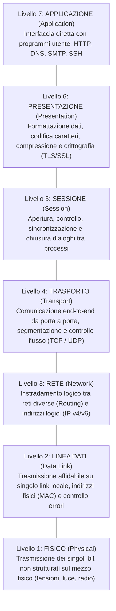
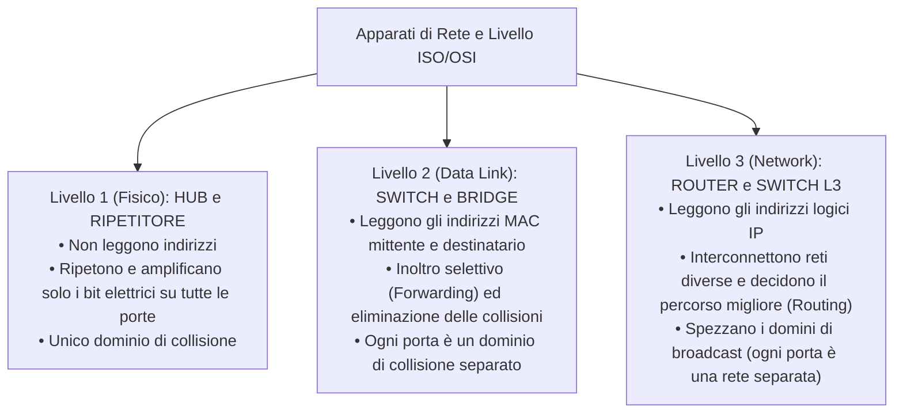

# Il Modello ISO/OSI: Architettura a 7 Livelli e Incapsulamento

> [!NOTE] Perché un Modello a Livelli?
> Il modello **ISO/OSI (*Open Systems Interconnection*)**, standardizzato nel 1984 dall'ISO (standard ISO 7498), è il modello teorico di riferimento universale per le reti di calcolatori.
> Il suo scopo fondamentale è **scomporre il problema complesso della comunicazione in 7 sotto-problemi più semplici e autonomi (livelli o strati)**. Ogni livello svolge funzioni specifiche, offre servizi al livello superiore e richiede servizi al livello sottostante tramite interfacce standardizzate, isolando i dettagli costruttivi (*information hiding*).

---

## 1. Modello Teorico vs Architettura Reale

- **Modello Teorico (ISO/OSI):** Specifica **COSA** deve fare ciascun livello in linea teorica, definendo le responsabilità e i confini senza vincoli di programmazione o hardware.
- **Architettura di Rete (es. TCP/IP ed Ethernet):** Rappresenta l'implementazione pratica e fisica, specificando **COME** vengono realizzati i protocolli, i driver software e i chip elettronici.

![[WhatsApp Image 2026-04-21 at 12.37.18.jpeg]]

![[WhatsApp Image 2026-04-21 at 12.43.12.jpeg]]

---

## 2. I 7 Livelli del Modello ISO/OSI in Dettaglio

I livelli sono numerati rigorosamente dall'1 (più vicino al mezzo fisico) al 7 (più vicino all'utente):



| N° | Livello (Italiano / Inglese) | PDU (Nome Unità Dati) | Funzioni Cardine | Protocolli ed Esempi |
| :---: | :--- | :---: | :--- | :--- |
| **7** | **Applicazione** (*Application*) | **Dati / Messaggio** | Fornisce servizi di rete ai software applicativi utilizzati dall'utente finale. | HTTP, HTTPS, DNS, FTP, SMTP, SSH, DHCP |
| **6** | **Presentazione** (*Presentation*) | **Dati Formattati** | Gestisce la sintassi e la codifica dei dati (ASCII, UTF-8), la crittografia e la compressione. | TLS/SSL, JPEG, MP3, MIME |
| **5** | **Sessione** (*Session*) | **Dati di Sessione** | Instaura, coordina e termina le conversazioni tra applicazioni; inserisce punti di ripristino (*checkpoint*). | RPC, NetBIOS, PPTP |
| **4** | **Trasporto** (*Transport*) | **Segmento** (TCP)<br/>**Datagramma** (UDP) | Consegna dei dati da processo a processo tramite **numeri di porta** ($0 - 65535$). TCP garantisce affidabilità e riordino; UDP garantisce velocità senza connessione. | TCP, UDP |
| **3** | **Rete** (*Network*) | **Pacchetto** | **Instradamento (*Routing*)** dei dati da una rete sorgente a una rete destinazione attraverso router intermedi. Gestisce l'indirizzamento logico. | IPv4, IPv6, ICMP, OSPF, BGP |
| **2** | **Linea Dati** (*Data Link*) | **Trama (*Frame*)** | Trasferimento affidabile di frame tra nodi adiacenti sullo stesso link fisico; controllo degli errori tramite checksum **FCS/CRC** e indirizzamento fisico **MAC**. | Ethernet (IEEE 802.3), Wi-Fi (802.11), ARP |
| **1** | **Fisico** (*Physical*) | **Bit** | Codifica dei singoli bit binari ($0$ e $1$) in parametri fisici (livelli di tensione, onde radio o impulsi ottici). | Connettori RJ45, cavi Cat 6A, transceiver SFP |

---

## 3. Il Processo di Incapsulamento e Decapsulamento

Quando un dispositivo mittente desidera trasmettere un messaggio attraverso la rete, i dati attraversano l'intera pila dall'alto verso il basso subendo l'**incapsulamento**. Il ricevitore esegue l'operazione inversa (**decapsulamento**):

```mermaid
flowchart TD
    subgraph INCAPSULAMENTO [Trasmettitore (Discesa verso il basso)]
        direction TB
        D7["Dati Applicativi"] --> D4["[Header TCP | Dati Applicativi] = SEGMENTO (Livello 4)"]
        D4 --> D3["[Header IP | Header TCP | Dati] = PACCHETTO (Livello 3)"]
        D3 --> D2["[Header MAC | Header IP | Header TCP | Dati | FCS Trailer] = TRAMA / FRAME (Livello 2)"]
        D2 --> D1["1011001101... = BIT SUL CAVO (Livello 1)"]
    end
```

1. **Incapsulamento (dal Livello 7 al Livello 1):** Ciascun livello prende l'unità dati ricevuta dal livello soprastante (chiamata *Service Data Unit - SDU*), vi antepone una propria intestazione con metadati di controllo (**Header**) e, nel caso del livello 2, anche una coda di controllo (**Trailer** con CRC), generando la **Protocol Data Unit (PDU)** che viene passata allo strato inferiore.
2. **Decapsulamento (dal Livello 1 al Livello 7):** Il nodo ricevente legge i bit sul cavo (L1), verifica che l'indirizzo MAC di destinazione coincida con il proprio ed elimina l'header e trailer di trama (L2), legge l'indirizzo IP di destinazione (L3), analizza la porta logica di destinazione riordinando i segmenti (L4) e infine consegna il payload puro all'applicazione corrispondente (L7).

![[WhatsApp Image 2026-04-21 at 12.58.22.jpeg]]

---

## 4. Livelli di Funzionamento degli Apparati di Rete

Non tutti i nodi di una rete devono elaborare tutti i 7 livelli della pila:



> [!IMPORTANT] Regola di Confinamento per le LAN
> All'interno di una rete locale pura (LAN), due computer scambiano trame comunicando direttamente tramite gli apparati di **Livello 1 (Fisico)** e **Livello 2 (Data Link)** utilizzando il protocollo **Ethernet** e gli indirizzi MAC. L'intervento del **Livello 3 (Router)** diventa indispensabile solo quando il pacchetto deve uscire dalla rete locale per raggiungere un'altra sottorete o la rete globale Internet.
