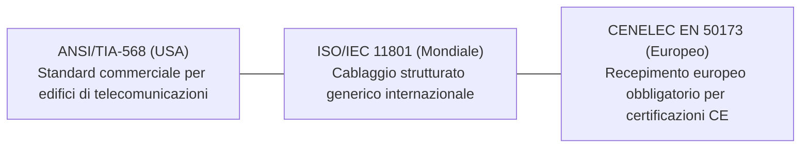
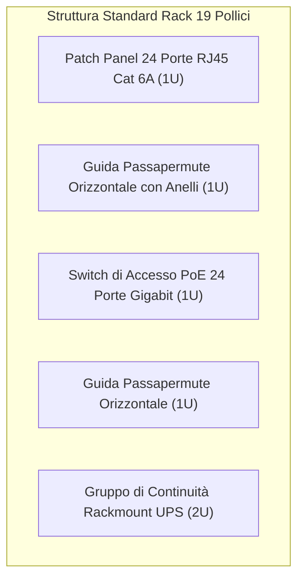

# Standard e Regole Base del Cablaggio Strutturato

> [!NOTE] Principi Fondamentali
> Il cablaggio strutturato trasforma l'infrastruttura di rete da un insieme caotico di cavi "volanti" in un impianto ingegneristico certificato, standardizzato e scalabile, capace di supportare telefonia, dati, videosorveglianza e domotica per oltre 15-20 anni.

---

## 1. Gli Standard Internazionali di Riferimento

La realizzazione di un impianto a norma fa riferimento a tre principali corpi normativi armonizzati:



---

## 2. Le Regole Auree di Installazione e Posa

### 1. La Regola dei 100 Metri (Channel Link)
Nessuna tratta orizzontale in rame su doppino ritorto può superare i **100 metri complessivi**:

```mermaid
flowchart LR
    RACK["Rack FD:<br/>Switch"] -->|Patch Cord Rack (max 5 m)| PP["Patch Panel IDC"]
    PP -->|Permanent Link in Canalina (MAX 90 METRI)| TO["Presa RJ45 a Muro"]
    TO -->|Patch Cord Utente (max 5 m)| PC["PC / Workstation"]
```

$$\text{Canale Completo} = \underbrace{90\text{ m}}_{\text{Cavo Rigido Murato (Permanent Link)}} + \underbrace{10\text{ m}}_{\text{Somma Bretelle Flessibili (Patch Cords)}} \le \mathbf{100\text{ metri}}$$

- **Cavo Rigido (*Solid Core*):** I cavi stesi nei muri e nelle canaline hanno conduttori a singolo filo rigido di rame, ideali per essere punzonati sui contatti a incisione d'isolante (**IDC**). Non devono essere usati per fare patch cord mobili perché si spezzano con le pieghe ripetute.
- **Cavo Flessibile (*Stranded Core*):** I cavi delle bretelle patch sono composti da tanti micro-filamenti di rame intrecciati, flessibili e resistenti ai movimenti, ma con attenuazione leggermente superiore (+20%).

---

### 2. Regola della Sbinatura Massima (Limite di 13 mm)
Durante la punzonatura dei singoli fili sul connettore RJ45 o sul patch panel:

> [!IMPORTANT] Limite di Untwist: 13 mm
> I doppini non devono mai essere separati (*sbinati*) per più di **13 mm (0.5 pollici)** rispetto al punto di taglio della guaina esterna.
> Sbinare eccessivamente i fili distrugge la cancellazione reciproca dei campi magnetici, provocando gravissimi fenomeni di diafonia (**NEXT - Near-End Crosstalk**) e facendo fallire la certificazione strumentale!

---

### 3. Fissaggio e Raggio di Curvatura
- **Velcro vs Fascette di Plastica:** I fasci di cavi negli armadi rack devono essere raggruppati esclusivamente con **fascette in velcro morbido**. È vietato l'uso di fascette in plastica serrate con pinza, perché schiacciano la guaina e alterano la geometria delle coppie, variando l'impedenza locale e creando riflessioni d'onda (**Return Loss**).
- **Raggio di Curvatura:** Non piegare mai il cavo ad angolo vivo (minimo 4 volte il diametro esterno del cavo).

---

## 3. L'Armadio Rack da 19 Pollici e le Unità "U"

Il rack da 19 pollici è il centro stella dell'impianto di cablaggio:



### Le Misure Standard (Standard EIA-310):
- **Larghezza tra i montanti verticali:** Esattamente **19 pollici** ($482.6\text{ mm}$).
- **L'Unità Rack ("U"):** Unità di misura modulare per l'altezza dei dispositivi:
  $$\mathbf{1U} = 1.75\text{ pollici} = \mathbf{44.45\text{ mm}}$$
- I fori sui montanti sono raggruppati a terne di fori filettati o predisposti per dadi a gabbia (*cage nuts*).

---

## 4. Schemi di Piedinatura: T568A e T568B

Lo standard TIA/EIA-568 definisce due schemi di collegamento dei connettori a 8 poli RJ45:

| Pin | T568A | T568B (Più diffuso in ambito dati) | Funzione Ethernet 10/100 |
| :---: | :--- | :--- | :---: |
| **1** | Bianco / Verde | **Bianco / Arancio** | Trasmissione + ($Tx+$) |
| **2** | Verde | **Arancio** | Trasmissione - ($Tx-$) |
| **3** | Bianco / Arancio | **Bianco / Verde** | Ricezione + ($Rx+$) |
| **4** | Blu | **Blu** | Dati a 1 Gbps / PoE |
| **5** | Bianco / Blu | **Bianco / Blu** | Dati a 1 Gbps / PoE |
| **6** | Arancio | **Verde** | Ricezione - ($Rx-$) |
| **7** | Bianco / Marrone | **Bianco / Marrone** | Dati a 1 Gbps / PoE |
| **8** | Marrone | **Marrone** | Dati a 1 Gbps / PoE |

- **Cavo Diretto (*Straight-Through*):** Entrambe le estremità utilizzano la stessa sequenza (es. T568B da entrambi i lati). Utilizzato per collegare un PC a uno Switch.
- **Cavo Incrociato (*Cross-Over*):** Un'estremità usa T568A e l'altra T568B. Utilizzato storicamente per collegare PC-PC o Switch-Switch.
- **Auto MDI-X:** Nei dispositivi moderni le schede di rete e gli switch rilevano automaticamente la piedinatura e invertono via software i pin Tx e Rx, rendendo utilizzabili i cavi diretti in ogni circostanza.

---

## 5. Etichettatura e Documentazione (Norma ANSI/TIA-606)

Un impianto è strutturato e certificabile solo se ogni componente è univocamente etichettato secondo un codice gerarchico:

$$\mathbf{[Edificio] - [Piano] - [Armadio Rack] - [Patch Panel] - [Numero Porta]}$$

- *Esempio di etichetta:* **`ED1-P0-FD1-PP02-14`**
  - Edificio 1
  - Piano Terra (P0)
  - Distributore di Piano 1 (FD1)
  - Pannello di permutazione n. 2
  - Presa n. 14
- La stessa identica etichetta deve comparire sulla placchetta della presa a muro della postazione utente e sul report di certificazione strumentale, consentendo la localizzazione immediata di guasti senza tracciare i cavi a vista.
