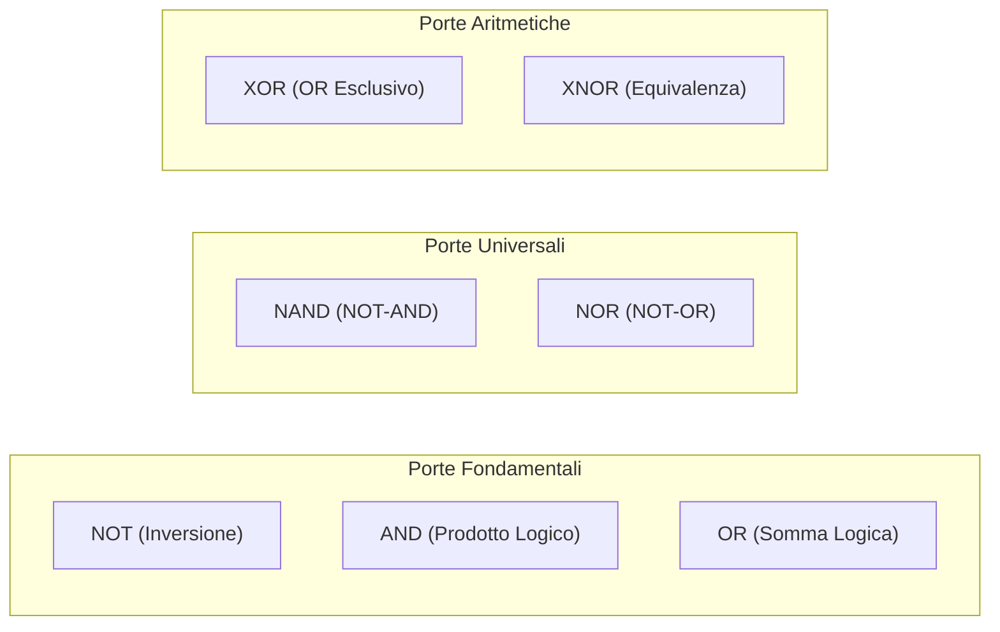

---
title: "Le Porte Logiche e l'Algebra Booleana"
description: "Guida completa alle porte logiche fondamentali (NOT, AND, OR, NAND, NOR, XOR, XNOR), tavole di verità, sintesi e analisi di reti combinatorie, teoremi di De Morgan e porte universali."
tags:
  - sistemi-e-reti
  - elettronica-digitale
  - porte-logiche
  - algebra-booleana
---
# Le Porte Logiche e l'Algebra Booleana
> [!NOTE] Concetto Base
> Le **porte logiche** sono i blocchi elementari costitutivi di qualsiasi circuito elettronico digitale e microprocessore. Ciascuna porta logica riceve uno o più segnali binari in ingresso ($0$ o $1$, fisicamente rappresentati da livelli di tensione) ed elabora **un'unica uscita binaria** secondo le regole dell'algebra di George Boole.

---
## 1. La Tavola di Verità (*Truth Table*)
La **tavola di verità** è lo strumento matematico fondamentale per descrivere univocamente il comportamento di una porta o di una rete logica. Elenca tutte le possibili combinazioni dei valori di ingresso e la corrispondente uscita prodotta.

Per un circuito con $N$ ingressi binari, la tavola di verità conterrà esattamente $2^N$ righe:
- Con 2 ingressi: $2^2 = 4$ combinazioni (`00`, `01`, `10`, `11`).
- Con 3 ingressi: $2^3 = 8$ combinazioni.

---
## 2. Le Porte Logiche Fondamentali e Derivate


### 1. Porta NOT (Invertitore)
Produce in uscita il complemento logico dell'unico ingresso applicato.
- **Espressione algebrica:** $X = \overline{A}$ (oppure $X = A'$)

| Ingresso $A$ | Uscita $X = \overline{A}$ |
| :---: | :---: |
| 0 | 1 |
| 1 | 0 |

---
### 2. Porta AND (Prodotto Logico)
L'uscita è $1$ **solo se tutti gli ingressi sono contemporaneamente $1$**. Se anche un solo ingresso è $0$, l'uscita è $0$.
- **Espressione algebrica:** $X = A \cdot B$ (oppure $X = AB$)

| $A$ | $B$ | Uscita $X = A \cdot B$ |
| :---: | :---: | :---: |
| 0 | 0 | 0 |
| 0 | 1 | 0 |
| 1 | 0 | 0 |
| 1 | 1 | **1** |

---
### 3. Porta OR (Somma Logica)
L'uscita è $1$ **se almeno uno degli ingressi è $1$**. L'uscita è $0$ unicamente se tutti gli ingressi sono a $0$.
- **Espressione algebrica:** $X = A + B$

| $A$ | $B$ | Uscita $X = A + B$ |
| :---: | :---: | :---: |
| 0 | 0 | **0** |
| 0 | 1 | 1 |
| 1 | 0 | 1 |
| 1 | 1 | 1 |

---
### 4. Porta NAND (Negazione di AND)
È una porta AND seguita da un invertitore. L'uscita è $0$ solo quando tutti gli ingressi sono $1$. In tutti gli altri casi l'uscita è $1$.
- **Espressione algebrica:** $X = \overline{A \cdot B}$

| $A$ | $B$ | Uscita $X = \overline{AB}$ |
| :---: | :---: | :---: |
| 0 | 0 | 1 |
| 0 | 1 | 1 |
| 1 | 0 | 1 |
| 1 | 1 | **0** |

> [!TIP] Proprietà Universale della porta NAND
> La porta NAND è detta **porta universale** perché combinando solo porte NAND è possibile realizzare qualsiasi altra funzione logica (NOT, AND, OR, XOR, ecc.).

---
### 5. Porta NOR (Negazione di OR)
È una porta OR seguita da un invertitore. L'uscita è $1$ esclusivamente se tutti gli ingressi sono contemporaneamente a $0$.
- **Espressione algebrica:** $X = \overline{A + B}$

| $A$ | $B$ | Uscita $X = \overline{A+B}$ |
| :---: | :---: | :---: |
| 0 | 0 | **1** |
| 0 | 1 | 0 |
| 1 | 0 | 0 |
| 1 | 1 | 0 |

---
### 6. Porta XOR (Exclusive OR - Disgiunzione Esclusiva)
L'uscita è $1$ **se e solo se gli ingressi sono diversi tra loro** (uno a 0 e l'altro a 1). Se gli ingressi sono identici, l'uscita vale $0$.
- **Espressione algebrica:** $X = A \oplus B = A\overline{B} + \overline{A}B$

| $A$ | $B$ | Uscita $X = A \oplus B$ |
| :---: | :---: | :---: |
| 0 | 0 | 0 |
| 0 | 1 | **1** |
| 1 | 0 | **1** |
| 1 | 1 | 0 |

---
### 7. Porta XNOR (Coincidenza o Equivalenza)
L'uscita è $1$ **se gli ingressi sono identici/uguali** (`00` oppure `11`). Se gli ingressi sono discordi, l'uscita vale $0$.
- **Espressione algebrica:** $X = \overline{A \oplus B} = AB + \overline{A}\,\overline{B}$

| $A$ | $B$ | Uscita $X = \overline{A \oplus B}$ |
| :---: | :---: | :---: |
| 0 | 0 | **1** |
| 0 | 1 | 0 |
| 1 | 0 | 0 |
| 1 | 1 | **1** |

---
## 3. Analisi delle Reti Combinatorie
### Esercizio 1: Dallo Schema alla Funzione Booleana
Consideriamo il circuito studiato negli appunti:
1. Gli ingressi $A$ e $B$ entrano in una porta AND $\implies Y = A \cdot B$.
2. L'uscita intermedia $Y$ e il terzo ingresso $C$ entrano in una porta OR $\implies Z = Y + C = (A \cdot B) + C$.
3. L'uscita $Z$ passa attraverso una porta NOT $\implies X = \overline{Z} = \overline{(A \cdot B) + C}$.

```mermaid
flowchart LR
    A["A"] --> AND1["AND"]
    B["B"] --> AND1
    AND1 -->|Y = A·B| OR1["OR"]
    C["C"] --> OR1
    OR1 -->|Z = (A·B) + C| NOT1["NOT"]
    NOT1 --> OUT["X = ¬((A·B) + C)"]
```

#### Tavola di Verità Completa del Circuito:
| $A$ | $B$ | $C$ | $Y = A \cdot B$ | $Z = Y + C$ | $X = \overline{Z}$ |
| :---: | :---: | :---: | :---: | :---: | :---: |
| 0 | 0 | 0 | 0 | 0 | **1** |
| 0 | 0 | 1 | 0 | 1 | **0** |
| 0 | 1 | 0 | 0 | 0 | **1** |
| 0 | 1 | 1 | 0 | 1 | **0** |
| 1 | 0 | 0 | 0 | 0 | **1** |
| 1 | 0 | 1 | 0 | 1 | **0** |
| 1 | 1 | 0 | 1 | 1 | **0** |
| 1 | 1 | 1 | 1 | 1 | **0** |

---
### Esercizio 2: Dalla Funzione Booleana allo Schema Circuitale
Consideriamo l'espressione logica:
$$F = \overline{\overline{A} + \overline{B + C}}$$

#### Procedura di Sintesi a Blocchi:
1. Somma tra $B$ e $C$ tramite porta OR $\implies (B + C)$.
2. Negazione del risultato tramite porta NOT $\implies \overline{B + C}$ (oppure con porta NOR diretta).
3. Negazione dell'ingresso $A$ tramite porta NOT $\implies \overline{A}$.
4. Somma tra $\overline{A}$ e $\overline{B + C}$ tramite porta OR $\implies \overline{A} + \overline{B + C}$.
5. Negazione finale dell'intera espressione tramite porta NOT $\implies F = \overline{\overline{A} + \overline{B + C}}$.

```mermaid
flowchart LR
    B["B"] --> OR_BC["OR"]
    C["C"] --> OR_BC
    OR_BC --> NOT_BC["NOT"]

    A["A"] --> NOT_A["NOT"]

    NOT_A -->|¬A| OR_MAIN["OR"]
    NOT_BC -->|¬(B+C)| OR_MAIN

    OR_MAIN -->|¬A + ¬(B+C)| NOT_FINAL["NOT"]
    NOT_FINAL --> F["F = ¬(¬A + ¬(B+C))"]
```

#### Semplificazione Algebrica con i Teoremi di De Morgan:
Applicando il teorema di De Morgan $\overline{X + Y} = \overline{X} \cdot \overline{Y}$:
$$F = \overline{\overline{A}} \cdot \overline{\overline{B + C}} = A \cdot (B + C) = A \cdot B + A \cdot C$$

> [!TIP] Vantaggio della Semplificazione
> Con la forma semplificata $F = A \cdot (B + C)$ servono solamente **due porte logiche** (un OR e un AND), risparmiando componenti, spazio su circuito stampato, consumo energetico e tempo di propagazione!

---
## 4. Teoremi Fondamentali dell'Algebra di Boole
| Nome del Teorema | Forma AND (Prodotto) | Forma OR (Somma) |
| :--- | :--- | :--- |
| **Identità** | $A \cdot 1 = A$ | $A + 0 = A$ |
| **Elemento Nullo** | $A \cdot 0 = 0$ | $A + 1 = 1$ |
| **Idempotenza** | $A \cdot A = A$ | $A + A = A$ |
| **Complementarietà** | $A \cdot \overline{A} = 0$ | $A + \overline{A} = 1$ |
| **Involuzione (Doppia Negazione)** | $\overline{\overline{A}} = A$ | - |
| **Commutatività** | $A \cdot B = B \cdot A$ | $A + B = B + A$ |
| **Associatività** | $A \cdot (B \cdot C) = (A \cdot B) \cdot C$ | $A + (B + C) = (A + B) + C$ |
| **Distributività** | $A \cdot (B + C) = A \cdot B + A \cdot C$ | $A + (B \cdot C) = (A + B) \cdot (A + C)$ |
| **Teoremi di De Morgan** | $\overline{A \cdot B} = \overline{A} + \overline{B}$ | $\overline{A + B} = \overline{A} \cdot \overline{B}$ |
