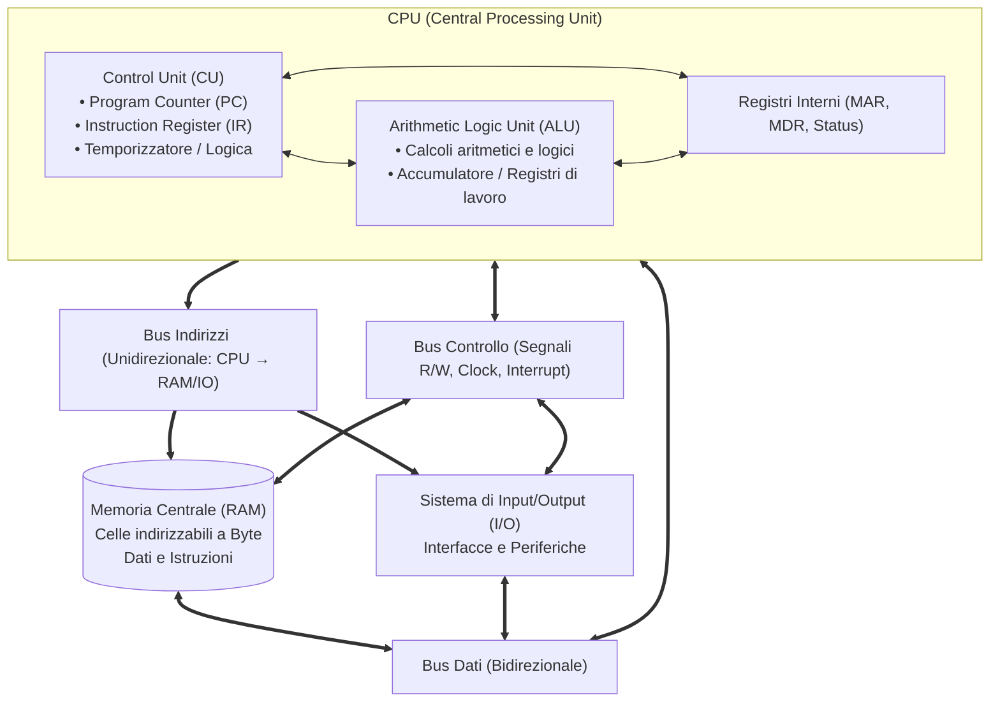
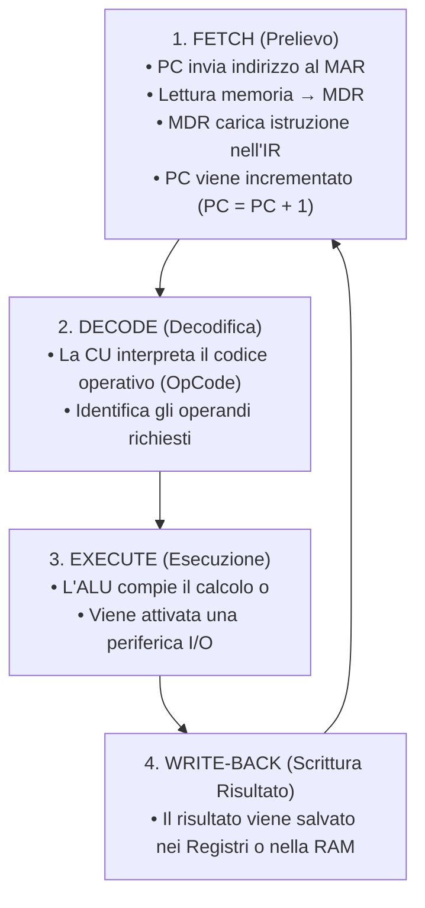
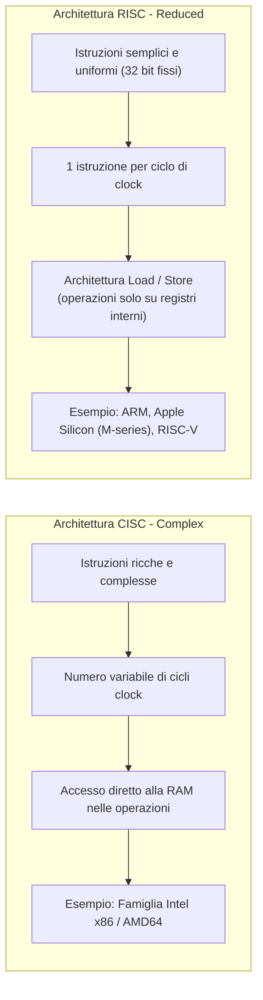
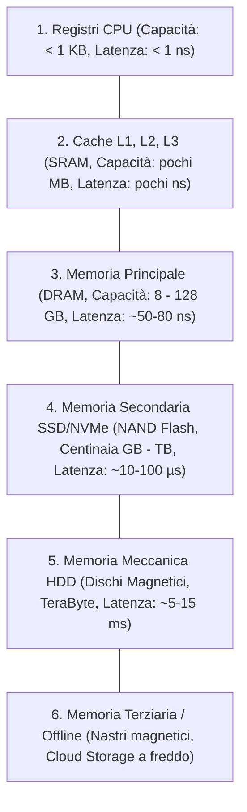
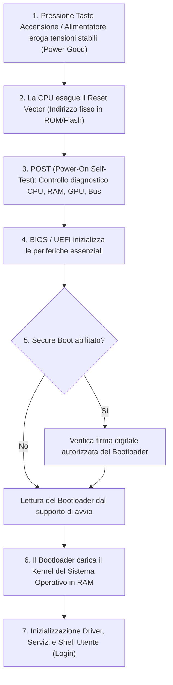
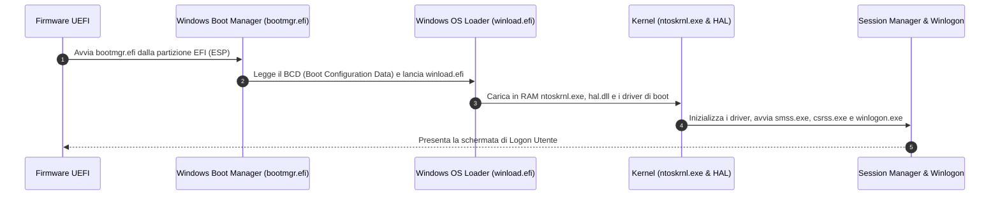

# Architettura e Funzionamento del Computer
> [!NOTE] Obiettivo
> Questo appunto approfondisce l'architettura interna del calcolatore digitale, dal modello teorico di Von Neumann all'esecuzione delle istruzioni nella CPU (pipeline, RISC vs CISC), la gerarchia delle memorie, la sicurezza del boot hardware/software e gli standard moderni di connessione e I/O.

---
## 1. Il Modello di Von Neumann
La quasi totalità dei calcolatori moderni si basa sul modello teorizzato dal matematico **John von Neumann** nel 1945. La sua intuizione rivoluzionaria fu il concetto di **programma memorizzato**: dati e istruzioni di programma risiedono nello stesso spazio di memoria fisica e sono trattati entrambi in formato binario.

### Componenti Principali:

#### 1. Unità Centrale di Elaborazione (CPU)
Il "motore" del computer, incaricato di prelevare ed eseguire le istruzioni:
- **Control Unit (CU - Unità di Controllo):** Coordina tutte le attività del calcolatore, preleva l'istruzione dalla RAM, la decodifica e invia segnali di comando temporizzati a tutti i sottosistemi.
- **Arithmetic Logic Unit (ALU - Unità Aritmetico-Logica):** Esegue le operazioni matematiche (somma, sottrazione, moltiplicazione) e logiche (AND, OR, NOT, confronto).
- **Registri Interni:** Piccolissime celle di memoria ad altissima velocità situate direttamente nel silicio del processore:
  - **PC (Program Counter):** Contiene l'indirizzo della *prossima* istruzione da eseguire.
  - **IR (Instruction Register):** Contiene l'istruzione binaria correntemente in fase di decodifica/esecuzione.
  - **MAR (Memory Address Register):** Contiene l'indirizzo di memoria a cui si vuole accedere in lettura o scrittura.
  - **MDR (Memory Data Register):** Contiene il dato letto dalla memoria o pronto per esservi scritto.
  - **Status Register (Flags):** Memorizza lo stato del processore dopo un'operazione (segno negativo, zero, overflow, riporto).
- **Cache (L1, L2, L3):** Memorie statiche ultra-veloci integrate nel chip per minimizzare i tempi di attesa dell'accesso alla RAM.

#### 2. Memoria Centrale (RAM - Random Access Memory)
- Memoria volatile ad accesso casuale (il tempo di accesso è costante e indipendente dall'indirizzo).
- Organizzata in una sequenza ordinata di **celle**, ciascuna dotata di un **indirizzo univoco**.
- Contiene i dati e i programmi attualmente caricati ed eseguiti dalla CPU.

#### 3. Sistema di Input/Output (I/O)
Permette l'interazione tra il computer e il mondo esterno:
- **Input:** Riceve dati dall'esterno e li converte in formato binario (es. tastiera, mouse, webcam).
- **Output:** Traduce i dati elaborati in un formato fruibile dall'uomo o da altri sistemi (es. monitor, altoparlanti, stampante).

#### 4. I Bus di Sistema
Linee fisiche di collegamento in rame o piste stampate su scheda madre:
- **Bus Indirizzi (Address Bus):** *Unidirezionale*. La CPU invia l'indirizzo della cella di memoria o del dispositivo I/O su cui operare. L'ampiezza in bit determina lo spazio di memoria indirizzabile ($2^N$ byte, con $N$ bit di bus indirizzi; es. 32 bit = 4 GB, 64 bit = 16 Exabyte).
- **Bus Dati (Data Bus):** *Bidirezionale*. Trasporta i byte effettivi delle istruzioni e dei dati tra CPU, RAM e I/O.
- **Bus di Controllo (Control Bus):** *Misto/Bidirezionale*. Trasporta segnali di sincronizzazione e comando (segnale di Clock, Read/Write, Interrupt Request `IRQ`, Bus Grant, Reset).

---
## 2. Il Ciclo Macchina e le Architetture di Istruzione

### Il Ciclo di Esecuzione (Fetch-Decode-Execute)
Ogni istruzione di un programma attraversa un ciclo rigorosamente sincronizzato dal clock della CPU:

### Pipelining delle Istruzioni
Nei processori tradizionali non-pipelined, ogni istruzione deve completare tutte le 4 fasi prima che la successiva possa iniziare. Con il **Pipelining**, le fasi vengono sovrapposte come in una catena di montaggio industriale:

| Ciclo di Clock | $T_1$ | $T_2$ | $T_3$ | $T_4$ | $T_5$ | $T_6$ |
| :--- | :---: | :---: | :---: | :---: | :---: | :---: |
| **Istruzione 1** | Fetch | Decode | Execute | WriteBack | - | - |
| **Istruzione 2** | - | Fetch | Decode | Execute | WriteBack | - |
| **Istruzione 3** | - | - | Fetch | Decode | Execute | WriteBack |

> [!TIP] Risultato del Pipelining
> A regime, il processore completa **un'istruzione per ogni ciclo di clock**, moltiplicando le prestazioni complessive (*throughput*).

### Confronto Architetturale: RISC vs CISC

| Parametro | CISC (Complex Instruction Set Computer) | RISC (Reduced Instruction Set Computer) |
| :--- | :--- | :--- |
| **Set di istruzioni** | Molto ampio (centinaia di istruzioni complesse) | Ridotto ed essenziale |
| **Durata istruzione** | Variabile (da 1 a decine di cicli di clock) | Fissa (1 ciclo per istruzione in pipeline) |
| **Formato istruzioni** | Lunghezza variabile (da 1 a 15 byte) | Lunghezza fissa (es. 32 bit o 64 bit) |
| **Accesso alla Memoria** | Molte istruzioni operano direttamente su RAM | Solo istruzioni dedicate `LOAD` e `STORE` |
| **Efficienza Energetica**| Più energivoro (richiede decodificatori complessi) | Altamente efficiente (ideale per smartphone ed embedded) |

---
## 3. Gerarchia delle Memorie e Sistemi RAID
Nessuna tecnologia di memoria possiede contemporaneamente massima velocità, massima capienza e costo minimo. L'architettura adotta quindi una **struttura gerarchica a piramide**:

> [!IMPORTANT] Regola della Gerarchia
> Salendo verso il vertice: **aumenta la velocità** e il **costo per bit**, ma **diminuisce la capacità**. Scendendo verso la base: aumenta la capacità e diminuisce il costo, ma aumentano i tempi di latenza.

### Tecnologia RAID (Redundant Array of Independent Disks)
Combina più dischi fisici indipendenti per incrementare la velocità, la tolleranza ai guasti o entrambe:

| Livello RAID | Nome / Principio | Tolleranza Guasti | Velocità | Spazio Utile | Note di Utilizzo |
| :--- | :--- | :---: | :---: | :---: | :--- |
| **RAID 0** | Striping (Dati suddivisi a blocchi alternati tra dischi) | ❌ **Nessuna** (se 1 disco cede, si perde tutto) | ⚡ Doppia / Moltiplicata | $100\%$ ($N \times \text{disco}$) | Solo per elaborazioni video o gaming senza dati critici. |
| **RAID 1** | Mirroring (Copia speculare esatta su due o più dischi) | ✅ Tolleranza al guasto di 1 disco | Velocità di lettura migliorata, scrittura normale | $50\%$ (dimezzato) | Massima sicurezza per sistemi operativi e database critici. |
| **RAID 5** | Striping con Parità Distribuita (minimo 3 dischi) | ✅ Tolleranza al guasto di **1 disco** | Elevata lettura, scrittura con calcolo parità | $(N - 1) \times \text{disco}$ | Ottimo bilanciamento costo/prestazioni nei server aziendali. |
| **RAID 10 (1+0)** | Mirroring + Striping (minimo 4 dischi) | ✅ Tolleranza al guasto di 1 disco per coppia speculare | ⚡ Altissima velocità sia in lettura che in scrittura | $50\%$ | Ideale per server di produzione mission-critical. |

---
## 4. Il Processo di Avvio del Computer (Boot Sequence)
All'accensione, la memoria RAM è completamente vuota e la CPU non ha alcun programma da eseguire. Per risolvere questo "stallo iniziale", il processore è cablato per puntare a un indirizzo fisso nella memoria non-volatile:

### Ruolo di BIOS e UEFI
- **BIOS Legacy (Basic Input/Output System):** Sistema storico a 16 bit, supporta solo partizionamento MBR (limite massimo dischi a 2 TB e 4 partizioni primarie).
- **UEFI (Unified Extensible Firmware Interface):** Standard moderno a 32/64 bit con interfaccia grafica, supporto al partizionamento GPT (dischi oltre 2 TB e partizioni virtualmente illimitate) e supporto a **Secure Boot**.

---
## 5. Fasi di Avvio del Sistema Operativo Windows
Nei moderni sistemi basati su UEFI e Windows 10/11, la sequenza di avvio si articola in 4 fasi:

### Tecnologie di Sicurezza Hardware:
- **TPM (Trusted Platform Module 2.0):** Microchip crittografico dedicato integrato sulla scheda madre. Custodisce in hardware le chiavi crittografiche per **BitLocker** (crittografia disco completo) e garantisce l'integrità del sistema certificando che il firmware e il bootloader non siano stati manomessi.
- **Secure Boot:** Blocca l'esecuzione di bootkit o driver malevoli prima del caricamento del sistema operativo, accettando solo codice firmato digitalmente da un'autorità fidata (Microsoft o costruttore OEM).

---
## 6. Periferiche e Bus di Connessione

### Classificazione delle Periferiche
- **Input:** Tastiera, mouse, scanner, tavoletta grafica, microfono.
- **Output:** Monitor, videoproiettore, stampante, casse audio.
- **Input/Output (I/O):** Schede di rete Ethernet/Wi-Fi, memorie di massa (dischi SSD, pendrive USB), touchscreen.

### Standard di Connessione Principali:
| Bus / Interfaccia | Tipologia | Velocità Tipica | Utilizzo Principale |
| :--- | :--- | :--- | :--- |
| **PCI Express (PCIe)** | Seriale interna punto-punto ad altissime prestazioni (da x1 a x16 corsie) | Gen 4: ~2 GB/s per corsia (x16 = 32 GB/s) Gen 5: ~4 GB/s per corsia (x16 = 64 GB/s) | Schede video dedicate (GPU), SSD NVMe M.2 ultra-veloci, schede di rete 10/100 GbE. |
| **SATA III** | Seriale interna per memorie di massa | 6 Gbps (circa 550-600 MB/s reali) | Hard disk meccanici (HDD) e SSD tradizionali da 2.5 pollici. |
| **M.2 NVMe** | Form-factor compatto su bus PCIe | Fino a 7.000 - 14.000 MB/s | SSD moderni ad altissima velocità su schede madri e laptop. |
| **USB (Universal Serial Bus)** | Seriale esterna universale plug-and-play | • USB 2.0: 480 Mbps • USB 3.2 Gen 2: 10 Gbps • USB4 / Thunderbolt 4: 40 - 80 Gbps | Mouse, tastiere, dischi esterni, audio, video e ricarica Power Delivery (con connettore Type-C). |
| **HDMI / DisplayPort** | Bus digitali video/audio ad alta definizione | Da 18 Gbps (HDMI 2.0) a 80 Gbps (DisplayPort 2.1) | Monitor per computer, TV 4K/8K, frequenze di refresh elevate (144Hz+). |
| **VGA / DVI (Legacy)** | Video analogico (VGA) o digitale prima generazione (DVI) | Limitata a risoluzioni Full HD o inferiori | Standard obsoleti gradualmente dismessi. |
