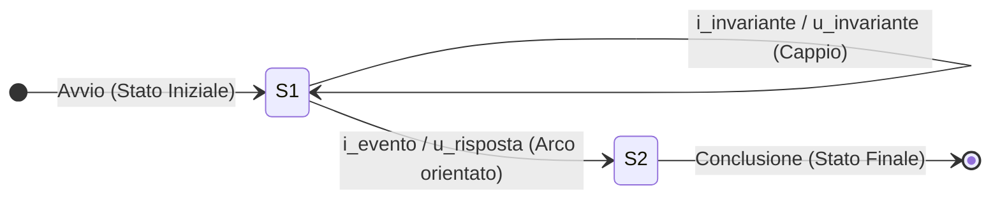

# Automi a Stati Finiti e Diagrammi di Stato
> [!NOTE] Cos'è un Automa a Stati Finiti (FSM)?
> Un **Automa a Stati Finiti** (*Finite State Machine - FSM*) è un modello matematico di computazione costituito da un insieme discreto e finito di **stati**, da un alfabeto di **ingressi**, da un alfabeto di **uscite** e da regole che governano le **transizioni** da uno stato all'altro in risposta agli stimoli esterni.

---
## 1. Definizione Formale dell'Automa
Formalmente, un automa a stati finiti deterministico è rappresentato dalla sestupla:

$$M = \langle I, U, S, f, g, s_0 \rangle$$

- **$I$ (Alfabeto degli Ingressi):** Insieme finito dei possibili simboli/stimoli in ingresso.
- **$U$ (Alfabeto delle Uscite):** Insieme finito delle possibili risposte o azioni generate.
- **$S$ (Insieme degli Stati):** Insieme finito degli stati interni che il sistema può assumere.
- **$f$ (Funzione di Transizione):** Regola che associa allo stato corrente e all'ingresso il prossimo stato:
  $$f: S \times I \to S$$
- **$g$ (Funzione di Trasformazione/Uscita):**
  - Per automi di **Mealy**: $g: S \times I \to U$ (l'uscita è funzione di stato e ingresso).
  - Per automi di **Moore**: $g: S \to U$ (l'uscita dipende solo dallo stato).
- **$s_0 \in S$ (Stato Iniziale):** Lo stato in cui si trova il sistema all'avvio.

---
## 2. Anatomia del Diagramma degli Stati (Grafo delle Transizioni)
Il **diagramma degli stati** è una rappresentazione visuale a grafo orientato:



| Elemento Grafico | Significato Logico | Notazione |
| :--- | :--- | :--- |
| **Cerchio (Nodo / Bolla)** | Rappresenta un particolare stato interno $s_i$. | `(s1)` |
| **Freccia senza origine** | Indica univocamente lo **Stato Iniziale** ($s_0$ o $s_1$). | `▶ (s1)` |
| **Doppio Cerchio** | Indica uno **Stato Finale / Terminale** (nei riconoscitori o processi a termine). | `((s_end))` |
| **Arco Orientato** | Indica una transizione valida da uno stato sorgente a uno stato destinazione. | $\longrightarrow$ |
| **Cappio (Self-loop)** | Transizione che riporta nello stesso stato se l'ingresso non produce avanzamento. | $\circlearrowright$ |
| **Etichetta sull'Arco** | Specifica la condizione di attivazione e l'effetto prodotto:<br/>**`Ingresso / Uscita`** (sintassi Mealy). | `1 EUR / Eroga` |

---
## 3. Caso di Studio: Distributore Automatico con Resto
Analizziamo il sistema reale modellato negli appunti: un **distributore automatico di bibite** (costo bevanda: **2 EUR**) che accetta monete da **1 EUR** e **2 EUR** ed è in grado di erogare la bibita scelta (Aranciata, Cola) ed erogare il corretto resto.

### 1. Definizione delle Variabili di Sistema
- **Vettore Ingressi $I = \{i_1, i_2\}$:**
  - $i_1$ (Moneta inserita): $V_{i_1} = \{\text{1 EUR}, \text{2 EUR}\}$
  - $i_2$ (Selezione bevanda): $V_{i_2} = \{\text{Sel. Aranciata}, \text{Sel. Cola}, \text{Nessuna}\}$
- **Vettore Uscite $U = \{u_1, u_2\}$:**
  - $u_1$ (Erogazione bevanda): $V_{u_1} = \{\text{Lattina Aranciata}, \text{Lattina Cola}, \text{Null}\}$
  - $u_2$ (Erogazione resto): $V_{u_2} = \{\text{Resto 0 EUR}, \text{Resto 1 EUR}, \text{Resto 2 EUR}\}$
- **Insieme degli Stati $S = \{s_1, s_2\}$:**
  - **$s_1$ (Credito 0 EUR - Attesa prima moneta):** Stato iniziale di riposo.
  - **$s_2$ (Credito 1 EUR - Attesa seconda moneta):** Il sistema memorizza che è già stato inserito 1 EUR.

---
### 4. Diagramma degli Stati del Distributore (Modello di Mealy)
```mermaid
stateDiagram-v2
    direction LR

    [*] --> S1: Accensione

    state S1 {
        description: "Credito: 0 EUR"
    }
    state S2 {
        description: "Credito: 1 EUR"
    }

    S1 --> S2: Inserito 1€ / (Bibita: NULL, Resto: 0€)
    S1 --> S1: Inserito 2€ + Sel.Cola / (Bibita: Lattina Cola, Resto: 0€)
    S1 --> S1: Inserito 2€ + Sel.Aranciata / (Bibita: Lattina Aranciata, Resto: 0€)

    S2 --> S1: Inserito 1€ + Sel.Cola / (Bibita: Lattina Cola, Resto: 0€)
    S2 --> S1: Inserito 1€ + Sel.Aranciata / (Bibita: Lattina Aranciata, Resto: 0€)
    S2 --> S1: Inserito 2€ + Sel.Cola / (Bibita: Lattina Cola, Resto: 1€)
    S2 --> S1: Inserito 2€ + Sel.Aranciata / (Bibita: Lattina Aranciata, Resto: 1€)
```

### Spiegazione dei Percorsi e Risoluzione del Resto:
1. **Partenza da $s_1$ (Credito 0 EUR):**
   - Se l'utente inserisce **2 EUR** e preme Cola: il costo (2 EUR) è coperto. Il sistema eroga subito la Cola con **Resto 0 EUR** e **ritorna in $s_1$**, pronto per un nuovo cliente.
   - Se l'utente inserisce **1 EUR**: il credito è insufficiente. Il sistema transita nello stato **$s_2$** (*credito accumulato = 1 EUR*) e l'uscita è `(Bibita: NULL, Resto: 0 EUR)`.
2. **Nello stato $s_2$ (Credito 1 EUR accumulato):**
   - Se l'utente inserisce un altro **1 EUR** (totale 2 EUR) e seleziona Cola: viene erogata la **Lattina Cola** con **Resto 0 EUR**, e il sistema ritorna allo stato di riposo **$s_1$**.
   - Se l'utente inserisce una moneta da **2 EUR** (totale accumulato 1 + 2 = 3 EUR) e seleziona Cola: il sistema eroga la **Lattina Cola** e contemporaneamente restituisce **Resto 1 EUR** ($3 - 2 = 1\text{ EUR}$), ritornando in **$s_1$**.

> [!TIP] Principio di Ciclicità
> Nei sistemi reattivi continui (come un distributore o un controllore di semaforo), l'automa non termina in uno "stato finale chiuso" ma deve **sempre resettarsi allo stato iniziale** dopo aver portato a termine l'erogazione.
