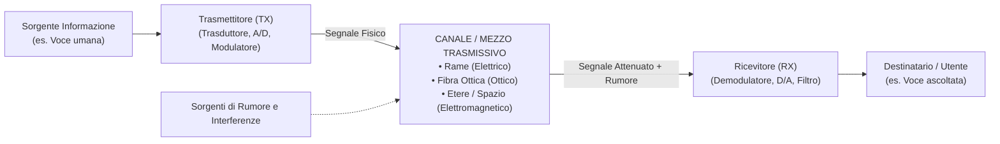
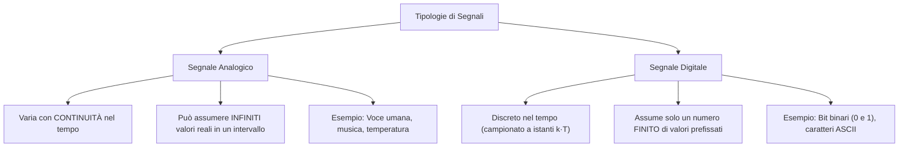
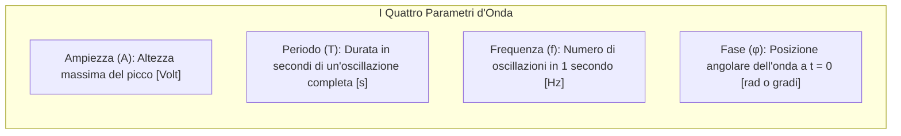
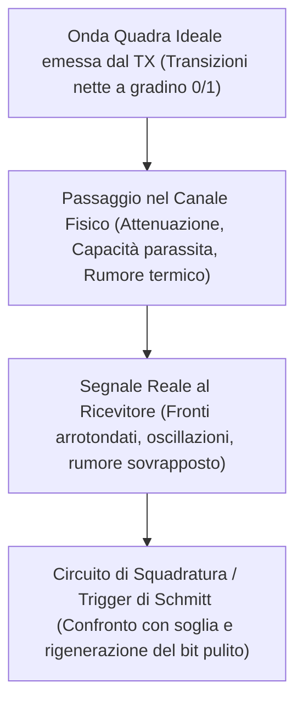
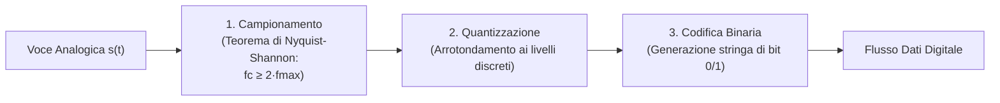

# I Segnali nelle Telecomunicazioni: Analogici e Digitali

> [!NOTE] Cos'è un Segnale?
> Nelle telecomunicazioni, un **segnale** è la variazione nel tempo di una grandezza fisica (solitamente una tensione elettrica, una corrente, un'onda elettromagnetica o un impulso luminoso) a cui è associata un'**informazione** da trasmettere a distanza.

---

## 1. Lo Schema di un Sistema di Telecomunicazione

Ogni sistema di trasmissione a distanza si articola su tre elementi fondamentali:

### Le Tre Tipologie di Mezzo Trasmissivo:
1. **Conduttori Metallici in Rame (Doppino intrecciato, Cavo Coassiale):** L'informazione viaggia sotto forma di impulsi di **tensione** e correnti elettriche.
2. **Fibra Ottica:** L'informazione viaggia sotto forma di **impulsi luminosi (fotoni)** guidati per riflessione totale interna nel silicio ultra-puro. Immuni a interferenze elettromagnetiche.
3. **Etere (Spazio libero / Aria):** L'informazione viaggia sotto forma di **onde elettromagnetiche** a radiofrequenza o microonde (es. Wi-Fi, 4G/5G, ponti radio, satelliti).

---

## 2. Segnale Analogico vs Segnale Digitale

---

## 3. Il Segnale Analogico e i Parametri Fondamentali

Un segnale analogico periodico elementare è descritto dall'equazione della sinusoide:

$$s(t) = A \cdot \sin(2\pi f t + \varphi)$$

### Formule e Definizioni Matematiche:
1. **Ampiezza ($A$ o $V_{max}$):** Il valore di picco raggiunto dal segnale rispetto al livello di riferimento di zero. L'ampiezza picco-picco vale $V_{pp} = 2A$.
2. **Periodo ($T$):** L'intervallo temporale minimo dopo il quale la forma d'onda torna a ripetersi identica a se stessa:
   $$T = \frac{1}{f} \quad [\text{secondi}]$$
3. **Frequenza ($f$):** Il numero di periodi completati in un secondo. Si misura in **Hertz (Hz)**:
   $$f = \frac{1}{T} \quad [\text{Hz}]$$
   *(1 kHz = $10^3$ Hz, 1 MHz = $10^6$ Hz, 1 GHz = $10^9$ Hz)*.
4. **Fase iniziale ($\varphi$):** Determina il punto di partenza dell'onda all'istante iniziale $t=0$. Se due onde della stessa frequenza hanno un ritardo reciproco, si dice che sono *sfasate*.
5. **Lunghezza d'onda ($\lambda$):** La distanza spaziale percorsa dall'onda durante un periodo completo $T$, viaggiando alla velocità di propagazione $v$ nel mezzo:
   $$\lambda = \frac{v}{f}$$
   *(Per le onde radio nel vuoto $v \approx c = 3 \times 10^8 \text{ m/s}$)*.

---

## 4. Il Segnale Digitale e la Trasmissione Binaria

Nel segnale digitale, l'informazione è codificata attraverso livelli discreti di tensione:
- **Segnale a più livelli ($M$-ario):** Può assumere $M$ valori distinti (es. a 5 livelli: $\{-2\text{V}, -1\text{V}, 0\text{V}, +1\text{V}, +2\text{V}\}$).
- **Segnale Binario ($M=2$):** Assume esclusivamente due livelli logici:
  - Livello Alto (**1 logico**): tipicamente $+5\text{V}$ o $+3.3\text{V}$.
  - Livello Basso (**0 logico**): tipicamente $0\text{V}$.

### Forma d'Onda Ideale vs Segnale Reale nel Mezzo:

> [!TIP] Perché il Digitale ha soppiantato l'Analogico?
> In un segnale analogico, qualsiasi disturbo o rumore introdotto dal cavo degrada irrimediabilmente l'informazione (fruscio audio, neve video). In un segnale digitale, finché il disturbo non è così forte da far scambiare uno `0` per un `1`, il ricevitore può **ricostruire e rigenerare perfettamente** la sequenza originale di bit senza perdita di qualità!

---

## 5. La Conversione Analogico-Digitale (A/D)

Poiché l'essere umano genera e percepisce grandezze fisiche analogiche (la voce, i suoni, la luce), mentre i computer elaborano solo bit binari, è necessaria una conversione in tre passaggi:

1. **Campionamento (*Sampling*):** Si preleva il valore del segnale a intervalli regolari di tempo $T_c = 1/f_c$.
   - **Teorema di Shannon-Nyquist:** Per poter ricostruire fedelmente il segnale, la frequenza di campionamento $f_c$ deve essere almeno il doppio della massima frequenza $f_{max}$ contenuta nel segnale:
     $$f_c \ge 2 \cdot f_{max}$$
     *(Es. Telefonia vocale: voce fino a 4 kHz $\implies f_c = 8 \text{ kHz}$; Audio CD: fino a 20 kHz $\implies f_c = 44.1 \text{ kHz}$)*.
2. **Quantizzazione:** L'ampiezza continua di ciascun campione viene approssimata al livello discreto più vicino tra $L = 2^b$ livelli permessi. L'errore di approssimazione commesso è detto *rumore di quantizzazione*.
3. **Codifica:** Ciascun livello quantizzato viene tradotto in una parola binaria di $b$ bit.
