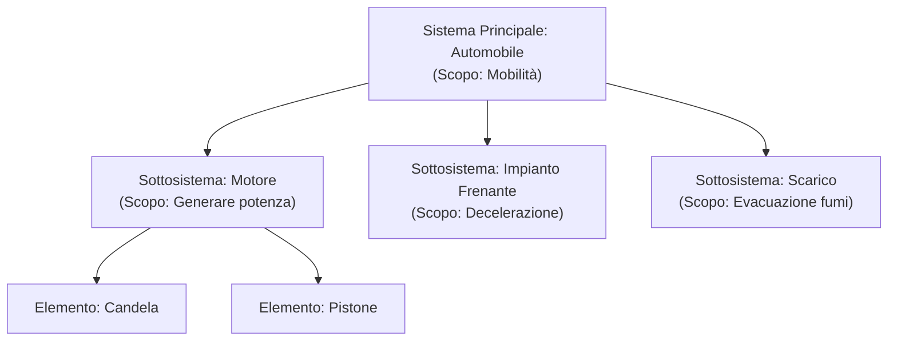
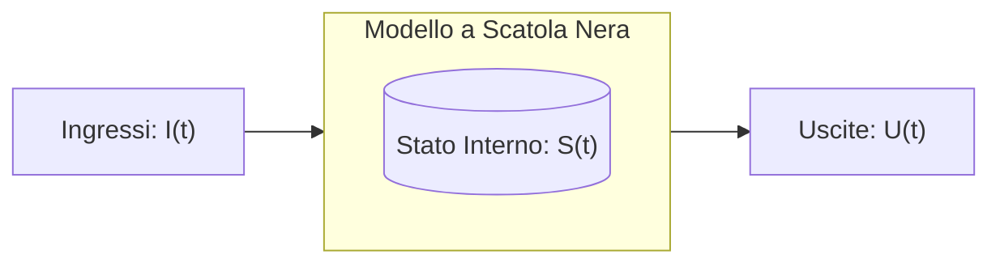
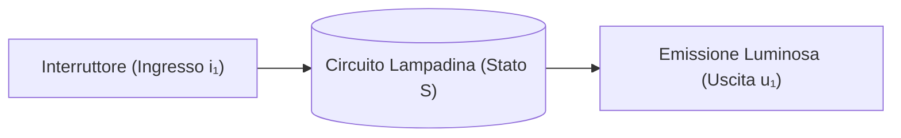

# Teoria dei Sistemi: Fondamenti e Modellazione
> [!NOTE] Obiettivo della trattazione
> Comprendere cos'è un sistema, come viene schematizzato attraverso il modello a scatola nera (*black box*), come si descrivono gli stati interni e in che modo le funzioni di transizione e trasformazione ne determinano l'evoluzione temporale.

---
## 1. Cos'è un Sistema?
Un **sistema** è un insieme di elementi o componenti interconnessi tra loro che interagiscono in modo coordinato secondo leggi ben definite per raggiungere un **obiettivo comune** (uno scopo o una funzione specifica).

```mermaid
flowchart LR
    A["Ambiente Esterno"] -->|Ingressi (Stimoli)| S["SISTEMA<br/>(Insieme di componenti interagenti)"]
    S -->|Uscite (Risposte)| A
```

### Concetti cardine:
- **Elementi (Componenti):** Le singole parti costitutive del sistema.
- **Interazioni (Relazioni):** I legami funzionali, logici o fisici tra le parti.
- **Confine del sistema:** La linea di separazione (reale o concettuale) che delimita ciò che appartiene al sistema rispetto all'ambiente esterno.
- **Ambiente esterno:** Tutto ciò che si trova al di fuori del confine e con cui il sistema scambia informazioni, energia o materia.

---
## 2. Sistemi, Sottosistemi ed Elementi
La definizione di ciò che è "sistema" dipende sempre dalla scala di osservazione (*punto di vista dello studio*):



- **Sottosistema:** Se analizziamo una parte complessa del sistema (es. il *motore* dell'automobile), essa è a sua volta un sistema autonomo con propri componenti e scopi specifici. Pur agendo singolarmente, concorre al raggiungimento dell'obiettivo del sistema principale.
- **Elemento semplice:** Se una parte non viene ulteriormente scomposta e viene considerata come indivisibile nel contesto della nostra analisi (es. un singolo bullone o la candela), essa prende il nome di *elemento*.

---
## 3. Il Modello a Scatola Nera (*Black Box*)
Nello studio ingegneristico dei sistemi non è sempre necessario o conveniente conoscere ogni singolo dettaglio costruttivo interno. Spesso si adotta l'approccio a **Scatola Nera (Black Box)**: si osserva il sistema solo dal punto di vista delle relazioni di causa-effetto tra ciò che entra e ciò che esce.



Un sistema è formalmente caratterizzato da tre vettori di variabili:

### 1. Ingressi ($I$)
Le grandezze provenienti dall'ambiente esterno che sollecitano il sistema:
$$I = \{i_1, i_2, \dots, i_k\}$$
Ogni ingresso $i_j$ può assumere valori appartenenti a un insieme o alfabeto di ingresso $V_{i_j}$.

### 2. Uscite ($U$)
Le risposte che il sistema invia verso l'ambiente esterno:
$$U = \{u_1, u_2, \dots, u_m\}$$
Ogni uscita $u_j$ assume valori nell'insieme dei valori di uscita $V_{u_j}$.

### 3. Stati Interni ($S$)
L'insieme delle informazioni minime necessarie all'istante $t$ che, insieme alla conoscenza degli ingressi futuri, determinano univocamente il comportamento futuro del sistema.
$$S = \{s_1, s_2, \dots, s_n\}$$
> [!TIP] Intuizione visiva dello "Stato"
> Lo stato è come una **fotografia istantanea** del sistema scattata all'istante di tempo $t$. Rappresenta la memoria storica del sistema: conserva la traccia di tutti gli ingressi passati che influenzano il presente.

---
## 4. Le Funzioni Matematiche del Sistema
Per descrivere completamente il comportamento e l'evoluzione temporale di un sistema a stati discreti, si utilizzano due funzioni fondamentali:

### A. La Funzione di Transizione di Stato ($f$)
Determina quale sarà lo **stato successivo** del sistema al passo temporale successivo ($t_{k+1}$ o $t+1$), combinando lo **stato attuale** ($S(t)$) e l'**ingresso corrente** ($I(t)$):

$$S(t+1) = f(S(t), I(t))$$

- **Cosa fa:** Specifica per ogni coppia `(stato corrente, ingresso attuale)` lo spostamento verso il nuovo stato.

### B. La Funzione di Trasformazione delle Uscite ($g$)
Determina il valore dell'**uscita** generata dal sistema:

1. **Modello di Mealy (Sistema Improprio):**
   L'uscita dipende sia dallo stato attuale sia dall'ingresso attuale:
   $$U(t) = g(S(t), I(t))$$
2. **Modello di Moore (Sistema Proprio):**
   L'uscita dipende **esclusivamente** dallo stato interno attuale:
   $$U(t) = g(S(t))$$

---
## 5. Esempio Pratico: Il Circuito Interruttore-Lampadina
Analizziamo il classico esempio descritto negli appunti: un circuito formato da un interruttore manuale e una lampadina.



### Definizione Formale:
- **Ingresso ($I$):** $I = \{i_1\}$, con $V_{i_1} = \{\text{Aperto}, \text{Chiuso}\}$
- **Stato ($S$):** $S = \{s_1, s_2\}$:
  - $s_1$: Lampadina Spenta (filamento freddo / a riposo)
  - $s_2$: Lampadina Accesa (filamento incandescente / in conduzione)
- **Uscita ($U$):** $U = \{u_1\}$, con $V_{u_1} = \{\text{Buio}, \text{Luce}\}$

### Tabella di Transizione (Stato Futuro $S(t+1)$)
Indica in quale stato si troverà la lampada in base allo stato attuale e alla posizione dell'interruttore:

| Stato Corrente $S(t)$ | Ingresso: Aperto | Ingresso: Chiuso |
| :--- | :---: | :---: |
| **$s_1$ (Spenta)** | $s_1$ (Spenta) | $s_2$ (Accesa) |
| **$s_2$ (Accesa)** | $s_1$ (Spenta) | $s_2$ (Accesa) |

### Tabella di Trasformazione (Uscita $U(t)$)
Indica la luminosità emessa dal sistema:

| Stato Corrente $S(t)$ | Ingresso: Aperto | Ingresso: Chiuso |
| :--- | :---: | :---: |
| **$s_1$ (Spenta)** | Buio | Luce (o transitorio verso accesa) |
| **$s_2$ (Accesa)** | Buio | Luce |

*(Se considerata come macchina di Moore pura, l'uscita dipenderebbe direttamente solo dallo stato: $s_1 \rightarrow \text{Buio}$, $s_2 \rightarrow \text{Luce}$)*.

---
## 6. Schema di Riepilogo
| Componente | Simbolo | Significato | Esempio Pratico |
| :--- | :---: | :--- | :--- |
| **Ingresso** | $I(t)$ | Stimolo proveniente dall'esterno | Pressione pulsante, moneta inserita |
| **Stato** | $S(t)$ | Memoria interna all'istante $t$ | Valore di conteggio, marcia inserita |
| **Uscita** | $U(t)$ | Azione o risultato visibile all'esterno | Accensione LED, erogazione bibita |
| **Transizione ($f$)** | $S(t+1) = f(S, I)$ | Regola di cambio di stato | Se ho 1 EUR e inserisco un altro 1 EUR $\rightarrow$ Stato "2 EUR inseriti" |
| **Trasformazione ($g$)** | $U(t) = g(S, I)$ | Regola di produzione dell'uscita | Se ho raggiunto 2 EUR e premo il tasto $\rightarrow$ Eroga bottiglia |
