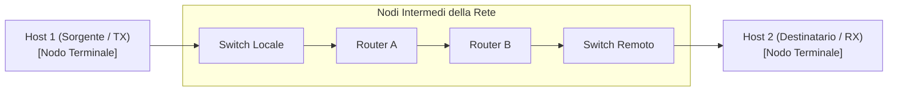
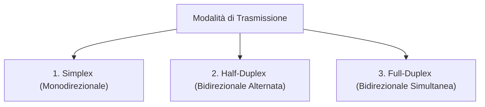
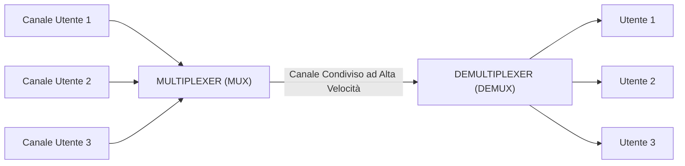
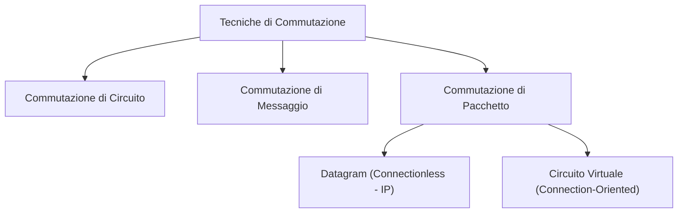
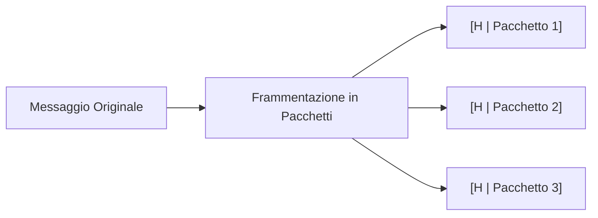

# Il Canale di Comunicazione: Multiplazione e Commutazione

> [!NOTE] Introduzione
> Il **canale di comunicazione** è il collegamento fisico o logico che unisce una sorgente a un destinatario. Per consentire a milioni di utenti di scambiare dati in modo efficiente ed economico, le reti adottano tecniche avanzate di **multiplazione** (condivisione del mezzo) e di **commutazione** (instradamento dei flussi attraverso nodi intermedi).

---

## 1. Architettura della Comunicazione e Nodi di Rete

- **Nodi Terminali (*End Systems / Host*):** Dispositivi utente che generano o consumano i dati (computer, smartphone, server web, stampanti di rete).
- **Nodi Intermedi (*Intermediate Systems*):** Apparati di rete specializzati (switch, router) incaricati di inoltrare e instradare i dati verso la destinazione finale.

### Il Concetto di Protocollo
> [!IMPORTANT] Definizione di Protocollo di Rete
> Un **protocollo** è un insieme formale di regole, formati di messaggio e convenzioni temporali concordate che due o più entità di rete devono rispettare per comunicare reciprocamente in modo corretto, comprensibile e privo di ambiguità.
> - **Sintassi:** Struttura dei dati e campi del messaggio (header, payload, checksum).
> - **Semantica:** Significato operativo associato a ogni campo e comando.
> - **Temporizzazione:** Sequenza temporale corretta degli scambi e gestione degli errori/timeout.

---

## 2. Modalità d'Uso del Canale (Direzione del Flusso)

La trasmissione tra due dispositivi può essere classificata in tre modalità operative:

| Modalità | Direzione | Principio di Funzionamento | Esempio Pratico |
| :--- | :---: | :--- | :--- |
| **Simplex** | $A \longrightarrow B$ | La trasmissione avviene in **un solo verso stabilito**. Il ricevitore non può mai rispondere sulla stessa linea. | Trasmissioni televisive o radiofoniche via etere, telecomando IR, sensore meteorologico verso centralina. |
| **Half-Duplex** | $A \longleftrightarrow B$ *(a turni)* | La trasmissione può avvenire in entrambi i versi, ma **uno solo alla volta**. Non è possibile parlare e ascoltare simultaneamente. | Walkie-talkie (pulsante PTT *Push-to-Talk*), standard Wi-Fi half-duplex con CSMA/CA, vecchi hub Ethernet con collisioni. |
| **Full-Duplex** | $A \rightleftarrows B$ *(simultaneo)* | La trasmissione può avvenire **contemporaneamente in entrambe le direzioni** senza interferenza reciproca. | Conversazione telefonica, cavi Ethernet moderni (coppie Tx e Rx fisicamente separate con switch). |

---

## 3. Tecniche di Multiplazione (*Multiplexing - MUX*)

La **multiplazione** è la tecnica che consente di trasmettere più flussi di comunicazione indipendenti attraverso **un unico canale fisico condiviso**, ottimizzando l'uso della banda disponibile.

### Le 4 Tipologie di Multiplazione:

#### 1. TDM (Time Division Multiplexing - Divisione di Tempo)
- **Principio:** L'intera banda del canale viene assegnata a turno a ciascun utente per un breve intervallo temporale ciclico detto **timeslot**.
- **Utilizzo:** Reti telefoniche digitali PCM (flussi primari E1 a 2.048 Mbps con 32 canali da 64 kbps).

#### 2. FDM (Frequency Division Multiplexing - Divisione di Frequenza)
- **Principio:** La banda totale del canale viene suddivisa in tante sottobande di frequenza più strette, separate da bande di guardia protettive. Ciascun utente trasmette continuativamente sulla propria frequenza portante dedicata.
- **Utilizzo:** Trasmissioni radiofoniche FM, televisione via cavo, tecnologia ADSL (separazione tra voce e dati).

#### 3. WDM (Wavelength Division Multiplexing - Divisione di Lunghezza d'Onda)
- **Principio:** È l'equivalente ottico dell'FDM per le fibre ottiche. Più segnali luminosi a diversa lunghezza d'onda (colori differenti di luce laser) vengono iniettati nella stessa fibra.
- **Utilizzo:** Dorsali internet sottomarine e terrestri (DWDM consente di trasportare terabit al secondo su un singolo filamento di fibra).

#### 4. CDM / CDMA (Code Division Multiple Access - Divisione di Codice)
- **Principio:** Tutti gli utenti trasmettono contemporaneamente sull'intera banda di frequenza disponibile. Ciascuna trasmissione è moltiplicata per una **sequenza di codice pseudo-casuale ortogonale** univoca assegnata all'utente, che il ricevitore decodifica tramite correlazione matematica.
- **Utilizzo:** Telefonia cellulare 3G (UMTS), sistemi satellitari GPS.

---

## 4. Tecniche di Commutazione (*Switching*)

La **commutazione** definisce come i dati vengono instradati e trasportati da un nodo all'altro attraverso l'infrastruttura di rete.

---

### A. Commutazione di Circuito
Richiede l'instaurazione preventiva di un circuito fisico o logico **dedicato e continuo** tra sorgente e destinatario prima che qualsiasi dato possa essere scambiato:
1. **Fase di Setup (Chiamata):** Si riserva la risorsa lungo tutti i nodi della tratta.
2. **Fase di Trasferimento Dati:** I dati viaggiano con ritardo fisso e senza contesa.
3. **Fase di Abbattimento:** Al termine, le risorse e le linee vengono liberate.

- **Vantaggi:** Banda garantita al 100%, nessun ritardo variabile (*jitter* quasi nullo).
- **Svantaggi:** Inefficienza elevata (se gli interlocutori rimangono in silenzio, la linea rimane occupata e nessun altro può sfruttarla).
- **Esempio:** La rete telefonica fissa tradizionale (PSTN / ISDN).

---

### B. Commutazione di Pacchetto
I dati vengono spezzati in unità di trasmissione elementari chiamate **pacchetti** (formati da un *Header* con indirizzi e dati di controllo, e da un *Payload* con i dati utili). I nodi intermedi usano la logica **Store-and-Forward** (ricevono il pacchetto, verificano il checksum ed effettuano l'inoltro).

Si articola in due filosofie fondamentali:

#### 1. Modalità Datagram (Connectionless)
- Ciascun pacchetto è gestito come un'entità indipendente.
- Non esiste una fase preventiva di connessione: ogni pacchetto contiene l'indirizzo di destinazione completo e i router possono decidere percorsi diversi per ciascun pacchetto in base al traffico istantaneo.
- I pacchetti possono arrivare **fuori ordine** o subire perdite; spetta ai livelli superiori (es. TCP) riordinarli e richiederne l'eventuale ritrasmissione.
- **Rappresenta oltre il 99% del traffico Internet odierno (Protocollo IP).**

#### 2. Modalità a Circuito Virtuale (Connection-Oriented)
- Prima dell'invio dei dati viene negoziato un percorso logico attraverso la rete assegnando un identificativo di circuito virtuale (**VCI**).
- Tutti i pacchetti successivi seguono la stessa sequenza di nodi e arrivano a destinazione rigorosamente nell'ordine di partenza.
- **Esempi:** Reti storiche X.25, Frame Relay, reti ATM (Asynchronous Transfer Mode), e il moderno MPLS (*Multi-Protocol Label Switching*).

---

## 5. Confronto di Sintesi

| Caratteristica | Commutazione di Circuito | Commutazione di Pacchetto (Datagram) |
| :--- | :--- | :--- |
| **Instaurazione Connessione** | Obbligatoria prima di trasmettere | Non richiesta (Connectionless) |
| **Percorso dei Dati** | Rigidamente fisso per tutta la sessione | Dinamico (ogni pacchetto può seguire percorsi diversi) |
| **Riserva di Banda** | Dedicata ed esclusiva | Condivisa dinamicamente (*multiplazione statistica*) |
| **Efficienza del Mezzo** | Bassa in presenza di traffico a raffica (*bursty*) | Massima (sfrutta ogni intervallo libero) |
| **Gestione Congestione** | Rifiuta nuove chiamate se satura (segnale occupato)| Accoda i pacchetti (aumenta latenza o scarta pacchetti) |
| **Tecnologia di Riferimento** | Rete telefonica analogica PSTN | Rete Internet globale (Protocollo IP) |
