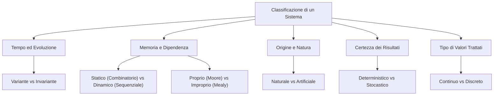
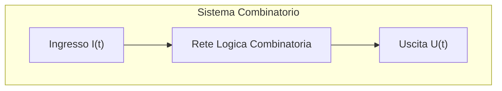
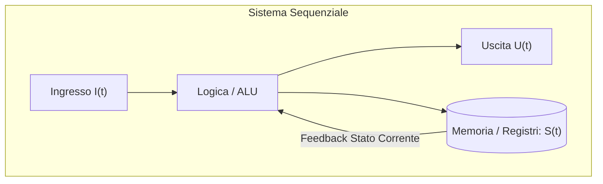
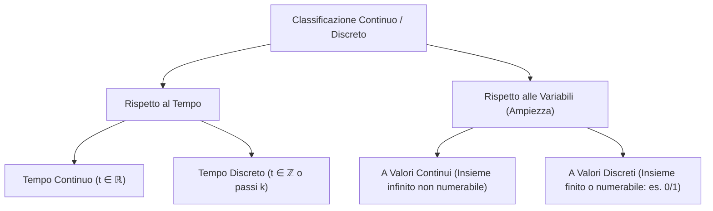
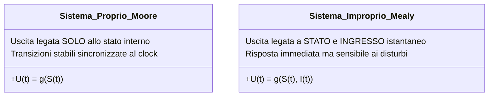

# Proprietà e Classificazione dei Sistemi

> [!NOTE] Perché si classificano i sistemi?
> Le proprietà dei sistemi servono a categorizzare il loro comportamento matematico e operativo. Classificare un sistema consente di scegliere il modello formale corretto (es. equazioni differenziali, automi a stati finiti, circuiti logici combinatori o sequenziali) per analizzarlo, simularlo o progettarlo.

---

## 1. Statico vs Dinamico (Memoria del Sistema)

Questa proprietà indica se il sistema ha o meno una **memoria** del proprio passato.

### Sistema Statico (Senza Memoria)
- **Definizione:** L'uscita a un qualsiasi istante $t$ dipende **esclusivamente** dal valore dell'ingresso applicato nello stesso istante $t$:
  $$U(t) = g(I(t))$$
- **Caratteristiche:** Il sistema non possiede stati interni; cessato lo stimolo in ingresso, l'effetto svanisce all'istante.
- **Esempio:** 
  - Una resistenza elettrica ($V = R \cdot I$, la tensione ai capi dipende all'istante dalla corrente).
  - Una porta logica elementare (es. porta AND o invertitore NOT).

### Sistema Dinamico (Con Memoria)
- **Definizione:** L'uscita a un istante $t$ dipende non solo dall'ingresso attuale $I(t)$, ma anche dalla **storia passata** degli ingressi, sintetizzata nello **stato interno** $S(t)$:
  $$U(t) = g(S(t), I(t)) \quad \text{oppure} \quad U(t) = g(S(t))$$
- **Caratteristiche:** Il sistema memorizza eventi trascorsi.
- **Esempio:**
  - Un contatore di accessi (il conteggio attuale dipende da quante persone sono passate prima).
  - Un condensatore elettrico (immagazzina carica nel tempo).
  - Un computer o un flip-flop.

---

## 2. Combinatorio vs Sequenziale

È la formulazione adottata in **elettronica digitale e informatica** per i sistemi statici e dinamici:

- **Sistema Combinatorio:** Le uscite sono una funzione logica pura degli ingressi correnti. Se gli ingressi tornano allo stato iniziale, le uscite ritornano istantaneamente ai valori corrispondenti. Non c'è feedback né elementi di memorizzazione.
- **Sistema Sequenziale:** Contiene celle di memoria (flip-flop, latch, registri). L'uscita futura dipende dalla sequenza temporale di tutti gli stimoli ricevuti in passato.

---

## 3. Naturale vs Artificiale

Classificazione basata sull'origine fisica del sistema:

- **Sistema Naturale:** Esiste e opera in natura spontaneamente, senza l'intervento costruttivo dell'uomo.
  - *Esempi:* Il cuore umano, il sistema cardiocircolatorio, il sistema solare, un ecosistema fluviale.
- **Sistema Artificiale:** Progettato, assemblato e realizzato dall'essere umano per eseguire funzioni specifiche.
  - *Esempi:* Un computer, un'automobile, un distributore automatico di bevande, un protocollo di rete.

---

## 4. Deterministico vs Stocastico (Probabilistico)

Classificazione basata sulla prevedibilità matematica del comportamento:

### Sistema Deterministico
- **Definizione:** A partire da uno stato iniziale noto $S(t_0)$ e applicando la medesima sequenza di ingressi, il sistema produrrà **sempre e con certezza assoluta** la stessa evoluzione degli stati e le stesse uscite.
- **Esempio:** Un microprocessore, un algoritmo deterministico, un circuito logico digitale.

### Sistema Stocastico (Probabilistico)
- **Definizione:** Il comportamento del sistema è soggetto a variabili casuali, rumore o distribuzioni di probabilità. A parità di condizioni iniziali e ingressi, l'uscita non è determinabile a priori in modo univoco, ma solo in termini statistici.
- **Esempio:** 
  - Il lancio di un dado o la roulette.
  - Il modello di arrivo dei pacchetti su un router Internet (traffico poissoniano).
  - Le previsioni meteorologiche.

---

## 5. Continuo vs Discreto

Riguarda il dominio del **tempo** e l'insieme dei **valori** assunti dalle grandezze:

| Tipologia | Caratteristiche | Esempio Pratico |
| :--- | :--- | :--- |
| **Continuo** | Le grandezze variano in modo continuo nel tempo e possono assumere qualsiasi valore all'interno di un intervallo di numeri reali ($\mathbb{R}$). | Segnale vocale captato da un microfono a membrana, temperatura atmosferica registrata da termometro a mercurio. |
| **Discreto** | Le variabili assumono solo valori appartenenti a un insieme finito o numerabile, e/o il tempo scorre a intervalli discreti (scandito da un clock). | Orologio digitale, file binario, tastiera, registri della CPU. |

---

## 6. Variante vs Invariante nel Tempo (Stazionario)

Indica se le regole intrinseche e i parametri fisici del sistema cambiano col passare del tempo.

- **Sistema Invariante (Stazionario):**
  Il comportamento non dipende dall'istante temporale in cui viene applicato lo stimolo. Se applichiamo una data sequenza di ingressi oggi o fra una settimana, il sistema risponderà nello stesso identico modo (a parità di stato iniziale), subendo unicamente una traslazione temporale:
  $$I(t - \tau) \implies U(t - \tau)$$
  - *Esempio:* Un circuito logico ideale a temperatura controllata.
- **Sistema Variante nel Tempo:**
  I parametri interni cambiano nel tempo a causa di usura, degradazione, invecchiamento o variazioni dell'ambiente esterno.
  - *Esempio:* I componenti elettronici soggetti a surriscaldamento o esaurimento (una batteria la cui resistenza interna sale con i cicli di carica).

---

## 7. Proprio (Moore) vs Improprio (Mealy)

Questa distinzione riguarda la dipendenza diretta dell'uscita negli automi e nei sistemi dinamici:

- **Sistema Proprio (Modello di Moore):**
  L'uscita dipende **esclusivamente dallo stato interno** presente. L'ingresso influenza lo stato futuro, ma non altera direttamente l'uscita corrente nello stesso istante.
  $$U(t) = g(S(t))$$
- **Sistema Improprio (Modello di Mealy):**
  L'uscita dipende **contemporaneamente sia dallo stato interno corrente sia dall'ingresso attuale**. Una variazione dell'ingresso può riflettersi immediatamente sull'uscita senza attendere il ciclo successivo.
  $$U(t) = g(S(t), I(t))$$

---

## 8. Tavola Sinottica di Classificazione Rapida

| Criterio | Valore A | Valore B | Domanda Guida per Riconoscerlo |
| :--- | :--- | :--- | :--- |
| **Memoria** | Statico | Dinamico | *L'uscita dipende solo dall'adesso o ricorda gli ingressi passati?* |
| **Origine** | Naturale | Artificiale | *È stato creato dall'uomo o esiste già nell'universo?* |
| **Certezza** | Deterministico | Stocastico | *Lo stesso identico input dà SEMPRE lo stesso identico output?* |
| **Grandezze** | Continuo | Discreto | *I valori possono assumere qualsiasi frazione reale o sono passi/livelli finiti?* |
| **Stazionarietà** | Invariante | Variante | *Il comportamento del sistema si degrada o cambia nel tempo?* |
| **Logica** | Combinatorio | Sequenziale | *Il circuito contiene elementi di memoria (registri, flip-flop)?* |
| **Uscita** | Proprio (Moore) | Improprio (Mealy) | *L'uscita cambia istantaneamente se muovo l'ingresso senza cambiare stato?* |
