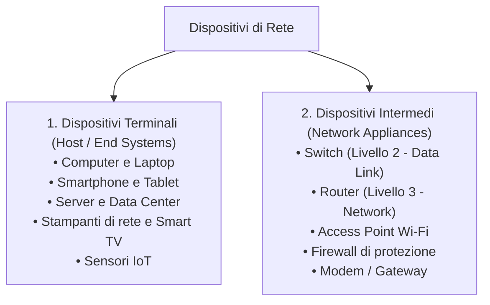
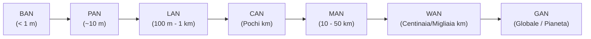
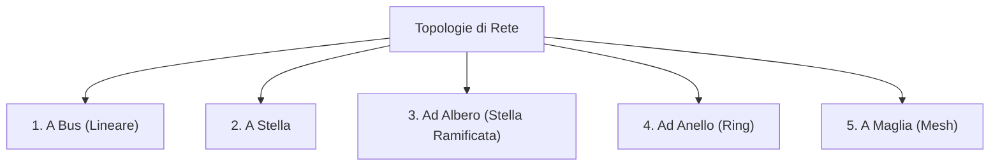
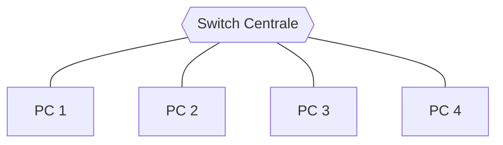
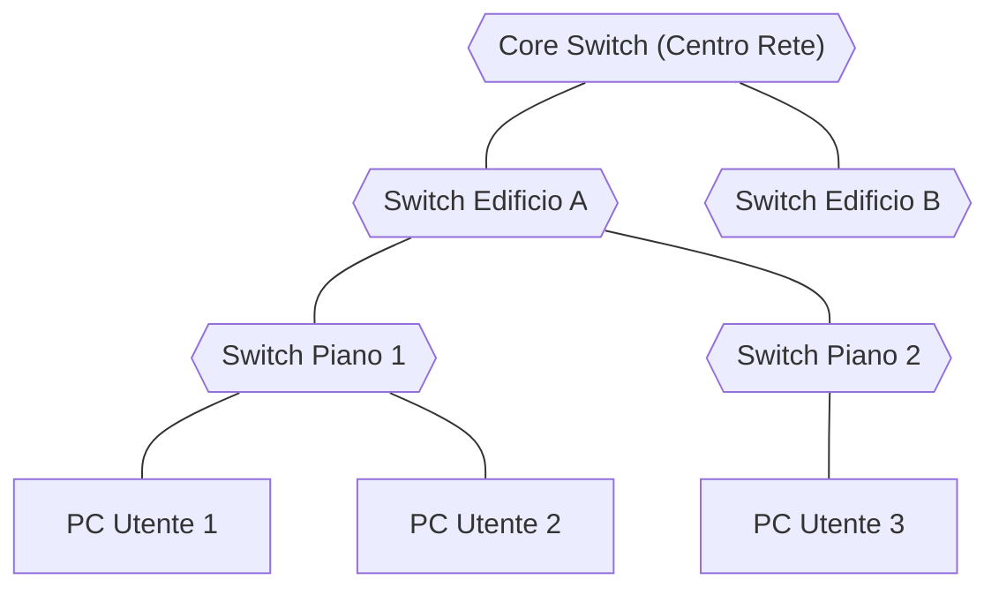
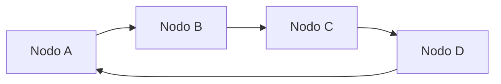
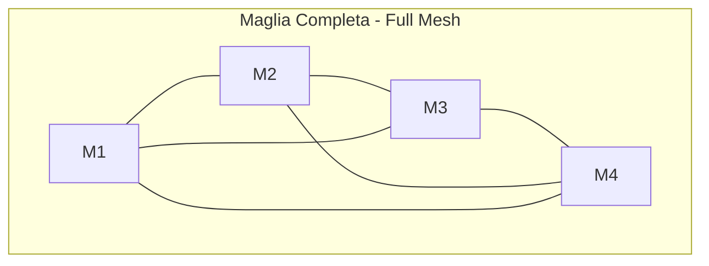

# Reti Informatiche: Classificazione Geografica e Topologie Fisiche

> [!NOTE] Cos'è una Rete Informatica?
> Una **rete informatica** (*computer network*) è un insieme di dispositivi autonomi interconnessi attraverso canali trasmissivi (guidati come cavi in rame o fibra ottica, o non guidati come onde radio) capaci di scambiarsi dati e condividere risorse hardware e software secondo regole e protocolli standardizzati.

---

## 1. Dispositivi della Rete: Terminali e Intermedi

Gli apparati che popolano una rete si suddividono in due categorie essenziali:

---

## 2. Classificazione per Estensione Geografica

In base alla distanza fisica coperta e alla scala dell'infrastruttura, le reti si classificano secondo la seguente scala gerarchica:

| Sigla | Denominazione Estesa | Copertura Tipica | Descrizione ed Esempi |
| :--- | :--- | :--- | :--- |
| **BAN** | *Body Area Network* | $< 1$ metro | Reti a contatto con il corpo umano: sensori biometrici, pacemaker intelligenti, smartwatch. |
| **PAN** | *Personal Area Network* | Pochi metri ($\le 10$ m) | Spazio personale di lavoro: connessioni Bluetooth tra smartphone, cuffie wireless, tastiere e mouse. |
| **LAN** | *Local Area Network* | Edificio o stanza (fino a qualche centinaio di metri) | Rete locale domestica, scolastica o aziendale. Velocità elevatissime (da 1 a 10 Gbps) a basso tasso di errore. |
| **CAN** | *Campus Area Network* | Pochi chilometri | Insieme di edifici appartenenti alla stessa organizzazione (campus universitario, polo ospedaliero, caserma). |
| **MAN** | *Metropolitan Area Network* | Intera città ($10 - 50$ km) | Rete metropolitana civica, dorsali in fibra ottica cittadine, reti televisive via cavo o WiMAX urbano. |
| **WAN** | *Wide Area Network* | Regionale, nazionale o continentale | Collega tra loro LAN situate in città o nazioni diverse tramite linee di telecomunicazione gestite da carrier/provider (ISP). |
| **GAN** | *Global Area Network* | Livello planetario | Rete a copertura globale basata su dorsali in fibra sottomarine e costellazioni di satelliti (la rete **Internet**). |

---

## 3. Le Topologie Fisiche di Rete

La **topologia fisica** definisce la disposizione geometrica e la modalità di collegamento fisico dei cavi e degli apparati che compongono la rete.

---

### 1. Topologia a Bus (Lineare)
Tutti i computer sono attestati su un **unico cavo dorsale condiviso** (*backbone*). Alle due estremità del cavo sono montati resistori di terminazione (**terminatori**) per assorbire il segnale ed evitare riflessioni d'onda.

- **Vantaggi:** Minimo consumo di cavo, semplicità d'installazione iniziale.
- **Svantaggi:** Singolo punto critico di guasto (se il cavo si interrompe in un punto qualsiasi, l'intera rete si blocca); alte collisioni all'aumentare dei nodi; ricerca guasti molto complessa.

---

### 2. Topologia a Stella
Ogni dispositivo terminale è collegato con un proprio cavo dedicato a un **apparato centrale** (concentratore: storicamente un *Hub*, oggi sempre uno **Switch**).

- **Vantaggi:** Elevata tolleranza ai guasti (se si trancia il cavo di un computer, solo quel nodo rimane isolato mentre il resto della rete opera normalmente); semplicità di diagnosi, aggiunta e rimozione dispositivi.
- **Svantaggi:** Richiede molto più metraggio di cavo; vulnerabilità del nodo centrale (se lo switch centrale si guasta o perde alimentazione, l'intera stella collassa).

---

### 3. Topologia ad Albero (Stella Ramificata / Gerarchica)
È l'evoluzione naturale della stella ed è lo standard universale del **cablaggio strutturato moderno**. Gli switch sono organizzati su più livelli gerarchici (Core Switch $\rightarrow$ Distribution Switch $\rightarrow$ Access Switch).

- **Vantaggi:** Massima scalabilità e modularità; facilità di gestione del traffico e isolamento dei sottosistemi.

---

### 4. Topologia ad Anello (*Ring*)
Ogni nodo è collegato in serie al successivo tramite un collegamento punto-punto, chiudendo il percorso nell'ultimo nodo per formare un cerchio chiuso. Il segnale circola in modo unidirezionale e ogni nodo funge da ripetitore attivo.

- **Svantaggi:** La rottura di un solo nodo o cavo interrompe l'anello (risolto nelle reti professionali FDDI/SDH tramite un *doppio anello controrotante* di emergenza).

---

### 5. Topologia a Maglia (*Mesh*)

- **Maglia Completa (*Full Mesh*):** Ogni nodo è collegato direttamente con ciascuno degli altri nodi della rete.
  - Per $N$ nodi occorrono esattamente:
    $$C = \frac{N(N - 1)}{2} \text{ collegamenti}$$
  - *Vantaggi:* Tolleranza ai guasti quasi invulnerabile e percorsi multipli alternativi.
  - *Svantaggi:* Costo esponenziale e complessità insostenibile per grandi reti.
- **Maglia Parziale (*Partial Mesh*):** Vengono creati collegamenti ridondanti solo tra i nodi più importanti (è la reale struttura portante della **dorsale Internet / WAN**, dove i router di frontiera hanno connessioni multiple alternative verso diversi provider).

---

## 4. Tabella di Confronto delle Topologie

| Topologia | Costo di Cablaggio | Tolleranza ai Guasti | Scalabilità | Utilizzo Comune |
| :--- | :---: | :---: | :---: | :--- |
| **Bus** | Bassissimo | Pessima (Single point of failure sul cavo) | Scarsa | Reti legacy coassiali (10BASE2), bus industriali (CAN bus) |
| **Stella** | Medio | Ottima sui rami, debole al centro | Alta | Reti locali LAN d'ufficio e domestiche |
| **Albero** | Medio-Alto | Eccellente | Massima | Cablaggi strutturati aziendali e campus |
| **Anello** | Basso-Medio | Bassa (eccetto anello doppio) | Media | Reti storiche Token Ring, anelli metropolitani SONET/SDH |
| **Maglia** | Altissimo | Massima in assoluto | Bassa (per full mesh) | Dorsali geografiche WAN e Internet Core Router |
