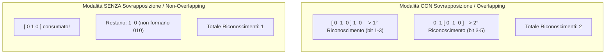
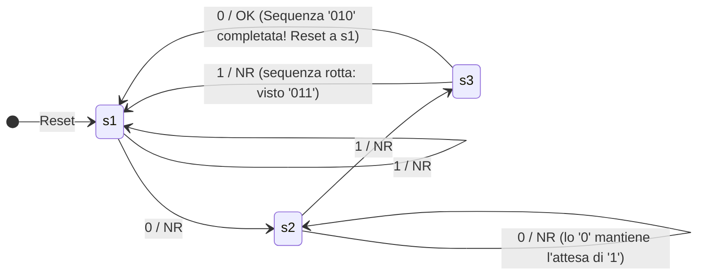
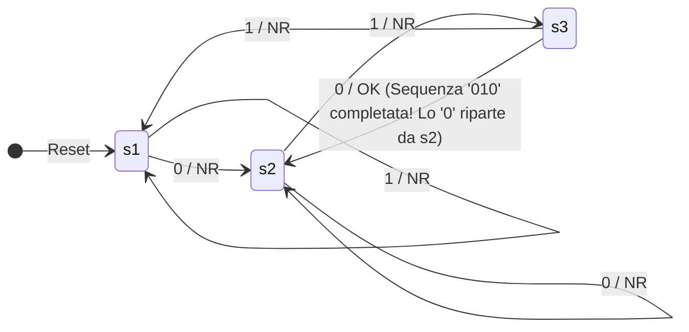

# Riconoscitori di Sequenze con e senza Sovrapposizione (*Overlapping*)
> [!NOTE] Definizione del Problema
> Dato uno stream sequenziale di simboli binari in ingresso, un **riconoscitore di sequenza** ha il compito di analizzare i bit in tempo reale ed emettere un segnale di validità (**OK**) nell'istante esatto in cui viene completata una precisa sottostringa target (ad esempio `010`).
>
> La distinzione fondamentale riguarda come viene trattato l'ultimo bit della sequenza riconosciuta: può essere riutilizzato per avviare una nuova sequenza (**con sovrapposizione / concatenato**) oppure deve essere scartato/azzerato (**senza sovrapposizione / non concatenato**).

---
## 1. Il Concetto di Concatenazione (Overlapping)
Consideriamo la sequenza target **`010`** e inviamo in ingresso la stringa di test:

$$\text{Input: } \mathbf{0 \quad 1 \quad 0 \quad 1 \quad 0}$$

- **Senza Sovrapposizione (Non-Overlapping):** Una volta riconosciuta la sottostringa, tutti i bit che ne facevano parte vengono considerati "consumati". L'automa resetta la ricerca ripartendo completamente da zero.
- **Con Sovrapposizione (Overlapping):** I caratteri finali della sequenza appena riconosciuta possono sovrapporsi ai caratteri iniziali della sequenza successiva, permettendo rilevamenti multipli ravvicinati.

---
## 2. Progettazione dell'Automa per la Sequenza `010`

### Definizione Formale:
- **Alfabeto Ingressi:** $I = \{0, 1\}$
- **Alfabeto Uscite:** $U = \{\text{OK}, \text{NR}\}$ ($\text{OK}$ = Riconosciuto, $\text{NR}$ = Non Riconosciuto)
- **Stati del Sistema ($S$):**
  - **$s_1$ (Attesa 1° bit):** Nessun bit valido. Si aspetta `'0'`.
  - **$s_2$ (Visto `0` - Attesa 2° bit):** Primo bit valido agganciato. Si aspetta `'1'`.
  - **$s_3$ (Visto `01` - Attesa 3° bit):** Primi due bit validi agganciati. Si aspetta `'0'`.

---
## 3. Automa SENZA Sovrapposizione (Non-Overlapping)
Se la sequenza viene completata, l'automa emette $\text{OK}$ e torna allo stato iniziale $s_1$:

> [!IMPORTANT] Comportamento della Transizione da $s_3$
> Quando arriva lo `'0'` in $s_3$, la sequenza `010` è completa: l'uscita è **$\text{OK}$**, ma l'arco punta a **$s_1$**, azzerando la memoria.

---
## 4. Automa CON Sovrapposizione (Overlapping)
Se la sequenza viene completata, l'ultimo bit `'0'` è già il primo bit valido della sequenza successiva: l'automa transita quindi direttamente a $s_2$!

> [!TIP] La Differenza Cruciale
> L'unica differenza topologica tra i due grafi è la destinazione dell'arco `0 / OK` uscente da $s_3$:
> - Senza sovrapposizione: punta a **$s_1$**.
> - Con sovrapposizione: punta a **$s_2$**.

---
## 5. Tabella Comparativa di Traccia Temporale
Inviamo la sequenza di bit: `0  1  0  1  0  0  1  0`

| Istante $t$ | $t_1$ | $t_2$ | $t_3$ | $t_4$ | $t_5$ | $t_6$ | $t_7$ | $t_8$ |
| :--- | :---: | :---: | :---: | :---: | :---: | :---: | :---: | :---: |
| **Bit in Ingresso** | **0** | **1** | **0** | **1** | **0** | **0** | **1** | **0** |
| **Stato (Senza Overlap)** | $s_2$ | $s_3$ | $s_1$ | $s_1$ | $s_2$ | $s_2$ | $s_3$ | $s_1$ |
| **Uscita (Senza Overlap)**| NR | NR | **OK** | NR | NR | NR | NR | **OK** |
| **Stato (Con Overlap)** | $s_2$ | $s_3$ | $s_2$ | $s_3$ | $s_2$ | $s_2$ | $s_3$ | $s_2$ |
| **Uscita (Con Overlap)** | NR | NR | **OK** | NR | **OK** | NR | NR | **OK** |

### Risultato del Test:
- **Senza Overlap:** 2 riconoscimenti (all'istante $t_3$ e all'istante $t_8$).
- **Con Overlap:** **3 riconoscimenti** (agli istanti $t_3$, $t_5$ e $t_8$), perché a $t_5$ viene catturata la sequenza sovrapposta `0 1 0` a cavallo dei bit 3, 4 e 5!

---
## 6. Ambiti Applicativi Reali
- **Protocolli di Rete (Framing):** Nei protocolli come **HDLC** (High-Level Data Link Control) o **PPP**, i pacchetti sono delimitati dalla sequenza speciale di flag `01111110`. L'automa del ricevitore deve individuare la fine di un frame e l'inizio del successivo senza perdere bit.
- **Compilatori e Tokenizer:** Nell'analisi lessicale di codice sorgente, le parole chiave vengono separate senza sovrapposizione (`if`, `while`, identificatori).
- **Crittografia e Analisi di Flussi:** Ricerca di firme malevole o pattern all'interno di pacchetti ispezionati da firewall/IDS (Intrusion Detection System).
