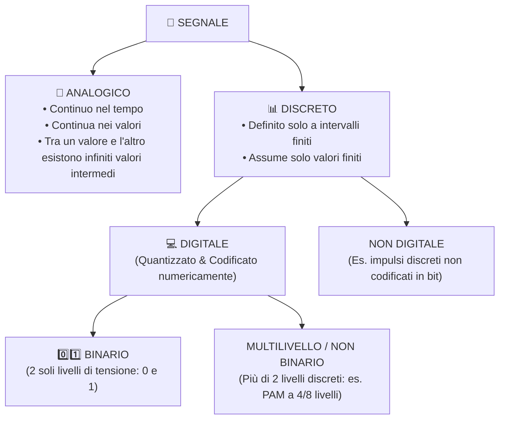
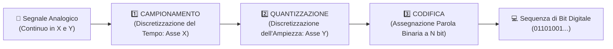

# 📡 Teoria dei Segnali e Conversione Analogico-Digitale (ADC)
Nel mondo reale in cui viviamo, quasi tutti i fenomeni fisici — come la voce umana, la musica, la luce che colpisce l'obiettivo di una macchina fotografica o la temperatura atmosferica — si manifestano sotto forma di grandezze **continue nel tempo e nei valori**.

I calcolatori elettronici moderni, tuttavia, non possono elaborare l'infinito: possono gestire unicamente sequenze finite di numeri composti da `0` e `1` (**dati digitali binari**).
Per colmare questo divario fondamentale esiste la catena di **Conversione Analogico-Digitale (ADC - *Analog-to-Digital Converter*)**.

---
## 1. Che cos'è un Segnale?
> [!IMPORTANT] Definizione di Segnale
> Un **segnale** è una grandezza fisica (tensione elettrica, corrente, intensità luminosa, pressione acustica) che varia nel tempo e nello spazio, trasportando **informazione**.

Possiamo classificare i segnali in base alla continuità del tempo e dell'ampiezza:



### Confronto Diretto: Analogico vs Digitale
| Caratteristica | Segnale Analogico | Segnale Digitale Binario |
| :--- | :--- | :--- |
| **Dominio dei valori** | Continuo (può assumere qualunque valore reale all'interno di un intervallo). | Discreto (solo due stati possibili: livello alto `1` e livello basso `0`). |
| **Sensibilità al rumore** | **Molto elevata**: qualsiasi interferenza elettromagnetica altera irreparabilmente l'informazione. | **Bassa / Resiliente**: piccole alterazioni di voltaggio non cambiano l'interpretazione logica tra `0` e `1`. |
| **Elaborabilità** | Richiede circuiti elettronici dedicati (amplificatori, filtri analogici). | Elaborabile da qualsiasi CPU, memorizzabile su dischi o memorie Flash senza degrado nel tempo. |
| **Copia e trasmissione** | Ogni copia o ritrasmissione subisce una perdita progressiva di fedeltà. | Copia perfetta al 100%, bit per bit, replicabile all'infinito. |

---
## 2. La Catena di Trasformazione da Analogico a Digitale (ADC)
Per convertire un segnale analogico continuo in una sequenza numerica binaria digitale, si attraversa un processo sequenziale standard suddiviso in **tre fasi fondamentali**:



---
### Fase 1: Il Campionamento (Sampling)
Il campionamento consiste nel misurare e registrare il valore del segnale analogico a **intervalli regolari di tempo**, chiamati **campioni** (o *"foto istantanee"* del segnale).

- **Azione grafica**: si suddivide l'**asse delle ascisse (asse X del tempo)** in intervalli regolari di durata $T_c$ (*Periodo di campionamento*).
- **Frequenza di campionamento ($f_c$)**: è il numero di campioni rilevati in un secondo, misurato in Hertz (Hz):
  $$f_c = \frac{1}{T_c}$$

```
Ampiezza
  ^          .---.
  |         /     \          <- Segnale continuo analogico
  |   |    |   |   |   |
  |---|----|---|---|---|---> Tempo (Asse X)
     Tc   2Tc 3Tc 4Tc 5Tc    (Campioni prelevati ogni Tc secondi)
```

> [!IMPORTANT] Il Teorema del Campionamento di Nyquist-Shannon
> Per poter ricostruire fedelmente il segnale analogico originale senza perdita di informazione né distorsioni, la frequenza di campionamento $f_c$ deve essere **almeno il doppio della frequenza massima ($f_{\max}$)** contenuta nel segnale:
> $$f_c \ge 2 \cdot f_{\max}$$
> *Se questa condizione non viene rispettata, si verifica il grave fenomeno dell'**Aliasing** (sovrapposizione spettrale che distorce il segnale).*

**Esempi pratici nel mondo reale**:
- **Voce telefonica**: le frequenze vocali udibili arrivano fino a circa $3,4 \text{ kHz} \approx 4 \text{ kHz}$. Per il teorema di Shannon, la telefonia fissa e cellulare campiona a $f_c = 2 \cdot 4000 = \mathbf{8.000 \text{ Hz}}$ (8 kHz).
- **Musica su Compact Disc (CD Audio)**: l'orecchio umano percepisce suoni fino a $20.000 \text{ Hz}$ (20 kHz). I CD campionano a **$44.100 \text{ Hz}$** ($44,1 \text{ kHz}$), garantendo una riproduzione perfetta di ogni sfumatura acustica.

---
### Fase 2: La Quantizzazione (Quantization)
Il campionamento ha reso discreto il tempo (asse X), ma ogni singolo campione può ancora assumere un numero infinito di ampiezze diverse sull'asse verticale (asse Y).

La **quantizzazione** consiste nel suddividere l'**asse delle ordinate (asse Y delle ampiezze)** in un numero finito di livelli discreti:
1. Si definisce una griglia di livelli prestabiliti (gradini di quantizzazione).
2. Il valore reale continuo di ciascun campione viene **approssimato** al livello quantizzato più vicino.

```
Ampiezza (Asse Y)
  ^
Liv. 3 |---------*-------- (Valore approssimato al livello più vicino)
       |        / \
Liv. 2 |-------/---\------
       |      /     \
Liv. 1 |-----*-------*----
       +-------------------> Asse X (Tempo)
```

> [!WARNING] L'Errore di Quantizzazione
> L'approssimazione introduce inevitabilmente una piccola discrepanza tra il valore reale del segnale e il livello a cui viene arrotondato. Questa differenza prende il nome di **Errore di Quantizzazione** (o *rumore di quantizzazione*).
> Più aumentiamo il numero di livelli discreti disponibili, più i gradini diventano fitti e più l'errore di quantizzazione diventa infinitesimo e trascurabile.

---
### Fase 3: La Codifica (Encoding)
La **codifica** è l'atto finale con cui a ciascuno degli $L$ livelli quantizzati viene associata in modo univoco una sequenza di **bit binari** (*codice numerico*).

Se utilizziamo una parola di codice di **$N$ bit** (profondità o risoluzione del convertitore):
$$\text{Numero di Livelli Rappresentabili: } \mathbf{L = 2^N}$$

Invertendo la formula: se vogliamo rappresentare $L$ livelli distinti, il numero minimo di bit $N$ necessari è:
$$N = \lceil \log_2(L) \rceil$$

| Risoluzione ($N$ bit) | Livelli Quantizzati ($L = 2^N$) | Errore di Quantizzazione | Qualità del Risultato |
| :---: | :---: | :---: | :---: |
| **1 bit** | $2^1 = 2$ livelli | Altissimo | Segnale binario grezzo (on/off). |
| **8 bit (1 Byte)** | $2^8 = \mathbf{256}$ livelli | Medio-basso | Qualità telefonica standard / Immagini in scala di grigi. |
| **16 bit (2 Byte)** | $2^{16} = \mathbf{65.536}$ livelli | Bassissimo | Qualità CD Audio professionale / Hi-Fi. |
| **24 bit (3 Byte)** | $2^{24} = \mathbf{16.777.216}$ livelli | Impercettibile | Audio da studio di registrazione / Immagini True Color. |

---
## 3. Calcolo Combinatorio e Configurazione dei Dati
Nel quaderno di appunti compare un calcolo importante sulle potenze e combinazioni:

> [!NOTE] Dagli appunti del quaderno:
> Se abbiamo un alfabeto o un insieme di $26$ simboli (es. lettere dell'alfabeto) e parole composte da $4$ caratteri:
> $$\text{Combinazioni possibili: } 26^4 = (2 \cdot 13)^4 = 2^4 \cdot 13^4 = 16 \cdot 28561 = 456.976$$
> Se invece avessimo $26$ posizioni e ciascuna potesse assumere solo $4$ stati:
> $$4^{26} = (2^2)^{26} = 2^{52}$$
> Questo dimostra come le potenze in base 2 crescano in maniera esponenziale, costituendo il fondamento per capire la scalabilità dei codici digitali binari.

---
## 📝 Documento Originale Manoscritto
Per consultare lo schema riassuntivo originale elaborato durante le lezioni:
![[appunti_originali_segnali.png|650]]
