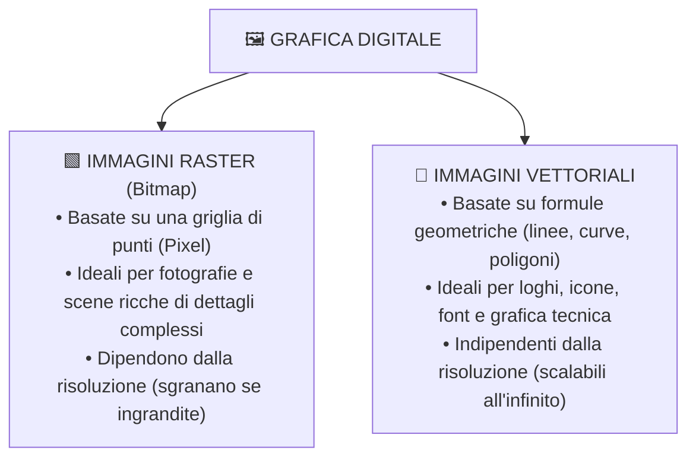
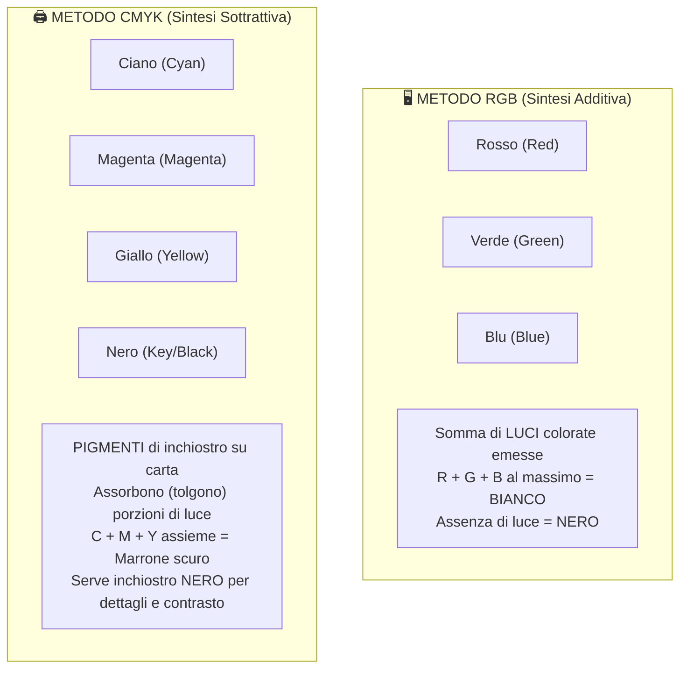
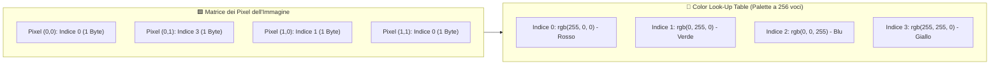

# 🎨 Digitalizzazione delle Immagini e Modelli di Colore

Un'immagine reale catturata dalla natura (un tramonto, un volto, un paesaggio) è un segnale bidimensionale continuo: in qualunque punto dello spazio fisico esistono infinite sfumature di colore e dettagli infinitesimali. 

Per poter memorizzare, elaborare o visualizzare un'immagine su un computer, dobbiamo sottoporla al processo di **digitalizzazione**, trasformandola in una sequenza ordinata di numeri binari.

---

## 1. Due Mondi a Confronto: Immagini Raster vs Vettoriali

Nel mondo della grafica digitale esistono due approcci radicalmente diversi per rappresentare visivamente le informazioni:

| Proprietà | Immagine Raster (Bitmap) | Immagine Vettoriale |
| :--- | :--- | :--- |
| **Elemento Costitutivo** | Matrice di singoli quadratini colorati (**Pixel**). | Equazioni matematiche e primitive geometriche. |
| **Ambito di Utilizzo Ottimale** | Fotografie, dipinti digitali, scansioni del mondo reale. | Loghi aziendali, caratteri tipografici (font), icone, CAD. |
| **Comportamento all'Ingrandimento** | **Sgrana e perde nitidezza** (*pixelation* e bordi scalettati). | **Rimane sempre perfetta e nitidissima** a qualsiasi fattore di zoom. |
| **Peso del File** | Dipende dal numero di pixel e dalla profondità di colore. | Dipende solo dal numero di forme geometriche disegnate. |

---

## 2. Il Processo di Digitalizzazione dell'Immagine

La trasformazione di un'immagine da continua a digitale applica esattamente i tre principi della teoria dei segnali (campionamento, quantizzazione e codifica), estesi alle **due dimensioni spaziali** ($X$ e $Y$):

### 1. Il Campionamento Spaziale (I Pixel)
L'immagine viene suddivisa mediante una fitta griglia regolare ortogonale in piccolissimi tasselli quadrati elementari chiamati **Pixel** (*Picture Element*):
- Ogni pixel è l'unità minima indivisibile dell'immagine digitale.
- Più la griglia è fitta (ovvero più pixel ci sono per pollice), maggiore è la fedeltà con cui vengono catturati i dettagli fini.

![[campionamento_matrice_pixel.png|600]]

> [!NOTE] Come viene letta la griglia?
> Per trasformare la matrice bidimensionale in un flusso lineare di dati serializzabili su un file o inviabili in rete, la griglia dei pixel viene letta e codificata **da sinistra verso destra, riga per riga, procedendo dall'alto verso il basso** (scansione *raster*).

---

### 2. La Quantizzazione del Colore
All'interno di ciascun pixel microscopico della realtà potrebbero cadere piccoli bagliori o impercettibili variazioni. 
Nella fase di quantizzazione:
- A ogni singolo pixel viene assegnato **un unico valore numerico omogeneo**, corrispondente al **colore predominante** (o colore medio) rilevato in quell'area.

---

### 3. La Codifica del Colore
A ogni colore quantizzato viene associata una precisa combinazione di cifre binarie (`0` e `1`). La quantità di informazioni memorizzabile per ogni pixel è regolata dalla **profondità di colore**.

---

## 3. La Profondità di Colore (Color Depth)

> [!IMPORTANT] Definizione di Profondità di Colore
> La **profondità di colore** (indicata con $p$ o *bpp - bits per pixel*) rappresenta il **numero di bit dedicati a memorizzare il colore di ogni singolo pixel**.
> 
> Se a ciascun pixel sono assegnati $p$ bit, il numero di colori differenti contemporaneamente rappresentabili nell'immagine è:
> $$\mathbf{N_{\text{colori}} = 2^p}$$

![[profondita_colore_confronto.png|750]]

### Le Principali Tipologie di Immagine in Base alla Profondità

| Tipologia | Profondità ($p$) | Numero di Colori ($2^p$) | Descrizione e Utilizzo |
| :--- | :---: | :---: | :--- |
| **Monocromatica (Binaria)** | **1 bit** | $2^1 = \mathbf{2}$ colori | Soltanto bianco puro (`1`) e nero puro (`0`). Usata per fax, codici a barre, spartiti musicali, documenti solo testo. |
| **Scala di Grigi (Grayscale)** | **8 bit** (1 Byte) | $2^8 = \mathbf{256}$ livelli di grigio | Dal nero assoluto (valore `0`) al bianco assoluto (valore `255`), passando per 254 sfumature intermedie. Tipica delle radiografie mediche. |
| **Colore Indicizzato (Palette)** | **8 bit** (1 Byte) | $2^8 = \mathbf{256}$ colori scelti | Una selezione personalizzata di 256 colori su misura per l'immagine. Formato standard delle immagini **GIF** e **PNG-8**. |
| **True Color (RGB a 24 bit)** | **24 bit** (3 Byte) | $2^{24} = \mathbf{16.777.216}$ colori | Qualità fotografica fotorealistica. L'occhio umano non è in grado di distinguere più di 10-12 milioni di colori, per cui 16,7 milioni offrono una visione perfetta. |
| **Deep Color (30/36/48 bit)** | **30-48 bit** | Oltre 1 miliardo di colori | Utilizzata nei sensori fotografici RAW e nella produzione cinematografica HDR professionale. |

---

## 4. I Modelli di Colore: RGB vs CMYK

Per descrivere matematicamente i colori visibili si utilizzano specifici **spazi colore**. I due modelli cardine dell'informatica sono **RGB** e **CMYK**:

---

### Il Modello RGB (Sintesi Additiva)
È il modello naturale per tutti i dispositivi che **emettono luce propria**: monitor per computer, schermi di smartphone, televisori, proiettori e sensori fotografici CMOS.

- Si basa sui tre colori primari della luce: **Rosso** (*Red*), **Verde** (*Green*), **Blu** (*Blue*).
- Ciascuno dei tre canali viene codificato con **1 Byte (8 bit)**, potendo assumere un'intensità compresa tra $0$ (spento) e $255$ (massima luminosità).
- In totale, un pixel RGB richiede:
  $$\text{Spazio per Pixel} = 8 \text{ bit (R)} + 8 \text{ bit (G)} + 8 \text{ bit (B)} = \mathbf{24 \text{ bit}} = \mathbf{3 \text{ Byte}}$$

> [!EXAMPLE] Come nascono i colori in RGB:
> - **Nero**: `rgb(0, 0, 0)` $\to$ tutte le sorgenti di luce spente.
> - **Bianco**: `rgb(255, 255, 255)` $\to$ tutte le luci alla massima intensità.
> - **Rosso puro**: `rgb(255, 0, 0)`.
> - **Giallo**: `rgb(255, 255, 0)` $\to$ somma di luce rossa e luce verde!
> - **Ciano**: `rgb(0, 255, 255)` $\to$ somma di verde e blu.
> - **Magenta**: `rgb(255, 0, 255)` $\to$ somma di rosso e blu.

---

### Il Modello CMYK (Sintesi Sottrattiva)
È il modello utilizzato obbligatoriamente per la **stampa su carta** (stampanti a getto d'inchiostro, laser, rotative tipografiche).

![[sintesi_cmyk_colori.png|350]]

- I fogli di carta bianca riflettono la luce ambientale. Gli inchiostri depositati sulla pagina agiscono come filtri: assorbono (sottraggono) alcune lunghezze d'onda luminose e lasciano riflettere le restanti.
- Si utilizzano quattro pigmenti primari:
  1. **Ciano** (*Cyan*)
  2. **Magenta** (*Magenta*)
  3. **Giallo** (*Yellow*)
  4. **Nero** (*Key / Black*)

> [!QUESTION] Perché si aggiunge il Nero (K) se unendo Ciano, Magenta e Giallo si ottiene già un colore scuro?
> 1. **Qualità ottica**: mescolando chimicamente i tre inchiostri C, M, Y reali si ottiene un marrone fangoso opaco, mai un vero nero profondo e nitido.
> 2. **Economia e velocità**: il testo e le linee nei documenti sono quasi sempre neri. Stampare con un solo passaggio di inchiostro nero costa molto meno rispetto a consumare contemporaneamente tre inchiostri colorati.
> 3. **Asciugatura della carta**: stendere tre strati d'inchiostro inzupperebbe la carta ritardandone l'asciugatura.

---

## 5. L'Indicizzazione dei Colori (La Palette)

Immaginiamo di voler memorizzare una semplice icona, un grafico aziendale o un disegno animato che contiene in tutto soltanto 10 o 15 sfumature di colore. 
Se usassimo il sistema True Color a 24 bit, sprecheremmo 3 Byte per ogni singolo pixel, memorizzando valori ripetitivi!

Per risparmiare memoria si ricorre alla tecnica della **Palette Indicizzata (o Tavolozza di Colori)**:

### Come Funziona la Palette:
1. Viene creata all'inizio del file una tabella chiamata **CLUT** (*Color Look-Up Table*), contenente al massimo **256 colori** (quelli effettivamente presenti nell'immagine). Ciascun colore nella tabella è specificato con la sua terna RGB a 24 bit ($256 \times 3 \text{ Byte} = 768 \text{ Byte}$ totali per la palette).
2. Per ogni pixel dell'immagine **non si memorizzano più i 3 Byte del colore RGB**, bensì **un solo Byte contenente il numero indice** (da 0 a 255) che punta alla voce corrispondente nella palette!

> [!TIP] Risultato pratico
> La dimensione dell'immagine viene **ridotta a un terzo** (da 24 bit a soli 8 bit per pixel), mantenendo una resa visiva nitida e brillante per grafiche, illustrazioni e loghi. Questo è il principio su cui si fonda lo storico e popolarissimo formato **GIF**.
