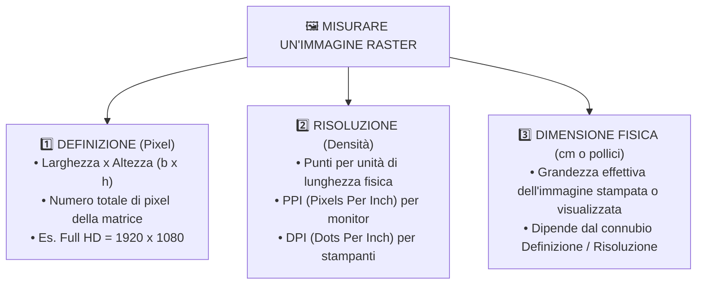
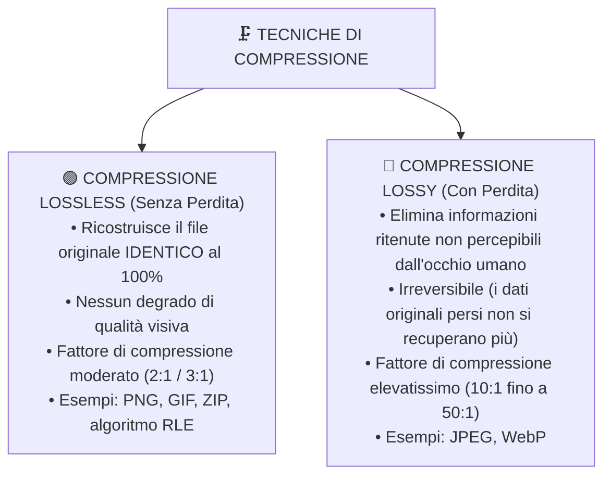

# 📐 Caratteristiche Raster, Calcolo del Peso e Compressione

Quando analizziamo un'immagine digitale raster, tre parametri fisici e matematici si intrecciano: quanti pixel la compongono (**definizione**), quanto densamente sono distribuiti nello spazio (**risoluzione**) e quanto grande apparirà l'immagine stampata su un foglio o proiettata su uno schermo (**dimensione fisica**). Da questi elementi dipende in modo diretto il **peso in Byte** del file.

---

## 1. Le Tre Grandezze Cardine: Definizione, Risoluzione e Dimensione Fisica

![[risoluzioni_schermi_fullhd_4k_8k.png|750]]

### 1. La Definizione (Dimensioni in Pixel)
Rappresenta il numero totale di pixel che compongono l'immagine, espresso come prodotto tra la larghezza ($b$) e l'altezza ($h$):
$$\text{Definizione} = b \times h \quad [\text{pixel}]$$

> [!NOTE] Standard di mercato più diffusi:
> - **HD Ready (720p)**: $1280 \times 720 = 921.600 \text{ pixel} \approx 0,92 \text{ Megapixel}$
> - **Full HD (1080p)**: $1920 \times 1080 = 2.073.600 \text{ pixel} \approx 2,07 \text{ Megapixel}$
> - **4K Ultra HD (UHD)**: $3840 \times 2160 = 8.294.400 \text{ pixel} \approx 8,29 \text{ Megapixel}$
> - **8K Ultra HD**: $7680 \times 4320 = 33.177.600 \text{ pixel} \approx 33,2 \text{ Megapixel}$

---

### 2. La Risoluzione Spaziale (PPI e DPI)
La risoluzione misura la **densità** dei pixel all'interno di una determinata misura lineare (il pollice, pari a $2,54 \text{ cm}$):
- **PPI (*Pixels Per Inch*)**: misura la densità dei pixel su dispositivi elettronici di visualizzazione (schermi di smartphone, monitor, tablet).
- **DPI (*Dots Per Inch*)**: misura la densità dei punti di inchiostro fisicamente depositati da una testina di stampa sulla carta.

![[risoluzione_ppi_confronto.png|650]]

---

### 3. La Dimensione Fisica e la Relazione Fondamentale
Come calcolare le dimensioni reali di stampa conoscendo i pixel e la risoluzione?

$$\text{Dimensione in Pollici (Inch)} = \frac{\text{Definizione in Pixel}}{\text{Risoluzione in PPI}}$$

$$\text{Dimensione in Centimetri (cm)} = \text{Dimensione in Pollici} \times 2,54$$

> [!EXAMPLE] Esempio pratico di stampa
> Un'immagine fotografica ha una definizione di $3000 \times 2000 \text{ pixel}$. Se viene stampata alla risoluzione fotografica standard professionale di $300 \text{ DPI}$:
> - Larghezza: $\frac{3000}{300} = 10 \text{ pollici} = 10 \cdot 2,54 = \mathbf{25,4 \text{ cm}}$
> - Altezza: $\frac{2000}{300} = 6,67 \text{ pollici} = 6,67 \cdot 2,54 = \mathbf{16,9 \text{ cm}}$

---

## 2. Il Calcolo del Peso di un'Immagine (Dimensione del File)

Il **peso** di un'immagine indica la quantità di memoria necessaria per archiviarla su disco o caricarla nella RAM della scheda video per la visualizzazione.

I fattori determinanti sono:
1. Il numero complessivo di pixel (**Definizione** = $b \times h$).
2. La **profondità di colore** ($p$, espressa in bit per pixel).

---

### Caso A: Immagini a Colori Diretti (True Color, Grayscale, Monocromatiche)

$$\mathbf{\text{Peso (bit)} = \text{Larghezza} \times \text{Altezza} \times \text{Profondità di Colore (bit)}}$$

Per ottenere il valore nelle unità di misura consuete:
$$\text{Peso (Byte)} = \frac{\text{Peso (bit)}}{8}$$

$$\text{Peso (KiloByte - KB)} = \frac{\text{Peso (Byte)}}{1024}$$

$$\text{Peso (MegaByte - MB)} = \frac{\text{Peso (KB)}}{1024}$$

---

### Esercizio Guidato 1 (Immagine Fotografica Full HD)
> Calcolare il peso in MegaByte di un'immagine Full HD ($1920 \times 1080 \text{ pixel}$) in formato **True Color** ($24 \text{ bit}$, ovvero $3 \text{ Byte}$ per pixel), non compressa.
> 
> 1. Numero totale di pixel:
>    $$1920 \times 1080 = 2.073.600 \text{ pixel}$$
> 2. Peso in bit:
>    $$2.073.600 \times 24 \text{ bit} = 49.766.400 \text{ bit}$$
> 3. Peso in Byte:
>    $$\frac{49.766.400}{8} = 2.073.600 \times 3 = 6.220.800 \text{ Byte}$$
> 4. Conversione in KB e MB:
>    $$\text{Peso in KB} = \frac{6.220.800}{1024} = 6.075 \text{ KB}$$
>    $$\text{Peso in MB} = \frac{6075}{1024} \approx \mathbf{5,93 \text{ MB}}$$

---

### Caso B: Immagini con Palette Indicizzata (es. GIF o PNG-8)

Nelle immagini con palette (tavolozza di colori), oltre alla matrice dei pixel che memorizza l'indice, **va sommato lo spazio occupato dalla palette stessa**:

$$\mathbf{\text{Peso Totale (Byte)} = \left(\frac{b \times h \times p_{\text{indice}}}{8}\right) + (N_{\text{colori}} \times 3 \text{ Byte})}$$

- $p_{\text{indice}}$: bit per l'indice (tipicamente 8 bit = 1 Byte).
- $N_{\text{colori}}$: numero di colori nella palette (es. 256).
- Ciascun colore nella palette richiede $3 \text{ Byte}$ (i valori R, G, B a 24 bit).

> [!EXAMPLE] Esercizio Guidato 2 (Immagine a 256 Colori)
> Calcolare il peso della stessa immagine Full HD ($1920 \times 1080$) memorizzata a **256 colori indicizzati** (8 bit per pixel):
> 
> 1. Peso della matrice di pixel:
>    $$2.073.600 \times 1 \text{ Byte} = 2.073.600 \text{ Byte}$$
> 2. Peso della palette (256 colori RGB):
>    $$256 \times 3 \text{ Byte} = 768 \text{ Byte}$$
> 3. Peso totale:
>    $$2.073.600 + 768 = 2.074.368 \text{ Byte} \approx \mathbf{1,98 \text{ MB}}$$
> 
> *Risparmio: il file pesa un terzo rispetto alla versione True Color a 24 bit!*

---

## 3. Formati File Raster a Confronto

I file di immagine non contengono solo i pixel puri, ma includono anche un'*intestazione* (*header*) con metadati (dimensione, profilo colore, data di scatto Exif) e adottano algoritmi di memorizzazione specifici:

![[confronto_formati_raster.png|800]]

| Formato | Compressione | Profondità Colore | Trasparenza | Animazioni | Utilizzo Tipico |
| :--- | :--- | :--- | :---: | :---: | :--- |
| **BMP** (*Bitmap*) | Nessuna (grezza) | 1, 8, 24 bit | No | No | Formato nativo storico Windows; file molto pesanti. |
| **JPEG / JPG** | **Lossy** (con perdita) | 24 bit (True Color) | No | No | Fotografie, web, smartphone, social network. |
| **PNG** | **Lossless** (senza perdita) | Fino a 48 bit + Alpha | **Sì** (Canale Alfa a 256 livelli) | No | Loghi per il web, grafica con trasparenze, screenshot. |
| **GIF** | **Lossless** (LZW) | Max 8 bit (256 colori) | **Sì** (trasparenza on/off a 1 bit) | **Sì** | Brevi animazioni grafiche per il web, adesivi, meme. |
| **TIFF** | Lossless (o Lossy) | Fino a 48 bit / CMYK | Sì | No | Ambito professionale editoriale, stampa tipografica, scanner. |
| **RAW** | Nessuna / Minima | 12 - 16 bit per canale | No | No | Dati "grezzi" usciti dal sensore delle fotocamere Reflex/Mirrorless. |
| **WebP** | Lossless o Lossy | 24 bit + Alpha | Sì | Sì | Formato moderno open sviluppato da Google per il web ad alte prestazioni. |

---

## 4. Teoria della Compressione: Lossless vs Lossy

Poiché le immagini raster non compresse occupano enormi quantità di banda e disco, la **compressione dei dati** è diventata indispensabile.

![[compressione_lossless_lossy_tucano.png|750]]

---

### Compressione Lossless: L'Algoritmo RLE (Run-Length Encoding)

L'algoritmo **RLE** è una delle tecniche senza perdita più intuitive e didattiche. Si basa sulla ricerca di **sequenze ripetute dello stesso valore**:
- Invece di scrivere individualmente ogni singolo pixel identico, si memorizza una coppia:
  $$(\text{Conteggio di ripetizioni}, \text{Valore del Pixel})$$

> [!EXAMPLE] Come funziona l'algoritmo RLE:
> Immaginiamo una riga di pixel di un disegno con ampie campiture uniformi:
> `B B B B B B B B  N N N  B B B B B`  *(dove B = Bianco, N = Nero)*
> - Dati grezzi: 16 singoli caratteri/pixel memorizzati.
> - Codifica RLE: `(8, B) (3, N) (5, B)`
> - Risultato: da 16 valori siamo scesi a sole 3 coppie! Durante la decompressione, il computer ricostruisce la riga originaria **senza aver perso neppure mezzo bit**.

---

### Compressione Lossy: Il Principio Psicovisivo del JPEG

Il formato **JPEG** sfrutta le caratteristiche biologiche del sistema visivo umano (*modello psicovisivo*):
1. **L'occhio umano è sensibilissimo alla luminosità** (contrasto e contorni), ma è **molto meno sensibile alle sfumature fini di colore** (crominanza).
2. Il JPEG converte l'immagine nello spazio colore $YC_bC_r$ ($Y$ = luminanza, $C_b/C_r$ = crominanza) e dimezza il campionamento del colore (*chroma subsampling*).
3. Applica poi la **Trasformata Discreta del Coseno (DCT)** per separare le frequenze spaziali basse (aree uniformi) dalle altissime frequenze (dettagli microscopici e rumore impercettibile).
4. Taglia via le frequenze più alte in modo irreversibile.

> [!CAUTION] Artefatti da Sovracompressione
> Se si imposta un livello di compressione JPEG troppo aggressivo (bassa qualità), l'algoritmo genera visibili difetti grafici:
> - **Effetto a blocchi (*blocking*)**: l'immagine appare suddivisa in sgradevoli quadratini di $8 \times 8$ pixel.
> - **Ringing**: sgradevoli aloni sfocati e "zanzare" visive attorno ai bordi netti e ai testi.
